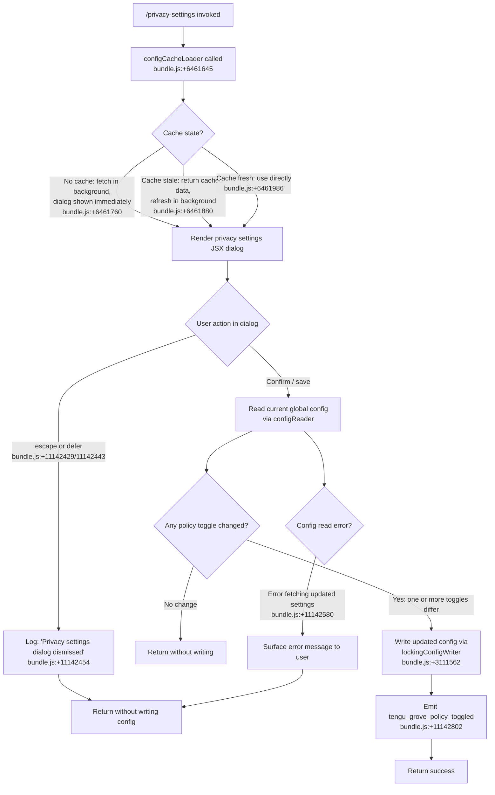

# `/privacy-settings`

> Analysis basis: CC v2.1.133 bundle.js (AST extraction + Claude interpretation)
> Minimum version: v2.1.133

---

## Overview

The `/privacy-settings` command opens an interactive JSX dialog that allows the user to view and update their privacy-related configuration options (referred to internally as "Grove" policy toggles). When invoked, the handler loads the current configuration via a caching layer, presents a UI panel, and — upon the user confirming or dismissing the dialog — persists any toggled settings back to the global config file. A telemetry event is emitted whenever a policy toggle actually changes state.

## Registration

| Field | Value |
|---|---|
| type | `local-jsx` |
| name | `privacy-settings` |
| description | `View and update your privacy settings` |
| module_id | `Ufq` |
| load_inline | `true` |
| loc_byte | `11143262` |
| loc_byte_end | `11143454` |
| loc_line | `6879` |
| arbor_handler.name | `Ez7` |
| arbor_handler.fqn | `claude-2.1.133::Ez7` |
| arbor_handler.kind | `AsyncFunction` |
| arbor_handler.resolution_path | `module_id` |
| arbor_handler.n_hits | `0` |

Analysis basis: CC v2.1.133 bundle.js:+11143262

> The handler was resolved by following `module_id` → `Ufq` → module exports → `Ez7`. Because Arbor resolved the handler via `module_id`, the Arbor symbol `Ez7` is used as the canonical handler name throughout this spec. The `load_inline: true` flag indicates the command is inlined via a `load: () => Promise.resolve({call: Ez7})` shape rather than a separate dynamic import.

---

## Input Branching

The command exhibits four or more distinct branches depending on: (1) cache state at invocation, (2) user action in the dialog (confirm vs. escape/defer), (3) whether any policy value actually changed, and (4) whether the background config refresh succeeds. A Mermaid flowchart is used per the 3+ branch rule.



---

## Behavioral Spec

### Handler Entry — privacySettingsHandler (Ez7)

The primary async handler for `/privacy-settings`. It orchestrates config loading, dialog rendering, and conditional config persistence.

```
async function privacySettingsHandler(commandContext):
    // Load current global config, potentially from cache
    currentConfig = await configCacheLoader(commandContext)   // _FH → CPH
    // bundle.js:+11142266

    // Capture current timestamp for cache freshness tracking
    invokeTime = Date.now()   // bundle.js:+6461734

    // Launch background config refresh if cache is absent or stale
    backgroundRefreshHandle = startConfigRefresh(invokeTime, currentConfig)   // HK9
    // bundle.js:+6461840

    // Assemble privacy policy toggle state from config
    policyState = extractPrivacyToggles(currentConfig)   // ql, z$H
    // bundle.js:+11142319, 11142324

    // Await user interaction in the JSX dialog
    dialogResult = await renderPrivacyDialog(policyState)
    // bundle.js:+11142909 (wj6.createElement)

    if dialogResult.action == "escape" or dialogResult.action == "defer":
        // bundle.js:+11142429, 11142443, 11142454
        log("Privacy settings dialog dismissed")
        return

    // Attempt to read the freshest config (may have been updated in background)
    latestConfig = await readLatestConfig(commandContext)   // d
    // bundle.js:+11142800

    if latestConfig is null or error:
        // bundle.js:+11142580
        surfaceError("Unable to retrieve updated privacy settings")
        return

    // Check whether any policy toggle actually changed
    if policyTogglesUnchanged(policyState, latestConfig):
        return   // no write needed

    // Persist changes
    await lockingConfigWriter(latestConfig, dialogResult.updatedToggles)
    // bundle.js:+3111562

    // Emit telemetry for each changed toggle
    emitTelemetry("tengu_grove_policy_toggled", changedFields)
    // bundle.js:+11142802

    return
```

Analysis basis: CC v2.1.133 bundle.js:+11142266

---

### Config Cache Loader — configCacheLoader (_FH → CPH)

Implements a stale-while-revalidate caching strategy for the global config. Three paths are logged as string literals in the bundle.

```
function configCacheLoader(context):
    cachedEntry = readConfigCache()   // CPH → U9

    if cachedEntry is absent:
        // bundle.js:+6461760
        log("Grove: No cache, fetching config in background (dialog skipped this session)")
        triggerBackgroundFetch()
        return constructDefaultConfig()   // C_

    age = Date.now() - cachedEntry.timestamp
    if age > STALE_THRESHOLD:
        // bundle.js:+6461880
        log("Grove: Cache stale, returning cached data and refreshing in background")
        triggerBackgroundFetch()
        return cachedEntry.data

    // bundle.js:+6461986
    log("Grove: Using fresh cached config")
    return cachedEntry.data
```

Analysis basis: CC v2.1.133 bundle.js:+6461645

---

### Privacy Toggle Extractor — extractPrivacyToggles (rY)

Reads specific privacy-relevant fields from the config object. The traversal reaches helpers that inspect `ANTHROPIC_API_KEY` (bundle.js:+2872588) and `apiKeyHelper` (bundle.js:+2872613) as well as plan-tier strings `"max"` (bundle.js:+2891989) and `"pro"` (bundle.js:+2892000), suggesting the displayed toggles may differ by subscription tier.

```
function extractPrivacyToggles(config):
    apiKeyPresent  = resolveApiKeyPresence(config)   // HK → checks ANTHROPIC_API_KEY
    apiHelperMode  = resolveApiKeyHelper(config)     // NS
    planTier       = detectPlanTier(config)          // kH  ("max" | "pro")
    toggleStates   = readToggleFlags(config)         // L_
    systemContext  = readSystemContext(config)        // _O  ("system" literal: bundle.js:+11142499)
    enterpriseFlag = readEnterpriseFlag(config)      // o96

    return {apiKeyPresent, apiHelperMode, planTier, toggleStates,
            systemContext, enterpriseFlag}
```

Analysis basis: CC v2.1.133 bundle.js:+2872089

---

### Background Config Refresh — backgroundRefreshScheduler (HK9)

Scheduled after initial load to revalidate the cache so a subsequent save uses the most recent on-disk state.

```
async function backgroundRefreshScheduler(invokeTime, cachedConfig):
    // Acquire or verify config lock via lockingConfigWriter infrastructure (R6)
    // bundle.js:+6462132
    freshConfig = await configReader(R6)   // bundle.js:+6462076 (z$H)

    refreshTime = Date.now()   // bundle.js:+6462184

    // Apply any pending writes from other Claude instances (e6)
    mergedConfig = applyPendingWrites(freshConfig, cachedConfig)
    // bundle.js:+6462219

    // Persist the merged result back to cache
    storeConfigCache(mergedConfig, refreshTime)   // k
    // bundle.js:+6462330
```

Analysis basis: CC v2.1.133 bundle.js:+6461840

---

### Locking Config Writer — lockingConfigWriter (R6 → fe8 / m5H)

Writes the updated config to disk using file locking with backup rotation.

```
async function lockingConfigWriter(config, updates):
    lockHandle = acquireLock(configPath)   // F6, t2, He8
    // Warn if lock acquisition is slow:
    //   "Lock acquisition took longer than expected…" bundle.js:+3111184

    if lock contention detected:
        emitTelemetry("tengu_config_lock_contention")   // bundle.js:+3111273

    // Re-read from disk to detect concurrent modifications
    diskConfig = readFileSync(configPath, "utf-8")   // bundle.js:+3113300

    // Auth-loss safety check (GH #3117):
    if diskConfig is missing auth fields that cache has:
        // "saveConfigWithLock: re-read config is missing auth…" bundle.js:+3111600
        emitTelemetry("tengu_config_stale_write")   // bundle.js:+3111409
        abortWrite()
        return

    // Rotate backups — max 5 kept, timeout 60000 ms (bundle.js:+3112203, 3111954)
    rotateDiskBackups(configPath, maxBackups=5)   // m5H → q.copyFileSync

    // Atomic write: write to temp, then rename
    writeFileSync(tempPath, serialize(mergedConfig))
    renameSync(tempPath, configPath)

    if auth fields were preserved:
        emitTelemetry("tengu_config_auth_loss_prevented")   // bundle.js:+3111752

    releaseLock(lockHandle)
```

Analysis basis: CC v2.1.133 bundle.js:+3110101

---

### Config Parse Error Handler

```
function handleConfigParseError(error, path):
    emitTelemetry("tengu_config_parse_error")   // bundle.js:+3113854
    // Error code checked: "ENOENT" (bundle.js:+3113447)
    // If file not found, return empty config object
    // Otherwise re-throw
```

Analysis basis: CC v2.1.133 bundle.js:+3113854

---

## State & Side Effects

| Item | Detail |
|---|---|
| Telemetry: `tengu_grove_policy_toggled` | Emitted when at least one privacy policy toggle changes value upon save (bundle.js:+11142802) |
| Telemetry: `tengu_config_lock_contention` | Emitted when config file lock takes longer than expected (bundle.js:+3111273) |
| Telemetry: `tengu_config_stale_write` | Emitted when a concurrent write would have produced a stale config (bundle.js:+3111409) |
| Telemetry: `tengu_config_auth_loss_prevented` | Emitted when auth fields on disk diverge from cache and the write is blocked to prevent data loss (bundle.js:+3111752) |
| Telemetry: `tengu_config_parse_error` | Emitted when the config file cannot be parsed (bundle.js:+3113854) |
| Config file write | Atomic rename via temp file; protected by advisory lock; max 5 backup copies retained; backup timeout 60,000 ms (bundle.js:+3112203, +3111954) |
| Config cache mutation | `configCacheLoader` stale-while-revalidate pattern updates the in-memory cache entry after background refresh completes |
| Dialog dismissal log | String `"Privacy settings dialog dismissed"` written to log on escape/defer (bundle.js:+11142454) |
| appState changes | Privacy policy toggles stored under the `"settings"` key (bundle.js:+11142863) in the global config JSON |
| Auth safety guard | Refuses to overwrite `~/.claude.json` when the re-read disk copy lacks auth tokens present in cache — references GH #3117 (bundle.js:+3111600) |
| File system ops | `readFileSync`, `mkdirSync`, `copyFileSync`, `statSync`, `readdirStringSync` (sync); async `writeFile`/`rename` for atomic updates (bundle.js:+3113273, +3114033, +3114362) |
| Sound | <!-- TODO: not found in depth-2 traversal; needs --depth 4 --> |

---

## Version History

| Version | Change |
|---|---|
| v2.1.133 | Initial analysis — `local-jsx` command rendering privacy toggle dialog; Grove policy cache layer; auth-loss prevention guard (GH #3117) |

---

## Common Mistakes

1. **Dismissing with Escape does not save changes.** Both `"escape"` and `"defer"` actions (bundle.js:+11142429, +11142443) cause the handler to return early without writing. Users who toggle settings but press Escape will lose their changes.
2. **Concurrent Claude instances can cause lock contention.** The string `"Lock acquisition took longer than expected - another Claude instance may be running"` (bundle.js:+3111184) is surfaced when the advisory lock is held by a sibling process; the write may be delayed or skipped.
3. **Auth fields must not be stripped from `~/.claude.json` externally.** If a user or tool edits the config file and removes authentication tokens while Claude Code holds a cached copy that includes them, the auth-loss guard (GH #3117) will refuse to write the privacy settings update to avoid silently deleting credentials (bundle.js:+3111600).
4. **Stale cache on first invocation.** When no cache entry exists, the dialog is shown immediately with a possibly outdated or default config and the label "No cache, fetching config in background" is logged (bundle.js:+6461760). If the user saves immediately, the persisted values may not reflect the latest on-disk state.
5. **Backup rotation limit is 5.** The config backup mechanism keeps at most 5 backup files (bundle.js:+3112203). Older backups are silently deleted; do not rely on the backup directory for audit purposes beyond 5 snapshots.

---

## Appendix — Identifier Mapping

> For bundle debugging only. Identifiers change across versions.

| Identifier | Role |
|---|---|
| `Ez7` | Primary async handler for `/privacy-settings` (Arbor-resolved entry point) |
| `_FH` | Config cache loader orchestrator (stale-while-revalidate) |
| `CPH` | Config cache read sub-routine |
| `U9` | Cache entry accessor |
| `zu_` | Cache miss path helper |
| `Ou_` | Cache stale-check helper |
| `rY` | Privacy toggle extractor (reads API key, plan tier, toggle flags) |
| `C_` | Default config constructor (cache-miss fallback) |
| `wU` | Boolean coercion helper within default config |
| `gYK` | Cache entry serializer/storer |
| `F7` | Toggle state reader sub-function |
| `R6` | Locking config writer (coordinates lock + atomic rename) |
| `F6` | File lock acquire/release helper |
| `He8` | Lock timeout guard |
| `m5H` | Sync config read + backup rotation helper |
| `u2K` | File watch / cache invalidation helper |
| `k` | Telemetry / logging dispatcher |
| `Ztq` | Log transport wrapper |
| `xcA` | Log output formatter |
| `H` | Random-delay jitter helper (used in retry paths) |
| `SH` | JSON serializer wrapper |
| `A` | Generic utility / string helper |
| `Uf` | String redaction helper (produces `[REDACTED]` output) |
| `rnA` | Token-map iterator |
| `_` | Lowercase string normalizer |
| `LkH` | Stdout writer wrapper |
| `UnA` | Raw stream write helper |
| `vtq` | Async file logger (append-to-log path) |
| `uNH` | Debounced write batcher |
| `aHH` | Log flush helper |
| `dG8` | Directory-is-file error handler (`EISDIR`) |
| `_iA` | Log file path resolver |
| `AiA` | Log file rotation helper (`.txt` extension, max 4 rotations) |
| `Vtq` | Log file append writer |
| `y1` | Active-write-set tracker |
| `HK9` | Background config refresh scheduler |
| `e6` | Global config save helper (top-level) |
| `fe8` | Locking save with backup rotation implementation |
| `fxH` | Config diff helper |
| `jX1` | Object-entries iterator for config fields |
| `MxH` | Timestamp stamper for config writes |
| `lq6` | Config path resolver |
| `d` | Generic async reader / promise helper |
| `Ke8` | Non-locking config writer (fallback path) |
| `M` | MCP server manager (reached via `Promise.all` in handler) |
| `iZH` | MCP connection initializer |
| `zt` | MCP server-list builder |
| `SEH` | MCP enterprise config parser |
| `Ot` | MCP SDK server collector |
| `XO6` | MCP SSE/HTTP server map builder |
| `$I` | MCP config writer (persists MCP state) |
| `dM` | MCP config file updater |
| `CJA` | MCP config post-processor |
| `L` | MCP server list padder / formatter |
| `K` | Async operation tracker (add/delete from active set) |
| `f` | Stream close / connection lifecycle helper |
| `AA` | Generic async accumulator |
| `AJ6` | MCP filter helper |
| `so4` | MCP needs-auth cache reader |
| `KIA` | Async file reader for needs-auth cache |
| `G98` | MCP server hash/key generator |
| `Vl` | Plan-tier resolver |
| `W98` | MCP server deduplication key builder |
| `GJ` | SHA-256 hash helper |
| `K8` | MCP debug logger |
| `gZA` | MCP connection supervisor |
| `qo4` | OAuth flow initiator |
| `lp` | Auth token storage helper |
| `_e` | MCP OAuth callback server |
| `KlH` | In-flight OAuth request tracker |
| `Y` | Background spare-process lifecycle manager |
| `AM8` | Needs-auth cache file cleaner |
| `eF` | MCP reconnect orchestrator |
| `Fb` | Auth token persistence helper |
| `D` | Daemon config reload handler |
| `T7` | MCP error logger |
| `vH` | String coercion helper |
| `Lo4` | MCP OAuth race-timeout helper |
| `_o4` | SSH environment detector for OAuth |
| `QZA` | MCP complete-authentication tool handler |
| `LlH` | In-flight request reader |
| `flH` | Pending OAuth entry reader |
| `Yl9` | Needs-auth cache writer |
| `JM8` | Needs-auth cache path resolver |
| `BZA` | MCP token store initializer |
| `dK` | Config path constant resolver |
| `Bw6` | MCP token clear helper |
| `kJA` | MCP server inclusion checker |
| `J` | Background process terminator |
| `v` | Background process manager (blurred/focused lifecycle) |
| `S` | Transient stream writer |
| `z` | Daemon stop/start controller |
| `$l9` | Async iterator helper |
| `GMH` | Generic async mapper (validates safe-integer indexes) |
| `_J6` | Integer parser (radix 10) |
| `fIA` | Integer parser (radix 20) |
| `mFq` | MCP update applier |
| `XM8` | MCP update serializer |
| `hI` | MCP cleanup orchestrator |
| `DlH` | MCP server-state serializer |
| `$` | Config persistence dispatcher |
| `XDq` | Config atomic write helper |
| `yr` | Config write path builder |
| `iY` | Atomic file writer (random-bytes temp name, rename) |
| `Sj6` | Daemon status file path builder |
| `J6` | Session/process lifecycle controller |
| `Bq6` | Session start helper |
| `gq6` | Session stop helper |
| `Po` | Plan-tier display formatter |
| `kH` | String coercion / truthy-check utility |
| `jo` | Experiment flag evaluator |
| `_d6` | Session deduplication guard |
| `pt8` | Experiment event emitter |
| `ct8` | Session initializer |
| `Og7` | MCP retry manager for failed remote servers |
| `T98` | MCP server permission checker |
| `q` | Filesystem unlink helper |
| `r8` | Async timeout wrapper |
| `O` | Generic callback dispatcher |

---

Note: index built via Arbor fallback; some signals (telemetry, literals) may be missing — see arbor-fallback.js.