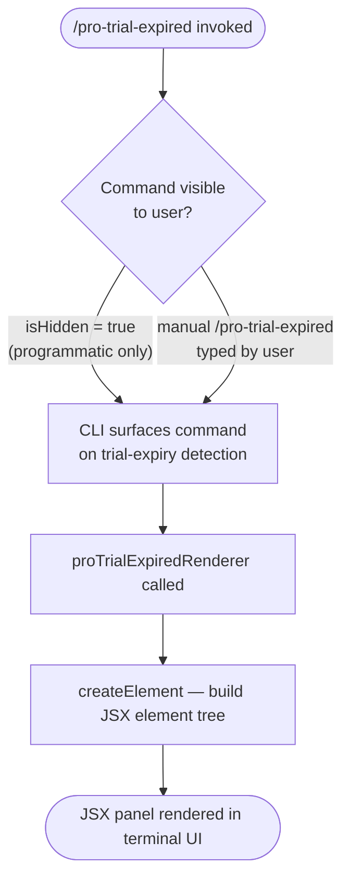

# `/pro-trial-expired`

> Analysis basis: CC v2.1.132 bundle.js (AST extraction + Claude interpretation)
> Minimum version: v2.1.132

---

## Overview

The `/pro-trial-expired` command renders a JSX-based UI panel presenting options to users whose Claude Code Pro plan trial has ended. It is a hidden, local JSX command — meaning it does not appear in the standard slash-command menu but can be surfaced programmatically by the CLI when the runtime detects a trial expiry condition. Its core mechanism is a single React element tree produced by the command's render function.

---

## Registration

| Field | Value |
|---|---|
| type | `local-jsx` |
| name | `pro-trial-expired` |
| description | Options shown when the Pro plan Claude Code trial has ended |
| isHidden | `true` |
| module\_id | `nOq` |

Analysis basis: CC v2.1.132 bundle.js:+11359233

---

## Input Branching

Because the depth-2 call graph contains only a single outbound edge (render function → `createElement`) and the literals array is empty, no conditional branching on user input was detected within the traversal window.



Analysis basis: CC v2.1.132 bundle.js:+11359113 (createElement call edge), +11359233 (registration)

---

## Behavioral Spec

### Render — Pro Trial Expired Panel

The command's entire observable behavior at depth ≤ 2 is the construction and return of a React element tree. No argument parsing, no async data fetching, and no telemetry emission were detected within this traversal depth.

```
function proTrialExpiredRenderer(props):
    # Build and return a JSX element tree that presents
    # post-trial options to the user.
    # Internal node structure is below depth-2 traversal limit.
    root ← createElement(
        containerComponent,   # component type: not resolved at depth-2
        propsObject,          # props: not resolved at depth-2
        ...children           # child elements: not resolved at depth-2
    )
    return root
```

Analysis basis: CC v2.1.132 bundle.js:+11359113

> **Note on traversal depth**: The call graph was collected at depth ≤ 2. The `createElement` call is the only resolved edge. The exact component hierarchy, any conditional branches inside the render tree, and all child element types are <!-- TODO: not found in depth-2 traversal; needs --depth 4 -->.

### Hidden Command Surfacing

Because `isHidden` is `true`, this command does not appear in the autocomplete list presented to users typing `/`. The mechanism by which the CLI decides to invoke it (e.g., a billing-state hook, an API response flag, or a startup check) is <!-- TODO: not found in depth-2 traversal; needs --depth 4 -->.

Analysis basis: CC v2.1.132 bundle.js:+11359233 (`isHidden: true`)

---

## State & Side Effects

| Item | Detail |
|---|---|
| Telemetry | None detected at depth ≤ 2 (telemetry array is empty) |
| Hook registration | <!-- TODO: not found in depth-2 traversal; needs --depth 4 --> |
| appState changes | <!-- TODO: not found in depth-2 traversal; needs --depth 4 --> |
| Sound | <!-- TODO: not found in depth-2 traversal; needs --depth 4 --> |
| Visibility | Hidden from user-facing slash-command menu (`isHidden: true`) |
| Render mechanism | `local-jsx` — renders a React/JSX element directly in the CLI UI layer |

---

## Version History

| Version | Change |
|---|---|
| v2.1.132 | Initial analysis — command registered as hidden local-jsx, single createElement call edge confirmed |

---

## Common Mistakes

1. **Attempting to invoke this command manually and expecting a menu entry.** Because `isHidden` is `true`, the command never appears in the autocomplete list. Typing `/pro-trial-expired` directly may work in some CLI versions, but the command is intended for programmatic surfacing only.
2. **Assuming this command handles billing state mutations.** At depth ≤ 2 the command only renders a UI panel; any actual billing upgrade actions are handled by child components or external hooks not visible in this traversal.
3. **Expecting telemetry events from this command.** No `tengu_*` events are emitted at the command's top level. Telemetry, if any, would originate from child components deeper in the render tree.
4. **Confusing `local-jsx` with a plain text command.** The `local-jsx` type means the output is a React element tree rendered by the CLI's UI runtime, not a plain string printed to stdout. Treating it like a text command will cause integration errors in custom tooling.

---

## Appendix — Identifier Mapping

> For bundle debugging only. Identifiers change across versions.

| Identifier | Role |
|---|---|
| `bY7` | Pro trial expired render function — constructs and returns the JSX element tree for the post-trial options panel |