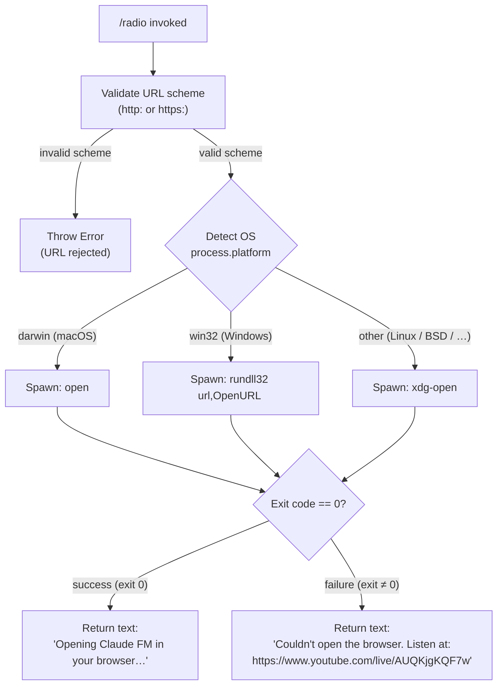

# `/radio`

> Analysis basis: CC v2.1.133 bundle.js (AST extraction + Claude interpretation)
> Minimum version: v2.1.133

---

## Overview

The `/radio` command launches **Claude FM**, a lo-fi music stream hosted on YouTube Live, directly in the user's default browser. When invoked, it resolves the stream URL, attempts a platform-specific browser-open call, and returns a short text message — either a confirmation that the browser is opening or a fallback message containing the raw URL if the open attempt fails.

---

## Registration

| Field | Value |
|---|---|
| type | `local` |
| name | `radio` |
| description | `Listen to Claude FM lo-fi radio` |
| supportsNonInteractive | `false` |
| module\_id | `OOq` |

Analysis basis: CC v2.1.133 bundle.js:+11323581

---

## Input Branching

The command accepts no user-supplied arguments. All branching is internal and depends on (a) URL scheme validation and (b) the host operating system.



Analysis basis:
- URL scheme check: CC v2.1.133 bundle.js:+7365727, +7365749, +7365677
- Platform detection: CC v2.1.133 bundle.js:+7365999, +7366015
- Windows launcher: CC v2.1.133 bundle.js:+7366099, +7366111
- macOS launcher: CC v2.1.133 bundle.js:+7366173
- Linux launcher: CC v2.1.133 bundle.js:+7366180
- Success/failure branch: CC v2.1.133 bundle.js:+7366247

---

## Behavioral Spec

### Command Entry Point

```
function radioCommandHandler(context):
    TARGET_URL = "https://www.youtube.com/live/AUQKjgKQF7w"
    result = openUrl(TARGET_URL)
    if result.success:
        return textResponse("Opening Claude FM in your browser…")
    else:
        return textResponse(
            "Couldn't open the browser. Listen at: " + TARGET_URL
        )
```

Analysis basis: CC v2.1.133 bundle.js:+11323301, +11323304, +11323360, +11323373, +11323441

---

### URL Validation

```
function validateUrl(rawUrl):
    parsed = parseUrl(rawUrl)
    if parsed.scheme not in ["http:", "https:"]:
        throw Error("Unsupported URL scheme")
    return parsed
```

Only `http:` and `https:` schemes are accepted. Any other scheme causes the function to throw a native `Error` before a child process is spawned.

Analysis basis: CC v2.1.133 bundle.js:+7365727, +7365749, +7365677

---

### Platform-Specific Browser Launch

```
function openUrl(url):
    validateUrl(url)                   // throws on bad scheme

    platform = process.platform

    if platform == "darwin":
        command = "open"
        args    = [url]
    else if platform == "win32":
        command = "rundll32"
        args    = ["url,OpenURL", url]
    else:                              // Linux and everything else
        command = "xdg-open"
        args    = [url]

    exitCode = spawnSync(command, args)

    return { success: (exitCode == 0) }
```

The exit-code comparison uses the numeric literal `0` for success and the numeric literal `1` as the representative non-zero failure sentinel in the conditional branch.

Analysis basis: CC v2.1.133 bundle.js:+7365964, +7365999, +7366015, +7366099, +7366111, +7366173, +7366180, +7366247

---

### Child-Process Spawn Helper

The spawn helper (`spawnAsync` / `spawnSync` — reached as call target `Y8` → `GA`, `N6`) internally caps the maximum output buffer or timeout.

- Numeric constant `10` is present at CC v2.1.133 bundle.js:+989065 — likely a timeout or retry ceiling.
- Numeric constant `0` is present at CC v2.1.133 bundle.js:+989099 — likely the default initial value for an output accumulator or exit-code check.

<!-- TODO: exact semantics of the 10 / 0 constants inside the spawn helper not determined at depth-2 traversal; needs --depth 4 -->

Analysis basis: CC v2.1.133 bundle.js:+989065, +989099, +989120, +989231

---

## State & Side Effects

| Item | Detail |
|---|---|
| Telemetry | None — `telemetry` array is empty; no `tengu_*` events are fired by this command. |
| Hook registration | None detected at depth-2 traversal. |
| appState changes | None detected at depth-2 traversal. |
| Child process | Spawns one short-lived OS process (`open`, `rundll32`, or `xdg-open`) to open the browser. |
| Network | No direct network call from the CLI process; the browser handles the YouTube Live connection. |
| Sound / media | Audio plays inside the browser, not inside the CLI process itself. |
| Target URL (hardcoded) | `https://www.youtube.com/live/AUQKjgKQF7w` (CC v2.1.133 bundle.js:+11323304, +11323441) |
| Interactive-only | `supportsNonInteractive: false` — the command is not available in non-interactive / piped mode. (CC v2.1.133 bundle.js:+11323581) |

---

## Version History

| Version | Change |
|---|---|
| v2.1.133 | Initial analysis — command registered as `local`, targets YouTube Live stream for Claude FM lo-fi radio. |

---

## Common Mistakes

1. **Running in non-interactive mode**: Because `supportsNonInteractive` is `false`, invoking `/radio` inside a piped or headless workflow will fail or be silently unavailable. Use an interactive terminal session.
2. **Expecting audio from the CLI process itself**: The command only opens a browser tab; the CLI produces no sound directly. If the default browser is not configured or is suppressed (e.g., a server environment), the fallback message is returned instead.
3. **Assuming cross-platform parity**: On Linux the command delegates to `xdg-open`, which must be installed and correctly configured. Minimal container images often lack `xdg-open`, causing the fallback message to appear.
4. **Providing arguments**: The command registration accepts no arguments. Any text typed after `/radio` is ignored; the hardcoded YouTube URL is always used.
5. **Expecting telemetry**: Unlike most Claude Code commands, `/radio` emits no telemetry events. Do not rely on telemetry pipelines to audit its usage.

---

## Appendix — Identifier Mapping

> For bundle debugging only. Identifiers change across versions.

| Identifier | Role |
|---|---|
| `oY7` | Radio command handler — top-level function registered as the `/radio` command implementation |
| `ML` | URL opener — orchestrates URL validation and platform-specific child-process launch |
| `rG4` | URL scheme validator — parses the URL and throws `Error` on non-http(s) schemes |
| `Y8` | Child-process spawn wrapper — spawns the OS browser-open command and returns exit code |