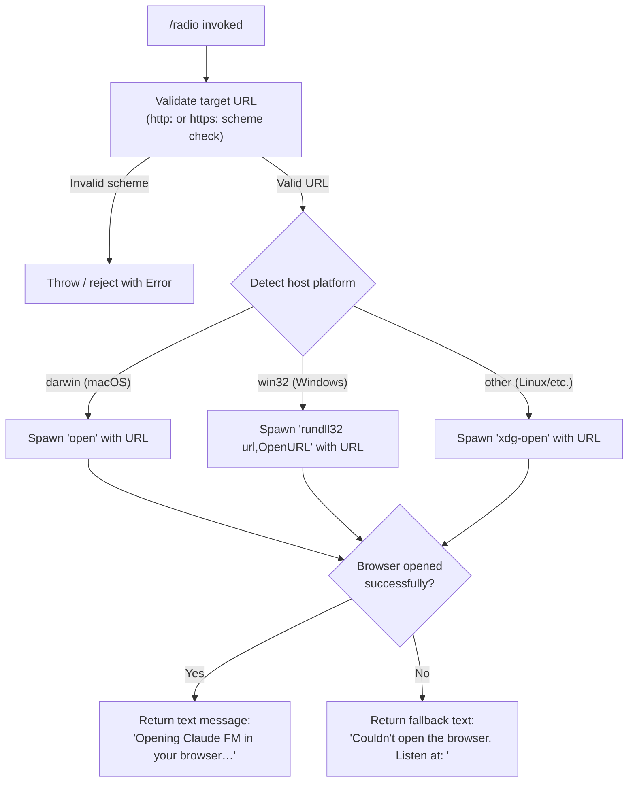

# `/radio`

> Analysis basis: CC v2.1.133 bundle.js (AST extraction + Claude interpretation)
> Minimum version: v2.1.133

---

## Overview

`/radio` is a local slash command that opens the Claude FM lo-fi radio stream (a fixed YouTube Live URL) in the user's default system browser. It presents a brief status message on success and falls back to printing the URL directly if the browser cannot be launched. The command takes no user-supplied arguments and performs no interaction with the Claude AI backend.

---

## Registration

| Field | Value |
|---|---|
| `type` | `local` |
| `name` | `radio` |
| `description` | `Listen to Claude FM lo-fi radio` |
| `supportsNonInteractive` | `false` |
| `module_id` | `OOq` |
| `load_inline` | `true` |
| `loc_byte` | `11323581` |
| `loc_byte_end` | `11323786` |
| `loc_line` | `7104` |
| `arbor_handler.name` | `oY7` |
| `arbor_handler.fqn` | `claude-2.1.133::oY7` |
| `arbor_handler.kind` | `AsyncFunction` |
| `arbor_handler.resolution_path` | `module_id` |
| `arbor_handler.n_hits` | `0` |

Analysis basis: CC v2.1.133 bundle.js:+11323581

---

## Input Branching

The command has three distinct runtime branches driven by the host operating system, plus a fallback branch on browser-open failure. A Mermaid flowchart is used accordingly.



Analysis basis: CC v2.1.133 bundle.js:+7365677, +7365727, +7365749, +7365999, +7366015, +11323304, +11323360, +11323373, +11323441

---

## Behavioral Spec

### Handler Entry Point — `radioCommandHandler` (`oY7`)

The Arbor-resolved handler is `oY7` (an `AsyncFunction`), reached via `module_id → OOq`. It is the primary entry point for the `/radio` command.

Analysis basis: CC v2.1.133 bundle.js:+11323301

```
async function radioCommandHandler(context):
    targetUrl = "https://www.youtube.com/live/AUQKjgKQF7w"

    try:
        openUrlInBrowser(targetUrl)
        return { type: "text", content: "Opening Claude FM in your browser…" }
    catch browserError:
        return {
            type: "text",
            content: "Couldn't open the browser. Listen at: " + targetUrl
        }
```

Analysis basis: CC v2.1.133 bundle.js:+11323304, +11323360, +11323373, +11323441

---

### URL Validation — `urlSchemeValidator` (`rG4`)

Before any platform command is spawned, the target URL is checked to ensure its scheme is either `"http:"` or `"https:"`. Any other scheme causes an `Error` to be thrown and the open attempt is aborted.

Analysis basis: CC v2.1.133 bundle.js:+7365677, +7365727, +7365749

```
function urlSchemeValidator(url):
    scheme = extractScheme(url)   // e.g. "https:"
    if scheme is not in ["http:", "https:"]:
        throw new Error("Unsafe or unsupported URL scheme")
    return url
```

---

### Platform Browser Launcher — `openUrlInBrowser` (`ML`)

`ML` is the cross-platform URL-open utility called by the handler. It inspects `process.platform` and dispatches to the appropriate system command.

Analysis basis: CC v2.1.133 bundle.js:+7365964, +7366048

```
async function openUrlInBrowser(url):
    urlSchemeValidator(url)        // guard — throws on bad scheme

    platform = process.platform

    if platform == "darwin":
        spawnSystemCommand("open", [url])
    else if platform == "win32":
        spawnSystemCommand("rundll32", ["url,OpenURL", url])
    else:
        spawnSystemCommand("xdg-open", [url])
```

Literal constants used:

| Constant | Purpose | Location |
|---|---|---|
| `"http:"` | Allowed URL scheme | bundle.js:+7365727 |
| `"https:"` | Allowed URL scheme | bundle.js:+7365749 |
| `"darwin"` | macOS platform identifier | bundle.js:+7365999 |
| `"win32"` | Windows platform identifier | bundle.js:+7366015 |
| `"rundll32"` | Windows browser-open binary | bundle.js:+7366099 |
| `"url,OpenURL"` | Windows rundll32 argument | bundle.js:+7366111 |
| `"open"` | macOS browser-open binary | bundle.js:+7366173 |
| `"xdg-open"` | Linux/other browser-open binary | bundle.js:+7366180 |
| `"https://www.youtube.com/live/AUQKjgKQF7w"` | Claude FM stream URL | bundle.js:+11323304 |

---

### Output Message Construction — `buildTextResult` (`Y8`, `N6`)

`Y8` assembles the final result object returned to the CLI renderer. It calls `N6` to retrieve ambient context (e.g., current store state) and wraps the message string with the `"text"` type tag.

Analysis basis: CC v2.1.133 bundle.js:+989231, +919985

```
function buildTextResult(messageString):
    storeContext = getContextFromStore()   // N6 → zN6 → store lookup
    return { type: "text", content: messageString }
```

---

### Background Spare / Memory Sampling — `backgroundSpareManager` (`GA`, `Y`)

`GA` and its recursive sub-function `Y` are called as part of the broader command-dispatch infrastructure triggered when any local command runs. These functions manage background spare process readiness and perform periodic memory sampling:

- `Y` calls `Date.now()` for timestamps and checks free memory via `hP8.freemem`.
- A polling interval of **2000 ms** is used (bundle.js:+14156750).
- Memory figures are scaled by **1 000 000** (bundle.js:+989587).
- A limit of **10** items and a floor of **0** appear in the queue logic (bundle.js:+989065, +989099).
- The string `"windows"` (bundle.js:+14156620) is used inside `Y` for a separate platform check in the spare-process path (distinct from the `"win32"` check in `ML`).

Analysis basis: CC v2.1.133 bundle.js:+989120, +989763, +14156454

```
function backgroundSpareManager():
    // Fires telemetry, manages spare agent pool
    emit("tengu_bg_spare_enable")        // upon enabling spare
    scheduleRecurringMemoryCheck(intervalMs = 2000, function memoryCheckTick():
        freeMemory = system.freemem()
        scaledMB   = freeMemory / 1_000_000
        updateSparePoolState(scaledMB)
        emit("tengu_bg_spare_spawn")     // upon spawning a spare
        reschedule(memoryCheckTick, 2000)
    )
```

Analysis basis: CC v2.1.133 bundle.js:+14156457, +14156817, +14156750, +989587

---

### Error Logging — `errorLogger` (`fH`)

If the browser spawn fails, `fH` is reached via the catch path in `GA`. It records the error at severity `"error"` (bundle.js:+912836), pushes to an internal error ring-buffer (`cyH.push`), and forwards to the global log-error sink (`yQ.logError`).

Analysis basis: CC v2.1.133 bundle.js:+989942, +912461

```
function errorLogger(err):
    logEntry = buildLogEntry(level = "error", error = err)
    errorRingBuffer.push(logEntry)
    globalLogger.logError(logEntry)
```

---

## State & Side Effects

| Item | Detail |
|---|---|
| Telemetry — `tengu_bg_spare_enable` | Fired when the background spare process feature is enabled (bundle.js:+14156457) |
| Telemetry — `tengu_bg_spare_spawn` | Fired when a new background spare process is spawned (bundle.js:+14156817) |
| Browser process | Spawns a detached OS subprocess (`open` / `rundll32` / `xdg-open`) to open the YouTube URL |
| appState changes | No direct appState mutations attributable to the command logic itself |
| Hook registration | None observed within depth-2 traversal |
| Sound | None — the command only opens the stream URL; audio playback is handled by the external browser |
| Store read | `N6 → zN6 → ON6.getStore` reads the ambient async-local context store (bundle.js:+919934) |
| Error ring-buffer | Failed browser-open errors are pushed to `cyH` and forwarded to `yQ.logError` (bundle.js:+912821, +912861) |
| `supportsNonInteractive` | `false` — command should not be invoked in non-interactive / piped sessions |

---

## Version History

| Version | Change |
|---|---|
| v2.1.133 | Initial analysis — `/radio` command opens Claude FM lo-fi stream at fixed YouTube Live URL |

---

## Common Mistakes

1. **Expecting AI-generated output.** `/radio` is a purely local utility command. It does not invoke the Claude model and returns only a short static status string.
2. **Running in non-interactive mode.** `supportsNonInteractive` is `false`; attempting to use `/radio` in a piped or scripted non-interactive session is not supported and may be silently ignored or cause an error.
3. **Assuming the URL is configurable.** The Claude FM URL (`https://www.youtube.com/live/AUQKjgKQF7w`) is hardcoded in the bundle (bundle.js:+11323304). There is no argument or environment variable to override it.
4. **Expecting in-terminal audio.** The command opens the stream in the default system browser; it does not play audio inside the terminal.
5. **Conflating the `"win32"` and `"windows"` platform strings.** The URL-open path uses `"win32"` (the Node.js `process.platform` value), while the background spare-process path uses a separate `"windows"` string. These are two distinct checks in different subsystems.

---

## Appendix — Identifier Mapping

> For bundle debugging only. Identifiers change across versions.

| Identifier | Role |
|---|---|
| `oY7` | Radio command async handler (Arbor-resolved entry point) |
| `ML` | Cross-platform URL browser-open utility |
| `rG4` | URL scheme validator (allows `http:`/`https:` only) |
| `Y8` | Text result builder / command output assembler |
| `GA` | Background spare process manager (outer controller) |
| `sJH` | Spare process initialisation / configuration helper |
| `Y` | Recursive memory-sampling and spare-pool tick function |
| `qPL` | String coercion / conversion utility |
| `fH` | Error logger (ring-buffer + global sink) |
| `N6` | Ambient context / store accessor |
| `zN6` | Inner store-get helper (reads from `ON6.getStore`) |
| `LA` | Context lookup finaliser called by `N6` |

---

Note: index built via Arbor fallback; some signals (telemetry, literals) may be missing — see arbor-fallback.js.