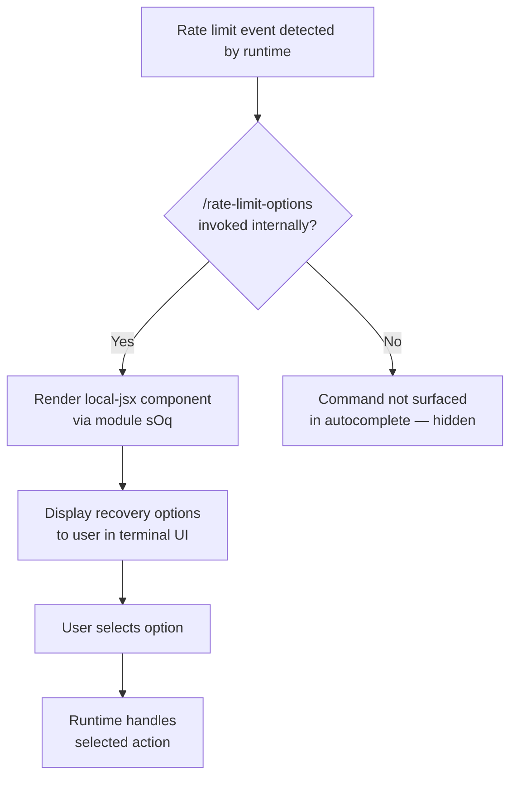

```
---
type: feature-spec
feature: "rate-limit-options"
cc_version: 2.1.133
updated: "2026-05-18"
tags: ["rate-limit-options", "commands", "slash-commands"]
source: "bundle-analysis"
bundle_verified: true
inherited_from: 2.1.132
analysis_basis: "CC v2.1.132 bundle.js (AST extraction + Claude interpretation)"
author: "ryujaeuk <ryujaeuk@gmail.com>"
repository: "https://github.com/MyLittleLuckyDog/cc-gnothi"
license: "AGPL-3.0-only"
---

# `/rate-limit-options`

> Analysis basis: CC v2.1.132 bundle.js (AST extraction + Claude interpretation)
> Minimum version: v2.1.132

---

## Overview

The `/rate-limit-options` command is a hidden slash command that presents the user with available choices when the API rate limit has been reached during a session. It is registered as a local JSX command, meaning it renders a UI component inline within the CLI terminal interface rather than producing plain text output. Its primary purpose is to surface recovery actions (such as waiting, switching models, or exiting) at the point of rate-limit impact.

---

## Registration

| Field | Value |
|---|---|
| type | `local-jsx` |
| name | `rate-limit-options` |
| description | Show options when rate limit is reached |
| isHidden | `true` |
| module_id | `sOq` |

Analysis basis: CC v2.1.132 bundle.js:+11362801

---

## Input Branching

Because the call graph returned zero edges at depth ≤ 2 and no string/numeric literals were extracted, no multi-path branching logic can be verified from the current traversal data.

<!-- TODO: not found in depth-2 traversal; needs --depth 4 -->

The command is `isHidden: true`, which means it does not appear in user-facing command completion lists and is expected to be invoked programmatically by the rate-limit handling subsystem rather than typed manually by users.



> Note: Internal branching within the JSX component (module `sOq`) and exact option labels
> cannot be specified — call graph depth-2 traversal returned no edges.
> <!-- TODO: not found in depth-2 traversal; needs --depth 4 -->

---

## Behavioral Spec

### Rate-Limit Options Rendering

```
function renderRateLimitOptions():
    # Invoked by the rate-limit handling layer, not by direct user input
    # Renders a JSX component registered under module sOq

    component = loadLocalJsxModule("sOq")

    # Component presents recovery options to the user.
    # Exact option labels and actions are not recoverable at traversal depth 2.
    # <!-- TODO: not found in depth-2 traversal; needs --depth 4 -->

    render(component)
```

Analysis basis: CC v2.1.132 bundle.js:+11362801

### Visibility / Discoverability

```
function isVisibleInCommandCompletion(command):
    if command.isHidden == true:
        return false   # Not shown in autocomplete or /help listings
    return true
```

The `isHidden: true` flag means `/rate-limit-options` will not appear when a user browses
available slash commands interactively. It is reserved for programmatic invocation by
the CLI's internal rate-limit event system.

Analysis basis: CC v2.1.132 bundle.js:+11362801

---

## State & Side Effects

| Item | Detail |
|---|---|
| Telemetry | None detected at traversal depth ≤ 2. <!-- TODO: not found in depth-2 traversal; needs --depth 4 --> |
| Hook registration | <!-- TODO: not found in depth-2 traversal; needs --depth 4 --> |
| appState changes | <!-- TODO: not found in depth-2 traversal; needs --depth 4 --> |
| Sound | <!-- TODO: not found in depth-2 traversal; needs --depth 4 --> |
| Render type | `local-jsx` — output is a terminal-rendered JSX component, not plain text |
| Visibility | Hidden from autocomplete and help listings (`isHidden: true`) |

---

## Version History

| Version | Change |
|---|---|
| v2.1.132 | Initial analysis. Command registered at bundle.js:+11362801 as hidden local-jsx command in module `sOq`. |

---

## Common Mistakes

1. **Attempting to invoke `/rate-limit-options` manually**: Because `isHidden: true`, this
   command is not intended for direct user invocation. Typing it manually may produce
   unexpected results or no visible effect outside of an active rate-limit state.

2. **Expecting plain text output**: The `type: local-jsx` registration means the command
   renders a UI component. Tools or scripts that parse slash command output as plain text
   will not receive structured text from this command.

3. **Assuming telemetry is emitted**: No `tengu_*` telemetry events were found in the
   implementation at the traversal depth analyzed. Do not rely on telemetry from this
   command for observability pipelines without verifying at greater traversal depth.

4. **Treating this command as stable public API**: The hidden flag and internal invocation
   pattern indicate this command is an implementation detail of the rate-limit subsystem.
   Its interface may change without notice in patch versions.

---

## Appendix — Identifier Mapping

> For bundle debugging only. Identifiers change across versions.

| Identifier | Role |
|---|---|
| `mY7` | Primary implementation symbol for the `/rate-limit-options` command; likely the JSX component or command registration factory within module `sOq` |
```