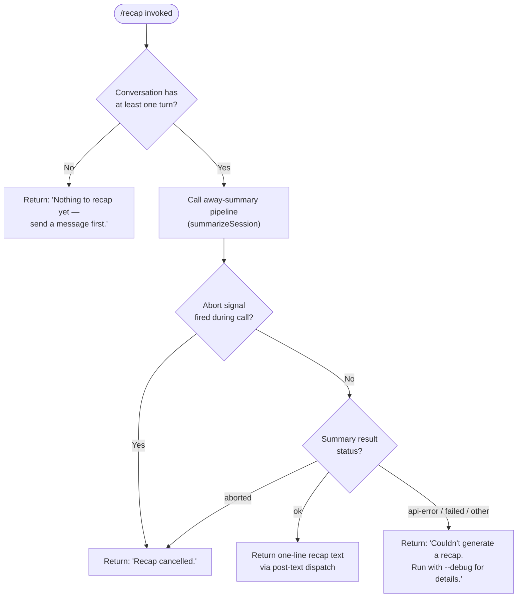

# `/recap`

> Analysis basis: CC v2.1.133 bundle.js (AST extraction + Claude interpretation)
> Minimum version: v2.1.133

---

## Overview

The `/recap` command triggers an immediate, on-demand generation of a single-line summary of the current Claude Code session. It invokes the same "away summary" pipeline used for background session recaps, routing its result back to the terminal as post-text output. The command short-circuits if no conversational turns exist yet, and cancels gracefully if an abort signal fires before the summary is complete.

---

## Registration

| Field | Value |
|---|---|
| type | `local` |
| name | `recap` |
| description | `Generate a one-line session recap now` |
| supportsNonInteractive | `false` |
| thinClientDispatch | `post-text` |
| load_inline | `true` |
| load_ident | `W27` |
| loc_byte | `11630020` |
| loc_byte_end | `11630236` |
| loc_line | `7643` |
| arbor_handler.name | `W27` |
| arbor_handler.fqn | `claude-2.1.133::W27` |
| arbor_handler.kind | `AsyncFunction` |
| arbor_handler.resolution_path | `load_ident` |
| arbor_handler.n_hits | `0` |

Analysis basis: CC v2.1.133 bundle.js:+11630020

---

## Input Branching

The handler has four distinct outcome branches based on session state and the result of the away-summary call, so a flowchart is used.



Analysis basis: CC v2.1.133 bundle.js:+11629628 (handler entry `W27` → `X68`)

---

## Behavioral Spec

### Handler entry — `recapCommandHandler` (`W27`)

The handler is an `AsyncFunction` inlined via `load: () => Promise.resolve({ call: W27 })`. It is the sole exported callable for `/recap`.

```
async function recapCommandHandler(commandContext):
    // 1. Validate that at least one message turn exists
    cachedParams = getCachedSummaryParams(commandContext)
    if cachedParams is null or empty:
        return textOutput("Nothing to recap yet — send a message first.")

    // 2. Register an abort listener so cancellation is propagated
    abortController = commandContext.abortSignal
    abortController.addEventListener("abort", onAbort)

    // 3. Delegate to the away-summary pipeline
    result = await runAwaySummaryPipeline(commandContext, cachedParams)

    // 4. Dispatch result according to status
    match result.status:
        case "ok":
            return postText(result.summary)
        case "aborted":
            return textOutput("Recap cancelled.")
        case "api-error" | "failed" | other:
            return textOutput("Couldn't generate a recap. Run with --debug for details.")
```

Analysis basis: CC v2.1.133 bundle.js:+11629628, +11629770, +11629862, +11629920

---

### Pre-flight check — session guard (`X68` → `XGH`, `k`)

Before invoking the model, the pipeline checks whether `CacheSafeParams` (the snapshot of conversation state needed for summarisation) has been saved. If the check fails, a debug-level log is emitted and the command exits immediately with the "nothing to recap" message.

```
function checkCachedSummaryParams(context):
    params = retrieveCacheSafeParams(context)          // XGH
    if params is absent:
        logDebug("[awaySummary] no CacheSafeParams saved, skipping")
        return null
    return params
```

Constant: log prefix `"[awaySummary] no CacheSafeParams saved, skipping"` (bundle.js:+6482789).

Analysis basis: CC v2.1.133 bundle.js:+6482768, +6482787, +6482789

---

### Away-summary pipeline — `runAwaySummaryPipeline` (`X68`)

This is the shared "away summary" subsystem, re-used by `/recap` as an explicit user-facing trigger. Key responsibilities:

1. **Tool permission lock-down** — the sub-agent for recap is always created with `"deny"` tool permissions and a fixed reason of `"Away summary cannot use tools"`. No tool calls are permitted during a recap generation. (bundle.js:+6483080, +6483095)
2. **Request type tagging** — the request is tagged `"away_summary"` so telemetry and routing can distinguish it from normal turns. (bundle.js:+6483163)
3. **Abort wiring** — an `"abort"` event on the context's abort controller is forwarded to the sub-agent so user Ctrl-C cleanly cancels the in-flight API request. (bundle.js:+6482903)
4. **Sub-agent invocation** — calls `executeAgentQuery` (`eE`) with the cached params, a single-turn `"no-turn"` mode constraint, and the tool-deny context. (bundle.js:+6482847)
5. **Result classification** — inspects the sub-agent outcome and maps it to one of: `ok`, `aborted`, `api-error`, `failed`. (bundle.js:+6483307, +6483396, +6483457, +6483476)

```
async function runAwaySummaryPipeline(context, cachedParams):
    permissionContext = buildPermissionContext(toolMode = "deny",
                                               reason = "Away summary cannot use tools")
    request = buildRequest(cachedParams,
                           turnMode   = "no-turn",
                           requestTag = "away_summary",
                           permissions = permissionContext)

    context.abortSignal.addEventListener("abort", () => subAgent.abort())

    rawResult = await executeAgentQuery(request)           // eE

    return classifyResult(rawResult)
    // classifyResult maps:
    //   SubAgent success  → { status: "ok",        summary: text }
    //   User abort        → { status: "aborted" }
    //   API failure       → { status: "api-error" }
    //   Other failure     → { status: "failed" }
```

Analysis basis: CC v2.1.133 bundle.js:+6482884, +6482915, +6482962, +6483080, +6483095, +6483163

---

### Agent query execution — `executeAgentQuery` (`eE`)

`executeAgentQuery` is the shared single-turn agent runner (also used by subagents and compact operations). For `/recap` it is constrained to a single output turn. Key behaviours:

- Stamps `Date.now()` at entry for latency tracking. (bundle.js:+5266446)
- Calls `buildAgentMessages` (`UMA`) to assemble the message array from cached params and app state. (bundle.js:+5266562)
- Iterates the conversation array to select the trailing turn slice (`G.at`, `eE → Y.push`). (bundle.js:+5266714, +5267341)
- Dispatches to `callModel` (`Ps` → `Kd4`) for the actual API call. (bundle.js:+5266764)
- Emits `"progress"` events during streaming so the CLI can show a spinner. (bundle.js:+5267421)
- On completion, maps the raw model output into the result object (`Y.map`, `d`). (bundle.js:+5267664)

```
async function executeAgentQuery(request):
    startTime = Date.now()
    messages  = await buildAgentMessages(request)          // UMA
    lastTurn  = messages.at(-1)                            // G.at

    progressStream = openProgressChannel()
    result = await callModel(messages, request.config)     // Ps → Kd4

    progressStream.push("progress", result.partial)
    return result.final
```

Analysis basis: CC v2.1.133 bundle.js:+5266446, +5266562, +5266714, +5266764, +5267341, +5267421

---

### Message assembly — `buildAgentMessages` (`UMA`)

Reconstructs the conversation message list from app state and the cached summary params. Also injects tool permission context (locked to deny for recap). Generates a fresh random request ID via `Nt1.randomUUID`. (bundle.js:+5266022)

```
async function buildAgentMessages(request):
    appState       = getAppState()                         // H.getAppState
    permCtx        = getToolPermissionContext()            // H.getToolPermissionContext
    conversationId = randomUUID()                          // Nt1.randomUUID
    history        = loadConversationHistory(appState)     // E_H
    return assembleMessages(history, permCtx, request)
```

Analysis basis: CC v2.1.133 bundle.js:+5262964, +5263261, +5263400, +5266022

---

### Recap output path — file persistence (`vtq`, `Vtq`, `aHH`)

After the model produces the recap text, the away-summary pipeline also persists the result to disk via a log-rotation-aware file writer (`vtq`). This is the same mechanism used by automatic background recaps.

Key steps:
1. Resolve the output directory path using `path.dirname` and `path.join`. (bundle.js:+162100)
2. Compute `Buffer.byteLength` of the encoded recap string to enforce size accounting. (bundle.js:+162275)
3. Rotate the file if it exceeds a size threshold via `archiveIfNeeded` (`AiA`): renames `.txt` to a timestamped backup (suffix `.txt`, slice at position 4), then unlinks the old file. (bundle.js:+161525, +161547)
4. Append the recap line via `fs.mkdir` (recursive) + `fs.appendFile`. (bundle.js:+161821, +161880)
5. On error with code `"EISDIR"`, the write is silently skipped. (bundle.js:+134356)

```
async function persistRecapToFile(recapText, context):
    dir     = path.dirname(path.join(baseDir, filename))   // vtq → iwH.dirname
    size    = Buffer.byteLength(recapText)
    await archiveIfNeeded(filePath)                        // AiA
        // if filePath.endsWith(".txt"):
        //     newPath = filePath.slice(0, -4) + timestamp
        //     await fs.rename(filePath, newPath)
        //     await fs.unlink(newPath)           // rotation
    await fs.mkdir(dir, { recursive: true })               // Vtq → $V.mkdir
    await fs.appendFile(filePath, recapText)               // Vtq → $V.appendFile
```

Analysis basis: CC v2.1.133 bundle.js:+162100, +162275, +161421, +161514, +161525, +161547, +161577, +161617, +161821, +161880, +134356

---

### Conversation message push — `pushConversationEntry` (`y1`)

A shared utility that registers new messages into the session message store. Used by the recap pipeline to record the generated summary turn.

```
function pushConversationEntry(message, store):
    notify(store)                                          // Qoq
    store.pendingSet.add(message.id)                      // d08.add
    store.pendingSet.delete(previousId)                   // d08.delete
    Object.assign(store.entries, message)
```

Analysis basis: CC v2.1.133 bundle.js:+53948, +53955, +53977, +53999

---

### Model call loop — `callModel` (`Ps` → `Kd4`)

The model call layer is the general-purpose agent loop. For `/recap` it runs in a constrained single-turn mode. Notable constants observed in the traversal:

- `"query_fn_entry"`, `"query_started"`, `"query_setup_start"`, `"query_setup_end"`, `"query_api_loop_start"`, `"query_api_streaming_start"`, `"query_api_streaming_end"` — internal phase markers used for tracing. (bundle.js:+9034995, +9035027, +9037648, +9037903, +9038411, +9038478, +9041427)
- Fast-mode flag checked via `G.getFastMode`. (bundle.js:+9038793)
- Effort value queried via `G.getEffectValue`. (bundle.js:+9039635)
- Tool-use is entirely absent from the recap path due to the `"deny"` permission context applied upstream.

```
async function callModel(messages, config):
    emitPhase("query_fn_entry")
    emitPhase("query_started")
    emitPhase("query_setup_start")
    ctx = buildQueryContext(messages, config)
    emitPhase("query_setup_end")
    emitPhase("query_api_loop_start")

    stream = openModelStream(ctx)                          // Y.callModel
    emitPhase("query_api_streaming_start")

    for chunk in stream:
        yield chunk

    emitPhase("query_api_streaming_end")
    return finalizeResult(stream)
```

Analysis basis: CC v2.1.133 bundle.js:+9034995, +9035027, +9037648, +9037903, +9038411, +9038478, +9041427

---

## State & Side Effects

| Item | Detail |
|---|---|
| Telemetry — auto-compact rapid refill breaker | `tengu_auto_compact_rapid_refill_breaker` (bundle.js:+9035886) — emitted by the shared model loop if the compact refill guard trips |
| Telemetry — auto-compact success | `tengu_auto_compact_succeeded` (bundle.js:+9036288) |
| Telemetry — prompt-too-long surfaced | `tengu_ptl_surfaced_to_user` (bundle.js:+9038195) |
| Telemetry — orphaned messages tombstoned | `tengu_orphaned_messages_tombstoned` (bundle.js:+9039921) |
| Telemetry — model fallback | `tengu_model_fallback_triggered` (bundle.js:+9041692) |
| Telemetry — query error | `tengu_query_error` (bundle.js:+9042024) |
| Telemetry — malformed tool use | `tengu_malformed_tool_use_response` (bundle.js:+9045494) |
| Telemetry — streaming tool execution used | `tengu_streaming_tool_execution_used` (bundle.js:+9046927) |
| Telemetry — streaming tool execution not used | `tengu_streaming_tool_execution_not_used` (bundle.js:+9047030) |
| Telemetry — post-autocompact turn | `tengu_post_autocompact_turn` (bundle.js:+9048986) |
| Telemetry — query before attachments | `tengu_query_before_attachments` (bundle.js:+9049100) |
| Telemetry — query after attachments | `tengu_query_after_attachments` (bundle.js:+9051432) |
| Telemetry — MCP tools refreshed mid-turn | `tengu_mcp_tools_refreshed_mid_turn` (bundle.js:+9051735) |
| Telemetry — feature ok | `tengu_feature_ok` (bundle.js:+907381) — emitted by the feature-flag check utility (`hH`) |
| Telemetry — feature bad | `tengu_feature_bad` (bundle.js:+907437) — emitted by the feature-flag check utility (`uH`) |
| Telemetry — bg spare enable | `tengu_bg_spare_enable` (bundle.js:+14156457) |
| Telemetry — bg low memory | `tengu_bg_low_mem_mb` (bundle.js:+14156207) |
| Telemetry — bg spare spawn | `tengu_bg_spare_spawn` (bundle.js:+14156817) |
| Telemetry — forked agent default turns exceeded | `tengu_forked_agent_default_turns_exceeded` (bundle.js:+5267888) |
| Telemetry — fork agent query | `tengu_fork_agent_query` (bundle.js:+5268331) |
| File write | Recap text is appended to a rotating `.txt` log file in the session's data directory (bundle.js:+161880) |
| File rotation | If the file exceeds size limits, it is renamed and unlinked; `EISDIR` errors are silently swallowed (bundle.js:+161577, +134356) |
| Abort registration | An `"abort"` event listener is added to the command's AbortController; the sub-agent is aborted on signal (bundle.js:+6482884, +6482915) |
| App state read | `getAppState()` and `getToolPermissionContext()` are called during message assembly (bundle.js:+5262964, +5263261) |
| Message store mutation | The generated recap turn is pushed into the session message store via `pushConversationEntry` (bundle.js:+53955) |
| Tool permissions | Locked to `"deny"` for all recap sub-agent invocations; no tool calls are possible (bundle.js:+6483080) |
| Non-interactive mode | Not supported (`supportsNonInteractive: false`); the command must be run in an interactive session |
| thinClientDispatch | `post-text` — the recap text is emitted as trailing text output, not as an interactive UI widget |
| Randomness | `Math.random` used in the shared retry jitter path (bundle.js:+12285769); `crypto.randomUUID` for request IDs (bundle.js:+5266022) |
| Timers | `setTimeout` / `clearTimeout` / `setImmediate` used in the output batching layer (`uNH`) (bundle.js:+53394, +53527, +53620) |

---

## Version History

| Version | Change |
|---|---|
| v2.1.133 | Initial analysis — `/recap` registered as a `local` command with `load_ident: W27`, `thinClientDispatch: post-text`, and the away-summary pipeline as its execution core |

---

## Common Mistakes

1. **Running `/recap` before any messages are sent.** The handler checks for cached summary params immediately; if none exist it returns `"Nothing to recap yet — send a message first."` and does not invoke the model at all. (bundle.js:+11629770)
2. **Expecting interactive tool use during recap.** The sub-agent is created with `"deny"` tool permissions unconditionally. Any system prompt or instruction that expects tool calls during a recap will silently receive no tool execution. (bundle.js:+6483080)
3. **Using `/recap` in non-interactive / scripted pipelines.** `supportsNonInteractive` is `false`; invoking the command from a CI pipeline or `--no-interactive` session is not supported. (bundle.js:+11630020)
4. **Expecting a rich multi-line summary.** The command description — "Generate a one-line session recap now" — is intentional: the prompt instructs the model to produce a single-line output. Long session histories are summarised into one line, not a bulleted list.
5. **Misreading the error message as a bug.** `"Couldn't generate a recap. Run with --debug for details."` (bundle.js:+11629920) surfaces `api-error`, `failed`, and all other non-ok, non-aborted outcomes. Re-run `claude --debug` and inspect the away-summary sub-agent error for the root cause.
6. **Assuming the recap is ephemeral.** The recap text is also persisted to a rotating `.txt` file on disk (bundle.js:+161880), independent of whether the terminal output is captured.

---

## Appendix — Identifier Mapping

> For bundle debugging only. Identifiers change across versions.

| Identifier | Role |
|---|---|
| `W27` | `recapCommandHandler` — top-level async handler for `/recap`; resolved via `load_ident` |
| `X68` | `runAwaySummaryPipeline` — orchestrates the away-summary sub-agent call |
| `XGH` | `retrieveCacheSafeParams` — reads cached conversation params needed for summarisation |
| `k` | `buildSummaryRequest` — assembles the sub-agent request object with tool-deny context |
| `Ztq` | `classifyAwaySummaryResult` — maps raw sub-agent outcome to `ok / aborted / api-error / failed` |
| `xcA` | `extractSummaryText` — pulls the text content from the model response |
| `SH` | `serializeRequestParams` — JSON-serialises request parameters (uses `JSON.stringify`) |
| `Uf` | `redactSensitiveContent` — replaces sensitive strings with `[REDACTED]` in log output |
| `rnA` | `mapTurnArray` — maps over the conversation turns array |
| `LkH` | `writeRecapLine` — writes the recap string to the session output stream |
| `UnA` | `streamWriter` — low-level write call on the output stream |
| `vtq` | `persistRecapToFile` — file-system persistence layer for recap text |
| `uNH` | `batchedOutputWriter` — batches output chunks using `clearTimeout` / `setTimeout` / `setImmediate` |
| `aHH` | `buildRecapFilePath` — constructs the full file path for the recap log |
| `F6` | `getRecapBaseDir` — resolves the base directory for recap file storage |
| `dG8` | `handleEisdirError` — catches `EISDIR` filesystem errors and suppresses them |
| `_iA` | `resolveRecapFilePath` — joins base dir and filename components |
| `AiA` | `archiveIfNeeded` — rotates the recap file when size threshold is exceeded |
| `Vtq` | `appendRecapToFile` — performs `fs.mkdir` + `fs.appendFile` for the recap text |
| `y1` | `pushConversationEntry` — registers a new message turn into the session message store |
| `eE` | `executeAgentQuery` — single-turn agent runner shared with subagents and compaction |
| `UMA` | `buildAgentMessages` — assembles conversation message list from app state and cached params |
| `Xv` | `openModelStream` — initiates the streaming model API request |
| `E_H` | `loadConversationHistory` — loads and dumps conversation history from app state |
| `BMH` | `injectSystemPrompt` — injects system prompt into the message list |
| `Qm1` | `applyPermissionContext` — applies tool permission context to the request |
| `re6` | `assembleRequestPayload` — final assembly of the API request payload |
| `Eu` | `generateRequestId` — creates a random hex request ID (`Vt1.randomBytes`, 8 bytes) |
| `G` | `conversationMessageQueue` — the live conversation message queue / registry |
| `AJ6` | `messageQueueEntry` — individual message queue entry constructor |
| `jP8` | `messageQueueIndex` — message queue indexing helper |
| `Ps` | `callModelDispatcher` — top-level dispatcher that routes to `Kd4` (main model loop) |
| `RK` | `initModelCallState` — initialises call state, including wiring `y1` (pushConversationEntry) |
| `SP6` | `filterMessageHistory` — filters conversation history; checks for `"ant"` provider tag |
| `SR` | `subAgentResultRouter` — routes sub-agent results; handles `"subagent_exit"` and `"turn"` events |
| `Kd4` | `mainModelLoop` — core agent query and tool-execution loop |
| `LH8` | `cacheEntryLookup` — looks up and removes entries from the session cache (`tc`) |
| `hH` | `checkFeatureFlag` — checks feature flags; emits `tengu_feature_ok` |
| `uH` | `checkFeatureFlagBad` — negative feature-flag check; emits `tengu_feature_bad` |
| `e3H` | `parseEventStream` — parses incoming SSE / streaming events |
| `se6` | `handleStreamEvent` — handles individual streaming event objects |
| `Et1` | `checkAbortSet` — checks whether a request ID is in the abort set (`zA4`) |
| `Y` | `sessionMessagePushQueue` — queue managing message push and background spare logic |
| `J6` | `enqueueMessage` — adds a message to the push queue, with deduplication |
| `$` | `disposeQueueEntry` — disposes of a push-queue entry |
| `sFA` | `processQueuedMessages` — processes and drains the queued message list |
| `lFA` | `spawnBackgroundSpare` — spawns a background spare agent process (`Bun.spawn`) |
| `d` | `emitTelemetryEvent` — generic telemetry emission helper |
| `fH` | `logWithErrorCapture` — logging utility that captures errors into `cyH` and uses `yQ.logError` |
| `wA4` | `handleForkAgentResult` — processes result from a forked sub-agent query |
| `$8` | `generateUUID` — generates a UUID via `SG.randomUUID` |
| `q` | `cleanupTempFiles` — removes temporary files via `Ydq.unlinkSync` |
| `ZK9` | `flatMapResultChunks` — flat-maps result chunk arrays for output collation |

---

Note: index built via Arbor fallback; some signals (telemetry, literals) may be missing — see arbor-fallback.js.