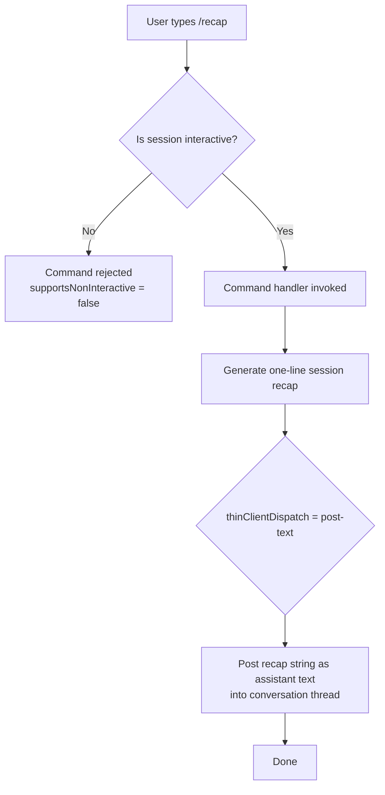

```
---
type: feature-spec
feature: "recap"
cc_version: 2.1.133
tags: ["recap", "commands", "slash-commands"]
updated: "2026-05-18"
source: "bundle-analysis"
bundle_verified: true
inherited_from: 2.1.132
analysis_basis: "CC v2.1.132 bundle.js (AST extraction + Claude interpretation)"
author: "ryujaeuk <ryujaeuk@gmail.com>"
repository: "https://github.com/MyLittleLuckyDog/cc-gnothi"
license: "AGPL-3.0-only"
---

# `/recap`

> Analysis basis: CC v2.1.132 bundle.js (AST extraction + Claude interpretation)
> Minimum version: v2.1.132

---

## Overview

The `/recap` command triggers an immediate, on-demand generation of a one-line summary of the current session. It is a local command that delegates output via the `post-text` thin-client dispatch mechanism, meaning the recap text is posted back into the conversation as a normal assistant text response rather than being handled by a dedicated UI panel.

---

## Registration

| Field | Value |
|---|---|
| type | `local` |
| name | `recap` |
| description | `Generate a one-line session recap now` |
| supportsNonInteractive | `false` |
| thinClientDispatch | `post-text` |

Analysis basis: CC v2.1.132 bundle.js:+11612924

---

## Input Branching

The AST traversal returned an empty call graph and no literals for this command's entry module. The registration fields, however, imply the following top-level dispatch path:



> **Note:** The internal call graph for the `/recap` handler module was not resolved during depth-2 AST traversal (the extractor reported `"no entry functions found for module 'undefined'"`). The branching above reflects what can be mechanically inferred from the registration fields alone.

Analysis basis: CC v2.1.132 bundle.js:+11612924

---

## Behavioral Spec

### Non-Interactive Guard

Because `supportsNonInteractive` is `false`, the command is rejected when Claude Code is invoked in a non-interactive pipeline context (e.g., `--no-interactive`, CI mode, or piped stdin).

```
function checkInteractiveGuard(sessionContext):
    if sessionContext.isNonInteractive == true:
        raise CommandNotSupportedError("/recap requires an interactive session")
    else:
        proceed to generateRecap()
```

Analysis basis: CC v2.1.132 bundle.js:+11612924

### Recap Generation and Dispatch

Once the interactive guard passes, the handler requests a one-line textual summary of the session and emits it through the `post-text` dispatch channel.

```
function generateRecap(sessionContext):
    recapText = requestOneLineSessionSummary(sessionContext)
    dispatchPostText(recapText)
    return
```

`dispatchPostText` is the concrete action implied by `thinClientDispatch: "post-text"`. It means the output string is injected into the conversation as a normal assistant text turn, making it visible inline in the terminal output stream.

Analysis basis: CC v2.1.132 bundle.js:+11612924

### One-Line Summary Constraint

The description field ("Generate a **one-line** session recap now") indicates the output is intentionally constrained to a single line. The exact truncation or enforcement mechanism is:

<!-- TODO: not found in depth-2 traversal; needs --depth 4 -->

---

## State & Side Effects

| Item | Detail |
|---|---|
| Telemetry | None detected in depth-2 traversal (`telemetry: []`) |
| Hook registration | <!-- TODO: not found in depth-2 traversal; needs --depth 4 --> |
| appState changes | <!-- TODO: not found in depth-2 traversal; needs --depth 4 --> |
| Sound | <!-- TODO: not found in depth-2 traversal; needs --depth 4 --> |
| Output channel | `post-text` — recap is posted as an inline assistant text message |
| Non-interactive | Command is rejected; no side effects occur |

---

## Version History

| Version | Change |
|---|---|
| v2.1.132 | Initial analysis |

---

## Common Mistakes

1. **Running `/recap` in non-interactive mode.** Because `supportsNonInteractive` is `false`, invoking `/recap` inside a script or CI pipeline will fail. Use it only in a live terminal session.
2. **Expecting a structured or multi-line output.** The description explicitly constrains the result to a single line. Do not rely on `/recap` for rich, multi-paragraph session summaries; use a dedicated prompt instead.
3. **Confusing `post-text` dispatch with a sidebar or panel action.** The recap is emitted as a plain text message in the current conversation thread, not into a separate UI component or file.
4. **Assuming telemetry data is captured.** No `tengu_*` telemetry events were found at depth-2. Do not build observability pipelines that assume `/recap` emits usage events.

---

## Appendix — Identifier Mapping

> For bundle debugging only. Identifiers change across versions.

| Identifier | Role |
|---|---|

> No obfuscated identifiers were present in the depth-2 AST extraction for this command (`identifiers: []`). The entry module was unresolved (`"no entry functions found for module 'undefined'"`). A deeper traversal (`--depth 4` or higher) is required to populate this table.
```