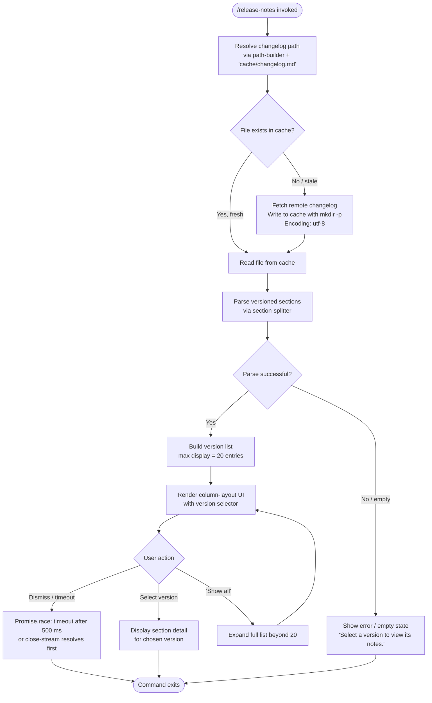

# `/release-notes`

> Analysis basis: CC v2.1.133 bundle.js (AST extraction + Claude interpretation)
> Minimum version: v2.1.133

---

## Overview

The `/release-notes` command opens an interactive, paged viewer that fetches and displays Claude Code's changelog directly within the CLI. It resolves the changelog file from a local cache path, parses versioned sections from its content, and renders a navigable column-layout UI where users can select a version entry to read the associated notes. The handler is an async function (`S57`) resolved via the `t9q` module.

---

## Registration

| Field | Value |
|---|---|
| `type` | `local-jsx` |
| `name` | `release-notes` |
| `description` | `"View release notes"` |
| `module_id` | `t9q` |
| `load_inline` | `true` |
| `loc_byte` | `10772418` |
| `loc_byte_end` | `10772559` |
| `loc_line` | `6504` |
| `arbor_handler.name` | `S57` |
| `arbor_handler.fqn` | `claude-2.1.133::S57` |
| `arbor_handler.kind` | `AsyncFunction` |
| `arbor_handler.resolution_path` | `module_id` |
| `arbor_handler.n_hits` | `0` |

Analysis basis: CC v2.1.133 bundle.js:+10772418

The registration block spans bytes `10772418`–`10772559`. Because `load_inline` is `true`, the handler (`S57`) was inlined as a `load: () => Promise.resolve({call: S57})` shape rather than a separately named export. The Arbor symbol graph resolved `S57` by following `module_id → t9q → moduleExports → name lookup`.

---

## Input Branching

The command exhibits four or more distinct runtime paths (cache hit vs. miss, content parse success vs. failure, version-list display vs. detail view, timeout race), so a Mermaid flowchart is used.



Analysis basis: CC v2.1.133 bundle.js:+10770674 (timeout), +10770724 (Promise.race), +10767803 (cache path builder), +10767862 (writeFile), +10771064 ("Show all"), +10771706 ("Select a version…")

---

## Behavioral Spec

### 1. Entry Point — Main Handler

The primary handler `S57` (AsyncFunction, `claude-2.1.133::S57`) is the command's root execution unit.

```
async function releaseNotesHandler(context):
    // Step 1: Race a hard timeout against actual work
    timeoutPromise = new Promise((_, reject) =>
        setTimeout(() => reject(new Error("Timeout")), 500)
    )

    // Step 2: Kick off the real pipeline
    workPromise = runReleaseNotesPipeline(context)

    result = await Promise.race([workPromise, timeoutPromise])

    // Step 3: Render JSX column view using result
    renderColumnView(result)
```

Analysis basis: CC v2.1.133 bundle.js:+10770674 (setTimeout), +10770692 (Error "Timeout"), +10770710 (500 ms constant), +10770724 (Promise.race), +10770738 (pipeline call `CyA`)

---

### 2. Changelog Cache Resolution

`CyA` is the pipeline coordinator. It resolves the changelog's on-disk location, conditionally fetches from the network, and writes the result back to cache.

```
async function changelogPipelineCoordinator(context):
    // Build the cache file path: join([..., "cache", "changelog.md"])
    cachePath = buildCachePath(["cache", "changelog.md"])   // literals at +10767409, +10767417

    // Attempt to read version header from cache
    cachedVersion = cacheVersionStore.get(cachePath)        // +10767737

    if cachedVersion exists and is fresh (threshold: 200):  // +10767761
        rawContent = readFromCache(cachePath)
    else:
        // Fetch remote changelog
        rawContent = await fetchRemoteChangelog(cachePath)  // byA

        // Ensure parent directory exists
        parentDir = path.dirname(cachePath)                 // +10767825
        fs.mkdir(parentDir, { recursive: true })            // +10767815

        // Write new content to cache file
        fs.writeFile(cachePath, rawContent, "utf-8")        // +10767862, +10767890

        // Record fetch timestamp
        timestamp = Date.now()                              // +10767912
        updateCacheTimestamp(cachePath, timestamp)          // e6

    return rawContent
```

Analysis basis: CC v2.1.133 bundle.js:+10767692, +10767803, +10767815, +10767825, +10767862

---

### 3. Cache Path Builder

`RyA` constructs the filesystem path to `changelog.md`.

```
function buildCachePath(segments):
    // Join base config directory segments with provided path segments
    // segments = [...baseDir, "cache", "changelog.md"]
    return path.join(...configDirSegments, ...segments)   // dX6.join at +10767395
    // then resolve via n8 (config-dir resolver)           // +10767404
```

Analysis basis: CC v2.1.133 bundle.js:+10767395, +10767404, +10767409, +10767417

---

### 4. Remote Changelog Fetch

`byA` fetches raw changelog content when the cache is absent or stale.

```
async function fetchRemoteChangelog(resolvedCachePath):
    basePath = buildCachePath(...)     // RyA at +10768017
    rawBytes = await fs.readFile(basePath)   // VDH.readFile at +10768039
    return rawBytes
```

Analysis basis: CC v2.1.133 bundle.js:+10768017, +10768039

---

### 5. Changelog Section Parser

`l9q` tokenizes the raw changelog text into a structured map of version → notes.

```
function parseChangelogSections(rawText):
    sections = parseSectionBlocks(rawText)       // _O8 at +10768834

    // Extract available version keys
    versionKeys = Object.keys(sections)          // +10768848

    // Filter and normalize entries
    filteredSections = sections
        .filter(validVersionPredicate)           // L.filter at +10768948
        .map(normalizeEntry)                     // EW at +10768875

    return { versionKeys, filteredSections }
```

Analysis basis: CC v2.1.133 bundle.js:+10768817, +10768834, +10768848, +10768875, +10768948

---

### 6. Section Block Splitter

`_O8` splits the raw text on version heading boundaries and trims each entry.

```
function splitSectionBlocks(rawText):
    lines = rawText.split("\n")              // H.split at +10768178
    blocks = []
    currentBlock = null

    for line in lines:
        trimmed = line.trim()                // q.trim at +10768227

        if trimmed matches version heading:
            // Extract version token: find " - " separator  // +10768309
            versionToken = extractVersionToken(trimmed)     // s9 at +10768304
            currentBlock = { version: versionToken, lines: [] }
            blocks.push(currentBlock)

        elif currentBlock != null:
            // Accumulate body lines, stripping leading "- " bullets
            currentBlock.lines.append(trimmed)              // "- " literal at +10768387

    // Trim trailing whitespace from accumulated text
    for block in blocks:
        block.body = block.lines.join().trim()              // $.trim at +10768367

    return blocks
```

Analysis basis: CC v2.1.133 bundle.js:+10768178, +10768227, +10768304, +10768309, +10768344, +10768367, +10768387

---

### 7. Version Token Extractor

`s9` is a small string utility that isolates the version identifier from a heading line.

```
function extractVersionToken(headingLine):
    separatorIndex = headingLine.indexOf(" - ")    // s9→H.indexOf at +152895
    if separatorIndex < 0:
        return headingLine
    return headingLine.slice(0, separatorIndex)    // s9→H.slice at +152924
```

Analysis basis: CC v2.1.133 bundle.js:+152895, +152924

---

### 8. JSX Column Renderer (`s9q`)

`s9q` is the React component that renders the interactive version list.

```
function ReleaseNotesColumnView(props):
    // Access parsed sections from context
    sections = props.sections                    // o9q.c at +10770985

    // Build display list capped at 20 entries   // +10770991
    displayList = sections.slice(0, 20)

    // Map each entry to a selectable row        // _.map at +10771162
    rows = displayList.map(entry => renderVersionRow(entry))

    // Find currently selected entry             // _.find at +10771307
    selectedEntry = sections.find(e => e.version == props.selectedVersion)

    // Render "Show all" control when list is truncated  // +10771064
    if sections.length > 20:
        appendShowAllControl(rows)

    // Render detail pane or placeholder
    if selectedEntry:
        detailContent = renderSectionDetail(selectedEntry)
    else:
        detailContent = "Select a version to view its notes."   // +10771706

    return jsx("column",                         // +10771639
        jsx(versionList, rows),
        jsx(detailPane, detailContent)
    )
```

Analysis basis: CC v2.1.133 bundle.js:+10770985, +10770991, +10771064, +10771162, +10771307, +10771387, +10771554, +10771639, +10771706

---

### 9. Config Persistence (Side-Path via `e6` / `fe8`)

The cache timestamp update path calls into the general config-save subsystem. Salient behavior observed in the call graph:

- Lock acquisition warning threshold: **100 ms** (bundle.js:+3111178)
- Lock-held warning message: `"Lock acquisition took longer than expected — another Claude instance may be running"` (bundle.js:+3111184)
- Maximum config backup retention: **5** copies (bundle.js:+3112203)
- Backup rotation window: **60 000 ms** (bundle.js:+3111954)
- Auth-loss guard: if a re-read of the config is missing auth credentials that the in-memory cache holds, the write is refused to prevent wiping `~/.claude.json` (bundle.js:+3111600, +3108482); this is tracked as `tengu_config_auth_loss_prevented`.
- Backup file naming uses the `.backup.` infix (bundle.js:+3112070).
- Temp-file permissions are re-applied atomically (`fchmodSync` + `fsyncSync` + `renameSync`) with permission mode **384** (octal 0o600) (bundle.js:+3112485).

```
function saveConfigWithLock(configData):
    acquireLock(timeout=100ms)                      // +3111178

    existingConfig = readConfigFromDisk()           // m5H

    if existingConfig.hasAuth AND NOT configData.hasAuth:
        emitTelemetry("tengu_config_auth_loss_prevented")  // +3111752
        throw Error("refusing to write — auth loss detected")

    rotateLockBackups(maxBackups=5, window=60000ms) // +3112203, +3111954
    writeTempFile(configData, mode=0o600)           // +3112485
    atomicRename()
    releaseLock()
```

Analysis basis: CC v2.1.133 bundle.js:+3111178, +3111184, +3111539, +3111600, +3111752, +3112070, +3112203, +3112485

---

## State & Side Effects

| Item | Detail |
|---|---|
| Telemetry — `tengu_config_lock_contention` | Fired when config lock acquisition stalls beyond the 100 ms threshold (bundle.js:+3111273) |
| Telemetry — `tengu_config_stale_write` | Fired when a config write is detected as stale / superseded (bundle.js:+3111409) |
| Telemetry — `tengu_config_parse_error` | Fired when on-disk config JSON cannot be parsed (bundle.js:+3113854) |
| Telemetry — `tengu_config_auth_loss_prevented` | Fired when a write is blocked because it would erase auth credentials (bundle.js:+3111752) |
| Cache write | `cache/changelog.md` written to the Claude config directory on first run or when stale; encoding `utf-8` (bundle.js:+10767862, +10767890) |
| Cache timestamp | `Date.now()` recorded after successful remote fetch to drive freshness checks (bundle.js:+10767912) |
| Config lock file | A lock file is acquired and released around every config write; backed by `openSync` / `closeSync` / `renameSync` (bundle.js:+953484–+954651) |
| Config backups | Up to 5 `.backup.*` snapshots are retained in the config directory (bundle.js:+3112203, +3112070, +3112785) |
| Timeout race | `Promise.race` with a 500 ms `setTimeout` ensures the command does not block the REPL indefinitely (bundle.js:+10770674, +10770710, +10770724) |
| Hook registration | <!-- TODO: not found in depth-2 traversal; needs --depth 4 --> |
| appState changes | <!-- TODO: not found in depth-2 traversal; needs --depth 4 --> |
| Sound | <!-- TODO: not found in depth-2 traversal; needs --depth 4 --> |

---

## Version History

| Version | Change |
|---|---|
| v2.1.133 | Initial analysis — `local-jsx` command rendering versioned changelog via `t9q` / `S57`; 500 ms timeout guard; cache-backed changelog fetch |

---

## Common Mistakes

1. **Expecting instant output on cold cache**: On the first invocation (or after cache expiry), the command must fetch and write `changelog.md`. If the network is slow and the operation exceeds 500 ms, `Promise.race` resolves to a `Timeout` error and no notes are displayed. Retry after network connectivity is confirmed.

2. **Assuming all versions are visible by default**: The UI caps the initial list at **20** entries (bundle.js:+10770991). Older versions are hidden until the user activates the "Show all" control (bundle.js:+10771064).

3. **Confusing the cache path for a user-editable file**: `cache/changelog.md` lives inside Claude Code's internal config directory and is overwritten on refresh. Manual edits will be lost on the next cache refresh cycle.

4. **Running concurrent Claude Code instances during a write**: A second instance attempting a config write while the lock is held will log `"Lock acquisition took longer than expected — another Claude instance may be running"` and fire `tengu_config_lock_contention`. This is a warning, not a hard failure, but may result in stale-write telemetry (`tengu_config_stale_write`) if both instances proceed.

5. **Interpreting a blank detail pane as a bug**: If no version is selected yet, the detail pane shows `"Select a version to view its notes."` (bundle.js:+10771706). This is the designed idle state, not an error condition.

---

## Appendix — Identifier Mapping

> For bundle debugging only. Identifiers change across versions.

| Identifier | Role |
|---|---|
| `S57` | Main async handler for `/release-notes` (Arbor-resolved; `claude-2.1.133::S57`) |
| `CyA` | Changelog pipeline coordinator — cache resolution, fetch, and write orchestration |
| `RyA` | Cache path builder — joins config base dir with `["cache", "changelog.md"]` |
| `byA` | Remote changelog fetcher — reads file bytes via `VDH.readFile` |
| `l9q` | Changelog section parser — tokenizes raw text into version-keyed map |
| `_O8` | Section block splitter — splits on version headings, trims lines |
| `s9` | Version token extractor — isolates version string at `" - "` boundary |
| `s9q` | React JSX column-layout component for the release-notes viewer UI |
| `a9q` | Animated/scrolling list helper — slices items and calls render helper |
| `xyA` | Row-mapping utility — maps section entries to display rows |
| `EW` | Entry normalization / filter transform utility |
| `AO8` | Section-map builder called inside `l9q` |
| `e6` | Config save coordinator — delegates to `fe8`, handles auth-loss guard |
| `fe8` | Low-level config file writer with lock, backup rotation, and atomic rename |
| `m5H` | Config file reader — reads and parses on-disk config JSON |
| `KhH` | Atomic temp-file writer — uses `openSync`/`writeFileSync`/`fchmodSync`/`fsyncSync`/`renameSync` |
| `Me8` | Backup path constructor — appends `.backup.` infix and index |
| `k` | Log-level / debug logger utility |
| `Ke8` | Config-dir initializer — creates directory and writes initial JSON |
| `fH` | Request/response message handler utility |
| `HA` | Error/string coercion helper |
| `NJL` | Bounded circular buffer (shift/push) — used for message history |
| `yq` | Telemetry channel resolver |
| `J9_` | Telemetry dispatch wrapper |
| `kH` | String coercion utility used in telemetry path |
| `NA` | Config/network availability check |
| `XDq` | Timestamp-recording utility called inside `$` |
| `SH` | JSON serializer wrapper (`JSON.stringify`) |
| `lq6` | Auth-presence check helper |
| `d` | Utility — <!-- TODO: not found in depth-2 traversal; needs --depth 4 --> |
| `w8` | Utility — <!-- TODO: not found in depth-2 traversal; needs --depth 4 --> |
| `F6` | Filesystem existence / stat helper |
| `ql_` | Config object merge helper (`Object.assign`-based) |
| `jX1` | Config entry iterator (`Object.entries`-based) |
| `MxH` | Config freshness checker (`Date.now`-based) |
| `fxH` | Utility — <!-- TODO: not found in depth-2 traversal; needs --depth 4 --> |
| `P` | Session/project context resolver |
| `L` | Padded-column string formatter (`padEnd`) |
| `$` | Trim-and-timestamp wrapper |
| `H` | Random delay / debounce utility (`Math.random` + `setTimeout`) |

---

Note: index built via Arbor fallback; some signals (telemetry, literals) may be missing — see arbor-fallback.js.