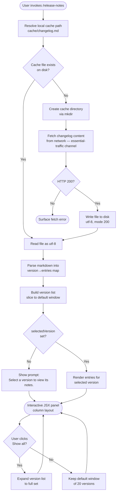

# `/release-notes`

> Analysis basis: CC v2.1.133 bundle.js (AST extraction + Claude interpretation)
> Minimum version: v2.1.133

---

## Overview

The `/release-notes` slash command renders an interactive JSX panel inside the Claude Code CLI that allows users to browse versioned changelog entries. It fetches a cached local copy of `changelog.md`, parses it into per-version sections, and presents a scrollable version list alongside the notes for the selected version. When the local cache is absent or stale, the command fetches fresh content and persists it to disk before rendering.

---

## Registration

| Field | Value |
|---|---|
| type | `local-jsx` |
| name | `release-notes` |
| description | `View release notes` |
| module\_id | `t9q` |

Analysis basis: CC v2.1.133 bundle.js:+10772418

---

## Input Branching

The command follows a multi-stage branching flow: cache resolution → network fetch (if needed) → markdown parsing → UI rendering.



Analysis basis: CC v2.1.133 bundle.js:+10770474, +10770549, +10770767, +10770806, +10771064, +10771706

---

## Behavioral Spec

### 1. Cache Path Resolution

```
function resolveCacheFilePath(configDirSegments):
    # Join config-dir path segments, then append "cache" and "changelog.md"
    segments = configDirSegments + ["cache", "changelog.md"]
    return pathJoin(segments)
```

The path components `"cache"` and `"changelog.md"` are hard-coded string constants.

Analysis basis: CC v2.1.133 bundle.js:+10767395, +10767409, +10767417

---

### 2. Changelog Fetch and Cache Write

```
function fetchAndCacheChangelog(cacheFilePath):
    parentDir = pathDirname(cacheFilePath)
    mkdirRecursive(parentDir)                      # creates intermediate dirs

    response = httpGet(channel="essential-traffic") # uses yq/J9_ transport
    if response.status != 200:
        raise FetchError(response)

    writeFile(cacheFilePath, response.body, encoding="utf-8", mode=200)
    recordTimestamp(Date.now())
    return response.body
```

File write mode is `200` (octal-style permission constant).
Analysis basis: CC v2.1.133 bundle.js:+10767815, +10767825, +10767862, +10767761, +10767890, +10767912

Network channel label `"essential-traffic"` is applied to the underlying request.
Analysis basis: CC v2.1.133 bundle.js:+911558

---

### 3. Changelog Read from Cache

```
function readCachedChangelog(cacheFilePath):
    raw = readFile(cacheFilePath, encoding="utf-8")
    return raw
```

Analysis basis: CC v2.1.133 bundle.js:+10768039

---

### 4. Markdown Parser — Version Section Extraction

```
function parseChangelogMarkdown(rawText):
    lines = rawText.split("\n")                       # line-by-line split
    versionMap  = {}                                  # version string → [entry, ...]
    currentVersion = null
    currentEntries = []

    for line in lines:
        trimmed = line.trim()
        if trimmed starts with heading marker and contains version token:
            if currentVersion is not null:
                versionMap[currentVersion] = currentEntries
            currentVersion = extractVersionString(trimmed)
            currentEntries = []
        elif trimmed starts with "- ":
            # Bullet entry; strip leading "- " prefix
            entry = trimmed.slice(len("- "))
            # Entries may contain " - " as an inline separator
            currentEntries.push(entry)
        # blank / non-bullet lines are skipped

    if currentVersion is not null:
        versionMap[currentVersion] = currentEntries

    return versionMap
```

String separators `" - "` (inline) and `"- "` (bullet prefix) are hard-coded.
Analysis basis: CC v2.1.133 bundle.js:+10768309, +10768387

The parser calls `.split`, `.trim`, and `.slice` on raw string values.
Analysis basis: CC v2.1.133 bundle.js:+10768178, +10768227, +10768344, +10768367

---

### 5. Version List Construction

```
function buildVersionList(versionMap, showAll):
    allVersions  = Object.keys(versionMap)           # insertion-order preserved
    filteredList = allVersions.filter(isNotEmpty)

    if showAll:
        return filteredList
    else:
        return filteredList.slice(0, DEFAULT_VERSION_WINDOW)  # DEFAULT_VERSION_WINDOW = 20
```

Default version window: **20** versions.
Analysis basis: CC v2.1.133 bundle.js:+10770991

The `"Show all"` label toggles `showAll` state.
Analysis basis: CC v2.1.133 bundle.js:+10771064

---

### 6. Animated Spinner / Delay Helper

```
function animatedDelay(callback):
    randomFactor = Math.random() * 2 + 1   # range [1, 3)
    delay        = randomFactor * 500       # range [500, 1500) ms
    setTimeout(callback, delay)
```

Random delay range constants: multiplier bounds `2` and `1`; base delay `500` ms.
Analysis basis: CC v2.1.133 bundle.js:+12285767, +12285783, +12285769, +12285806, +10770710

---

### 7. Fetch Orchestration with Timeout Race

```
function fetchWithTimeout(fetchFn, timeoutMs=500):
    timeoutPromise = new Promise((_, reject) =>
        setTimeout(() => reject(new Error("Timeout")), timeoutMs)
    )
    return Promise.race([fetchFn(), timeoutPromise])
```

Timeout label string: `"Timeout"`.
Timeout duration: **500 ms**.
Analysis basis: CC v2.1.133 bundle.js:+10770698, +10770710, +10770674, +10770724

---

### 8. Global Config Save Guard

If the config persistence layer (`saveGlobalConfig`) detects that a re-read of the on-disk config is missing authentication data that the in-memory cache holds, it refuses to write and emits the `tengu_config_auth_loss_prevented` telemetry event. This guard is triggered within the changelog write path when config state is flushed.

```
function saveGlobalConfigGuarded(inMemoryConfig, freshDiskConfig):
    if freshDiskConfig is missing auth fields that inMemoryConfig holds:
        logError("saveGlobalConfig fallback: re-read config is missing auth " +
                 "that cache has; refusing to write. See GH #3117.")
        emitTelemetry("tengu_config_auth_loss_prevented")
        return   # abort write
    persistToDisk(inMemoryConfig)
```

Error message is hard-coded: `"saveGlobalConfig fallback: re-read config is missing auth that cache has; refusing to write. See GH #3117."`
Analysis basis: CC v2.1.133 bundle.js:+3108482, +3108440

---

### 9. JSX Render — Panel Layout

```
function renderReleaseNotesPanel(versionMap, selectedVersion, showAll):
    versionList = buildVersionList(versionMap, showAll)

    panel = Column(
        title = "Release notes",
        children = [
            VersionSelector(
                items     = versionList,
                onSelect  = (v) => setSelectedVersion(v),
                showAllButton = (not showAll),
                showAllLabel  = "Show all"
            ),
            NoteDisplay(
                content = selectedVersion
                    ? versionMap[selectedVersion]
                    : "Select a version to view its notes."
            )
        ],
        layout = "column"
    )
    return panel
```

Panel title: `"Release notes"` (hard-coded).
Placeholder prompt: `"Select a version to view its notes."` (shown when no version selected).
Layout direction: `"column"`.
Analysis basis: CC v2.1.133 bundle.js:+10772090, +10771706, +10771639

The component uses React memo-cache with sentinel value `"react.memo_cache_sentinel"` and a cache slot count of **20**.
Analysis basis: CC v2.1.133 bundle.js:+10771565, +10771548 (slot index 10, with slots 3–19 referenced at +10771147 through +10772141)

---

### 10. File Handle Cleanup

```
function closeFileHandles(handle1, handle2, activeHandleSet):
    handle1.close(0)      # close at position 0
    handle2.close(0)
    activeHandleSet.add(currentHandle)
    try:
        await operation
    finally:
        activeHandleSet.delete(currentHandle)
```

Close position constant: `0`.
Analysis basis: CC v2.1.133 bundle.js:+14167101, +14167103, +14167113

String padding width used in column formatting: **40** characters.
Analysis basis: CC v2.1.133 bundle.js:+14181334

---

### 11. Entry Rendering — Map over Version Items

```
function renderVersionEntries(entries):
    return entries.map((entry, index) =>
        renderEntryRow(entry, index)
    )
```

The `"system"` string is applied as a message role label for rendered changelog entries injected into the conversation context.
Analysis basis: CC v2.1.133 bundle.js:+10770890

---

## State & Side Effects

| Item | Detail |
|---|---|
| Telemetry | `tengu_config_auth_loss_prevented` — fired when the config save guard detects an auth field would be lost (bundle.js:+3108610) |
| Disk write | `changelog.md` written to `<config-dir>/cache/changelog.md` in utf-8 with mode 200 |
| Disk read | Same path read back on subsequent invocations |
| Directory creation | `<config-dir>/cache/` created recursively if absent |
| Network request | One HTTP GET on the `"essential-traffic"` channel to fetch the remote changelog |
| React memo cache | Panel component uses a memo-cache with sentinel `"react.memo_cache_sentinel"` and up to 20 slots |
| Temp file handles | Two file handles tracked in an active-handle Set; both closed in a `finally` block |
| Config guard | `saveGlobalConfig` aborts and logs if auth fields would be overwritten; see GH #3117 |
| selectedVersion state | Local React state; defaults to unset, showing the placeholder prompt |
| showAll state | Local React state; defaults to `false`, limiting the displayed version list to 20 entries |

---

## Version History

| Version | Change |
|---|---|
| v2.1.133 | Initial analysis — `local-jsx` command registered in module `t9q`; full cache/fetch/parse/render pipeline documented |

---

## Common Mistakes

1. **Expecting live network data on every invocation.** The command serves content from the local cache at `<config-dir>/cache/changelog.md` whenever that file exists. The network is only hit when the cache file is absent. Force a refresh by deleting the cache file.

2. **Assuming all versions are shown by default.** Only the 20 most recent versions appear in the list initially. Click "Show all" to see the full set.

3. **Interpreting the "Select a version to view its notes." message as an error.** This is the normal placeholder displayed when the panel first opens and no version has been selected yet.

4. **Believing the fetch is instantaneous.** A random animated delay in the range `[500, 1500)` ms is applied before the fetch resolves in the UI, independent of actual network latency.

5. **Confusing the 500 ms timeout race with the animated delay.** The `Promise.race` timeout (500 ms, labeled `"Timeout"`) governs the fetch operation itself, while the animated delay is a UI-layer effect and operates independently.

6. **Expecting the config to be updated after a changelog fetch failure.** The `saveGlobalConfig` guard will abort any config write if it detects that auth fields would be lost, preventing silent data corruption (see GH #3117).

---

## Appendix — Identifier Mapping

> For bundle debugging only. Identifiers change across versions.

| Identifier | Role |
|---|---|
| `xyA` | Entry list mapper — maps version entry arrays for rendering |
| `a9q` | Version list slicer — slices version array and invokes entry mapper |
| `H` | Animated delay helper — uses `Math.random` and `setTimeout` |
| `EW` | Utility/helper — called from version list builder and fetch orchestrator |
| `S57` | Fetch orchestrator — runs timeout race, calls fetch, read, parse, and render helpers |
| `f` | File handle closer / async operation wrapper |
| `_` | String lowercaser / entry filter |
| `q` | File handle or Set — used for close, add, delete operations |
| `K` | Active handle Set manager — tracks open handles with add/finally/delete |
| `CyA` | Changelog fetch-and-cache function — mkdir, writeFile, Date.now |
| `NA` | Sub-helper called within fetch-and-cache flow |
| `yq` | HTTP transport initiator — calls `J9_` (essential-traffic channel) |
| `RyA` | Cache path resolver — joins path segments with "cache"/"changelog.md" |
| `e6` | Global config save function — includes auth-loss guard and telemetry |
| `byA` | Cache read function — reads changelog file as utf-8 |
| `l9q` | Changelog parser orchestrator — calls section parser and version list builder |
| `AO8` | Sub-helper called within parser orchestrator |
| `_O8` | Markdown section parser — split/trim/slice on raw lines |
| `L` | Version list filter / column formatter — filter + padEnd |
| `fH` | Entry renderer / async file utility — calls `HA`, `kH`, `yq`, `NJL` |
| `HA` | Error/string wrapper utility — wraps Error and String constructors |
| `s9q` | Top-level JSX component — renders full release-notes panel |