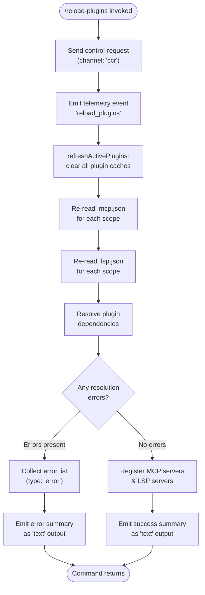

# `/reload-plugins`

> Analysis basis: CC v2.1.133 bundle.js (AST extraction + Claude interpretation)
> Minimum version: v2.1.133

---

## Overview

The `/reload-plugins` command activates pending plugin changes in the current Claude Code session without requiring a full restart. It achieves this by clearing all internal plugin caches, re-reading plugin configuration files (`.mcp.json` and `.lsp.json`), re-resolving plugin dependencies, and re-registering active plugin MCP servers and LSP servers. The command dispatches its work through a control-request channel, meaning it is only available in interactive (non-thin-client-passthrough) sessions.

---

## Registration

| Field | Value |
|---|---|
| type | `local` |
| name | `reload-plugins` |
| description | `Activate pending plugin changes in the current session` |
| supportsNonInteractive | `false` |
| thinClientDispatch | `control-request` |
| module_id | `_$q` |

Analysis basis: CC v2.1.133 bundle.js:+11274499

---

## Input Branching

The command handler (`commandEntryPoint`) performs no argument parsing; it takes the current session context directly and branches purely on the results of cache-clearing and plugin re-resolution.



Analysis basis: CC v2.1.133 bundle.js:+11273522, +11273559, +11273589, +11273634, +11273930, +11273962, +11274005

---

## Behavioral Spec

### 1. Control-Request Dispatch

```
function commandEntryPoint(context):
    channel = "ccr"                          // literal: bundle.js:+11273540
    sendControlRequest(channel, context)
    emitTelemetry("reload_plugins")          // literal: bundle.js:+11273589
```

The command unconditionally opens a control channel named `"ccr"` before performing any plugin work.

Analysis basis: CC v2.1.133 bundle.js:+11273522, +11273540, +11273559, +11273589

---

### 2. Plugin Category Classification

Before reload begins, the handler classifies each registered plugin into one of three named categories used in user-facing messages:

```
function classifyPluginType(pluginEntry):
    if pluginEntry.kind == "plugin":
        return "plugin"                      // literal: bundle.js:+11273654
    else if pluginEntry.kind == "skill":
        return "skill"                       // literal: bundle.js:+11273685
    else if pluginEntry.kind == "agent":
        return "agent"                       // literal: bundle.js:+11273713
```

These labels appear in the reload summary separated by the delimiter `" · "`.

Analysis basis: CC v2.1.133 bundle.js:+11273654, +11273685, +11273713, +11273772

---

### 3. Cache Invalidation (`refreshActivePlugins`)

```
function refreshActivePlugins():
    log("debug", "refreshActivePlugins: clearing all plugin caches")
    // literal: bundle.js:+11271646
    clearInstalledPluginsCache()
    log("debug", "Cleared installed plugins cache")
    // literal: bundle.js:+9179441
    clearMcpConfigCache()
    clearLspConfigCache()
```

This is the first substantive action of the reload pipeline. All in-memory plugin state is discarded before any re-reading occurs.

Analysis basis: CC v2.1.133 bundle.js:+11271644, +11271646, +9179439, +9179441

---

### 4. MCP Configuration Re-read

```
function readMcpConfig(scopePath):
    configFile = join(scopePath, ".mcp.json")   // literal: bundle.js:+7429621
    rawJson = readFileSync(configFile, "utf-8")
    parsed = JSON.parse(rawJson)
    if not Array.isArray(parsed.servers):
        raise TypeError
    return parsed
```

Each scope directory is searched for a `.mcp.json` manifest. If parsing fails, that scope is skipped and an error is recorded.

Analysis basis: CC v2.1.133 bundle.js:+7429610, +7429621, +7429840

---

### 5. LSP Configuration Re-read

```
function readLspConfig(scopePath):
    configFile = join(scopePath, ".lsp.json")   // literal: bundle.js:+8228193
    rawJson = readFile(configFile, "utf-8")     // encoding: bundle.js:+8228237
    validated = applySchema(rawJson,
                    schema: { record: N.record, string: N.string })
    if validationFails:
        recordError("lsp-config-invalid")       // literal: bundle.js:+8228455
        raise Error("Failed to parse JSON file")// literal: bundle.js:+8228891
    return merge(Object.assign, validated)
```

Analysis basis: CC v2.1.133 bundle.js:+8228177, +8228193, +8228222, +8228237, +8228256, +8228265, +8228276, +8228309, +8228432, +8228455, +8228891

---

### 6. Dependency Resolution

```
function resolvePluginDependencies(pluginList):
    results = []
    for each plugin in pluginList:
        status = checkDependencies(plugin)
        if status == "dependency-unsatisfied":  // literal: bundle.js:+10521144
            markFailed(plugin, "dependency-unsatisfied")
        else if status == "not-found":          // literal: bundle.js:+10521181
            markFailed(plugin, "not-found")
        else if scope == "managed":             // literal: bundle.js:+4406564
            raise Error("Cannot install plugins to managed scope")
            // literal: bundle.js:+4406586
        else:
            results.push(plugin)
    return results

function buildDependencyGraph(entries):
    // Uses Array.isArray checks, Object.entries iteration, set-membership tracking
    for each [name, descriptor] in Object.entries(entries):
        if Array.isArray(descriptor.dependencies):
            for each dep in descriptor.dependencies:
                addEdge(name, dep)
    resolutionOrder = topologicalSort(graph)
    return resolutionOrder
```

Dependency resolution walks up to 5 levels of nesting (constant `5` at bundle.js:+4419337) and assembles `"dependency"` / `"dependencies"` labels for summary output.

Analysis basis: CC v2.1.133 bundle.js:+10521144, +10521181, +10521208, +10521244, +10521266, +4406564, +4406580, +4406586, +4418194, +4418209, +4418259, +4419337, +4419341, +4419352, +4419378, +4419394, +4419446, +4419451, +4419464

---

### 7. Policy Enforcement During Resolution

During dependency resolution a series of policy checks guard each candidate plugin:

| Policy Status Literal | Meaning | loc_byte |
|---|---|---|
| `"blocked-by-policy"` | Plugin directly blocked by admin policy | +4921472 |
| `"marketplace-blocked-by-policy"` | Plugin sourced from a blocked marketplace | +4921564 |
| `"local-source-no-location"` | Local plugin has no on-disk location | +4921688 |
| `"resolution-failed"` | Generic graph resolution failure | +4922683 |
| `"dependency-blocked-by-policy"` | Transitive dep is policy-blocked | +4922798 |
| `"dependency-marketplace-blocked-by-policy"` | Transitive dep marketplace-blocked | +4922908 |
| `"settings-write-failed"` | Could not persist resolved settings | +4923185 |
| `"range-conflict"` | Version range conflict between plugins | +4924228 |
| `"no-matching-tag"` | No release tag satisfies requested range | +4924408 |
| `"installed-unsatisfied"` | Installed version does not satisfy constraint | +4925707 |
| `"dependency-resolution"` | Dependency resolution sub-phase label | +10522156 |

Any of these statuses causes the affected plugin to be placed into the error list rather than the active set.

Analysis basis: CC v2.1.133 bundle.js:+4921472, +4921564, +4921688, +4922683, +4922798, +4922908, +4923185, +4924228, +4924408, +4925707, +10522156

---

### 8. Server Re-registration

```
function reRegisterServers(resolvedPlugins):
    mcpServers = resolvedPlugins.filter(p => p.serverType == "plugin MCP server")
    // label literal: bundle.js:+11273745
    lspServers = resolvedPlugins.filter(p => p.serverType == "plugin LSP server")
    // label literal: bundle.js:+11274237

    Promise.all([
        for each mcp in mcpServers: startMcpServer(mcp),
        for each lsp in lspServers: startLspServer(lsp)
    ])

    emitEvent(Bz8, "reload_complete")
```

Both server types are started concurrently via `Promise.all`. The LSP manager subsystem is identified internally by the tag `"lsp-manager"` (bundle.js:+11273091) and filtered using `"plugin:"` prefix matching (bundle.js:+11273126).

Analysis basis: CC v2.1.133 bundle.js:+11271753, +11271766, +11271772, +11272686, +11273066, +11273091, +11273126, +11273745, +11274178, +11274237

---

### 9. Result Formatting and Output

```
function buildReloadSummary(successList, errorList):
    lines = successList.map(p =>
        p.name.padEnd(40) + "  " + p.typeLabel
        // pad width 40: bundle.js:+14179342; two-space separator: bundle.js:+9148389 area
    )
    if errorList is not empty:
        for each err in errorList:
            emit({ type: "error", content: err })  // literal: bundle.js:+11273827
    emit({ type: "text", content: lines.join("\n") }) // literal: bundle.js:+11273902
```

The column padding constant is 40 characters.

Analysis basis: CC v2.1.133 bundle.js:+14179329, +14179342, +14181334, +11273827, +11273902

---

### 10. Retry / Back-off for Remote MCP Servers

```
function retryRemoteMcpServer(server):
    delay = Math.random() * 2 * baseInterval   // factor 2: bundle.js:+12285767
    setTimeout(reconnect, delay)
    // On exhausted retries: emit telemetry "tengu_mcp_retry_failed_remote"
```

If a remote MCP server fails to reconnect after the reload, a randomised exponential back-off is applied. Exhausted retries produce the `tengu_mcp_retry_failed_remote` telemetry event.

Analysis basis: CC v2.1.133 bundle.js:+12285767, +12285806, +13870726, +13870729

---

## State & Side Effects

| Item | Detail |
|---|---|
| Telemetry | `tengu_mcp_retry_failed_remote` (emitted when remote MCP reconnect retries are exhausted; bundle.js:+13870729) |
| Control channel | Opens channel `"ccr"` for the duration of the reload (bundle.js:+11273540) |
| Internal reload event | `"reload_plugins"` identifier used as the in-process event key (bundle.js:+11273589) |
| Cache invalidation | All installed-plugin caches, MCP config caches, and LSP config caches are cleared unconditionally before re-read (bundle.js:+11271644, +11271646) |
| File I/O | Reads `.mcp.json` (bundle.js:+7429621) and `.lsp.json` (bundle.js:+8228193) from every active scope |
| Hook type registered | `"hook"` entries are re-registered during plugin activation (bundle.js:+11274178) |
| Event bus | `Bz8.emit` is called to notify subscribers of reload completion (bundle.js:+11272686) |
| appState changes | Plugin registry maps (`A.get`/`A.set`, `O.get`/`O.set`, `P.get`/`P.set`, `Q.get`/`Q.set`, `c.get`/`c.set`) are updated with the new resolved plugin set (bundle.js:+10521208, +10521244, +4921739, +4922479, +4922092, +4923961, +4924136) |
| Sound | <!-- TODO: not found in depth-2 traversal; needs --depth 4 --> |
| Scope constraint | Will not install or reload plugins in `"managed"` scope; raises an error (bundle.js:+4406564, +4406586) |
| Non-interactive support | `supportsNonInteractive: false` — command cannot be used in script/pipe mode (bundle.js:+11274499) |

---

## Version History

| Version | Change |
|---|---|
| v2.1.133 | Initial analysis |

---

## Common Mistakes

1. **Running in non-interactive mode**: `/reload-plugins` has `supportsNonInteractive: false`. Invoking it from a script or a piped session will cause it to be rejected before any plugin work begins (bundle.js:+11274499).

2. **Expecting managed-scope plugins to reload**: Plugins installed under a `"managed"` policy scope cannot be reloaded or modified by this command. The command raises `"Cannot install plugins to managed scope"` and skips those entries (bundle.js:+4406564, +4406586).

3. **Assuming instant MCP reconnection**: Remote MCP servers undergo a randomised back-off reconnection loop after reload. There may be a delay of several seconds before a remote server is fully available. Repeated failures are reported via `tengu_mcp_retry_failed_remote` (bundle.js:+13870729).

4. **Editing `.mcp.json` or `.lsp.json` while a reload is in progress**: Both files are read once at the start of re-registration. Changes written to disk after the cache-clear but before the file-read phase will be picked up; changes written after the file-read phase will require a second `/reload-plugins` invocation.

5. **Ignoring `lsp-config-invalid` errors in output**: An invalid `.lsp.json` (failed schema validation) emits an `"error"` type output block but does not abort the entire reload. MCP servers may reload successfully while LSP servers remain in a broken state.

---

## Appendix — Identifier Mapping

> For bundle debugging only. Identifiers change across versions.

| Identifier | Role |
|---|---|
| `HY7` | Command entry-point function (top-level handler for `/reload-plugins`) |
| `oM` | Control-request channel opener |
| `RwH` | Low-level transport send helper called by channel opener |
| `Ig` | Telemetry event emitter for reload start |
| `d8` | Telemetry event record constructor |
| `lDH` | `refreshActivePlugins` — main cache-clear and plugin re-resolution orchestrator |
| `k` | Debug logger (accepts level string and message) |
| `Bg9` | Installed-plugins cache invalidation function |
| `_3` | Plugin list formatter / column layout helper |
| `JT9` | Scope enumeration helper |
| `dh9` | MCP config file locator |
| `LA` | Scope-to-path resolver |
| `L` | Per-plugin row builder (uses `padEnd` for column alignment) |
| `Kt` | MCP configuration reader and parser (`.mcp.json`) |
| `uTH` | LSP configuration reader and parser (`.lsp.json`) |
| `M` | Plugin-map merge / reduce helper |
| `$` | Plugin entry reduce/fold utility |
| `H` | Randomised back-off timer (uses `Math.random` + `setTimeout`) |
| `eD7` | LSP-manager plugin filter (filters by `"lsp-manager"` / `"plugin:"` prefix) |
| `fH` | Error collector and logger |
| `vH` | String coercion utility (wraps `String()`) |
| `YqH` | Dependency resolver — main graph traversal and policy enforcement |
| `AF` | Plugin activation helper called during dependency resolution |
| `i76` | Dependency entry iterator (`Object.entries` + `Array.isArray` guard) |
| `YR` | Policy-violation error constructor |
| `T1` | Plugin name parser (splits on `"."`, checks `includes`) |
| `K` | Pending-operation tracker (add/delete with `finally` cleanup) |
| `gj` | Host/path pattern matcher (`"hostPattern"` / `"pathPattern"`) |
| `m0H` | Plugin manifest file reader (reads plugin source file from disk) |
| `zG` | Plugin version/tag resolver |
| `pL7` | Already-resolved plugin set membership checker |
| `_f6` | Full plugin installation and registration pipeline |
| `Ua` | Dependency label builder (`"dependency"` / `"dependencies"` pluralisation) |
| `q` | File-system cleanup helper (calls `unlinkSync`) |