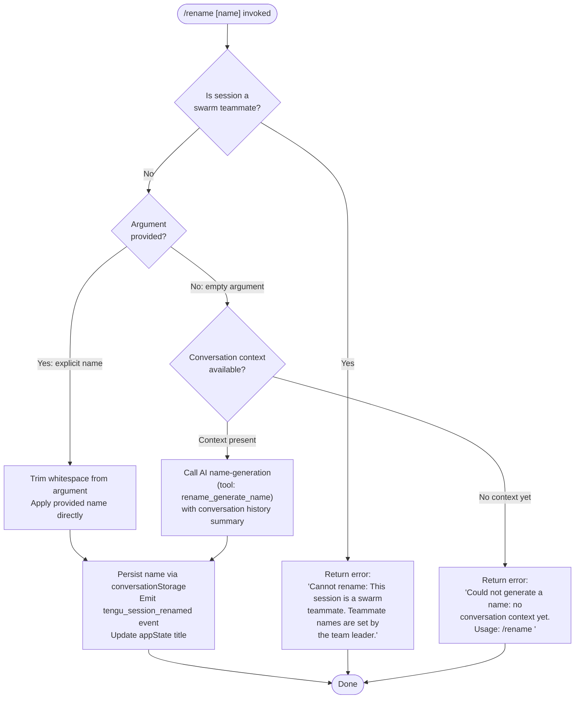

# `/rename`

> Analysis basis: CC v2.1.133 bundle.js (AST extraction + Claude interpretation)
> Minimum version: v2.1.133

---

## Overview

The `/rename` command sets the display name of the current conversation session. When invoked with an explicit name argument it applies that name immediately; when invoked without an argument it uses an AI-generated name derived from the conversation history. The command is blocked in swarm teammate sessions, where names are controlled by the team leader.

## Registration

| Field | Value |
|---|---|
| type | `local-jsx` |
| name | `rename` |
| description | `Rename the current conversation` |
| argumentHint | `[name]` |
| immediate | `true` |
| aliases | `["name"]` |
| module_id | `Lqq` |
| load_inline | `true` |
| loc_byte | `10776649` |
| loc_byte_end | `10776848` |
| loc_line | `6517` |
| arbor_handler.name | `u57` |
| arbor_handler.fqn | `claude-2.1.133::u57` |
| arbor_handler.kind | `AsyncFunction` |
| arbor_handler.resolution_path | `module_id` |
| arbor_handler.n_hits | `0` |

Analysis basis: CC v2.1.133 bundle.js:+10776649

---

## Input Branching

Four distinct execution paths exist depending on swarm status, argument presence, and conversation context availability. A Mermaid flowchart is used.



Analysis basis: CC v2.1.133 bundle.js:+10775814, +10776015, +10775794, +10775919

---

## Behavioral Spec

### Top-level Handler (`u57`)

The Arbor-resolved handler for this command is the async function `u57`. It is reached via the `module_id` resolution path through module `Lqq`.

```
async function renameCommandHandler(args, context):
    // Step 1 – retrieve current session state
    sessionState = getSessionStore()                    // via sessionStoreAccessor → asyncLocalStorageGetStore

    // Step 2 – swarm teammate guard
    if sessionState.isSwarmTeammate:
        return errorResult(
            "Cannot rename: This session is a swarm teammate. " +
            "Teammate names are set by the team leader."
        )

    // Step 3 – branch on whether an explicit name was supplied
    trimmedArg = args.trim()

    if trimmedArg is non-empty:
        newName = trimmedArg
    else:
        // Step 4 – attempt AI-generated name
        newName = await generateNameFromContext(context)
        if newName is null:
            return errorResult(
                "Could not generate a name: no conversation context yet. " +
                "Usage: /rename <name>"
            )

    // Step 5 – persist and broadcast
    await persistConversationName(newName)
    return successResult(newName)
```

Analysis basis: CC v2.1.133 bundle.js:+10776346, +10776362, +10776404

---

### Swarm Teammate Guard (`fO8` / inner handler)

Executed immediately after session state is fetched. If the session is identified as a swarm teammate the handler returns early with the fixed error string and never touches the name storage layer.

Analysis basis: CC v2.1.133 bundle.js:+10775814

---

### AI Name Generation (`qO8` / name-builder)

When no explicit argument is provided the command synthesises a conversation title using a structured AI call.

```
async function generateNameFromContext(conversationHistory):
    // Build a summary payload from message history
    messages = []
    for msg in conversationHistory:
        if msg.role in ["user", "assistant"] and not msg.isMeta:
            if msg.origin == "human" and msg.type == "text":
                messages.push(summariseMessage(msg))

    if messages is empty:
        return null                        // triggers "no context yet" error

    // Invoke model with tool schema requesting a single JSON name field
    toolSchema = {
        type: "json_schema",
        name: "rename_generate_name"       // tool name literal at +10775218
    }

    response = await runAgentQuery(
        messages  = messages,
        toolSchema = toolSchema
    )

    generatedName = response.name
    return generatedName
```

Key literals observed in the name-builder path:
- Tool schema type: `"json_schema"` (bundle.js:+10775074)
- Tool schema name: `"rename_generate_name"` (bundle.js:+10775218)
- Message role filters: `"user"`, `"assistant"` (bundle.js:+10772702, +10772719)
- Message metadata filter key: `"isMeta"` (bundle.js:+10772743)
- Origin filter value: `"human"` (bundle.js:+10772818)
- Content type filter: `"text"` (bundle.js:+10772957)

Analysis basis: CC v2.1.133 bundle.js:+10772882, +10772900, +10772998, +10773030

---

### Conversation Persistence (`unH` / storage writer)

After a valid name is determined (either explicit or AI-generated), the persistence layer is invoked.

```
async function persistConversationName(name):
    // Delegates to lower-level conversation file writer
    await conversationStorageUpdate(name)           // unH → wv path
    await conversationFileWrite(name)               // wv → Ff8 path (SHA-1 keyed file, utf8)
    emitEvent("tengu_session_renamed")              // zm → NP6.emit
```

The file write path (`Ff8`) performs:
1. Computes a SHA-1 hex digest (first 6 chars) as the storage key (bundle.js:+9379332, +9379361, +9379376).
2. Reads existing file if present (`d9H.readFile`, bundle.js:+9379417); creates a fresh UUID if absent (`bw6.randomUUID`, bundle.js:+9379513).
3. Writes updated content via `d9H.writeFile` after ensuring the directory exists via `d9H.mkdir` (bundle.js:+9379827, +9379874).
4. Encoding used: `"utf8"` (bundle.js:+9379442).
5. Error code `"ENOENT"` is handled gracefully (bundle.js:+9379552).

Analysis basis: CC v2.1.133 bundle.js:+10774712, +10774753, +10774770

---

### Title-type Tagging (`zm` / log writer)

When the session name is written to the persistent log, the source of the title is tagged:

- `"custom-title"` — applied when the name was provided explicitly by the user (bundle.js:+11830546).
- `"ai-title"` — applied when the name was produced by the AI generation path (bundle.js:+11830710).

This tag travels alongside the `tengu_session_renamed` telemetry event and is written via `wVH` (append-file writer).

Analysis basis: CC v2.1.133 bundle.js:+11830525, +11830534, +11830598, +11830625

---

### AppState / UI Update (`IZH` / state dispatcher)

After the file write succeeds, the session title is pushed into the reactive application state so the UI re-renders with the new name.

```
function dispatchTitleUpdate(name, titleType):
    currentState = reactiveStateStore.get()
    newState = Object.assign({}, currentState, { title: name, titleType: titleType })
    reactiveStateStore.set(newState)
    // Optional: emit NP6 event for downstream listeners
```

Analysis basis: CC v2.1.133 bundle.js:+8975741, +8975779, +8975926

---

## State & Side Effects

| Item | Detail |
|---|---|
| Telemetry — `tengu_session_renamed` | Fired on every successful rename (explicit or AI-generated). loc: bundle.js:+11830638 |
| Telemetry — `tengu_agent_name_set` | Fired when the agent-name field is updated as a side-effect of rename. loc: bundle.js:+11832874 |
| Telemetry — (API pipeline events) | If the AI name-generation path is taken, the full query pipeline fires: `tengu_off_switch_query`, `tengu_api_before_normalize`, `tengu_api_after_normalize`, and streaming-related events as applicable. |
| Conversation storage | SHA-1 keyed JSONL/text file under the CC data directory is updated with new name and `titleType` tag. |
| AppState changes | Session title field in reactive store is updated immediately; UI header re-renders. |
| Title-type tag | `"custom-title"` for user-supplied names; `"ai-title"` for AI-generated names. |
| Swarm guard | No storage or state changes occur if the session is a swarm teammate; an error string is returned instead. |
| Sound | <!-- TODO: not found in depth-2 traversal; needs --depth 4 --> |
| Hook registration | <!-- TODO: not found in depth-2 traversal; needs --depth 4 --> |

---

## Version History

| Version | Change |
|---|---|
| v2.1.133 | Initial analysis. `immediate: true` flag; alias `name`; AI name-generation via `rename_generate_name` JSON-schema tool; swarm teammate guard with hardcoded error string. |

---

## Common Mistakes

1. **Calling `/rename` with no argument before any messages exist** — the command requires at least one non-meta user or assistant message in history to generate an AI title. If the conversation is empty the command returns the error `"Could not generate a name: no conversation context yet. Usage: /rename <name>"` (bundle.js:+10776015). Supply an explicit name instead.

2. **Attempting to rename inside a swarm teammate session** — teammate names are controlled exclusively by the swarm team leader. Running `/rename` in a teammate session returns a hard error and makes no changes (bundle.js:+10775814).

3. **Assuming the alias `/name` behaves differently** — `/name` is registered as a full alias and follows the identical code path; there is no behavioral difference.

4. **Expecting synchronous completion in the AI-generation path** — when no argument is supplied, the command is asynchronous and invokes a model query. In slow-network or high-load conditions this path may take several seconds before the title is updated.

5. **Expecting the title to be persistent across reinstalls without data migration** — the title is stored in a SHA-1-keyed file in the CC data directory. Deleting or moving the data directory will lose custom titles.

---

## Appendix — Identifier Mapping

> For bundle debugging only. Identifiers change across versions.

| Identifier | Role |
|---|---|
| `u57` | Top-level rename command handler (AsyncFunction; Arbor-resolved) |
| `fO8` | Inner rename execution function; performs swarm guard, arg trim, and name application |
| `KO8` | Session-state accessor called at entry of handler |
| `v2` | Async local storage / context store getter |
| `m7` | Session store retrieval helper |
| `pP` | Calls `Qg8.getStore` — reads the async local storage slot |
| `unH` | Conversation name persistence orchestrator |
| `qO8` | Name-builder / message-history summariser for AI generation |
| `wv` | Conversation file write coordinator |
| `Ff8` | Low-level conversation file write (SHA-1 key, readFile/writeFile) |
| `dq` | Shared conversation data accessor / queue helper |
| `HVH` | Agent query runner wrapper (wraps `i2q`) |
| `NZA` | Conversation state normaliser used before query |
| `i2q` | Core agent query execution loop (streaming + non-streaming) |
| `KX` | HTTP client constructor helper |
| `URH` | Underlying HTTP transport builder |
| `GW` | Response handler / post-query side-effect dispatcher |
| `NL` | Message history filter helper |
| `IZH` | Reactive app-state dispatcher (pushes title into UI store) |
| `zm` | Session log / title-tag appender (writes `custom-title` / `ai-title`) |
| `wVH` | Low-level append-file writer with mkdir guard |
| `RK` | State persistence helper called from log writer |
| `rt` | Alternate log-write path (reuses `wVH` + `HN`) |
| `HN` | Log-line formatter |
| `ef` | Log entry constructor helper |
| `R9H` | Session rename event emitter (fires `tengu_session_renamed` via `qxA.emit`) |
| `EU` | Conversation metadata read/write helper |
| `nA6` | File read-then-write helper used by `EU` |
| `M` | MCP server / session manager (reached during context load) |
| `iZH` | MCP connection registry and tool enumeration |
| `mFq` | MCP update applier |
| `Og7` | MCP remote-server reconnect/refresh orchestrator |
| `dfH` | Agent context builder (working directory, file listing) |
| `xL` | Working-directory path resolver |
| `vW` | Basename extractor for context display |
| `r9` | Workspace file stat/cache helper |
| `lP` | File-cache invalidation helper |
| `Pf` | Atomic file write helper (random bytes + rename) |
| `iY` | Atomic write implementation (randomBytes → writeFile → rename) |
| `D8` | Error classifier helper |
| `fH` | Error logging / reporting helper |
| `HA` | Error coercer (Error + String normalisation) |
| `yq` | Structured error formatter |
| `J9_` | Inner error key formatter |
| `NJL` | Error history ring-buffer manager |
| `vtq` | Transcript/log file writer with rotation logic |
| `uNH` | Buffered write scheduler (setTimeout / setImmediate based) |
| `aHH` | Transcript flush helper |
| `AiA` | File rename/unlink helper (`.txt` extension handling) |
| `Vtq` | Append-to-log-file helper (mkdir + appendFile) |
| `dG8` | Write-error handler |
| `_iA` | Log-file path builder |
| `y1` | Active-write-set tracker (add/delete on `d08`) |
| `vH` | String coercion utility |
| `v6` | Void / no-op sentinel or unit value |
| `il` | Inline JSX renderer helper |
| `ly` | Lazy-load helper |
| `dl` | Deferred-load helper |
| `k` | Terminal output formatter / ANSI renderer |
| `Uf` | ANSI strip / plain-text converter |
| `rnA` | ANSI sequence mapper |
| `LkH` | Terminal write wrapper |
| `UnA` | Raw `H.write` (stdout) wrapper |
| `Ztq` | Terminal control-sequence emitter |
| `xcA` | Cursor positioning helper |
| `F6` | Path utilities / format helper |
| `SH` | `JSON.stringify` wrapper |
| `p6` | `JSON.parse` wrapper |
| `kH` | `String()` coercion wrapper |
| `AA` | Array / collection factory |
| `J6` | React rendering / JSX component emitter |
| `Po` | JSX element constructor |
| `_d6` | Component-instance deduplication cache |
| `R6` | Component scheduler / update batcher |
| `K8` | MCP debug logger |
| `T7` | MCP error logger |
| `so4` | MCP session initialiser |
| `gZA` | MCP OAuth flow handler |
| `QZA` | MCP OAuth callback handler |
| `Yl9` | MCP capabilities/config file writer |
| `BZA` | MCP server config reader |
| `kJA` | MCP server include-list checker |
| `G98` | Tool permission context builder |
| `XG` | Message normalisation / content-block processor |
| `wr4` | Image/attachment content mapper |
| `N6` | Content-block join helper |
| `rd9` | Conversation record deserialiser |
| `Bf8` | Conversation record constructor |
| `$8` | UUID-tagged object factory |
| `XDq` | Timestamp/session-id factory |
| `Bq6` | JSX text node builder |
| `gq6` | JSX fragment builder |
| `DlH` | MCP diagnostic log writer |
| `XM8` | MCP state serialiser |
| `hI` | MCP connection cleanup helper |
| `$l9` | MCP metric aggregator |
| `_J6` | Integer parser (parseInt wrapper) |
| `fIA` | Integer parser variant |
| `oM` | IPC/RPC channel manager |
| `RwH` | IPC message router |
| `Qt` | Promise-queue / concurrency limiter |
| `T98` | Tool permission set checker |
| `r8` | HTTP retry / timeout wrapper |
| `nA6` | (see above — EU sub-helper) |
| `EU` | Conversation metadata read/write helper |

---

Note: index built via Arbor fallback; some signals (telemetry, literals) may be missing — see arbor-fallback.js.