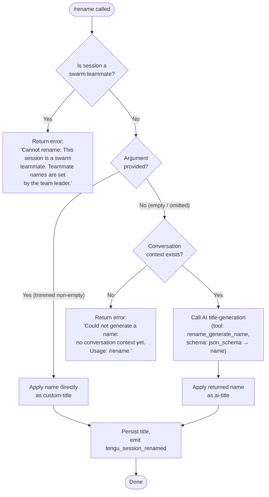

# `/rename`

> Analysis basis: CC v2.1.133 bundle.js (AST extraction + Claude interpretation)
> Minimum version: v2.1.133

---

## Overview

The `/rename` command sets or generates a title for the current Claude Code conversation session. When called with an explicit name argument it applies that name immediately; when called without an argument it attempts to auto-generate a name from the conversation history using an AI-powered structured-output call. The command is registered as `local-jsx` and executes immediately on entry.

---

## Registration

| Field | Value |
|---|---|
| type | `local-jsx` |
| name | `rename` |
| description | Rename the current conversation |
| argumentHint | `[name]` |
| immediate | `true` |
| aliases | `name` |
| module_id | `Lqq` |

Analysis basis: CC v2.1.133 bundle.js:+10776649

---

## Input Branching

The top-level handler (`commandEntryPoint`) receives the raw user input string and branches based on whether the argument is present, whether the session is a swarm teammate, and whether there is existing conversation context.



Analysis basis: CC v2.1.133 bundle.js:+10775794, +10775814, +10775919, +10775953, +10776015, +10776122

---

## Behavioral Spec

### Swarm-Teammate Guard

When the command is invoked, the handler first calls the session-context accessor to retrieve the current store state. If the session is flagged as a swarm teammate the command aborts immediately and surfaces the literal error message to the user, without touching any title state.

```
function swarmGuard(sessionContext):
    if sessionContext.isSwarmTeammate == true:
        return errorMessage(
            "Cannot rename: This session is a swarm teammate. " +
            "Teammate names are set by the team leader."
        )
    return CONTINUE
```

Analysis basis: CC v2.1.133 bundle.js:+10775814

---

### Argument Parsing

The raw argument string is trimmed of leading/trailing whitespace. A non-empty result is treated as the explicit new name; an empty result triggers auto-generation mode.

```
function parseArgument(rawInput):
    trimmed = rawInput.trim()
    if trimmed.length > 0:
        return { mode: "explicit", name: trimmed }
    else:
        return { mode: "auto-generate" }
```

Analysis basis: CC v2.1.133 bundle.js:+10775919

---

### Conversation Context Extraction

Before auto-generation can proceed the handler collects the existing message history by calling the conversation-context builder. It filters messages, assembles role-typed entries (`user`, `assistant`) with their text content, and strips internal meta-messages.

```
function buildConversationContext(messages):
    result = []
    for each message in messages:
        if message.isMeta == true:
            skip
        if message.origin == "human":
            role = "user"
        else:
            role = "assistant"
        textParts = collectTextParts(message)
        result.push({ role: role, content: textParts.join("") })
    if result.length == 0:
        return null          // triggers "no conversation context" error
    return result
```

Relevant string literals observed: `"user"`, `"assistant"`, `"isMeta"`, `"origin"`, `"human"`, `"type"`, `"text"`.

Analysis basis: CC v2.1.133 bundle.js:+10772702, +10772719, +10772743, +10772778, +10772818, +10772936, +10772957

---

### Auto-Generate Name via AI

When no argument is supplied and conversation context is available, the handler issues a structured AI request using the tool name `rename_generate_name` and a `json_schema` response format whose single required property is `name` (string). The response is then extracted and used as the generated title.

```
function autoGenerateName(conversationContext):
    if conversationContext == null:
        return error("Could not generate a name: no conversation context yet. " +
                     "Usage: /rename <name>")

    request = {
        tool: "rename_generate_name",
        responseFormat: {
            type: "json_schema",
            schema: { properties: { name: { type: "string" } } }
        },
        messages: conversationContext
    }
    response = await callAI(request)
    generatedName = response.name
    return generatedName
```

Analysis basis: CC v2.1.133 bundle.js:+10775074, +10775154, +10775218, +10776015

---

### Applying the Title

Once a name is determined (explicit or generated), the handler calls the session-title persistence layer. Two distinct title-type strings exist: `"custom-title"` is written for explicitly supplied names; `"ai-title"` is written for AI-generated names. After writing, the function emits the `NP6` event bus signal and fires telemetry.

```
function applyTitle(titleType, name, sessionId):
    // titleType is either "custom-title" or "ai-title"
    writeSessionTitle(sessionId, titleType, name)
    eventBus.emit("session_renamed", { sessionId, name, source: titleType })
    emitTelemetry("tengu_session_renamed")
```

Analysis basis: CC v2.1.133 bundle.js:+11830546, +11830625, +11830638, +11830710

---

### Agent-Name Path

A parallel code path (`agentNameSetter`) writes an `"agent-name"` record and fires a separate telemetry event. This path is reached when the session being renamed is an agent session rather than a plain conversation session.

```
function setAgentName(agentId, name):
    writeAgentTitle(agentId, "agent-name", name)
    eventBus.emit("agent_name_set", { agentId, name })
    emitTelemetry("tengu_agent_name_set")
```

Analysis basis: CC v2.1.133 bundle.js:+11832776, +11832861, +11832874

---

### Standalone Agent Context

After the primary rename action completes, the handler calls `setStandaloneAgentContext`, updating any standalone-agent state that references the session name.

Analysis basis: CC v2.1.133 bundle.js:+10776154

---

### File System Context (dfH / Context-Loader)

The call graph shows the command reaching a file-system context-loading subsystem (`contextFileLoader`). This subsystem resolves working-directory paths, stat-checks files, reads UTF-8 content, manages a file-cache (`QfH`), and enforces a cache limit of **1 000 entries** (bundle.js:+3882301). File reads use encoding `"utf-8"` (bundle.js:+3881837). Path depth is truncated at **8 levels** (bundle.js:+3880802). This subsystem feeds conversation context used by the auto-generate path.

```
function loadContextFiles(workingDir, filePaths):
    resolvedPaths = filePaths.slice(0, MAX_DEPTH)   // MAX_DEPTH = 8
    stats = await Promise.all(resolvedPaths.map(p => fs.stat(p)))
    results = []
    for each (path, stat) in zip(resolvedPaths, stats):
        cached = fileCache.get(path)
        if cached and cached.mtime == stat.mtime:
            results.push(cached.content)
            continue
        content = await fs.readFile(path, "utf-8")
        fileCache.set(path, { mtime: stat.mtime, content })
        if fileCache.size > 1000:
            fileCache.clear()
        results.push(content)
    return results
```

Analysis basis: CC v2.1.133 bundle.js:+3881424, +3881437, +3881823, +3881837, +3882089, +3882144, +3882201, +3882301

---

### Error Logging

Any unhandled exception during the rename flow is passed to `yQ.logError`, and an `"error"`-level log entry is written to the session log ring-buffer (`cyH`).

```
function onRenameError(err):
    logRingBuffer.push({ level: "error", message: err.message })
    logger.logError(err)
```

Analysis basis: CC v2.1.133 bundle.js:+10775504, +912861, +912821

---

## State & Side Effects

| Item | Detail |
|---|---|
| Telemetry — session renamed | `tengu_session_renamed` fired after every successful rename (custom or AI-generated) — bundle.js:+11830638 |
| Telemetry — agent name set | `tengu_agent_name_set` fired when an agent-session name is applied — bundle.js:+11832874 |
| Telemetry — MCP retry failed | `tengu_mcp_retry_failed_remote` may fire during the AI call if the underlying MCP remote connection retries exhausted — bundle.js:+13870729 |
| Title record type | Either `"custom-title"` (explicit arg) or `"ai-title"` (generated) written to session store — bundle.js:+11830546, +11830710 |
| Agent-name record | `"agent-name"` record written separately for agent sessions — bundle.js:+11832776 |
| Event bus | `NP6.emit` triggered on session rename; `qxA.emit` triggered on agent-name set — bundle.js:+11830625, +11832861 |
| Standalone-agent context | `setStandaloneAgentContext` called to propagate new name — bundle.js:+10776154 |
| File cache | `QfH` (Map) populated/cleared during context loading; cleared when size exceeds 1 000 — bundle.js:+3882089, +3882306 |
| Sound | <!-- TODO: not found in depth-2 traversal; needs --depth 4 --> |
| Hook registration | <!-- TODO: not found in depth-2 traversal; needs --depth 4 --> |

---

## Version History

| Version | Change |
|---|---|
| v2.1.133 | Initial analysis — explicit rename, AI auto-generation, swarm-teammate guard, agent-name path |

---

## Common Mistakes

1. **Calling `/rename` without arguments in a fresh session** — If no messages have been exchanged yet, auto-generation cannot proceed and returns the error `"Could not generate a name: no conversation context yet. Usage: /rename <name>"`. Always supply an explicit name when starting a new session.
2. **Attempting to rename a swarm teammate session** — Sessions acting as swarm teammates reject the command entirely; the rename must be issued from the team-leader session instead.
3. **Expecting the alias `/name` to behave differently** — The alias `name` is identical to `rename` in every respect; there is no behavioral difference.
4. **Assuming the title is written synchronously** — The AI auto-generation path is asynchronous (`Promise.resolve`, `await`). UI updates may lag behind the command returning in rapid-fire test scenarios.
5. **Conflating `custom-title` and `ai-title` records** — These are distinct record types in the session store. External tooling that reads session metadata must handle both keys to reliably retrieve the current display name.

---

## Appendix — Identifier Mapping

> For bundle debugging only. Identifiers change across versions.

| Identifier | Role |
|---|---|
| `KO8` | Session-context reader — reads current session state from store |
| `v2` | Store-accessor helper used by session-context reader |
| `fO8` | Primary rename command handler — orchestrates all sub-steps |
| `m7` | Session-store getter — retrieves active session object |
| `pP` | Store accessor wrapper called by session-store getter |
| `H` | General utility object / namespace (trim, map, includes, random, setTimeout) |
| `unH` | Conversation-context builder — assembles filtered message list |
| `qO8` | Message-list formatter — role-types and joins message parts |
| `wv` | AI structured-output request dispatcher |
| `dq` | Request serializer / transport helper |
| `NL` | Message filter — removes meta/system entries |
| `k` | String-normalization utility (trim, toUpperCase, includes checks) |
| `vH` | String coercion wrapper (calls native `String()`) |
| `v6` | Async/await runtime helper |
| `IZH` | Title-persistence coordinator — routes to custom-title or ai-title writer |
| `il` | Title-type selector helper |
| `ef` | Custom-title writer — writes `"custom-title"` record |
| `zm` | AI-title writer — writes `"ai-title"` record and emits `NP6` event |
| `rt` | AI-title fallback writer — alternate path for `"ai-title"` |
| `ly` | Post-write cleanup helper |
| `dl` | Promise-chain helper in title-persistence coordinator |
| `M` | MCP/remote-call orchestrator reached during AI generation |
| `Qt` | Response-extraction helper in title-persistence coordinator |
| `R9H` | Agent-name writer — writes `"agent-name"` record and emits `qxA` event |
| `oM` | Error-record constructor |
| `EU` | Timestamp utility (wraps `Date.now`) |
| `A` | App-state / context object (push, setStandaloneAgentContext, toUpperCase) |
| `dfH` | Context-file loader — resolves paths, stats, caches, reads UTF-8 files |
| `xL` | Working-directory path resolver |
| `vW` | Basename extractor for file paths |
| `r9` | File-read-and-cache worker — stat → cache-check → readFile → cache-set |
| `lP` | Cache-entry invalidator (`QfH.delete`) |
| `Pf` | File-permission / existence checker |
| `D8` | ENOENT error classifier |
| `fH` | Log-ring-buffer writer and error logger |
| `u57` | Top-level command entry-point component (JSX render function) |