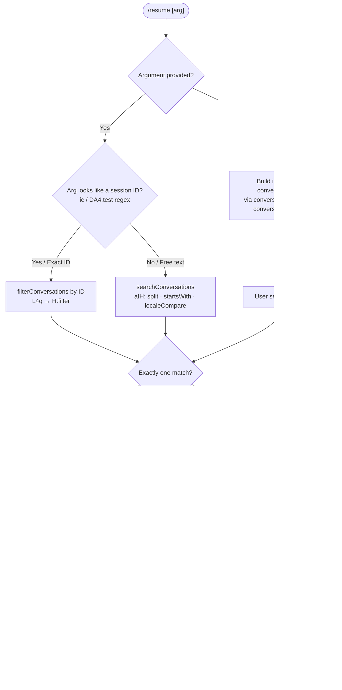

# `/resume`

> Analysis basis: CC v2.1.133 bundle.js (AST extraction + Claude interpretation)
> Minimum version: v2.1.133

---

## Overview

The `/resume` command (also aliased as `/continue`) allows a user to load and re-enter a previously saved Claude Code conversation session. It accepts either an exact conversation ID or a free-text search term, locates matching session transcripts on disk, and then restores the full conversation state so the session can continue seamlessly. If no argument is given, it presents an interactive picker of recent conversations.

---

## Registration

| Field | Value |
|---|---|
| type | `local-jsx` |
| name | `resume` |
| description | `Resume a previous conversation` |
| argumentHint | `[conversation id or search term]` |
| aliases | `continue` |
| module_id | `K4q` |

Analysis basis: CC v2.1.133 bundle.js:+10932124

---

## Input Branching

The command's entry point (`u37`) examines the user-supplied argument and branches across four major paths: no argument (interactive picker), a bare session ID, a search term, and a no-results fallback.



Analysis basis: CC v2.1.133 bundle.js:+10930804, +10931278, +10928742, +10931177

---

## Behavioral Spec

### 1. Conversation List Filtering (`filterConversations`)

Filters the full set of persisted conversation records to those matching the user input.

```
function filterConversations(allConversations, rawArg):
    normalized = rawArg.toLowerCase()          // fg → H.toLowerCase +10931563
    return allConversations.filter(conv =>
        conv.id.startsWith(normalized) OR
        conv.title.toLowerCase().includes(normalized)
    )
    // L4q → H.filter +10930804
```

When no argument is provided, the filter is skipped and the full list is passed to the interactive picker.

Analysis basis: CC v2.1.133 bundle.js:+10930804, +10931563, +10931296

---

### 2. Worktree-Aware Session Discovery (`worktreeAwareLoader`)

Before listing conversations, the command detects any active Git worktree context and limits the conversation list to sessions associated with the current worktree.

```
function worktreeAwareLoader(sessionList):
    worktrees = git("worktree", "list", "--porcelain")
    // literals: "worktree" +10928027, "list" +10928038, "--porcelain" +10928045
    emit telemetry("tengu_worktree_detection")   // +10928127

    for each session in sessionList:
        path = session.path
        if path.startsWith("worktree ")           // "worktree " +10928246
            suffix = path.slice(9)                // 9 +10928277
            normalize to NFC                      // "NFC" +10928290
        end
    end

    filteredSessions = sessionList.filter(
        s => s.worktreePath matches currentWorkingDirectory
    )
    return filteredSessions
    // aIH → _.split +10928208, $.startsWith +10928233, $.slice +10928269
```

Analysis basis: CC v2.1.133 bundle.js:+10928127, +10928208, +10928233, +10928246, +10928277

---

### 3. Search and Ranking (`searchConversations`)

When a free-text argument is supplied and it does not match the session-ID regex pattern, a locale-aware search and sort is performed.

```
function searchConversations(allConversations, searchTerm):
    candidates = allConversations.filter(conv =>
        conv.id.startsWith(searchTerm) OR        // H.startsWith +10928404
        conv.searchableText.includes(searchTerm)  // K.filter +10928431
    )
    // Sort by locale-aware title comparison
    candidates.sort((a, b) =>
        a.title.localeCompare(b.title)           // $.localeCompare +10928464
    )
    return candidates
```

If the result set is empty, the literal message `"No conversations found to resume."` is rendered.
Analysis basis: CC v2.1.133 bundle.js:+10928404, +10928431, +10928464, +10931177

---

### 4. Session-ID Detection (`isSessionId`)

A regular-expression test (pattern held in `DA4`) determines whether the argument resembles a raw session UUID or opaque ID rather than a human-readable search string.

```
function isSessionId(arg):
    return DA4.test(arg)     // ic → DA4.test +5261356
```

Analysis basis: CC v2.1.133 bundle.js:+5261356, +10931278

---

### 5. Conversation State Restoration (`restoreConversationState`)

Once a single target session is identified, the full conversation state is loaded from disk and applied to the running application. This is the deepest and most complex sub-operation.

```
function restoreConversationState(sessionId):
    // Phase 1 – load raw transcript bytes
    rawFile = SK.readFile(transcriptPath)        // Tt → SK.readFile +11843439
    transcriptEntries = parseTranscript(rawFile) // Tt → fH +11843548

    // Phase 2 – rebuild conversation chain (handles parent-cycle guard)
    chain = buildChain(transcriptEntries)
    // emits tengu_transcript_parent_cycle if a cycle is detected +11843920
    // emits tengu_chain_parent_cycle if a chain cycle is detected +11823697
    // emits tengu_chain_timestamp_fallback when timestamp is missing +11823846

    // Phase 3 – restore per-conversation metadata maps
    // Each key written via Map.set calls inside Tt:
    setMetadataKey("summary",                ...)  // +11841638
    setMetadataKey("last-prompt",            ...)  // +11841705
    setMetadataKey("custom-title",           ...)  // +11841801
    setMetadataKey("ai-title",               ...)  // +11841879
    setMetadataKey("tag",                    ...)  // +11841949
    setMetadataKey("agent-name",             ...)  // +11842010
    setMetadataKey("agent-color",            ...)  // +11842084
    setMetadataKey("agent-setting",          ...)  // +11842160
    setMetadataKey("mode",                   ...)  // +11842240
    setMetadataKey("permission-mode",        ...)  // +11842303
    setMetadataKey("isolation-latch",        ...)  // +11842387
    setMetadataKey("worktree-state",         ...)  // +11842461
    setMetadataKey("pr-link",               ...)  // +11842545
    setMetadataKey("file-history-snapshot",  ...)  // +11842676
    setMetadataKey("attribution-snapshot",   ...)  // +11842738
    setMetadataKey("content-replacement",    ...)  // +11842809
    setMetadataKey("fork-context-ref",       ...)  // +11843015
    setMetadataKey("marble-origami-commit",  ...)  // +11843070
    setMetadataKey("marble-origami-snapshot",...)  // +11843121

    // Phase 4 – reconstruct message thread (truncate at 200 chars for display)
    // HxA → _.slice with limit 200 +11821601
    // Missing prompt text replaced with "No prompt" +11821653

    // Phase 5 – push session into active session registry
    // Jz6 → Fjq → Tt; Object.assign +11845338

    // Phase 6 – emit JSX element for display
    element = lX.createElement(...)             // +10931028
    recordTimestamp = Date.now()                // +10931054

    return element
```

Analysis basis: CC v2.1.133 bundle.js:+11843439, +11843548, +11841638–+11843121, +11821601, +11845338, +10931028, +10931054

---

### 6. No-Results Handling

When the filtered/searched result set is empty, the component renders the literal string and returns without attempting any state restoration.

```
function handleNoResults():
    render("No conversations found to resume.")   // +10931177
    return
```

Analysis basis: CC v2.1.133 bundle.js:+10931177

---

### 7. Disambiguation Handling (Multiple Matches)

When more than one session matches, the command enters a disambiguation mode identified internally by the token `multipleMatches`. Bold formatting is applied to the matching portion of each title via `M6.bold`.

```
function handleMultipleMatches(matches):
    mode = "multipleMatches"                    // +10928742
    for each match in matches:
        title = boldMatchingPortion(match.title)  // _4q → M6.bold +10928706
    end
    render interactiveSelectionList(matches)
```

Analysis basis: CC v2.1.133 bundle.js:+10928742, +10928706

---

### 8. Conversation Picker / Interactive List (`conversationPicker`)

When no argument is given, a sorted, deduplicated list of recent conversations is assembled and rendered.

```
function buildConversationPicker(allConversations):
    // Sort by last-modified descending
    sorted = allConversations
        .filter(isValidSession)                  // fg → f.filter +10931296
        .sort((a, b) => b.modifiedAt - a.modifiedAt)  // fg → z.sort +11836214

    // Limit display window
    visible = sorted.slice(0, MAX_DISPLAY)       // fg → z.slice +11836280

    // Deduplicate by conversation map key
    seen = new Map()
    for each conv in visible:
        key = buildDisplayKey(conv)              // fg → O.get/O.set +11836132/+11836170
        if not seen.has(key):
            seen.set(key, conv)
        end
    end
    return Array.from(seen.values())             // fg → Array.from +11836188
```

Analysis basis: CC v2.1.133 bundle.js:+10931296, +11836214, +11836280, +11836132, +11836170, +11836188

---

### 9. Transcript Encoding and Path Resolution (`transcriptPathResolver`)

Session transcript files are located on disk; file paths are joined using `O$.join` and directory contents are read via `SK.readdir`.

```
function resolveTranscriptPaths(baseDir):
    entries = SK.readdir(baseDir)                // gjq → SK.readdir +11848669
    paths   = entries
        .filter(e => e.isDirectory())            // gjq → j.isDirectory +11848891
        .map(dir => O$.join(baseDir, dir))       // gjq → O$.join +11849061

    // Flatten nested results
    allPaths = paths.flat()                      // gjq → X.flat +11849183

    // Strip "attachment", "system", "progress" message types from display
    // literals: "attachment" +11828299, "system" +11828316, "progress" +11828329
    return allPaths
```

Analysis basis: CC v2.1.133 bundle.js:+11848669, +11848891, +11849061, +11849183, +11828299, +11828316, +11828329

---

### 10. State Slot Registration (`registerSessionSlot`)

After successful restoration, two named state slots are written to mark the resumed session for subsequent commands and telemetry:

```
function registerSessionSlot(sessionId, title):
    appState.set("slash_command_session_id", sessionId)  // +10931438
    appState.set("slash_command_title",      title)      // +10931662
```

Analysis basis: CC v2.1.133 bundle.js:+10931438, +10931662

---

## State & Side Effects

| Item | Detail |
|---|---|
| Telemetry — `tengu_worktree_detection` | Fired during worktree enumeration before building the session list (bundle.js:+10928127) |
| Telemetry — `tengu_transcript_parent_cycle` | Fired when a cycle is detected in the transcript parent-chain during restoration (bundle.js:+11843920) |
| Telemetry — `tengu_chain_parent_cycle` | Fired when a cycle is detected in the conversation chain (bundle.js:+11823697) |
| Telemetry — `tengu_chain_timestamp_fallback` | Fired when a chain entry lacks a valid timestamp and a fallback is used (bundle.js:+11823846) |
| Telemetry — `tengu_mcp_retry_failed_remote` | Fired if the MCP remote connection fails during session replay (bundle.js:+13870729) |
| Telemetry — `tengu_bg_dispatch_sigkill_escalate` | Fired if a background dispatch requires SIGKILL escalation (bundle.js:+14157040) |
| Telemetry — `tengu_bg_dispatch_low_mem` | Fired when free memory drops below threshold during background dispatch (bundle.js:+14157619) |
| Telemetry — `tengu_bg_spare_enable` | Fired when a spare background session slot is enabled (bundle.js:+14158234) |
| Telemetry — `tengu_bg_spare_claim` | Fired when a spare slot is successfully claimed (bundle.js:+14158355) |
| Telemetry — `tengu_bg_spare_claim_fail` | Fired when spare slot claim fails (bundle.js:+14158618) |
| Telemetry — `tengu_daemon_control` | Fired during daemon lifecycle operations (bundle.js:+14191366) |
| Telemetry — `tengu_daemon_config_reload` | Fired when the daemon reloads its configuration on resume (bundle.js:+14170592) |
| Telemetry — `tengu_bg_spare_spawn` | Fired when a spare background session is spawned (bundle.js:+14156817) |
| appState changes | `slash_command_session_id` and `slash_command_title` written on successful resume (+10931438, +10931662) |
| Metadata maps written | 19 named keys written into per-session Map stores (summary, last-prompt, custom-title, ai-title, tag, agent-name, agent-color, agent-setting, mode, permission-mode, isolation-latch, worktree-state, pr-link, file-history-snapshot, attribution-snapshot, content-replacement, fork-context-ref, marble-origami-commit, marble-origami-snapshot) |
| Filesystem reads | `SK.readFile` (transcript body), `SK.readdir` (directory scan), `SK.stat` (file metadata) |
| Hook registration | Background session spare-pool hooks registered via `setTimeout`/`clearTimeout` inside the background dispatcher (W, +12810998/+12811016) |
| Sound | <!-- TODO: not found in depth-2 traversal; needs --depth 4 --> |
| JSX render | `lX.createElement` called to build the resume UI element (+10931028) |
| Randomised delay | `Math.random` used with `setTimeout` for background spare-session jitter (+12285769, +12285806) |

---

## Version History

| Version | Change |
|---|---|
| v2.1.133 | Initial analysis. Confirmed worktree-aware filtering, 19-key metadata restoration, spare background session pool, and dual disambiguation modes (sessionNotFound / multipleMatches). |

---

## Common Mistakes

1. **Passing a partial title that matches multiple sessions** — the command enters `multipleMatches` disambiguation mode instead of resuming immediately. Use enough of the unique ID prefix to reduce matches to exactly one.

2. **Running `/resume` outside the relevant worktree directory** — the worktree-aware filter (`tengu_worktree_detection`) will exclude sessions from other worktrees, making them appear absent even when they exist on disk.

3. **Confusing `/resume` with re-sending the last message** — `/resume` restores the conversation context but does not automatically re-submit any prompt. The user must type a new message after resumption.

4. **Expecting instant availability of a session saved milliseconds ago** — the conversation index is rebuilt from disk; a very recently closed session may not yet be flushed and visible.

5. **Using `/resume` with only a keyword that appears in `attachment`, `system`, or `progress` message types** — these message types are filtered out from the searchable display text, so matches against their content will not surface results.

6. **Assuming the alias `/continue` behaves differently** — `/continue` is a registered alias and is functionally identical to `/resume` in all paths.

---

## Appendix — Identifier Mapping

> For bundle debugging only. Identifiers change across versions.

| Identifier | Role |
|---|---|
| `L4q` | Top-level conversation list filter function |
| `H` | Generic collection / array variable (context-dependent); also background spare-session scheduler |
| `GM` | Shared utility — general map or getter helper |
| `u37` | Main command handler / entry-point function for `/resume` |
| `fH` | Transcript parser / conversation file reader |
| `HA` | Error-wrapping utility (constructs Error from String) |
| `kH` | String normalization helper |
| `yq` | Network traffic classifier (uses "essential-traffic" literal) |
| `NJL` | Queue rotation helper (shift + push on AN6) |
| `vH` | Value-to-string converter |
| `aIH` | Worktree-aware session search and filtering function |
| `GA` | Session lookup / conversation getter orchestrator |
| `d` | Generic disposable / small utility (context-dependent) |
| `_` | String or map variable (context-dependent); also lowercase normalizer |
| `$` | String variable used for path/prefix comparisons |
| `K` | Async operation tracker (add/finally/delete pattern) |
| `LA` | Locale or language accessor helper |
| `cO8` | Conversation picker UI component wrapper |
| `hP6` | Conversation display-item builder (joins, formats, renders entries) |
| `ic` | Session-ID detection function (wraps DA4 regex test) |
| `f` | Filter/file handle variable (context-dependent) |
| `q` | Queue or result accumulator (context-dependent) |
| `kl` | Key-lookup / configuration accessor |
| `d1H` | Full session state restoration orchestrator |
| `Tt` | Per-session metadata Map writer (all 19 metadata keys) |
| `gY8` | Date-parse sorter for conversation timestamps |
| `Z` | Set or array accumulator (context-dependent) |
| `Q1H` | Conversation chain builder with cycle detection |
| `IQH` | Message-list mapper |
| `HxA` | Prompt text truncator / replaceAll sanitizer |
| `_xA` | Auxiliary cross-reference resolver |
| `L` | Column/layout formatter (padEnd, map) |
| `M` | MCP session map accessor |
| `O` | Generic object/map store (context-dependent) |
| `w` | Background worker / daemon process manager |
| `J` | Process-kill manager (values + kill) |
| `X` | Worker accessor (delegates to `w`) |
| `j` | Buffer stream parser (concat, subarray, indexOf) |
| `z` | Daemon stop controller |
| `D` | Supervisor / config-reload controller |
| `Y` | Background spare-session spawn manager |
| `QY8` | Session slot getter/setter (Map get + set + push) |
| `dY8` | Session values enumerator (Array.from + H.values) |
| `W` | Skills / debounce event emitter |
| `E` | Remote-control / key-event interceptor |
| `Jz6` | Session state assembler (collects all sub-maps into one object) |
| `Fjq` | State initializer (kG7 seed + Tt + Object.assign) |
| `A` | Miscellaneous keys/values iterator |
| `I` | Internal watcher / config-reload controller |
| `cbA` | Conversation snapshot builder (at, HxA, IQH, _xA) |
| `G` | Platform / process info accessor (AJ6, jP8) |
| `IqH` | Interactive-mode query helper |
| `fg` | Conversation list builder and sorter for the interactive picker |
| `gjq` | Filesystem transcript path enumerator (readdir, flat, isDirectory) |
| `JVH` | Buffer allocation and binary chunk writer |
| `_4q` | Title bold-formatter for disambiguation display |