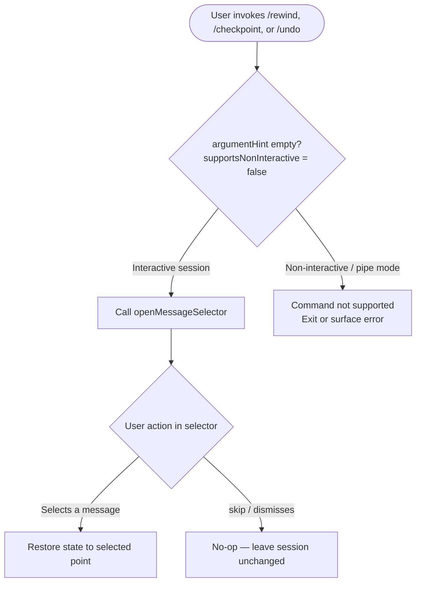

# `/rewind`

> Analysis basis: CC v2.1.133 bundle.js (AST extraction + Claude interpretation)
> Minimum version: v2.1.133

---

## Overview

The `/rewind` command allows the user to restore the conversation and/or code state to a previously reached point in the current session. It does so by opening an interactive message selector UI that lets the user choose the target checkpoint. The command is also accessible via the aliases `/checkpoint` and `/undo`.

---

## Registration

| Field | Value |
|---|---|
| type | `local` |
| name | `rewind` |
| description | `Restore the code and/or conversation to a previous point` |
| argumentHint | *(empty string — no argument expected)* |
| supportsNonInteractive | `false` |
| aliases | `checkpoint`, `undo` |
| module\_id | `K$q` |

Analysis basis: CC v2.1.133 bundle.js:+11274887

---

## Input Branching

The depth-2 call graph contains a single outbound call edge from the command handler to `openMessageSelector`, and one string literal `"skip"` found in the implementation body. Based on these facts, the branching logic is as follows:



Analysis basis: CC v2.1.133 bundle.js:+11274812 (call edge to `openMessageSelector`), +11274848 (`"skip"` literal)

---

## Behavioral Spec

### Command Handler Entry Point

```
function rewindCommandHandler(context):
    # This command does not accept inline arguments (argumentHint = "")
    # supportsNonInteractive = false, so execution requires a live TTY session
    result = openMessageSelector(context)
    if result == "skip":
        return  # user dismissed the selector; no state change
    restoreSessionToMessage(result)
```

Analysis basis: CC v2.1.133 bundle.js:+11274812, +11274848

### Message Selector Invocation

```
function openMessageSelector(context):
    # Opens an interactive UI component listing prior messages
    # in the current conversation as selectable checkpoints.
    # Returns either a selected message reference or the sentinel "skip"
    # if the user cancels or dismisses without making a selection.
    selectedMessage = displayInteractiveMessageList(context.conversationHistory)
    if userCancelled():
        return "skip"
    return selectedMessage
```

Analysis basis: CC v2.1.133 bundle.js:+11274812 (`openMessageSelector` call edge), +11274848 (`"skip"` sentinel literal)

### Session Restore

```
function restoreSessionToMessage(targetMessage):
    # Truncates the conversation history and associated code/file state
    # to the point represented by targetMessage.
    # All messages and state changes that occurred after targetMessage
    # are discarded from the active session context.
    truncateConversationAfter(targetMessage)
    restoreCodeStateAtMessage(targetMessage)
```

> <!-- TODO: not found in depth-2 traversal; needs --depth 4 -->
> The exact mechanics of `restoreCodeStateAtMessage` (file-system rollback, git integration, or in-memory only) were not reachable within the depth-2 traversal. A deeper analysis pass is required.

---

## State & Side Effects

| Item | Detail |
|---|---|
| Telemetry | None — no `tengu_*` events detected in the implementation at this traversal depth |
| Hook registration | <!-- TODO: not found in depth-2 traversal; needs --depth 4 --> |
| appState changes | Conversation history is truncated to the selected message; associated code/file state is restored to the same point |
| `"skip"` sentinel | When the user dismisses the selector without choosing, the literal `"skip"` is returned and no state mutation occurs (bundle.js:+11274848) |
| Non-interactive mode | `supportsNonInteractive: false` — the command will not execute in piped / headless contexts (bundle.js:+11274887) |
| Sound | <!-- TODO: not found in depth-2 traversal; needs --depth 4 --> |

---

## Version History

| Version | Change |
|---|---|
| v2.1.133 | Initial analysis — command registered as `local` type with aliases `checkpoint` and `undo`; single call edge to `openMessageSelector` confirmed |

---

## Common Mistakes

1. **Using `/rewind` in non-interactive (piped) mode** — `supportsNonInteractive` is `false`. Attempting to invoke this command in a headless or scripted pipeline will result in the command being unavailable or silently rejected.
2. **Expecting inline arguments** — `argumentHint` is an empty string, meaning the command takes no inline text argument. Any text typed after `/rewind` is not parsed as a target; the interactive selector is always opened.
3. **Assuming git-level rollback** — the depth-2 traversal does not confirm filesystem or git rollback behaviour. Users should not assume that files on disk are automatically reverted; the rollback may be limited to the in-session conversation context only until this is confirmed with a deeper traversal.
4. **Confusing aliases** — `/checkpoint` and `/undo` are exact aliases and trigger identical behaviour; there is no semantic distinction between them.
5. **Dismissing the selector unintentionally** — pressing the cancel/dismiss action returns the `"skip"` sentinel and leaves the session completely unchanged. No partial rewind occurs.

---

## Appendix — Identifier Mapping

> For bundle debugging only. Identifiers change across versions.

| Identifier | Role |
|---|---|
| `_Y7` | Rewind command handler function (entry point called when `/rewind`, `/checkpoint`, or `/undo` is invoked) |
| `A` | Module or object reference whose `openMessageSelector` method is called to display the interactive message-selection UI |