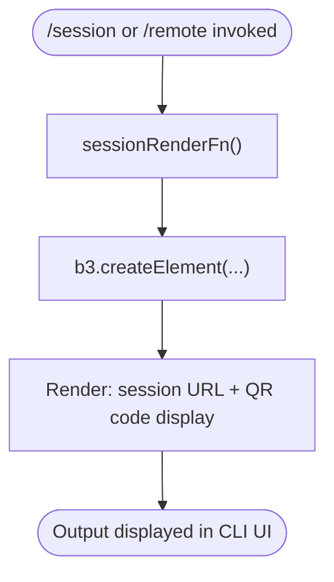

# `/session`

> Analysis basis: CC v2.1.133 bundle.js (AST extraction + Claude interpretation)
> Minimum version: v2.1.133

---

## Overview

The `/session` command (also accessible via `/remote`) displays the current remote session URL and an associated QR code in the Claude Code CLI interface. It is a local JSX-rendered command that presents session connection information visually within the terminal UI, enabling users to connect to a running session from another device or share access via the displayed URL.

---

## Registration

| Field | Value |
|---|---|
| type | `local-jsx` |
| name | `session` |
| description | `Show remote session URL and QR code` |
| aliases | `["remote"]` |
| module\_id | `a4q` |

Analysis basis: CC v2.1.133 bundle.js:+10978819

---

## Input Branching

The depth-2 call graph for this command contains a single call edge: the command's render function calls `b3.createElement`, indicating that the entire command output is produced by constructing a JSX element tree. No conditional branching paths, argument parsing calls, or guard clauses were detected within the traversal depth.



Analysis basis: CC v2.1.133 bundle.js:+10978641

> **Note:** No branching literals (e.g., argument flags, error guards) were found in the depth-2 traversal. Extended branching logic (e.g., handling the case where no remote session is active) may exist at greater call depth.
> <!-- TODO: not found in depth-2 traversal; needs --depth 4 -->

---

## Behavioral Spec

### Session Display Rendering

The command is implemented as a `local-jsx` type command, meaning its output is produced entirely through React-style element construction rather than returning plain text. When invoked, the command's render function builds a component tree via `createElement` and returns it for display in the CLI's UI layer.

```
function sessionRenderFn(context):
    rootElement = createElement(SessionDisplayComponent, props derived from context)
    return rootElement
```

The rendered output is expected to include:
- The remote session URL (as described in the registration description)
- A QR code representation of that URL

Analysis basis: CC v2.1.133 bundle.js:+10978641

### Command Aliases

The command is registered under two names:

```
registeredNames = ["session", "remote"]
```

Both `/session` and `/remote` resolve to the same render function (`sessionRenderFn`) via the alias registration mechanism. No difference in behavior between the two invocation paths was observed at this traversal depth.

Analysis basis: CC v2.1.133 bundle.js:+10978819

### Argument Handling

<!-- TODO: not found in depth-2 traversal; needs --depth 4 -->

No argument-parsing calls, input validators, or string/numeric literals related to argument processing were detected within the depth-2 call graph. The command likely accepts no arguments (consistent with its role as a simple display command), but this cannot be confirmed without deeper traversal.

---

## State & Side Effects

| Item | Detail |
|---|---|
| Telemetry | None detected in depth-2 traversal |
| Hook registration | None detected in depth-2 traversal |
| appState changes | None detected in depth-2 traversal |
| Sound | None detected in depth-2 traversal |
| Render mechanism | JSX element tree constructed via `b3.createElement` (Analysis basis: CC v2.1.133 bundle.js:+10978641) |
| Aliases registered | `remote` is a registered alias for `session` (Analysis basis: CC v2.1.133 bundle.js:+10978819) |

> **Note:** The absence of telemetry events (`tengu_*`) in the extracted data suggests this command does not emit usage analytics, or those calls exist beyond depth-2. <!-- TODO: not found in depth-2 traversal; needs --depth 4 -->

---

## Version History

| Version | Change |
|---|---|
| v2.1.133 | Initial analysis — command confirmed as `local-jsx`, alias `remote` registered, renders session URL and QR code |

---

## Common Mistakes

1. **Invoking `/session` when no remote session is active** — The command is intended to display an active remote session's URL and QR code. If no remote session has been established, the output may be empty or display an error. The exact behavior in this case is <!-- TODO: not found in depth-2 traversal; needs --depth 4 -->.

2. **Expecting text output** — Because this command is `local-jsx` typed, its output is rendered as a UI component, not raw text. Attempting to pipe or redirect the output of `/session` as plain text may not capture the QR code or URL in a useful form.

3. **Confusing `/session` with a session management command** — `/session` is a **display-only** command. It does not create, destroy, pause, or resume sessions. Session lifecycle management is handled elsewhere in the CLI.

4. **Not recognizing `/remote` as equivalent** — Both `/session` and `/remote` are registered to the same implementation. Users familiar with one alias should be aware the other is fully equivalent.

---

## Appendix — Identifier Mapping

> For bundle debugging only. Identifiers change across versions.

| Identifier | Role |
|---|---|
| `h$7` | Session command render function — the top-level function registered as the `local-jsx` command handler; calls `b3.createElement` to produce the session URL and QR code display |