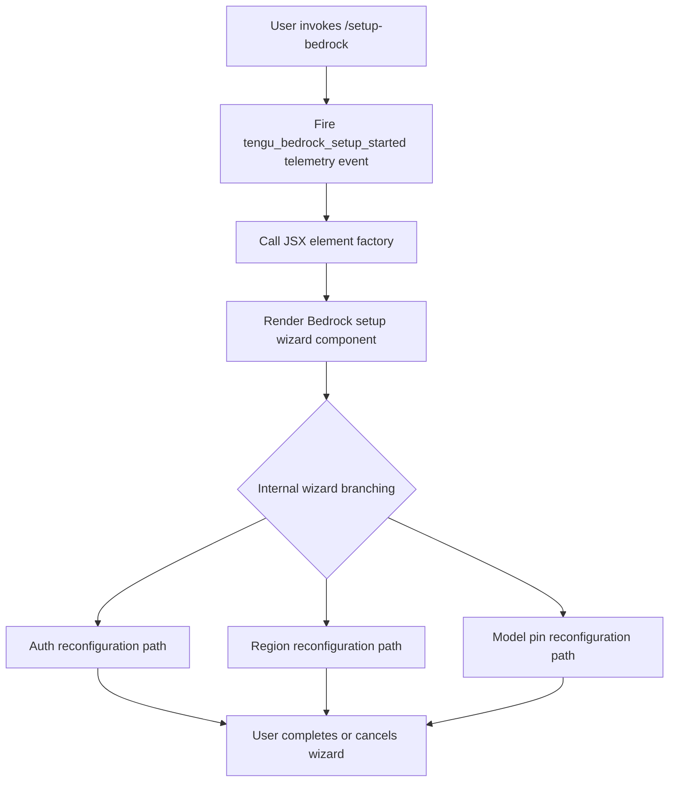

# `/setup-bedrock`

> Analysis basis: CC v2.1.132 bundle.js (AST extraction + Claude interpretation)
> Minimum version: v2.1.132

---

## Overview

`/setup-bedrock` is a local JSX slash command that launches an interactive reconfiguration flow for Amazon Bedrock authentication, region settings, and model pins. It fires a telemetry event immediately on invocation and then renders a JSX component that drives the Bedrock setup wizard. This command is distinct from initial onboarding — it is explicitly designed to be re-run after first setup to update or correct existing Bedrock configuration.

---

## Registration

| Field | Value |
|---|---|
| type | `local-jsx` |
| name | `setup-bedrock` |
| description | `Reconfigure Amazon Bedrock authentication, region, or model pins` |
| module\_id | `RKq` |

Analysis basis: CC v2.1.132 bundle.js:+10915872

---

## Input Branching

The command's call graph is shallow (depth ≤ 2). At invocation the command handler performs two sequential operations — a side-effecting telemetry call followed immediately by a JSX render call — with no conditional branching detected at this traversal depth.



> **Note:** The internal branches within the rendered wizard component (auth / region / model-pin paths) are inferred from the command description. Their exact control flow was not reachable at depth-2 traversal.
> <!-- TODO: not found in depth-2 traversal; needs --depth 4 -->

---

## Behavioral Spec

### Command Handler Entry Point

```
function setupBedrockCommandHandler(commandContext):
    // Step 1: emit telemetry immediately on command entry
    emitTelemetryEvent("tengu_bedrock_setup_started")

    // Step 2: produce JSX output for the REPL renderer
    return createElement(BedrockSetupWizardComponent, commandContext)
```

Analysis basis: CC v2.1.132 bundle.js:+10915149 (telemetry call), +10915185 (JSX createElement call)

### Telemetry Emission

```
function emitTelemetryEvent(eventName):
    // Fires unconditionally before any user interaction begins.
    // eventName = "tengu_bedrock_setup_started"
    send(eventName, timestamp=now())
```

Analysis basis: CC v2.1.132 bundle.js:+10915151

### JSX Rendering

```
function renderBedrockSetupWizard(props):
    // createElement is called with the wizard component and
    // the forwarded command context as props.
    // The rendered component owns all subsequent branching
    // (auth / region / model-pin).
    return Vm.createElement(BedrockSetupWizardComponent, props)
```

Analysis basis: CC v2.1.132 bundle.js:+10915185

### Wizard Sub-flows (description-derived; not traversal-verified)

The command description enumerates three named reconfiguration targets:

| Target | Purpose |
|---|---|
| Authentication | Update AWS credentials or IAM role bindings used by Bedrock |
| Region | Change the AWS region against which Bedrock API calls are routed |
| Model pins | Update which Bedrock-hosted model IDs are pinned for Claude Code use |

<!-- TODO: not found in depth-2 traversal; needs --depth 4 -->

---

## State & Side Effects

| Item | Detail |
|---|---|
| Telemetry | `tengu_bedrock_setup_started` fired unconditionally at command entry (bundle.js:+10915151) |
| Hook registration | <!-- TODO: not found in depth-2 traversal; needs --depth 4 --> |
| appState changes | <!-- TODO: not found in depth-2 traversal; needs --depth 4 --> |
| Persistent config writes | Implied by description ("reconfigure … authentication, region, or model pins"); exact write paths not visible at depth-2 |
| Sound | <!-- TODO: not found in depth-2 traversal; needs --depth 4 --> |
| Numeric constant | Value `1` present at bundle.js:+52833; role within this command not determinable at depth-2 traversal |

---

## Version History

| Version | Change |
|---|---|
| v2.1.132 | Initial analysis — command registered as `local-jsx`, single telemetry event confirmed, JSX render entry point confirmed |

---

## Common Mistakes

1. **Assuming `/setup-bedrock` only runs once.** The command is explicitly named "Reconfigure" and is designed to be re-invoked at any time after initial setup. Running it will overwrite previously saved Bedrock settings.
2. **Expecting CLI argument parsing.** The registration type is `local-jsx`, meaning the command renders an interactive component rather than accepting inline CLI flags. Passing extra tokens after `/setup-bedrock` may be silently ignored or handled by the wizard UI.
3. **Confusing this command with initial onboarding.** The Bedrock setup wizard launched here is the *reconfiguration* path. First-time Bedrock provisioning may follow a different code path not covered by this command.
4. **Blocking on telemetry.** The `tengu_bedrock_setup_started` event fires before the wizard renders. Network conditions affecting telemetry delivery should not block the wizard from appearing, but any integration tests that assert on wizard readiness before the telemetry call completes may observe ordering issues.
5. **Assuming all three sub-flows are always presented.** The wizard may conditionally show auth, region, or model-pin sections depending on existing configuration state. Do not rely on all three being present in every invocation.

---

## Appendix — Identifier Mapping

> For bundle debugging only. Identifiers change across versions.

| Identifier | Role |
|---|---|
| `OM7` | Command handler / entry-point function for `/setup-bedrock` |
| `d` | Telemetry emission utility called at command entry (receives event name `"tengu_bedrock_setup_started"`) |