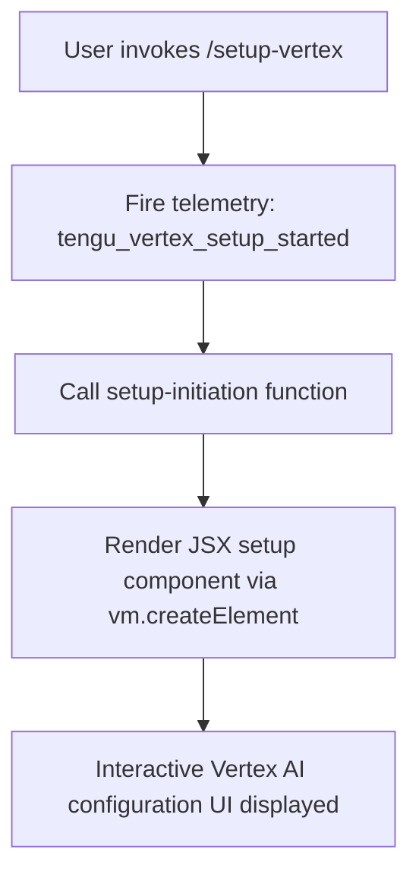

# `/setup-vertex`

> Analysis basis: CC v2.1.132 bundle.js (AST extraction + Claude interpretation)
> Minimum version: v2.1.132

---

## Overview

The `/setup-vertex` command launches an interactive reconfiguration flow for Google Vertex AI integration within Claude Code. It allows users to update authentication credentials, project ID, region, and model pin settings without restarting the CLI. The command renders a JSX-based UI component and fires a telemetry event immediately upon invocation.

---

## Registration

| Field | Value |
|---|---|
| type | `local-jsx` |
| name | `setup-vertex` |
| description | Reconfigure Google Vertex AI authentication, project, region, or model pins |
| module_id | `mKq` |
| loc_line | 6555 |

Analysis basis: CC v2.1.132 bundle.js:+10916891

---

## Input Branching

The depth-2 call graph for this command reveals a two-step dispatch: a setup-initiation call followed by a JSX element render. Because only two call edges are present and no conditional branching literals are found within the command's own scope, the flow is linear rather than multi-path.



Analysis basis: CC v2.1.132 bundle.js:+10916170, +10916205

---

## Behavioral Spec

### Setup Initiation

When the command is invoked, the runtime immediately calls the setup-initiation function before any UI is shown. This function is responsible for preparing the configuration context (authentication state, current project and region values, and any existing model pins) that will be passed as props to the rendered component.

```
function initiateVertexSetup(context):
    fire telemetry event "tengu_vertex_setup_started"
    configState = loadCurrentVertexConfig(context.appState)
    return configState
```

Analysis basis: CC v2.1.132 bundle.js:+10916170, +10916172

### JSX Component Rendering

After setup initiation, the command renders its interactive UI by calling the virtual-DOM element factory (`vm.createElement`). Because the command type is `local-jsx`, the returned element is mounted directly into the Claude Code terminal UI panel rather than producing plain text output.

```
function renderVertexSetupComponent(configState):
    element = createElement(
        VertexSetupComponent,
        props = {
            authConfig:    configState.auth,
            projectId:     configState.project,
            region:        configState.region,
            modelPins:     configState.modelPins,
            onComplete:    handleSetupComplete
        }
    )
    return element
```

Analysis basis: CC v2.1.132 bundle.js:+10916205

### Configuration Fields

<!-- TODO: not found in depth-2 traversal; needs --depth 4 -->

The exact field-level validation rules, accepted value formats for project ID and region, and the enumeration of pinnable model identifiers are not present in the depth-2 call graph. A deeper traversal of the `mKq` module is required to recover these details.

---

## State & Side Effects

| Item | Detail |
|---|---|
| Telemetry | `tengu_vertex_setup_started` fired synchronously at invocation (bundle.js:+10916172) |
| Hook registration | <!-- TODO: not found in depth-2 traversal; needs --depth 4 --> |
| appState changes | <!-- TODO: not found in depth-2 traversal; needs --depth 4 --> |
| Sound | <!-- TODO: not found in depth-2 traversal; needs --depth 4 --> |

---

## Version History

| Version | Change |
|---|---|
| v2.1.132 | Initial analysis — command registered in module `mKq`; telemetry event `tengu_vertex_setup_started` confirmed |

---

## Common Mistakes

1. **Invoking `/setup-vertex` expecting plain-text output** — because the command type is `local-jsx`, it renders an interactive UI panel. Running it in a non-interactive or piped terminal session may produce no visible output or an error.
2. **Assuming the command modifies credentials immediately on invocation** — the telemetry event fires at the start, but actual credential or project changes only take effect after the user completes the interactive component flow. Closing the UI mid-flow leaves the previous configuration intact.
3. **Confusing `/setup-vertex` with a one-shot flag command** — it does not accept inline arguments (e.g., `/setup-vertex --project my-proj`). All configuration is performed through the rendered interactive component.
4. **Re-running the command to "undo" changes** — the command always opens the reconfiguration UI from the current saved state; it has no built-in revert or rollback action. Users must manually restore prior values.

---

## Appendix — Identifier Mapping

> For bundle debugging only. Identifiers change across versions.

| Identifier | Role |
|---|---|
| `DM7` | Command handler / setup-initiation function — top-level entry point for `/setup-vertex` |
| `d` | Setup-initiation helper called by `DM7` before JSX render (bundle.js:+10916170) |