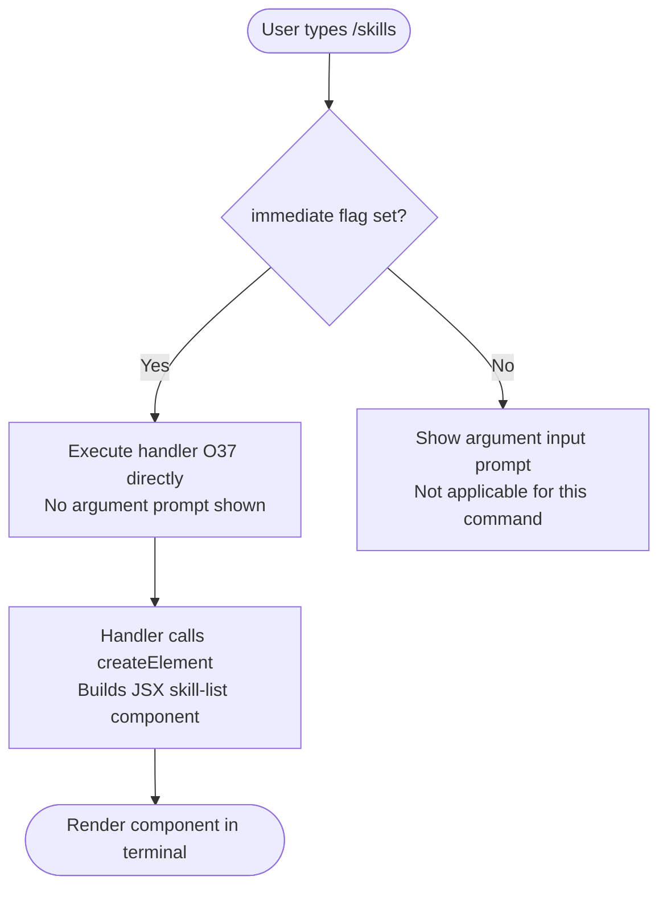

# `/skills`

> Analysis basis: CC v2.1.132 bundle.js (AST extraction + Claude interpretation)
> Minimum version: v2.1.132

---

## Overview

The `/skills` command is a local-JSX slash command that lists the skills available to the current Claude Code session. It executes immediately upon invocation, rendering its output as a JSX component rather than producing a plain-text prompt. The command is registered as `immediate`, meaning no additional user input is required before it executes.

---

## Registration

| Field | Value |
|---|---|
| type | `local-jsx` |
| name | `skills` |
| description | `List available skills` |
| immediate | `true` |
| module\_id | `b4q` |
| load\_inline | `true` |
| handler | `O37` (async function, resolved via `module_id` path) |
| loc\_byte span | `+10970438` – `+10970570` |
| `loc_byte_end` | `10970570` |
| `arbor_handler.name` | `O37` |
| `arbor_handler.kind` | `AsyncFunction` |
| `arbor_handler.resolution_path` | `module_id` |
| `arbor_handler.fqn` | `claude-2.1.132::O37` |
| `arbor_handler.n_hits` | `0` |

**Notes:**
- `immediate: true` means the command fires as soon as the user selects it from the slash-command menu; no argument prompt is shown.
- `type: local-jsx` means the handler returns a React element (via `OhA.createElement`) that the CLI renders in-terminal, rather than sending a text prompt to the model.
- The handler `O37` was resolved by Arbor following the `module_id → b4q → moduleExports → name` path (`resolution_path: "module_id"`).

Analysis basis: CC v2.1.132 bundle.js:+10970438

---

## Input Branching

Because `immediate: true` is set and the command type is `local-jsx`, there is no multi-path input handling driven by user text. The sole branching is whether the command is invoked or not.



Analysis basis: CC v2.1.132 bundle.js:+10970300 (call edge `O37` → `OhA.createElement`)

---

## Behavioral Spec

### Skill List Rendering

The handler is an `AsyncFunction` (`O37`) registered under module `b4q`. At invocation the runtime resolves module `b4q`, calls `O37`, and awaits the result. The function constructs a React element tree describing the available skills and returns it; the CLI framework then renders that element to the terminal display.

```
async function renderSkillsList(context):
    // Build a JSX element representing the current skill inventory
    element = createElement(SkillListComponent, props_derived_from_context)
    return element

// Caller (CLI framework):
async function invokeSkillsCommand(context):
    component = await renderSkillsList(context)
    renderToTerminal(component)
```

Analysis basis: CC v2.1.132 bundle.js:+10970300

**What "skills" means in this context:**

The description field states `"List available skills"`. In Claude Code, "skills" refers to discrete capabilities or tool-groups that the agent can employ. The JSX output produced by `O37` enumerates these for the user. The exact set of skills displayed is determined at runtime from session state; no compile-time literal list was found in the depth-2 traversal.

<!-- TODO: The precise data source for the skills inventory (e.g. which appState slice or context field is read) was not found in depth-2 traversal; needs --depth 4 -->

---

## State & Side Effects

| Item | Detail |
|---|---|
| Telemetry | None detected in depth-2 traversal |
| Hook registration | None detected in depth-2 traversal |
| appState changes | None detected; command appears read-only |
| Sound | None detected |
| Output mechanism | JSX element rendered in-terminal via `OhA.createElement` |
| Async | Handler is `AsyncFunction`; CLI awaits result before rendering |

**Observations:**
- The absence of telemetry events (`telemetry: []`) means this command does not emit any `tengu_*` analytics events at the depth inspected.
- The absence of literals (`literals: []`) confirms there are no hard-coded string constants (e.g. skill names, error messages) visible at depth ≤ 2; these are likely computed from runtime state.
- Because no appState mutations were detected, `/skills` is a **read-only introspection command**.

---

## Version History

| Version | Change |
|---|---|
| v2.1.132 | Initial analysis; `local-jsx` immediate command rendering skill inventory via handler `O37` |

---

## Common Mistakes

1. **Expecting a text/prompt response**: `/skills` is type `local-jsx`, not `prompt`. It renders a UI component directly and does not send any message to the model. Do not confuse its output with model-generated text.
2. **Passing arguments**: Because `immediate: true` is set, the command accepts no user-supplied arguments. Any text typed after `/skills` will be ignored by the framework.
3. **Assuming a static skill list**: The skill inventory is assembled at runtime. Skills available may vary depending on session configuration, enabled tools, or MCP server connections active at invocation time.
4. **Expecting telemetry for audit purposes**: This command emits no `tengu_*` telemetry events (at depth ≤ 2). Do not rely on analytics pipelines to detect its invocation.

---

## Appendix — Identifier Mapping

> For bundle debugging only. Identifiers change across versions.

| Identifier | Role |
|---|---|
| `O37` | Primary handler (async function) for the `/skills` command; builds and returns the JSX skill-list component; resolved via `module_id: b4q` |
| `OhA` | React (or React-compatible) namespace used to call `createElement`; observed as call target at bundle.js:+10970300 |