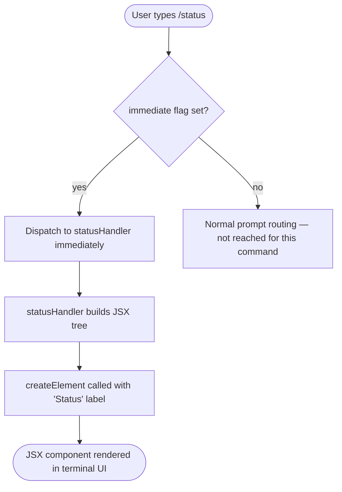

# `/status`

> Analysis basis: CC v2.1.132 bundle.js (AST extraction + Claude interpretation)
> Minimum version: v2.1.132

---

## Overview

The `/status` command is a local, immediately-executed slash command that renders a JSX component displaying a real-time snapshot of Claude Code's operational state. It surfaces version information, the active model, account identity, API connectivity health, and the status of available tools — all without sending a prompt to the agent. Because it is typed `local-jsx` and flagged `immediate: true`, the output appears inline in the terminal UI as soon as the command is issued.

---

## Registration

| Field | Value |
|---|---|
| `type` | `local-jsx` |
| `name` | `status` |
| `description` | Show Claude Code status including version, model, account, API connectivity, and tool statuses |
| `immediate` | `true` |
| `module_id` | `p4q` |
| `load_inline` | `true` |
| `handler` | `D37` (AsyncFunction, resolved via `module_id` path) |
| `loc_byte_end` | `10970992` |
| `arbor_handler.name` | `D37` |
| `arbor_handler.kind` | `AsyncFunction` |
| `arbor_handler.resolution_path` | `module_id` |
| `arbor_handler.fqn` | `claude-2.1.132::D37` |
| `arbor_handler.n_hits` | `0` |

Analysis basis: CC v2.1.132 bundle.js:+10970787 – +10970992

---

## Input Branching

The `/status` command accepts no user-supplied arguments. Because `immediate: true` is set, the shell intercepts the command before any prompt-routing logic runs and dispatches directly to the handler. There is no argument-parsing stage and no conditional branching on user input.



Analysis basis: CC v2.1.132 bundle.js:+10970646 (call edge `D37 → zhA.createElement`), +10970700 (string literal `"Status"`)

---

## Behavioral Spec

### Status Component Construction

The handler is an `AsyncFunction` that constructs and returns a JSX element. At depth-2 traversal only one outbound call edge is visible: a call to `createElement` on the React-equivalent namespace (`zhA`). The string constant `"Status"` is passed as (or incorporated into) the element descriptor, anchoring the rendered panel's identity.

```
async function statusHandler(context):
    rootElement = createElement(
        StatusPanelComponent,
        props derived from context,   // version, model, account, connectivity, tools
        label = "Status"
    )
    return rootElement
```

Because the type is `local-jsx`, the returned element is handed directly to the terminal renderer; no agent turn is created and no network round-trip to the Anthropic API is required for the render itself.

Analysis basis: CC v2.1.132 bundle.js:+10970646 (`createElement` call site), +10970700 (`"Status"` literal)

### Displayed Information

The command description enumerates the data categories the component is expected to surface:

| Category | Description |
|---|---|
| Version | The running CC build version (e.g., `v2.1.132`) |
| Model | The currently configured model identifier |
| Account | The authenticated account / identity information |
| API connectivity | Live reachability check result for the Anthropic API endpoint |
| Tool statuses | Enabled/disabled or healthy/errored state of each registered tool |

The exact sub-components that render each category were not reached within the depth-2 call-graph traversal.

Analysis basis: CC v2.1.132 bundle.js:+10970787 (registration `description` field)

<!-- TODO: internal sub-component render tree (connectivity probe logic, tool-status enumeration) not found in depth-2 traversal; needs --depth 4 -->

---

## State & Side Effects

| Item | Detail |
|---|---|
| Telemetry | None detected in depth-2 traversal |
| Hook registration | None detected in depth-2 traversal |
| `appState` changes | None detected; command is read-only / display-only |
| Network I/O | API connectivity check implied by description; probe logic not visible at depth-2 |
| Sound | None detected |
| Agent turn created | No — `local-jsx` + `immediate` bypasses the agent entirely |

<!-- TODO: API connectivity probe implementation and tool-status enumeration logic not found in depth-2 traversal; needs --depth 4 -->

---

## Version History

| Version | Change |
|---|---|
| v2.1.132 | Initial analysis — `local-jsx` / `immediate` handler `D37`; renders version, model, account, API connectivity, and tool statuses |

---

## Common Mistakes

1. **Expecting an agent response.** Because `/status` is `local-jsx` + `immediate`, it never creates an agent turn. Waiting for a streaming response or inspecting conversation history for status output will yield nothing.
2. **Passing arguments.** The command registration defines no argument schema. Any text typed after `/status` will be ignored or may prevent command matching, depending on the shell tokeniser version.
3. **Assuming the API connectivity result is cached.** The description implies a live check; do not treat a previously seen "connected" status as proof that the current session is healthy — re-run `/status` to get a fresh snapshot.
4. **Version-pinning the handler identifier.** The handler is currently resolved as `D37` via the `module_id` path. Minified identifiers change across bundle versions; always re-run AST extraction against a new bundle before referencing internal names.

---

## Appendix — Identifier Mapping

> For bundle debugging only. Identifiers change across versions.

| Identifier | Role |
|---|---|
| `D37` | Main status command handler (`AsyncFunction`); constructs and returns the status JSX component; resolved from module `p4q` via `module_id` path (CC v2.1.132 bundle.js:+10970646) |
| `zhA` | React-equivalent namespace on which `createElement` is called to build the status JSX tree (CC v2.1.132 bundle.js:+10970646) |