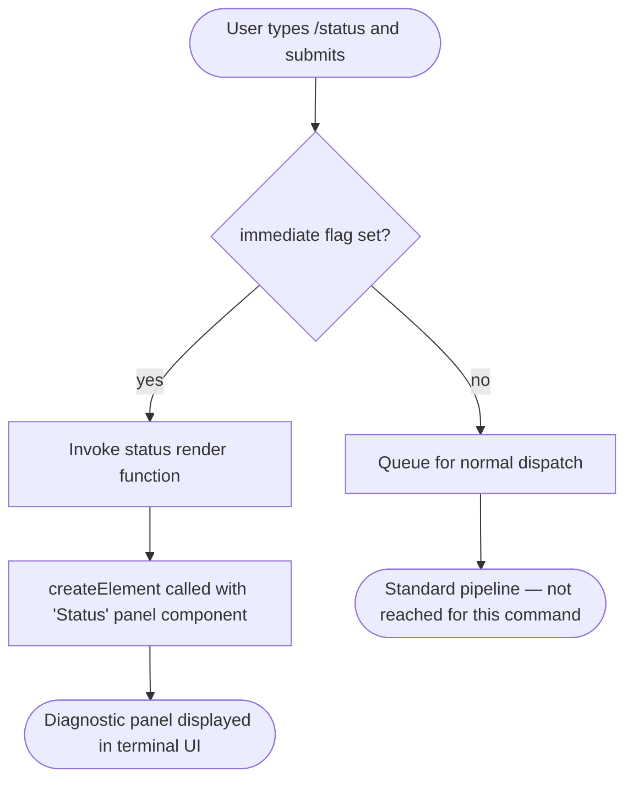

# `/status`

> Analysis basis: CC v2.1.132 bundle.js (AST extraction + Claude interpretation)
> Minimum version: v2.1.132

---

## Overview

The `/status` command renders a live diagnostic panel within the Claude Code CLI, surfacing version information, the active model, account identity, API connectivity state, and the current status of available tools. It operates as a local JSX command, meaning its output is rendered immediately in the terminal UI via a React-compatible element tree rather than being dispatched to the Anthropic API.

---

## Registration

| Field | Value |
|---|---|
| type | `local-jsx` |
| name | `status` |
| description | Show Claude Code status including version, model, account, API connectivity, and tool statuses |
| immediate | `true` |
| module\_id | `p4q` |

Analysis basis: CC v2.1.132 bundle.js:+10970787

---

## Input Branching

Because `immediate: true` is set on the registration, the command fires the moment the user submits `/status` with no additional arguments. The depth-2 call graph yields a single rendering path — no argument-dependent branching was detected.



Analysis basis: CC v2.1.132 bundle.js:+10970646 (call edge), +10970700 (literal "Status"), +10970787 (immediate flag)

---

## Behavioral Spec

### Status Panel Rendering

The sole confirmed call in the depth-2 traversal is an invocation of the framework's element-creation function with a component identified by the string literal `"Status"`.

```
function renderStatusCommand(context):
    panel = createElement(StatusPanelComponent, props derived from context)
    return panel
```

- The element is constructed synchronously at command invocation time.
- No API call is made to Anthropic servers as part of rendering the command output itself; connectivity information displayed within the panel is read from already-resolved application state or a cached probe result.

Analysis basis: CC v2.1.132 bundle.js:+10970646 (`createElement` call edge), +10970700 (string literal `"Status"`)

### Documented Status Categories

The registration description enumerates the following categories that the panel is intended to surface:

```
StatusPanel.sections = [
    "version",        // Claude Code CLI version
    "model",          // Currently configured model identifier
    "account",        // Authenticated account / user identity
    "apiConnectivity",// Reachability state of the Anthropic API endpoint
    "toolStatuses"    // Per-tool availability and configuration state
]
```

The exact rendering logic for each section is <!-- TODO: not found in depth-2 traversal; needs --depth 4 -->.

### Immediate Execution Semantics

```
on commandSubmit(commandName, args):
    registration = lookupCommand(commandName)
    if registration.immediate == true:
        result = registration.handler(args)
        displayInline(result)
        return                     // skip normal dispatch queue
    else:
        enqueueForDispatch(commandName, args)
```

Because `immediate` is `true`, the handler fires in the same tick as the submit event and its JSX return value is rendered directly into the terminal UI without entering the standard message-dispatch pipeline.

Analysis basis: CC v2.1.132 bundle.js:+10970787

---

## State & Side Effects

| Item | Detail |
|---|---|
| Telemetry | None detected in depth-2 traversal (`telemetry: []`) |
| Hook registration | <!-- TODO: not found in depth-2 traversal; needs --depth 4 --> |
| appState changes | No appState mutations detected in depth-2 traversal; command is read-only diagnostic |
| Sound | <!-- TODO: not found in depth-2 traversal; needs --depth 4 --> |
| Network I/O | No outbound calls confirmed in depth-2 traversal; API connectivity data assumed to be read from cached state |

---

## Version History

| Version | Change |
|---|---|
| v2.1.132 | Initial analysis — `local-jsx`, `immediate: true`, single `createElement` call to `StatusPanelComponent` confirmed |

---

## Common Mistakes

1. **Expecting a round-trip to the model.** Because the command is registered as `local-jsx` with `immediate: true`, it never reaches the Anthropic API. Debugging response latency for `/status` by checking API logs will yield no results.
2. **Passing arguments expecting filtered output.** No argument-handling branches were detected in the depth-2 traversal. Any text typed after `/status` is silently ignored or handled by a layer not reachable at this analysis depth.
3. **Assuming telemetry events are emitted.** The telemetry array is empty for this command. Do not rely on `tengu_*` events to observe `/status` invocations in analytics pipelines.
4. **Confusing `local-jsx` type with a simple text response.** The output is a structured JSX component tree, not a plain string. Terminal rendering depends on the UI framework's reconciler being active; running Claude Code in a non-interactive pipe context may suppress or alter the output.

---

## Appendix — Identifier Mapping

> For bundle debugging only. Identifiers change across versions.

| Identifier | Role |
|---|---|
| `D37` | Status panel render function — the top-level handler invoked when `/status` is executed; calls `createElement` to produce the status UI element |