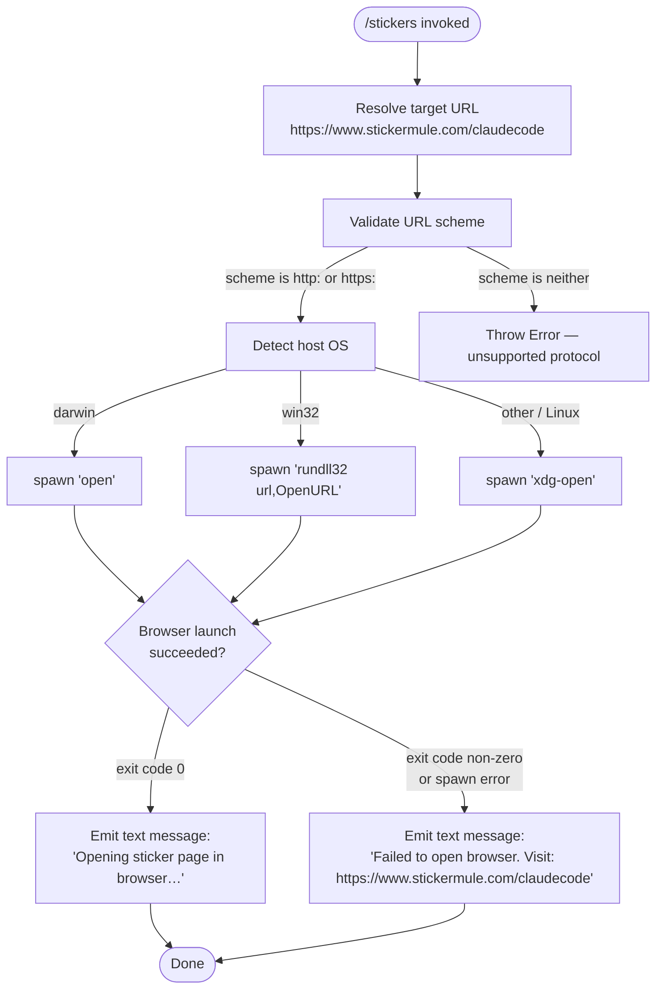

# `/stickers`

> Analysis basis: CC v2.1.132 bundle.js (AST extraction + Claude interpretation)
> Minimum version: v2.1.132

---

## Overview

The `/stickers` command opens the official Claude Code sticker order page (`https://www.stickermule.com/claudecode`) in the user's default system browser. It is a local, interactive-only command with no arguments; on success it prints a brief status message, and on failure it falls back to printing the URL for manual navigation.

---

## Registration

| Field | Value |
|---|---|
| type | `local` |
| name | `stickers` |
| description | `Order Claude Code stickers` |
| supportsNonInteractive | `false` |
| module_id | `k$q` |

Analysis basis: CC v2.1.132 bundle.js:+11305840

---

## Input Branching

Because the command accepts no user-supplied arguments, the only branching that occurs is at the operating-system layer inside the browser-open utility, followed by an error-recovery path.



Analysis basis: CC v2.1.132 bundle.js:+11305573, +7355236, +7355286, +7355308, +7355558, +7355574, +7355658, +7355670, +7355732, +7355739, +11305643, +11305714

---

## Behavioral Spec

### Command Entry Point

```
function executeStickersCommand(context):
    targetURL = "https://www.stickermule.com/claudecode"
    result = openURLInBrowser(targetURL)
    if result.success:
        yield textBlock("Opening sticker page in browser…")
    else:
        yield textBlock(
            "Failed to open browser. Visit: https://www.stickermule.com/claudecode"
        )
```

Analysis basis: CC v2.1.132 bundle.js:+11305576, +11305630, +11305643, +11305714

---

### URL Validation

Before any OS call is made, the browser-open utility inspects the URL's protocol scheme.

```
function validateURL(url):
    scheme = extractScheme(url)          // everything up to and including ":"
    if scheme not in ["http:", "https:"]:
        throw new Error("unsupported protocol: " + scheme)
    return url
```

Supported schemes: `http:` and `https:`.
Analysis basis: CC v2.1.132 bundle.js:+7355236, +7355286, +7355308

---

### Platform-Specific Browser Launcher

```
function openURLInBrowser(url):
    validateURL(url)
    platform = getOperatingSystem()      // Node process.platform equivalent

    if platform == "darwin":
        command = "open"
        args    = [url]
    else if platform == "win32":
        command = "rundll32"
        args    = ["url,OpenURL", url]
    else:                                // Linux and all other POSIX systems
        command = "xdg-open"
        args    = [url]

    exitCode = spawnSync(command, args)

    // Exit code 0 signals success; any other value is treated as failure.
    // The numeric constant 1 marks the non-zero failure sentinel in the bundle.
    return exitCode == 0
```

Numeric sentinels used internally: `0` (success) and `1` (failure indicator).
Analysis basis: CC v2.1.132 bundle.js:+7355558, +7355574, +7355658, +7355670, +7355732, +7355739, +7355806, +987899, +987933

---

### Child-Process Wrapper

The spawn helper wraps the low-level process call and enforces a timeout expressed as the numeric literal `10` found at the call site.

```
function spawnSync(command, args):
    // Maximum wait: 10 (unit: <!-- TODO: not found in depth-2 traversal; needs --depth 4 -->)
    process = childProcess.spawnSync(command, args, { timeout: 10 })
    if process.error:
        throw process.error
    return process.status
```

Analysis basis: CC v2.1.132 bundle.js:+987899, +987933, +987954, +988065

---

### Output Format

The command always yields exactly one output block of kind `"text"`.

| Scenario | Text content |
|---|---|
| Browser opened successfully | `Opening sticker page in browser…` |
| Browser launch failed | `Failed to open browser. Visit: https://www.stickermule.com/claudecode` |

Analysis basis: CC v2.1.132 bundle.js:+11305630, +11305643, +11305714

---

## State & Side Effects

| Item | Detail |
|---|---|
| Telemetry | None — the `telemetry` array is empty; no `tengu_*` events are emitted. |
| Hook registration | <!-- TODO: not found in depth-2 traversal; needs --depth 4 --> |
| appState changes | None observed in depth-2 traversal. |
| Sound | None observed in depth-2 traversal. |
| External process | Spawns one synchronous child process (`open`, `rundll32`, or `xdg-open`) per invocation. |
| Network | No direct network I/O from the CLI; the system browser handles the HTTP request. |
| Interactive-only | `supportsNonInteractive: false` — the command is disabled in non-interactive (pipe/CI) mode. |

Analysis basis: CC v2.1.132 bundle.js:+11305840 (registration), empty telemetry array

---

## Version History

| Version | Change |
|---|---|
| v2.1.132 | Initial analysis — command registered as local, opens StickerMule order page, no telemetry. |

---

## Common Mistakes

1. **Running in non-interactive mode.** Because `supportsNonInteractive` is `false`, invoking `/stickers` inside a script or piped session will not execute the command. Always run it in an interactive terminal session.
2. **Expecting URL customization.** The target URL (`https://www.stickermule.com/claudecode`) is hard-coded; no argument or environment variable overrides it. Analysis basis: CC v2.1.132 bundle.js:+11305576.
3. **Assuming telemetry is emitted.** Unlike many other CC commands, `/stickers` fires no telemetry events. Do not rely on analytics data to confirm its invocation.
4. **Misreading the fallback message as an error exit.** When the browser cannot be opened, the command emits a `text` block with the fallback URL and exits cleanly — it does not throw an unhandled exception to the CLI runtime.
5. **Treating Linux behavior as identical to macOS.** On non-`darwin`, non-`win32` platforms the launcher calls `xdg-open`, which may fail silently on minimal server environments where no browser or `xdg-open` binary is installed. Analysis basis: CC v2.1.132 bundle.js:+7355739.

---

## Appendix — Identifier Mapping

> For bundle debugging only. Identifiers change across versions.

| Identifier | Role |
|---|---|
| `ED7` | Stickers command implementation module — top-level handler that resolves the target URL and delegates to the browser-open utility |
| `LL` | Browser-open orchestrator — validates the URL scheme and dispatches to the platform-specific launcher |
| `T04` | URL scheme validator — inspects the protocol prefix and throws on unsupported schemes |
| `Y8` | Platform-specific process spawner — selects `open`, `rundll32`, or `xdg-open` based on `process.platform` and executes synchronously |