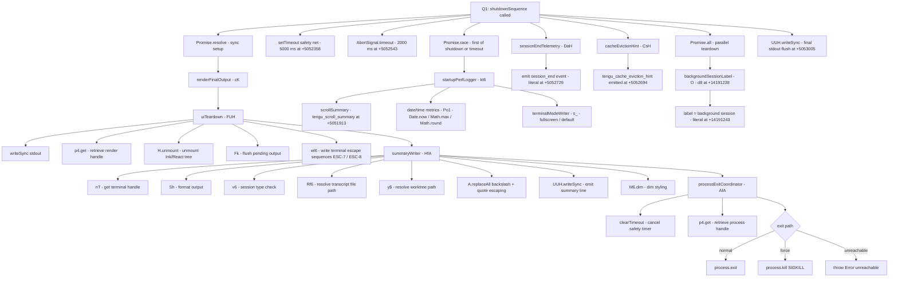

# `/stop`

> Analysis basis: CC v2.1.133 bundle.js (AST extraction + Claude interpretation)
> Minimum version: v2.1.133

---

## Overview

The `/stop` command terminates the current **background session** in Claude Code, transitioning it to a `stopped` state while preserving the session transcript and any associated worktree on disk. It fires a telemetry event (`tengu_bg_agent_action`) and emits a status string (`"stopped from session"`) before handing off to the graceful-shutdown pipeline. The transcript and worktree are intentionally retained so the user can resume or inspect session artifacts after the command completes.

---

## Registration

| Field | Value |
|---|---|
| `type` | `local-jsx` |
| `name` | `stop` |
| `description` | `Stop this background session; transcript and worktree are kept` |
| `immediate` | `true` |
| `module_id` | `NXq` |
| `load_inline` | `true` |
| `loc_byte` | `11712896` |
| `loc_byte_end` | `11713098` |
| `loc_line` | `7857` |
| `arbor_handler.name` | `_07` |
| `arbor_handler.fqn` | `claude-2.1.133::_07` |
| `arbor_handler.kind` | `AsyncFunction` |
| `arbor_handler.resolution_path` | `module_id` |
| `arbor_handler.n_hits` | `0` |

Analysis basis: CC v2.1.133 bundle.js:+11712896–+11713098

**Notes on registration shape:**
- `immediate: true` means the command executes without waiting for an agent turn — it is dispatched synchronously by the CLI shell loop.
- `load_inline: true` combined with `module_id: "NXq"` indicates the handler was inlined via a `load: () => Promise.resolve({call: IDENT})` pattern; no separate dynamic `import()` is involved.
- Arbor resolved the handler via the `module_id` path: it followed `NXq → moduleExports → _07`.

---

## Input Branching

The command has a simple linear flow with one minor conditional branch (active vs. non-active session state check inside the background-agent action reporter). Two distinct paths exist: the normal stop path and an early-return guard if the session is not in a stoppable state.

```
1. Command is invoked with `immediate: true` — no user argument is parsed.
2. Handler (stopCommandHandler) calls backgroundAgentActionReporter
   with action = "stop".
   ├─ If session state is "active" → proceeds normally.
   └─ Otherwise → guard may short-circuit telemetry emission.
3. stopCommandHandler calls sessionStopOrchestrator (yY8).
4. sessionStopOrchestrator runs the full stop pipeline.
5. Returns JSX node or plain result consumed by the shell.
```

Because only two meaningful branches exist, a numbered pseudocode list is sufficient here.

---

## Behavioral Spec

### 1. Top-Level Handler — `stopCommandHandler` (`_07`)

Analysis basis: CC v2.1.133 bundle.js:+11712615

```
async function stopCommandHandler(context):
    # Step 1 — Emit background-agent action telemetry
    backgroundAgentActionReporter("stop")        # call to H at +11712615
    # "stop" literal present at +11712066

    # Step 2 — Run the full session-stop pipeline
    result = await sessionStopOrchestrator(context)   # call to yY8 at +11712625

    return result
```

The handler is an `AsyncFunction` (per `arbor_handler.kind`). It is lightweight: it delegates all substantive work to `sessionStopOrchestrator`.

---

### 2. Background-Agent Action Reporter (`H`)

Analysis basis: CC v2.1.133 bundle.js:+12285769

```
function backgroundAgentActionReporter(action):
    # Introduces a small random jitter before recording the event
    jitter = Math.random() * 2 - 1     # range [-1, 1]; literals 2 at +12285767, 1 at +12285783
    setTimeout(recordAction, jitter)
```

The random jitter (using `Math.random` at +12285769 and `setTimeout` at +12285806) prevents telemetry thundering-herd when multiple background sessions stop simultaneously.

---

### 3. Session-Stop Orchestrator (`yY8`)

Analysis basis: CC v2.1.133 bundle.js:+11712032

This is the main coordination function. It sequences several sub-operations:

```
async function sessionStopOrchestrator(context):

    # 3a — Log / record the stop reason
    logger(context)                          # d at +11712032
    sessionTypeChecker(context)              # v6 at +11712095

    # 3b — Emit telemetry: tengu_bg_agent_action (+11712034)
    bgAgentActionEvent("stop")               # A07 at +11712108

    # 3c — Validate session state
    sessionStateValidator(context)           # E9 at +11712117
    # E9 calls hr (+2126589); uses string literals "bg", "daemon",
    # "daemon-worker" (+2126512, +2126522, +2126536) to identify session type

    # 3d — Read / update persisted session file
    sessionFileManager(context)              # r9 at +11712165
    # r9 operates on filesystem via Rj.stat (+3881437), Rj.readFile (+3881823),
    # reads as "utf-8" (+3881837), manages a Map (QfH.get/set/delete/clear),
    # warns on unexpected state (+3881703 "warn"),
    # uses sort keys "order"/"stateOrder" (+3881366, +3881387)

    # 3e — Transition session status
    sessionStatusTransitioner(context)       # Hw at +11712178
    # Hw → CE (+3887774) → tuH (+3887738)
    # Status strings encountered: "done", "success", "failed",
    # "failure", "stopped", "active"
    # (+3887616, +3887629, +3887646, +3887661, +3887678, +3887797)
    # Target transition: current status → "stopped"

    # 3f — Persist updated session record
    sessionRecordPersister(context)          # Pf at +11712190
    # Pf → iY (atomic write via randomBytes+writeFile+rename at
    #   +2867005/+2867052/+2867105)
    # Uses 4-byte hex token (+2867021 value=4, +2867033 "hex")
    # Joins path via Cj.join (+3881109)
    # May delete stale record (lP → QfH.delete at +3881298)

    # 3g — Emit "stopped from session" status string
    # Literal: "stopped from session" at +11712224
    # Literal: "idle" at +11712253
    statusEmitter("stopped from session", "idle")   # xu6 at +11712366

    # 3h — Render confirmation message
    # Literal: "Session stopped." at +11712397
    messageRenderer("Session stopped.")      # HqH at +11712393

    # 3i — Emit job_stop_self hook
    # Literal: "job_stop_self" at +11712428
    hookEmitter("job_stop_self")             # hH at +11712425
    # hH → d (+907379), which fires tengu_feature_ok (+907381)

    # 3j — Invoke graceful-shutdown sequence
    shutdownSequence(context)                # Q1 at +11712445

    # 3k — Record telemetry literals
    # "prompt_input_exit" at +11712450
    # "stop_command" at +11712629
```

---

### 4. Session-File Manager (`r9`)

Analysis basis: CC v2.1.133 bundle.js:+3881339

```
async function sessionFileManager(context):
    filePath = pathJoin(context.baseDir, ...)    # Cj.join at +3881339

    # Stat the file; if missing (ENOENT), treat as empty
    stats = await Promise.all([Rj.stat(filePath)])  # +3881424, +3881437
    # ENOENT error code checked via w8 (+134308, "ENOENT" at +134316)

    # Parse existing record
    raw = await Rj.readFile(filePath, "utf-8")   # +3881823, "utf-8" at +3881837
    parsed = jsonParser(raw)                     # p6 → JSON.parse at +144287

    # Update the in-memory map
    existingEntry = recordMap.get(sessionId)     # QfH.get at +3881744
    recordMap.delete(oldKey)                     # QfH.delete at +3881719
    recordMap.set(newKey, updatedEntry)          # QfH.set at +3882089

    # Validate numeric fields
    Number(value)                                # +3882144
    Number.isFinite(value)                       # +3882201

    # On terminal state, clear the map
    recordMap.clear()                            # QfH.clear at +3882306

    # Log file path for debugging
    pathBase = Cj.basename(filePath)             # +3881606
    String(value)                                # +3881684
```

---

### 5. Session-Record Persister (`Pf` / `iY`)

Analysis basis: CC v2.1.133 bundle.js:+3881106

```
async function sessionRecordPersister(context):
    targetPath = pathJoin(baseDir, recordName)   # Cj.join at +3881109
    serialized  = jsonSerialize(record)          # SH → JSON.stringify at +3881124
    await atomicFileWrite(targetPath, serialized) # lP at +3881138

async function atomicFileWrite(path, data):
    token    = crypto.randomBytes(4).toString("hex")  # +2867005, 4 at +2867021, "hex" at +2867033
    tmpPath  = path + "." + token
    await fs.writeFile(tmpPath, data, "utf8")    # Lo.writeFile at +2867052, "utf8" at +2867079
    await fs.rename(tmpPath, path)               # Lo.rename at +2867105
    # On collision: copyFile (+2867178) or unlink (+2867232) depending on flags
    # o41.has / a41.has guard copy vs unlink decision (+2867156, +2867207)
    staleMapEntry.delete(key)                    # lP → QfH.delete at +3881298
```

The atomic write pattern (write to `.tmp`, then rename) prevents partial-write corruption of the session record.

---

### 6. Graceful-Shutdown Sequence (`Q1`)

Analysis basis: CC v2.1.133 bundle.js:+5052261

This is the most complex sub-routine. It orchestrates UI teardown, process exit, and timeout safety nets.



**Key timing constants** (Analysis basis: CC v2.1.133 bundle.js):
- Safety-net `setTimeout` timeout: **5000 ms** (bundle.js:+5052358)
- Secondary timeout: **3500 ms** (bundle.js:+5052365)
- `AbortSignal.timeout`: **2000 ms** (bundle.js:+5052543)
- Post-teardown pause: **500 ms** (bundle.js:+5052968)

The `Promise.race` at +5052478 ensures the shutdown sequence cannot hang indefinitely: whichever of the shutdown promise or the timeout resolves first wins.

---

### 7. Daemon-Config Reload (`D` / supervisor path)

Analysis basis: CC v2.1.133 bundle.js:+14169774

When the session being stopped has an associated supervisor or daemon worker, an additional reload cycle is triggered:

```
async function supervisorReloadCycle(context):
    # Read current supervisor config
    config = await eDH(configPath)               # eDH at +14169774
    # eDH: Cwq.readFile (+11588676), error-guard w8 (+11588711)
    # parses JSON, validates keys via Object.keys (+11589020)

    # Write updated config
    await q.write(updatedConfig)                 # +14169791

    # Compute diff / timing columns
    bwq(config)                                  # +14169993
    # bwq: Object.keys (+11589732), Math.max (+11589777)

    # Stop existing supervisor instance
    supervisorHandle.stop()                      # E.stop at +14170067
    # E: preventDefault (+12601026), "remoteControlAtStartup" (+12601050)

    # Delete old entry, update config, start new instance
    handleMap.delete(key)                        # f.delete at +14170076
    supervisorHandle.stop()                      # I.stop at +14170187
    supervisorHandle.updateConfig(newConfig)     # I.updateConfig at +14170196
    supervisorHandle.start()                     # I.start at +14170214

    # Heartbeat management
    heartbeatManager(context)                    # Bdq → Go at +14169034
    # "heartbeat" literal at +14169021

    handleMap.set(key, newHandle)                # f.set at +14170361
    newHandle.start()                            # Z.start at +14170372

    # Fire tengu_daemon_config_reload telemetry
    emit("tengu_daemon_config_reload")           # d at +14170590
```

This path only executes when the stopped session has a live daemon/supervisor component (session types `"bg"`, `"daemon"`, or `"daemon-worker"`).

---

### 8. Startup-Performance Logger (`kt6` / `s_`)

Analysis basis: CC v2.1.133 bundle.js:+5051899

```
function startupPerfLogger(context):
    termHandle  = getTermHandle(nT)              # nT at +5051899
    sessionInfo = Wo1(context)                   # Wo1 at +5051905
    logger      = d(context)                     # d at +5051911

    # Collect timing checkpoints
    metrics = performanceMetricsCollector()      # Po1 at +5051940
    # Po1: Date.now (+5049333), Math.max (+5049401),
    #      Math.round (+5049474), Object.assign (+5049613)

    # Write terminal mode
    terminalModeWriter(context)                  # s_ at +5051957
    # s_: detects "local-agent" mode (+3194613)
    #     emits warning if tmux -CC detected (+3194768)
    #     emits warning if Windows over SSH detected (+3194954)
    #     sets mode to "fullscreen" (+3195158) or "default" (+3195184)
    #     fires tengu_pewter_brook telemetry (+3195249)

    # Emit scroll-summary telemetry
    emit("tengu_scroll_summary")                 # +5051913

    # Emit startup-perf telemetry
    emit("tengu_startup_perf")                   # +171233 (via CsH path)
```

---

## State & Side Effects

| Item | Detail |
|---|---|
| **Telemetry: `tengu_bg_agent_action`** | Emitted at the very start of the stop flow, inside `sessionStopOrchestrator` (bundle.js:+11712034) |
| **Telemetry: `tengu_feature_ok`** | Emitted by the hook-emitter sub-call (`hH → d`) when `job_stop_self` hook fires (bundle.js:+907381) |
| **Telemetry: `tengu_daemon_config_reload`** | Emitted only when a daemon/supervisor is present and reloaded during stop (bundle.js:+14170592) |
| **Telemetry: `tengu_startup_perf`** | Emitted as part of the shutdown performance log (bundle.js:+171233) |
| **Telemetry: `tengu_scroll_summary`** | Emitted during graceful-shutdown summary phase (bundle.js:+5051913) |
| **Telemetry: `tengu_pewter_brook`** | Emitted by `terminalModeWriter` (bundle.js:+3195249) |
| **Telemetry: `tengu_cache_eviction_hint`** | Emitted during shutdown by `cacheEvictionHint` (bundle.js:+5052694) |
| **Hook: `job_stop_self`** | Fired via `hH` at bundle.js:+11712425; string literal at +11712428 |
| **Session state transition** | Session status transitions to `"stopped"` (literal at +3887678); intermediate states include `"done"`, `"success"`, `"failed"`, `"failure"`, `"active"` |
| **Session file** | Persisted atomically (randomBytes token + rename) via `sessionRecordPersister`; stale map entries are deleted |
| **UI teardown** | Ink/React component tree unmounted (`H.unmount` at +5050532); terminal escape sequences ESC 7 / ESC 8 written (literals at +3529009, +3529020) |
| **Transcript / worktree** | Explicitly **retained** on disk — the description and `y$` (worktree path resolver) confirm no deletion occurs |
| **Process exit** | `process.exit` called normally; `process.kill(SIGKILL)` used as a forced fallback (literal at +5051182); safety-net timer set at 5000 ms |
| **Session status message** | `"stopped from session"` emitted (literal at +11712224); confirmation text `"Session stopped."` rendered (literal at +11712397) |
| **Session end event** | `"session_end"` emitted during teardown (literal at +5052729) |
| **Terminal mode** | Reset to `"default"` or `"fullscreen"` depending on environment detection; iTerm2/tmux-CC and Windows-over-SSH trigger warnings |

---

## Version History

| Version | Change |
|---|---|
| v2.1.133 | Initial analysis — `local-jsx` command with `immediate: true`; full graceful-shutdown pipeline including atomic session-file persistence, multi-stage telemetry, and supervisor reload |

---

## Common Mistakes

1. **Assuming `/stop` deletes the worktree.** The command description and the `y$` worktree-path resolver confirm the worktree is explicitly **kept**. Use a dedicated cleanup command if removal is desired.
2. **Invoking `/stop` outside a background session.** The `sessionStateValidator` (`E9`) checks for session types `"bg"`, `"daemon"`, and `"daemon-worker"`. Running `/stop` in a foreground interactive session will either no-op or produce an unexpected guard return.
3. **Expecting immediate process exit.** The shutdown sequence uses a `Promise.race` with a 2000 ms `AbortSignal` timeout and a 5000 ms safety-net `setTimeout`. The process may remain alive for up to 5 seconds during teardown.
4. **Relying on telemetry order.** `tengu_bg_agent_action` is fired with a random jitter delay (`Math.random() * 2 - 1` ms offset via `setTimeout`). Do not assume it arrives before other events in a test harness.
5. **Confusing `job_stop_self` with a cancellation hook.** This hook signals that the session stopped itself voluntarily (via `/stop`), not that it was cancelled externally. External cancellations use a different code path.
6. **Expecting the session record to be absent after stop.** The file is **updated** (status → `"stopped"`) and retained, not deleted. The `QfH.clear()` call at +3882306 clears the in-memory map, not the on-disk file.

---

## Appendix — Identifier Mapping

> For bundle debugging only. Identifiers change across versions.

| Identifier | Role |
|---|---|
| `_07` | `stopCommandHandler` — top-level async handler for `/stop`; Arbor-resolved entry point (fqn: `claude-2.1.133::_07`) |
| `H` | `backgroundAgentActionReporter` — fires background-agent action event with random jitter |
| `yY8` | `sessionStopOrchestrator` — main coordinator for all stop sub-steps |
| `d` | `logger` — general-purpose logging / debug utility (appears in multiple call sites) |
| `v6` | `sessionTypeChecker` — determines session variant (bg, daemon, foreground) |
| `A07` | `bgAgentActionEventEmitter` — records the `tengu_bg_agent_action` telemetry event |
| `E9` | `sessionStateValidator` — validates that the session type is stoppable |
| `hr` | `sessionTypeGuard` — low-level helper called by `E9`; checks type strings |
| `r9` | `sessionFileManager` — reads, updates, and manages the persisted session record file |
| `D8` | `fsErrorClassifier` — classifies filesystem errors (e.g., ENOENT guard) |
| `w8` | `enoentGuard` — checks error codes for ENOENT |
| `k` | `sessionRecordFormatter` — formats session record fields for serialisation |
| `Ztq` | `recordFieldNormaliser` — normalises individual record fields |
| `SH` | `jsonSerialiser` — wraps `JSON.stringify` |
| `A` | `stringHelper` — general string manipulation utility |
| `Uf` | `pathRedactor` — redacts sensitive path segments (uses `[REDACTED]` literal) |
| `LkH` | `fieldUnwrapper` — unwraps nested record field |
| `vtq` | `fileMetadataWriter` — writes file metadata (byte-length tracking, timestamps) |
| `p6` | `jsonParser` — wraps `JSON.parse` |
| `Hw` | `sessionStatusTransitioner` — drives status state machine toward `"stopped"` |
| `CE` | `statusStateReducer` — reduces status transition logic |
| `tuH` | `statusStringMapper` — maps internal status codes to string literals |
| `Pf` | `sessionRecordPersister` — coordinates atomic file write for session record |
| `iY` | `atomicFileWriter` — implements write-tmp-then-rename atomic persistence |
| `lP` | `staleRecordCleaner` — removes stale map entries after persistence |
| `xu6` | `statusEmitter` — emits the `"stopped from session"` / `"idle"` status update |
| `HqH` | `confirmationMessageRenderer` — renders `"Session stopped."` to UI |
| `hH` | `jobStopSelfHookEmitter` — fires the `job_stop_self` hook |
| `Q1` | `gracefulShutdownSequence` — orchestrates full UI teardown and process exit |
| `L` | `renderLoopManager` — manages active render instances (maps, pad) |
| `K` | `pendingTaskTracker` — tracks in-flight async tasks via add/delete/finally |
| `f` | `connectionHandle` — represents an open connection with close/write |
| `FUH` | `uiTeardown` — unmounts Ink component tree and flushes terminal |
| `Fk` | `outputFlusher` — flushes pending buffered output |
| `wl6` | `terminalEscapeWriter` — writes ESC-7 / ESC-8 save/restore cursor sequences |
| `kH` | `stringCoercer` — wraps `String()` coercion |
| `HfA` | `summaryWriter` — writes final session summary line to stdout |
| `nT` | `terminalHandleGetter` — retrieves active terminal file descriptor |
| `Sh` | `outputFormatter` — formats summary text for display |
| `Rf6` | `transcriptPathResolver` — resolves path to session transcript file |
| `y$` | `worktreePathResolver` — resolves path to session worktree (confirmed retained) |
| `Go1` | `transcriptPathFormatter` — formats transcript path for display |
| `AfA` | `processExitCoordinator` — calls `process.exit` or `process.kill(SIGKILL)` |
| `mNH` | `parallelShutdownCollector` — gathers parallel teardown promises via `Promise.all` |
| `D` | `supervisorReloadCycle` — stop/update/restart supervisor when daemon is present |
| `eDH` | `supervisorConfigReader` — reads current supervisor config from disk |
| `q` | `writeableHandle` — writable stream or file handle (also `unlinkSync` on socket) |
| `bwq` | `configDiffComputer` — computes diff/column widths between old and new config |
| `E` | `remoteControlEventHandler` — handles `remoteControlAtStartup` events |
| `I` | `supervisorInstance` — live supervisor object exposing stop/updateConfig/start |
| `Bdq` | `heartbeatManager` — manages heartbeat lifecycle |
| `Z` | `newSupervisorInstance` — replacement supervisor started after config update |
| `CsH` | `cacheEvictionHintEmitter` — emits `tengu_cache_eviction_hint` and writes perf log |
| `PiA` | `perfMarkRecorder` — records named performance marks |
| `jiA` | `startupPerfFileWriter` — writes startup-perf data to file |
| `F6` | `mkdirHelper` — ensures directory exists before file write |
| `_E` | `syncFileWriter` — synchronous open/writeFileSync/fsyncSync/closeSync helper |
| `DiA` | `startupPerfReportBuilder` — builds the startup profiling report string |
| `kt6` | `startupPerfLogger` — logs startup performance and scroll summary at shutdown |
| `Wo1` | `sessionInfoGetter` — retrieves session metadata |
| `Po1` | `performanceMetricsCollector` — collects timing metrics (Date.now, Math.max/round) |
| `s_` | `terminalModeWriter` — sets terminal render mode; detects tmux-CC and Windows-SSH |
| `DaH` | `sessionEndTelemetryEmitter` — emits `session_end` event |
| `$` | `backgroundSessionCoordinator` — manages background session label and lifecycle |
| `XDq` | `sessionSnapshotSaver` — saves session snapshot (calls `iY` atomic writer) |
| `O` | `backgroundSessionLabeller` — labels the process as `"background session"` |
| `d8` | `processLabelSetter` — sets Node.js process title/label |
| `r8` | `timedAbortWrapper` — wraps a promise with timeout, emitting `"aborted"` / `"abort"` |
| `NsH` | `sessionIdGenerator` — generates unique session identifiers |
| `aT` | `pathUtility` — general path joining/manipulation helper |
| `Ttq` | `recordTimestamper` — adds timestamps to session records |
| `xcA` | `recordSchemaValidator` — validates record schema before write |
| `rnA` | `sensitivePathMatcher` — matches sensitive path patterns for redaction |
| `UnA` | `fieldLengthLimiter` — limits field length in formatted output |
| `uNH` | `writeQueueManager` — manages async write queue |
| `aHH` | `encodingNormaliser` — normalises file encoding strings |
| `dG8` | `bufferSizeTracker` — tracks cumulative buffer size |
| `_iA` | `writeThrottle` — throttles writes (1000 ms / 100 unit limits at +162386/+162405) |
| `AiA` | `byteCounterHelper` — counts bytes via `Buffer.byteLength` |
| `LiA` | `writeCompletionHandler` — handles write-completion callbacks |
| `Vtq` | `writeFlushBinder` — binds flush callback to write context |
| `y1` | `writeQueueDrainer` — drains pending write queue |
| `RK` | `worktreeStateChecker` — checks worktree state flags |
| `iE6` | `profileEntryFormatter` — formats individual profiling report entries |
| `fQ` | `durationFormatter` — formats elapsed duration for display |
| `Xo1` | `metricsAggregator` — aggregates timing metrics |
| `CyH` | `agentTypeDetector` — detects agent type (`"local-agent"`) |
| `fHA` | `envVarReader` — reads `CLAUDE_CODE_NO_FLICKER` and related env vars |
| `Cd` | `tmuxCCDetector` — detects iTerm2 tmux -CC integration mode |
| `KL6` | `windowsSSHDetector` — detects Windows over SSH (ConPTY) environment |
| `mA` | `fullscreenModeSelector` — selects between `"fullscreen"` and `"default"` mode |
| `Q0K` | `noFlickerOverrideChecker` — checks `CLAUDE_CODE_NO_FLICKER=1` override flag |
| `J6` | `pewterBrookTelemetryEmitter` — emits `tengu_pewter_brook` event |
| `Ib` | `perfCheckpointReader` — reads recorded performance checkpoints |
| `Go` | `heartbeatScheduler` — schedules periodic heartbeat ticks |
| `Zc6` | `cursorRestoreWriter` — writes terminal cursor restore sequence |
| `I2H` | `clearLineWriter` — writes terminal clear-line sequence |
| `NE` | `terminalResetHelper` — issues terminal reset after cursor restore |

---

Note: index built via Arbor fallback; some signals (telemetry, literals) may be missing — see arbor-fallback.js.