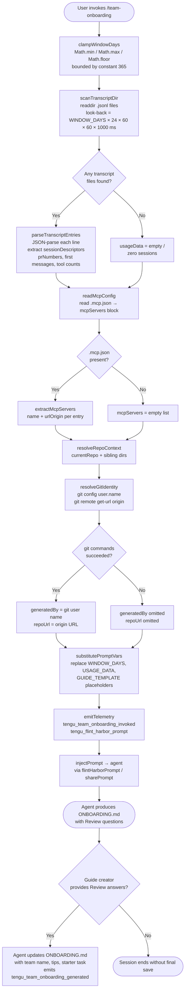

# `/team-onboarding`

> Analysis basis: CC v2.1.133 bundle.js (AST extraction + Claude interpretation)
> Minimum version: v2.1.133

---

## Overview

`/team-onboarding` is a `prompt`-type slash command that analyzes the invoking user's local Claude Code session transcripts over a configurable look-back window and co-authors a personalized `ONBOARDING.md` guide that teammates can paste directly into Claude Code for an interactive walkthrough. The command gathers usage data, MCP server configuration, and repository context before handing control to the agent via a 4,539-character prompt injected through `getPromptForCommand`.

---

## Registration

| Field | Value |
|---|---|
| `type` | `prompt` |
| `name` | `team-onboarding` |
| `description` | `Help teammates ramp on Claude Code with a guide from your usage` |
| `isHidden` | `false` |
| `handler_method` | `getPromptForCommand` |
| `handler_method_start` (byte) | `11648983` |
| `handler_method_end` (byte) | `11649639` |
| `loc_byte` | `11648645` |
| `loc_byte_end` | `11649640` |
| `loc_line` | `7785` |
| `prompt_body.length` | `4539` characters |
| `prompt_body.trace` | `identifier→$ (local→1 ext vars)` |
| `arbor_handler.name` | `getPromptForCommand` |
| `arbor_handler.kind` | `Method` |
| `arbor_handler.fqn` | `claude-2.1.133::getPromptForCommand` |
| `arbor_handler.resolution_path` | `direct` |
| `arbor_handler.n_hits` | `2` |
| `handler_method_start` | `11648983` |
| `handler_method_end` | `11649639` |

The registration block spans bytes `11648645`–`11649640` in the v2.1.133 bundle. The handler is an `ObjectMethod` named `getPromptForCommand` residing inline on the registration object; the call graph uses the synthetic entry `__handler_team-onboarding` as a BFS root but `arbor_handler` confirms the real symbol is `getPromptForCommand`.

Analysis basis: CC v2.1.133 bundle.js:+11648645

---

## Input Branching

The handler exhibits more than three distinct execution paths (transcript scan hit/miss, window-day clamping, MCP config present/absent, git identity resolution success/failure, usage-data substitution). A Mermaid flowchart is used below.



Analysis basis: CC v2.1.133 bundle.js:+11648989 (handler entry), +11649186 (Math.min/max/floor), +11649232 (constant 365), +11637486 (time conversion constants 24/60/1000), +11649367 (usageDataCollector call), +11649485 (sharePrompt call)

---

## Behavioral Spec

### 1. Window-Day Clamping

```
function clampWindowDays(rawDays):
    # rawDays defaults to 365 when not supplied
    # Analysis basis: bundle.js:+11649186, +11649204, +11649232
    lower = Math.max(1, rawDays)
    upper = Math.min(lower, MAX_WINDOW_DAYS)   # MAX_WINDOW_DAYS = 365
    return Math.floor(upper)
```

Maximum look-back window: **365 days** (bundle.js:+11649232).

Analysis basis: CC v2.1.133 bundle.js:+11649186

---

### 2. Transcript Directory Scan (`usageDataCollector` / `CJq`)

```
async function collectUsageData(windowDays):
    cutoffMs = Date.now() - windowDays * 24 * 60 * 60 * 1000
    # Time constants: 24 h, 60 min, 1000 ms  (bundle.js:+11637486)

    entries = await readdir(transcriptDir)
    jsonlFiles = entries.filter(e => extname(e) == ".jsonl")
    # Extension filter literal ".jsonl"  (bundle.js:+11637601)

    results = await Promise.all(
        jsonlFiles.map(async file =>
            stat = await fsStat(join(transcriptDir, file))
            if not stat.isFile(): return null
            raw = await readFile(join(transcriptDir, file))
            lines = raw.split("\n")
            # Split on newline; up to 10 lines sampled  (bundle.js:+11637997)
            return parseLines(lines, cutoffMs)
        )
    )
    return results.filter(r => r != null)
```

- Transcript directory is resolved via `transcriptDirPath` (calls `_Z` → `eyH.join` → path under `projects/`; literal `"projects"` at bundle.js:+944535).
- Each `.jsonl` file is read fully, then split into newline-delimited JSON records.
- The parser extracts `sessionDescriptors` (title, `prNumbers`, first user message) and counts of tool calls and MCP calls per session.
- If `~0` sessions are found within the window the prompt instructs the agent to leave the work-type breakdown as a `TODO`.

Analysis basis: CC v2.1.133 bundle.js:+11637473 (`Date.now`), +11637514 (`readdir`), +11637584 (`extname`), +11637620 (`Promise.all`), +11637857 (`readFile`), +11637971 (`split`)

---

### 3. Session Content Extraction

```
function parseLines(lines, cutoffMs):
    sessionDescriptors = []
    for line in lines:
        # matchAll on JSON content  (bundle.js:+11638058)
        if line.includes('"name":"mcp__'):   # literal bundle.js:+11638180
            recordMcpHit(line)
        if line.includes('"content":['):     # literal bundle.js:+11638530
            tryExtractFirstMessage(line)
        # d27, c27, l27 regex exec for title / prNumbers / timestamp
        # Number() cast for prNumbers  (bundle.js:+11638401)
    return {sessionDescriptors, mcpCounts, toolCounts}
```

- PR numbers are extracted via the regex matched by `c27` and cast with `Number()`.
- Session titles are extracted via `d27`.
- Timestamp boundary is checked; sessions older than `cutoffMs` are discarded.
- Up to 3 top-level content blocks are sampled per session (literal `3` at bundle.js:+11638633).

Analysis basis: CC v2.1.133 bundle.js:+11638012, +11638058, +11638180, +11638321, +11638377, +11638530, +11638633

---

### 4. MCP Configuration Reader (`r27`)

```
async function readMcpConfig(workspaceRoot):
    configPath = join(workspaceRoot, ".mcp.json")
    # Literal ".mcp.json"  (bundle.js:+11639712)
    try:
        raw = await readFile(configPath, "utf8")
        # Encoding literal "utf8"  (bundle.js:+11639725)
        parsed = JSON.parse(raw)
        servers = parsed["mcpServers"] ?? {}
        # Key literal "mcpServers"  (bundle.js:+11639768)
        return servers
    catch:
        return {}
```

Each server entry's `name` and `urlOrigin` (where present) are forwarded to the agent, which infers what the server does and how a teammate obtains access.

Analysis basis: CC v2.1.133 bundle.js:+11639688 (`readFile`), +11639701 (`join`), +11639712 (`.mcp.json`), +11639768 (`mcpServers`), +11639735 (`JSON.parse`)

---

### 5. Git Identity & Repository Resolution (`GA` → `sJH`)

```
async function resolveGitContext(cwd):
    try:
        userName = await runProcess("git", ["config", "user.name"], cwd)
        # Literals "git", "config", "user.name"  (bundle.js:+11640335, +11640342, +11640351)
    catch:
        userName = null

    try:
        originUrl = await runProcess("git", ["remote", "get-url", "origin"], cwd)
        # Literals "remote", "get-url", "origin"  (bundle.js:+11640407, +11640416, +11640426)
    catch:
        originUrl = null

    return {generatedBy: userName, repoUrl: originUrl}
```

If `userName` is `null` the agent is instructed to omit the `generatedBy` field from the guide header.

Analysis basis: CC v2.1.133 bundle.js:+11640332 (`GA`), +11640335–+11640426 (git literals)

---

### 6. Prompt Variable Substitution & Injection

```
function buildPrompt(templateBody, windowDays, usageData, guideTemplate):
    # Three placeholder literals replaced via A.replaceAll  (bundle.js:+11649376)
    p = templateBody.replaceAll("{{WINDOW_DAYS}}", String(windowDays))
    # Literal "{{WINDOW_DAYS}}"  (bundle.js:+11649389)
    p = p.replaceAll("{{USAGE_DATA}}", JSON.stringify(usageData))
    # Literal "{{USAGE_DATA}}"  (bundle.js:+11649464)
    p = p.replaceAll("{{GUIDE_TEMPLATE}}", guideTemplate)
    # Literal "{{GUIDE_TEMPLATE}}"  (bundle.js:+11649429)
    return p

function injectPrompt(finalPrompt):
    sharePrompt($58, finalPrompt)   # calls flintHarborShare  (bundle.js:+11649485)
    # return type literal "text"  (bundle.js:+11649623)
```

The prompt body (4,539 chars) is co-authored with the agent as follows (key behavioral instructions, paraphrased — not quoted verbatim):

1. **Immediate acknowledgment line** — The agent is required to emit a single acknowledgment sentence referencing `WINDOW_DAYS` and the onboarding purpose *before* any classification or tool use.
2. **Work-type classification** — Sessions in `sessionDescriptors` are classified into up to seven predefined task-type slugs (`build_feature`, `debug_fix`, `improve_quality`, `analyze_data`, `plan_design`, `prototype`, `write_docs`). The top 3–5 types with rough percentages are surfaced. Review sessions map to the type of the artifact being reviewed.
3. **Context assembly** — Repo list built from `currentRepo` plus workspace siblings; MCP servers described by name and inferred access method.
4. **Guide authoring** — Written to `ONBOARDING.md` using a built-in template (`{{GUIDE_TEMPLATE}}`). Numeric values filled from real usage data; ASCII bar charts use `█`/`░` at 20 characters wide. A preserved HTML comment appears at the bottom.
5. **Review loop** — After rendering the guide in a fenced code block, the agent appends a `---` separator and a `**Review**` heading with three numbered questions (team name confirmation, starter task, team tips).
6. **Final save** — After the guide creator answers, `ONBOARDING.md` is updated and a fixed closing line is emitted verbatim by the agent.

Analysis basis: CC v2.1.133 bundle.js:+11649376, +11649389, +11649407, +11649429, +11649464, +11649485, +11649623

---

### 7. Prompt Dispatch via `flintHarborPrompt` / `sharePrompt` (`$58`)

```
function sharePrompt(context, promptText):
    # $58 calls flintHarborShare  (bundle.js:+8880227 telemetry)
    # and J6 (session/conversation initializer)  (bundle.js:+8880224)
    emitTelemetry("tengu_flint_harbor_share")
    initSession(J6, promptText)
```

`$58` is the intermediary that forwards the final assembled prompt to the active conversation session (`J6` / `sessionManager`).

Analysis basis: CC v2.1.133 bundle.js:+8880172, +8880190, +8880224, +8880227

---

## State & Side Effects

| Item | Detail |
|---|---|
| **Telemetry — invocation** | `tengu_team_onboarding_invoked` (bundle.js:+11649243) — fired immediately after window-day clamping |
| **Telemetry — prompt dispatch** | `tengu_flint_harbor_prompt` (bundle.js:+11649020) — fired when prompt is sent to agent |
| **Telemetry — generation complete** | `tengu_team_onboarding_generated` (bundle.js:+11649508) — fired after guide is written |
| **Telemetry — prompt share** | `tengu_flint_harbor_share` (bundle.js:+8880227) — fired on prompt injection |
| **Telemetry — feature gate (ok)** | `tengu_feature_ok` (bundle.js:+907381) |
| **Telemetry — feature gate (bad)** | `tengu_feature_bad` (bundle.js:+907437) |
| **Telemetry — config parse error** | `tengu_config_parse_error` (bundle.js:+3113854) — if local config is malformed |
| **Telemetry — background (indirect)** | `tengu_bg_dispatch_sigkill_escalate`, `tengu_bg_dispatch_low_mem`, `tengu_bg_spare_enable`, `tengu_bg_spare_claim`, `tengu_bg_spare_claim_fail`, `tengu_bg_spare_spawn`, `tengu_bg_low_mem_mb`, `tengu_daemon_control` — background daemon events reachable via session manager; not specific to this command |
| **File writes** | `ONBOARDING.md` created or overwritten in the current working directory by the agent |
| **File reads** | `.jsonl` transcript files under `~/.claude/projects/`; `.mcp.json` in workspace root |
| **Process spawns** | Two `git` subprocess calls (`git config user.name`, `git remote get-url origin`) via `GA` → `sJH` |
| **Session initialisation** | `J6` (session manager) is called to open or attach to a conversation context |
| **appState changes** | Session descriptor set updated via `_d6` → `Ut8.add` / `b5H.get`; dedup set `pq6` updated |
| **Hook registration** | `u2K` registers a file watcher (`Yd6.watchFile`) on config; unwatched on cleanup (`Yd6.unwatchFile`) |
| **Sound** | None detected at depth ≤ 2 |

---

## Version History

| Version | Change |
|---|---|
| v2.1.133 | Initial analysis — command registered at bundle.js:+11648645; `getPromptForCommand` handler confirmed via Arbor direct resolution |

---

## Common Mistakes

1. **Running the command outside a Claude Code project directory** — The transcript scanner resolves the `projects/` directory relative to the Claude config home. If the user's transcript directory is empty or does not exist, `usageData` will be empty and the agent will emit a guide with `TODO` placeholders for the work-type breakdown. Populate at least a few sessions before invoking.

2. **Missing `.mcp.json` at workspace root** — The MCP configuration reader silently returns an empty server list if `.mcp.json` is absent. The generated guide will omit the MCP setup section. If the team uses MCP servers, ensure `.mcp.json` exists at the project root before running.

3. **No git remote configured** — `git remote get-url origin` is expected to return a URL. If the workspace has no `origin` remote, the repo URL field in the guide header will be blank. Add the remote or manually edit `ONBOARDING.md` afterwards.

4. **Skipping the Review step** — The agent writes `ONBOARDING.md` in draft form after the first turn. It only inserts the confirmed team name, starter task, and team tips after the user responds to the three numbered Review questions. Closing the session early leaves these fields as `TODO`.

5. **Confusing `WINDOW_DAYS` scope** — The maximum look-back is hard-capped at 365 days (bundle.js:+11649232). Passing a larger value will be silently clamped. For teams with short histories, a smaller window (e.g. 30–90 days) typically produces a more representative work-type breakdown.

6. **Expecting a public-facing output** — The command is marked `isHidden: false` and is therefore visible in the command palette, but its output (`ONBOARDING.md`) is a local file. Distribution to teammates requires manually adding it to team docs or a shared repository.

---

## Appendix — Identifier Mapping

> For bundle debugging only. Identifiers change across versions.

| Identifier | Role |
|---|---|
| `__handler_team-onboarding` | Synthetic BFS entry point for the command handler (not a real bundle symbol) |
| `J6` | Session manager — initialises and manages conversation sessions |
| `Bq6` | Session manager sub-routine A (<!-- TODO: not found in depth-2 traversal; needs --depth 4 -->) |
| `gq6` | Session manager sub-routine B (<!-- TODO: not found in depth-2 traversal; needs --depth 4 -->) |
| `Po` | Conversation context builder |
| `kH` | String utility / encoding helper |
| `jo` | Prompt formatting helper |
| `Ex` | External prompt executor |
| `_d6` | Session dedup / descriptor registrar |
| `pt8` | First-party event emitter |
| `ePH` | Event payload helper |
| `pU` | Random ID generator (uses `randomBytes`, 32-byte hex) |
| `SH` | JSON serialiser wrapper |
| `O2K` | Output routing helper |
| `ct8` | Config accessor / validator |
| `I71` | Config value reader |
| `mA` | Database accessor (`db`) |
| `LX1` | Config field extractor |
| `CyH` | Permission / flag checker (`JwL.has`) |
| `R6` | Transcript file reader (reads and parses local config/transcript files) |
| `F6` | File-system base path resolver |
| `He8` | File-system error handler |
| `m5H` | Config file loader (reads UTF-8, handles `ENOENT`, creates backups) |
| `q` | File-system module binding |
| `p6` | JSON parser wrapper |
| `nh` | String prefix stripper (`startsWith` / `slice`) |
| `A` | Generic utility / array-or-string helper |
| `w8` | Warning/log emitter |
| `PX1` | Directory walker (uses `readdirStringSync`, `statSync`, `path.basename`) |
| `k` | Log formatter / debug logger |
| `fH` | Transcript file reader (reads `.jsonl`, pushes to array, logs errors) |
| `d` | Core async dispatcher |
| `Me8` | Backup directory path builder |
| `w` | Background daemon manager |
| `u2K` | File watcher registrar (`watchFile` / `unwatchFile`) |
| `kd` | File watcher callback handler |
| `y1` | Watcher lifecycle manager (`d08.add` / `d08.delete`) |
| `o27` | Usage data collector — orchestrates scan, MCP read, git resolution |
| `LA` | Usage data sub-helper A |
| `h0` | Transcript directory path resolver |
| `_Z` | Base transcript path builder (`eyH.join`, `n8`) |
| `TO` | Path string transformer (`replace`, `slice`) |
| `H` | Generic async helper / timer wrapper |
| `wXL` | Numeric hash helper (`Math.abs`) |
| `CJq` | Transcript file parser (readdir → stat → readFile → regex extraction) |
| `Z9` | Warning emitter (`w8`) |
| `L` | Iterable mapper (`.map`, `.padEnd`) |
| `K` | Promise queue manager |
| `f` | Stream / handle closer |
| `O` | File-stat wrapper (`isFile`) |
| `d8` | File descriptor helper |
| `$` | Transcript line iterator / disposable |
| `XDq` | Session record builder |
| `z` | Daemon/background session controller |
| `hH` | Background session "hot" state handler |
| `uH` | Background session "cold" state handler |
| `bS` | Background session broker |
| `cC` | Daemon control loop (`Promise.race`, `process.exit`) |
| `Y` | Background session lifecycle manager |
| `sFA` | Background session spawner (macOS path) |
| `lFA` | Background session spawner (spare pool, `Bun.spawn`) |
| `r27` | MCP config reader (reads `.mcp.json`) |
| `D8` | Warning logger (`w8`) |
| `i27` | Additional context gatherer |
| `GA` | Git context resolver (spawns `git config user.name` and `git remote get-url origin`) |
| `sJH` | Process runner / child-process wrapper |
| `BK_` | Platform-specific command builder (Win32 `.exe` / `cmd /q`) |
| `Kh8` | Process stdout reader |
| `fh8` | Process stderr reader |
| `$h8` | Process exit handler |
| `iL_` | Numeric argument validator (`Number.isFinite`) |
| `UH6` | Process error wrapper |
| `Lh8` | Reflect-based property definer |
| `IK_` | Process event listener registrar (`H.on("exit")`) |
| `nL_` | Timeout-race helper (`setTimeout`, `Promise.race`, `clearTimeout`) |
| `rL_` | Process kill helper |
| `cL_` | Process stdio handler (stdout) |
| `lL_` | Process force-kill helper (`H.kill`) |
| `TK_` | Process all-output collector |
| `QH6` | Process output accumulator |
| `GK_` | Pipe setup helper (`_.pipe`) |
| `EK_` | Default export adder (`_.add`) |
| `tL_` | Stream bind helper (`ry8.bind`) |
| `qPL` | String coercer for process output |
| `AXH` | Git URL / remote origin parser (trim, match, startsWith `git/`) |
| `kPL` | URL host extractor |
| `s9` | String index-and-slice utility |
| `$58` | Prompt share / flint-harbor dispatcher |
| `yq` | Conversation prompt injector |
| `J9_` | Low-level string encoder (`kH`) |

---

Note: index built via Arbor fallback; some signals (telemetry, literals) may be missing — see arbor-fallback.js.