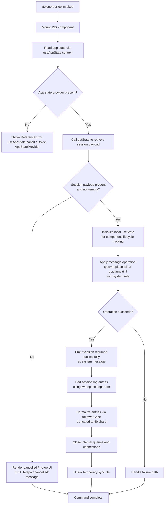

# `/teleport`

> Analysis basis: CC v2.1.133 bundle.js (AST extraction + Claude interpretation)
> Minimum version: v2.1.133

---

## Overview

The `/teleport` command (alias: `/tp`) resumes a Claude Code session that was previously initiated or saved on claude.ai, bridging the web-based environment with the local CLI. It operates as a `local-jsx` command, meaning it renders a React component within the terminal UI rather than dispatching a plain text handler. Upon successful resumption, it injects a system-level "replace-all" message operation into the current session state to restore the prior conversation context.

---

## Registration

| Field | Value |
|---|---|
| type | `local-jsx` |
| name | `teleport` |
| description | Resume a Claude Code session from claude.ai |
| aliases | `["tp"]` |
| module_id | `w5q` |

Analysis basis: CC v2.1.133 bundle.js:+11059582

---

## Input Branching

The command's JSX component mounts and immediately reads application state to determine whether a resumable session payload is present. Depending on what it finds, it follows one of three primary paths: successful resume, user-initiated cancellation, or an error/empty state.



---

## Behavioral Spec

### Context Guard — App State Access

Before any session data is read, the command verifies it is rendered inside an `<AppStateProvider />` by consuming the React context. If the context is absent, execution halts immediately with a `ReferenceError`.

```
function guardedAppStateAccess(context):
    value = IfH.useContext(context)
    if value is undefined or null:
        raise ReferenceError(
            "useAppState/useSetAppState cannot be called outside of an <AppStateProvider />"
        )
    return value
```

Analysis basis: CC v2.1.133 bundle.js:+3587674 (context read), +3587706 (ReferenceError throw), +3587721 (error string literal)

---

### Session Payload Retrieval

After the context guard passes, the component calls `getState` on the global store (`L`) to obtain the current session snapshot. The result is coerced to a Boolean to determine emptiness.

```
function retrieveSessionPayload(store):
    rawPayload = store.getState()
    hasPayload = Boolean(rawPayload)   // falsy check: null, undefined, empty string
    if not hasPayload:
        return EMPTY
    return rawPayload
```

- `Boolean` coercion applied at: Analysis basis: CC v2.1.133 bundle.js:+11058782
- `getState` call: Analysis basis: CC v2.1.133 bundle.js:+11058790
- Coercion offset (literal `0` used as empty index sentinel): Analysis basis: CC v2.1.133 bundle.js:+11058769

---

### Component Lifecycle State

A local React state variable is initialized with the value `1`, representing the component's initial "pending" phase. Subsequent state transitions (numeric phases 8–15) govern rendering stages.

```
function initComponentState():
    [phase, setPhase] = useState(initialValue=1)
    return (phase, setPhase)
```

- `useState` call: Analysis basis: CC v2.1.133 bundle.js:+11058857
- Initial value `1`: Analysis basis: CC v2.1.133 bundle.js:+11058833
- Phase constants observed: `6`, `7`, `8`, `9`, `10`, `11`, `12`, `13`, `14`, `15`, `16`

Analysis basis: CC v2.1.133 bundle.js:+11058880 (phase 6), +11058890 (phase 7), +11059029 (phase 8), +11059059 (phase 9), +11059161 (phase 10), +11059169 (phase 11), +11059207 (phase 12), +11059218 (phase 13), +11059229 (phase 14), +11059368 (phase 15), +11058728 (phase 16)

---

### Message Operation — Replace-All Injection

On a successful payload retrieval, the command applies a `"replace-all"` message operation to the session at message positions 6 and 7. The injected message carries the role `"system"`. This replaces any prior messages in the conversation view with the restored session context from claude.ai.

```
function injectRestoredSession(messageQueue, payload):
    operation = {
        type: "replace-all",       // literal: "replace-all"
        startIndex: 6,
        endIndex: 7,
        role: "system",            // literal: "system"
        content: payload
    }
    messageQueue.applyMessageOp(operation)
```

- `applyMessageOp` call: Analysis basis: CC v2.1.133 bundle.js:+11058905
- `"replace-all"` literal: Analysis basis: CC v2.1.133 bundle.js:+11058928
- Position `6`: Analysis basis: CC v2.1.133 bundle.js:+11058880
- Position `7`: Analysis basis: CC v2.1.133 bundle.js:+11058890
- `"system"` role literal: Analysis basis: CC v2.1.133 bundle.js:+11059001

---

### Success Notification

After the message operation completes, the component emits a human-readable confirmation as a `"localCommand"` typed system message.

```
function emitSuccessMessage(messageQueue):
    messageQueue.push({
        type: "localCommand",
        role: "system",
        content: "Session resumed successfully"
    })
```

- `"Session resumed successfully"` literal: Analysis basis: CC v2.1.133 bundle.js:+11058961
- `"localCommand"` type literal: Analysis basis: CC v2.1.133 bundle.js:+11059325

---

### Cancellation Path

When no valid session payload is found (or when the user dismisses the prompt), the component emits a cancellation notice and exits without modifying session state.

```
function emitCancellation(messageQueue):
    messageQueue.push({
        type: "localCommand",
        role: "system",
        content: "Teleport cancelled"
    })
```

- `"Teleport cancelled"` literal: Analysis basis: CC v2.1.133 bundle.js:+11059075

---

### Session Log Normalization

After a successful resume, session log entries are post-processed: each entry is padded to a uniform width using a two-space separator, then normalized to lowercase and truncated to a maximum of 40 characters.

```
function normalizeLogEntries(entries):
    result = []
    for entry in entries:
        padded = entry.padEnd(width, separator="  ")   // two-space pad
        normalized = padded.toLowerCase()
        truncated = normalized[0 : 40]                 // max 40 chars
        result.append(truncated)
    return result
```

- `padEnd` call with `"  "` (two spaces): Analysis basis: CC v2.1.133 bundle.js:+14179342, +14179363
- `toLowerCase` call: Analysis basis: CC v2.1.133 bundle.js:+14181260
- Truncation length `40`: Analysis basis: CC v2.1.133 bundle.js:+14181334

---

### Async Queue and File Cleanup

The implementation manages an internal async work queue. On completion (success or cancellation), outstanding queue entries are finalized, network/IPC connections are closed, and any temporary synchronization file created during the teleport handshake is deleted from disk.

```
function cleanup(workQueue, connectionSet, tempFilePath):
    // Drain in-flight async tasks
    for task in workQueue.activeTasks:
        workQueue.add(task)
        task.finally(lambda: workQueue.delete(task))

    // Close IPC/network connections
    connectionSet.close()
    workQueue.close()

    // Remove temporary handshake file
    fs.unlinkSync(tempFilePath)
```

- `q.add`: Analysis basis: CC v2.1.133 bundle.js:+14161309
- `f.finally`: Analysis basis: CC v2.1.133 bundle.js:+14161318
- `q.delete`: Analysis basis: CC v2.1.133 bundle.js:+14161332
- `_.close`: Analysis basis: CC v2.1.133 bundle.js:+14167103
- `q.close`: Analysis basis: CC v2.1.133 bundle.js:+14167113
- `unlinkSync`: Analysis basis: CC v2.1.133 bundle.js:+14137065

---

## State & Side Effects

| Item | Detail |
|---|---|
| Telemetry | None — no `tengu_*` events found in the implementation |
| Hook registration | Consumes `useContext` (React) for `AppStateProvider`; uses `useState` for internal phase tracking |
| appState changes | Reads global store via `getState`; applies a `"replace-all"` message operation to the active session message list |
| Message emissions | Emits `"Session resumed successfully"` (system/localCommand) on success; emits `"Teleport cancelled"` (system/localCommand) on cancellation or empty payload |
| File system | Calls `unlinkSync` to delete a temporary handshake/sync file after session restoration completes |
| Async queues | Registers and drains an internal async work queue; closes IPC/network connections on teardown |
| Log normalization | Post-processes session log entries: pad → lowercase → truncate to 40 characters |

---

## Version History

| Version | Change |
|---|---|
| v2.1.133 | Initial analysis — command registered as `local-jsx`, alias `tp`, module `w5q` |

---

## Common Mistakes

1. **Invoking `/teleport` outside a session context**: Because the command relies on `AppStateProvider` being present in the React tree, running it in an environment where the provider is absent will throw a `ReferenceError` with the message `"useAppState/useSetAppState cannot be called outside of an <AppStateProvider />"`. This is a hard error, not a graceful fallback.

2. **Expecting a prompt for a session URL**: The command does not appear to interactively request a claude.ai session URL from the user. The session payload is expected to already be present in the global app state at the time of invocation — likely pre-populated by an external handshake mechanism. Invoking `/teleport` without a prior handshake will result in the `"Teleport cancelled"` path.

3. **Confusing `/tp` scope**: The alias `/tp` is a registered first-class alias, not a shorthand that can be combined with other flags. It behaves identically to `/teleport`.

4. **Assuming telemetry capture**: Unlike many other Claude Code commands, `/teleport` emits **no** `tengu_*` telemetry events. Monitoring dashboards that rely on telemetry events will not receive signals from this command's execution.

5. **Expecting partial session merge**: The message operation type is `"replace-all"`, not an append or merge. Invoking `/teleport` will **replace** messages at the target positions entirely with the restored session content — any locally-accumulated messages in those slots will be overwritten.

---

## Appendix — Identifier Mapping

> For bundle debugging only. Identifiers change across versions.

| Identifier | Role |
|---|---|
| `XO7` | Module export container for the teleport command module (`w5q`) |
| `Y5q` | Primary JSX component function implementing the `/teleport` command |
| `_K` | App state hook wrapper — calls `MAA` to retrieve context value |
| `MAA` | Core `useAppState` / `useSetAppState` implementation; enforces `AppStateProvider` guard |
| `L` | Global store object exposing `getState` and session map operations |
| `K` | Async work queue manager — handles task addition, deletion, and finalization |
| `f` | Connection/resource object exposing `close`, async task lifecycle (`finally`), and queue delegation |
| `q` | Secondary queue or connection set used for IPC/network teardown and `unlinkSync` dispatch |
| `_` | Log entry normalizer — applies `toLowerCase` and truncation to session log strings |