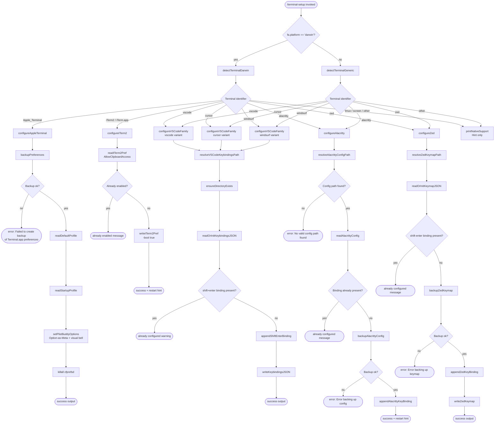

# `/terminal-setup`

> Analysis basis: CC v2.1.133 bundle.js (AST extraction + Claude interpretation)
> Minimum version: v2.1.133

---

## Overview

The `/terminal-setup` command detects the user's current terminal emulator and operating system, then automatically configures terminal-specific settings to improve the Claude Code experience — most notably installing Shift+Enter keybindings for multi-line input and, on macOS, enabling Option-as-Meta and disabling the audio bell in Apple Terminal or enabling clipboard access in iTerm2. The command is a local JSX command that renders its results inline and requires no user-supplied arguments.

---

## Registration

| Field | Value |
|---|---|
| type | `local-jsx` |
| name | `terminal-setup` |
| description | `null` |
| isHidden | `null` |
| module_id | `pN1` |

Analysis basis: CC v2.1.133 bundle.js:+11072068

---

## Input Branching

The top-level orchestrator (described here as `runTerminalSetup`) is invoked by the command handler (`commandHandler`), which first reads `fa.platform` to decide the macOS-vs-other split, then delegates to `dispatchByTerminal` for per-terminal work.



Analysis basis: CC v2.1.133 bundle.js:+3762920, +3763179, +3763213, +3763238, +3763426, +3763457, +3763493, +3763812, +3764856, +3766326

---

## Behavioral Spec

### Terminal Detection

```
function detectTerminalDarwin():
    env = process.env
    term_program = env["TERM_PROGRAM"]    // checked against known identifiers
    platform = fa.platform()              // expected "darwin"

    if term_program == "Apple_Terminal":
        return "Apple_Terminal"
    if term_program == "vscode":
        // distinguish VS Code family by server directory presence
        home = fa.homedir()
        if home contains ".vscode-server":  return "vscode"
        if home contains ".cursor-server":  return "cursor"
        if home contains ".windsurf-server":return "windsurf"
        return "vscode"
    if term_program == "iTerm.app" or env indicates "iTerm2":
        return "iTerm2"
    for each id in ["alacritty", "zed", "tmux", "screen"]:
        if env matches id: return id
    return "unknown"
```

Analysis basis: CC v2.1.133 bundle.js:+3762920, +3762936, +3762960, +3762992, +3763016, +3763040, +3763066, +3763093, +3762497, +3762508, +3762538, +3762568

---

### Apple Terminal Configuration (`configureAppleTerminal`)

```
function configureAppleTerminal():
    // Step 1 — export plist backup
    result = runCommand("defaults", "export", "com.apple.Terminal", backupPath)
    // result exit code is checked; a non-zero exit code OR byte length == 0 means failure
    if result.exitCode != 0 or result.stdout.length == 0:
        throw Error("Failed to create backup of Terminal.app preferences, bailing out")

    // Step 2 — read current default window settings
    defaultProfile = runCommand("defaults", "read", "com.apple.Terminal",
                                "Default Window Settings")
    if defaultProfile.trim() == "":
        throw Error("Failed to read default Terminal.app profile")

    startupProfile = runCommand("defaults", "read", "com.apple.Terminal",
                                "Startup Window Settings")
    if startupProfile.trim() == "":
        throw Error("Failed to read startup Terminal.app profile")

    // Step 3 — apply PlistBuddy settings to each profile
    profiles = deduplicate([defaultProfile, startupProfile])
    successCount = 0
    for each profile in profiles:
        ok = applyPlistBuddySettings(profile)
        if ok: successCount++

    if successCount == 0:
        throw Error("Failed to enable Option as Meta key or disable audio bell"
                    " for any Terminal.app profile")

    // Step 4 — flush preference daemon
    runCommand("killall", "cfprefsd")

    // Step 5 — render success output
    output = []
    output.push("Configured Terminal.app settings:")
    output.push("- Enabled \"Use Option as Meta key\"")
    output.push("- Switched to visual bell")
    output.push("Shift+Return will now enter a newline.")
    output.push("Option+Enter will now enter a newline.")
    output.push("You must restart Terminal.app for changes to take effect.")
    return renderSuccess(output)
```

Analysis basis: CC v2.1.133 bundle.js:+3770354, +3770361, +3770365, +3770394, +3770400, +3770495, +3770510, +3770538, +3770577, +3770598, +3770715, +3770754, +3770775, +3770829, +3771084, +3771095, +3771124, +3771137, +3771204, +3771266, +3771311, +3771360, +3771445

---

### PlistBuddy Profile Settings (`applyPlistBuddySettings`)

The helper `applyPlistBuddySettings` (mapped from `SN1` / `RN1`) calls `/usr/libexec/PlistBuddy` with `-c` flag arguments to mutate the Terminal preference plist for each named profile.

```
function applyPlistBuddySettings(profileName):
    plistBuddy = "/usr/libexec/PlistBuddy"
    flag = "-c"
    // Sets "Use Option as Meta key" = true and "Bell" = false
    // Uses runCommand (fH) internally; errors are caught and surfaced
    result1 = runCommand(plistBuddy, flag, setMetaKeyCommand(profileName))
    result2 = runCommand(plistBuddy, flag, setBellCommand(profileName))
    return result1.ok or result2.ok
```

Analysis basis: CC v2.1.133 bundle.js:+3769643, +3769670, +3769736, +3769887, +3769890

---

### iTerm2 Clipboard Configuration (`configureITerm2`)

```
function configureITerm2():
    domain = "com.googlecode.iterm2"
    key    = "AllowClipboardAccess"

    current = runCommand("defaults", "read", domain, key)
    if current.trim() == "1" or current.trim().toLowerCase() == "true":
        return renderMessage("iTerm2 clipboard access already enabled")

    result = runCommand("defaults", "write", domain, key, "-bool", "true")
    if result.exitCode != 0:
        return renderWarning("Couldn't update iTerm2 clipboard setting.")

    return renderSuccess([
        "Enabled \"Applications in terminal may access clipboard\" in iTerm2",
        "Restart iTerm2 for this to take effect. " +
        "Undo: defaults write com.googlecode.iterm2 AllowClipboardAccess -bool false"
    ])
```

Analysis basis: CC v2.1.133 bundle.js:+3763891, +3763913, +3763937, +3764012, +3764100, +3764155, +3764206, +3764297, +3764380

---

### VS Code Family Keybindings (`configureVSCodeFamily`)

Handles VS Code, Cursor, and Windsurf. All three share the same keybinding injection path; they differ only in the application name used in output strings and the config directory path.

```
function resolveVSCodeConfigDir(appVariant):
    // appVariant ∈ {"Code", "Cursor", "Windsurf"}
    platform = fa.platform()
    home     = fa.homedir()
    if platform == "win32":
        return path.join(home, "AppData", "Roaming", appVariant, "User")
    if platform == "darwin":
        return path.join(home, "Library", "Application Support", appVariant, "User")
    // linux / other
    return path.join(home, ".config", appVariant, "User")

function configureVSCodeFamily(appVariant):
    // appVariant label: "VSCode" | "Cursor" | "Windsurf"
    configDir      = resolveVSCodeConfigDir(appVariant)
    keybindingFile = path.join(configDir, "keybindings.json")

    ensureDirectoryExists(configDir, { recursive: true })

    rawContent = readFileOrDefault(keybindingFile, "[]", "utf-8")
    parsed     = parseJSON(rawContent)           // via Z9 / JSON-safe parser
    if not Array.isArray(parsed): parsed = []

    // Check whether the binding already exists
    existing = parsed.find(entry =>
        entry.key == "shift+enter" and
        entry.command == "workbench.action.terminal.sendSequence")
    if existing != null:
        return renderWarning(appVariant + " Shift+Enter key binding already configured")

    // Generate a 4-byte random hex suffix for the backup filename
    suffix   = crypto.randomBytes(4).toString("hex")
    backupPath = keybindingFile + ".backup." + suffix
    copyFile(keybindingFile, backupPath)          // best-effort; no bail on failure

    // Append the new binding
    newBinding = {
        key:     "shift+enter",
        command: "workbench.action.terminal.sendSequence",
        args:    { text: "\u001b\r" },            // ESC + CR
        when:    "terminalFocus"
    }
    parsed.push(newBinding)
    writeFile(keybindingFile, serializeJSON(parsed, null, 2), "utf-8")

    return renderSuccess("Shift+Return will now enter a newline.")
```

Analysis basis: CC v2.1.133 bundle.js:+3762992, +3763016, +3763040, +3763213, +3763285, +3763355, +3766405, +3766421, +3766429, +3766442, +3766458, +3766474, +3766484, +3766496, +3766537, +3766547, +3766587, +3767749, +3767764, +3767767, +3768217, +3768401, +3768410, +3768420, +3768450, +3768483, +3768510, +3768534, +3768551, +3768575, +3768601, +3768617, +3768629, +3768664, +3768802, +3768869, +3768891, +3768943, +3768958, +3768977, +3769347, +3769369, +3769528, +3769534

The VS Code family also patches `settings.json` (separate from keybindings) in a parallel sub-flow (`__A`):

```
function patchVSCodeSettings(appVariant):
    configDir    = resolveVSCodeConfigDir(appVariant)
    settingsFile = path.join(configDir, "settings.json")

    raw    = readFileOrDefault(settingsFile, "{}", "utf-8")
    parsed = parseJSON(raw)
    if typeof parsed != "object" or Array.isArray(parsed): parsed = {}

    // Merges terminal-relevant settings; existing keys are preserved
    // Uses writeShiftEnterEntry (I4_) and writeSettingsEntry (V4_)
    suffix     = crypto.randomBytes(4).toString("hex")
    backupPath = settingsFile + ".backup." + suffix
    copyFile(settingsFile, backupPath)

    writeFile(settingsFile, serializeJSON(parsed, null, 2), "utf-8")
```

Analysis basis: CC v2.1.133 bundle.js:+3766638, +3766714, +3766744, +3766752, +3766759, +3766786, +3766808, +3766860, +3766880, +3766921, +3766947, +3767140, +3767162, +3767286, +3767337, +3767473, +3767632

---

### Alacritty Keybinding Configuration (`configureAlacritty`)

```
function configureAlacritty():
    // Collect candidate config paths for this platform
    candidatePaths = buildAlacrittyConfigPaths()   // uses fa.homedir, fa.platform
    // Primary filename: "alacritty.toml"
    configPath = candidatePaths.find(p => fileExists(p))

    if configPath == null:
        throw Error("No valid config path found for Alacritty")

    content = readFile(configPath, "utf-8")
    parsed  = parseToml(content)      // Z9 — TOML-safe parser

    // Check if binding is already present by scanning for both marker strings
    if content.includes("mods = \"Shift\"") and content.includes("key = \"Return\""):
        return renderMessage("Alacritty Shift+Enter key binding already configured")

    // Backup
    suffix     = crypto.randomBytes(4).toString("hex")
    backupPath = configPath + ".backup." + suffix
    result     = copyFile(configPath, backupPath)
    if result.error:
        throw Error("Error backing up existing Alacritty config. Bailing out.")

    // Inject TOML key-binding block
    appendAlacrittyBlock(configPath, content)
    // Ensures parent directory exists before writing
    ensureDirectoryExists(path.dirname(configPath))
    writeFile(configPath, newContent, "utf-8")

    return renderSuccess([
        "Installed Alacritty Shift+Enter key binding",
        "You may need to restart Alacritty for changes to take effect"
    ])
```

Analysis basis: CC v2.1.133 bundle.js:+3771976, +3771983, +3772005, +3772044, +3772101, +3772253, +3772315, +3772360, +3772366, +3772423, +3772434, +3772464, +3772491, +3772507, +3772570, +3772584, +3772606, +3772669, +3772717, +3772865, +3772874, +3772919, +3773035, +3773091, +3773161, +3773277, +3773289

---

### Zed Keymap Configuration (`configureZed`)

```
function configureZed():
    home        = fa.homedir()
    keymapPath  = path.join(home, ".config", "zed", "keymap.json")
    ensureDirectoryExists(path.dirname(keymapPath))

    raw    = readFileOrDefault(keymapPath, "[]", "utf-8")
    parsed = parseJSON(raw)
    if not Array.isArray(parsed): parsed = []

    // Check presence of "shift-enter" binding
    if parsed some entry contains "shift-enter":
        return renderMessage("Zed Shift+Enter key binding already configured")

    // Backup
    suffix     = crypto.randomBytes(4).toString("hex")
    backupPath = keymapPath + ".backup." + suffix
    result     = copyFile(keymapPath, backupPath)
    if result.error:
        throw Error("Error backing up existing Zed keymap. Bailing out.")

    // Build Zed binding object
    // Context: "Terminal", action: "terminal::SendText", value: "\u001b\r"
    newEntry = {
        context: "Terminal",
        bindings: {
            "shift-enter": ["terminal::SendText", "\u001b\r"]
        }
    }
    parsed.push(newEntry)    // indentation level: 2
    writeFile(keymapPath, serializeJSON(parsed, null, 2), "utf-8")

    return renderSuccess("Installed Zed Shift+Enter key binding")
```

Analysis basis: CC v2.1.133 bundle.js:+3773373, +3773381, +3773423, +3773448, +3773503, +3773555, +3773578, +3773589, +3773613, +3773629, +3773686, +3773700, +3773722, +3773785, +3773833, +3773979, +3773986, +3774026, +3774042, +3774078, +3774118, +3774133, +3774143, +3774189, +3774282, +3774288, +3774294

---

### Command Execution Helper (`runCommand`)

The `runCommand` helper (mapped from `fH`) wraps all external process calls. It uses an internal error-logging path and pushes entries to an in-memory error list.

```
function runCommand(executable, ...args):
    try:
        result = spawnSync(executable, args)
        if result.status != 0:
            logError(result.stderr)
            return { ok: false, exitCode: result.status, stdout: "", stderr: result.stderr }
        return { ok: true, exitCode: 0, stdout: result.stdout.toString(), stderr: "" }
    catch err:
        logError(err)
        return { ok: false, exitCode: -1, stdout: "", stderr: String(err) }
```

Analysis basis: CC v2.1.133 bundle.js:+912461, +912474, +912720, +912803, +912821, +912836, +912861

---

### Foreground Color Detection for Output (`detectForegroundColor`)

The `detectForegroundColor` helper (mapped from `K_`) is used by multiple per-terminal configurators to style their console output. It checks whether the terminal's foreground color spec starts with `"rgb("`, `"ansi256("`, or `"ansi:"`.

```
function detectForegroundColor(colorSpec):
    if colorSpec.startsWith("rgb("):    return parseRgbColor(colorSpec)
    if colorSpec.startsWith("ansi256("): return parseAnsi256Color(colorSpec)
    if colorSpec.startsWith("ansi:"):   return parseAnsiColor(colorSpec)
    return defaultColor
```

Analysis basis: CC v2.1.133 bundle.js:+3553244, +3553288, +3553301, +3553342, +3553368, +3553384, +3553408

---

### Preference Restore / Rollback (`restoreAppleTerminalPreferences`)

The `restoreAppleTerminalPreferences` helper (mapped from `Dn6`) handles rollback of Apple Terminal preferences when an earlier step fails mid-flight.

```
function restoreAppleTerminalPreferences(backupPath):
    if backupPath == null or backupPath == "no_backup":
        return { status: "no_backup" }

    result = runCommand("defaults", "import", "com.apple.Terminal", backupPath)
    if result.exitCode != 0:
        return { status: "failed" }

    stat = sAA.stat(backupPath)
    if stat is ok:
        // attempt to unlink the temp backup file
        unlinkSync(backupPath)
    return { status: "restored" }
```

Analysis basis: CC v2.1.133 bundle.js:+3760360, +3760386, +3760412, +3760449, +3760523, +3760538, +3760595, +3760672, +3760700, +3760703

---

### Main Terminal Orchestration (`dispatchByTerminal`)

The root orchestrator (mapped from `BRK`) reads the platform, collects the detected terminal name, and dispatches to the correct configurator. It also prints the "already natively supported" hint for terminals that do not need setup.

```
function dispatchByTerminal(context):
    platform    = fa.platform()
    terminalId  = detectTerminalDarwin()      // or generic on non-darwin

    // Run iTerm2 clipboard path on macOS regardless of per-terminal branch
    if platform == "darwin" and terminalId includes "iterm":
        configureITerm2()

    // Run t2H (terminal capability check) to read env
    caps = detectTerminalCapabilities()

    // Dispatch per-terminal
    switch terminalId:
        case "Apple_Terminal": return configureAppleTerminal()
        case "iTerm2":         return configureITerm2()
        case "vscode":         return configureVSCodeFamily("Code")
        case "cursor":         return configureVSCodeFamily("Cursor")
        case "windsurf":       return configureVSCodeFamily("Windsurf")
        case "alacritty":      return configureAlacritty()
        case "zed":            return configureZed()
        default:
            print("Note: You can already use backslash (\\) + return to add newlines.")
            print("Note: iTerm2, WezTerm, Ghostty, Kitty, Warp, and Windows Terminal"
                  " support Shift+Enter natively.")
```

Analysis basis: CC v2.1.133 bundle.js:+3764856, +3764957, +3764984, +3765006, +3765052, +3765183, +3765198, +3765403, +3765429, +3765455, +3765472, +3765549, +3765697, +3765849, +3766184, +3766326

---

### Config File Locking and Backup (`configLockManager`)

The `configLockManager` (mapped from `fe8` / `e6` / `G$`) is a general-purpose config-save guard used across Claude Code. It is reached indirectly through the onboarding completion hook fired at command end.

Key constants:
- Lock contention warning threshold: **100 ms** (Analysis basis: CC v2.1.133 bundle.js:+3111178)
- Maximum lock wait timeout: **60 000 ms** (Analysis basis: CC v2.1.133 bundle.js:+3111954)
- Maximum retained backup files per config: **5** (Analysis basis: CC v2.1.133 bundle.js:+3112203)
- File permission mode for new config files: **0o600 (384 decimal)** (Analysis basis: CC v2.1.133 bundle.js:+3112485)
- Background spare process idle interval: **2 000 ms** (Analysis basis: CC v2.1.133 bundle.js:+14156750)

```
function acquireConfigLock(lockFilePath):
    deadline = Date.now() + 60000
    while Date.now() < deadline:
        try:
            createExclusive(lockFilePath)   // O_EXCL — throws EEXIST if held
            return lockHandle
        catch EEXIST:
            if elapsed > 100:
                emitTelemetry("tengu_config_lock_contention")
                logWarning("Lock acquisition took longer than expected - " +
                           "another Claude instance may be running")
            sleep(small_interval)
    throw Error("could not acquire lock")
```

Analysis basis: CC v2.1.133 bundle.js:+3111184, +3111273, +3111931, +3111954

---

## State & Side Effects

| Item | Detail |
|---|---|
| Telemetry — `tengu_bg_spare_enable` | Fired when a background spare process is enabled (CC v2.1.133 bundle.js:+14156457) |
| Telemetry — `tengu_bg_spare_spawn` | Fired when a background spare process is spawned (CC v2.1.133 bundle.js:+14156817) |
| Telemetry — `tengu_config_lock_contention` | Fired when config-lock acquisition exceeds 100 ms threshold (CC v2.1.133 bundle.js:+3111273) |
| Telemetry — `tengu_config_stale_write` | Fired when a stale config write is detected and suppressed (CC v2.1.133 bundle.js:+3111409) |
| Telemetry — `tengu_config_auth_loss_prevented` | Fired when a write that would erase auth credentials is blocked (CC v2.1.133 bundle.js:+3111752) |
| Telemetry — `tengu_config_parse_error` | Fired when a JSON/plist config file cannot be parsed (CC v2.1.133 bundle.js:+3113854) |
| Telemetry — `tengu_feature_ok` | Fired on successful feature check (CC v2.1.133 bundle.js:+907381) |
| Onboarding hook | `hH` sets the `onboarding_project_complete` flag in app state on successful completion (CC v2.1.133 bundle.js:+3759317, +3759314) |
| File system — Apple Terminal | Exports `com.apple.Terminal` plist to a temp backup; kills `cfprefsd`; no permanent new files left on error (CC v2.1.133 bundle.js:+3770354, +3771084) |
| File system — VS Code family | Creates or patches `keybindings.json` and `settings.json` under the editor's User config directory; leaves `.backup.<hex>` copy of the original (CC v2.1.133 bundle.js:+3768664, +3769369) |
| File system — Alacritty | Patches `alacritty.toml`; leaves `.backup.<hex>` copy (CC v2.1.133 bundle.js:+3772669, +3773035) |
| File system — Zed | Patches `~/.config/zed/keymap.json`; leaves `.backup.<hex>` copy (CC v2.1.133 bundle.js:+3773785, +3774118) |
| File system — iTerm2 | Calls `defaults write` only; no file copied directly (CC v2.1.133 bundle.js:+3764100) |
| appState changes | `onboarding_project_complete` boolean updated via `hH` → `IN1` → `aAA` path (CC v2.1.133 bundle.js:+3759257, +3759115) |
| Sound | No audio output. The command explicitly **disables** the audio bell for Apple Terminal profiles (CC v2.1.133 bundle.js:+3771266) |
| External processes spawned | `defaults`, `/usr/libexec/PlistBuddy`, `killall cfprefsd` on macOS only (CC v2.1.133 bundle.js:+3760102, +3769643, +3771084) |

---

## Version History

| Version | Change |
|---|---|
| v2.1.133 | Initial analysis |

---

## Common Mistakes

1. **Running on an unsupported terminal and expecting changes** — If the terminal is not one of `Apple_Terminal`, `iTerm2/iTerm.app`, `vscode`, `cursor`, `windsurf`, `alacritty`, or `zed`, the command only prints informational notes and does not modify any files. It does not report an error in that case.

2. **Not restarting the terminal after setup** — All per-terminal configurators that modify files print a restart-required notice. Changes to Apple Terminal preferences and iTerm2 `defaults` do not apply to already-running terminal windows.

3. **Running under tmux or screen** — The terminal detection uses `TERM_PROGRAM` and related environment variables. Inside a `tmux` or `screen` session these variables may not be set, causing the command to fall through to the informational-only path and skip the actual configuration.

4. **Assuming settings.json is unchanged** — In addition to `keybindings.json`, the VS Code family path also patches `settings.json` in the same User config directory. Both files receive a `.backup.<8-char-hex>` copy before modification.

5. **Expecting rollback on VS Code / Alacritty / Zed failures** — Only the Apple Terminal path has an explicit rollback mechanism (`restoreAppleTerminalPreferences`). For the other terminals, the `.backup.<hex>` file is left on disk but is not automatically restored; users must restore it manually.

6. **Multiple Claude instances racing on config** — The config-lock system warns (and emits `tengu_config_lock_contention` telemetry) if another Claude instance holds the lock for more than 100 ms, but `/terminal-setup` itself does not retry failed terminal-file writes.

---

## Appendix — Identifier Mapping

> For bundle debugging only. Identifiers change across versions.

| Identifier | Role |
|---|---|
| `t2H` | Terminal capability / environment variable reader |
| `Xn6` | Top-level terminal-setup command handler (dispatcher) |
| `FRK` | Apple Terminal configuration orchestrator |
| `yN1` | Apple Terminal plist export / backup runner |
| `Y8` | Shell command executor (generic wrapper) |
| `q` | File-unlink / temp-file helper |
| `K` | Async task set (add / delete / find / push) |
| `SN1` | PlistBuddy profile setter — Option-as-Meta |
| `RN1` | PlistBuddy profile setter — audio bell disable |
| `QuH` | Preference-restore helper dispatcher |
| `K_` | Terminal foreground color detector / formatter |
| `Y` | Background spare process manager |
| `fH` | External process runner (`runCommand`) |
| `Dn6` | Apple Terminal preferences rollback / restore helper |
| `q_A` | VS Code family keybindings configurator |
| `bN1` | VS Code family server-directory detector |
| `mN1` | VS Code family config-directory resolver |
| `nh8` | JSON-safe file reader with error classification |
| `Z9` | TOML / JSON parser (safe wrapper) |
| `dS` | File-URL builder (`CN1.pathToFileURL` wrapper) |
| `V4_` | VS Code keybindings entry writer |
| `__A` | VS Code `settings.json` patcher |
| `I4_` | VS Code settings entry writer |
| `gRK` | Alacritty keybinding configurator |
| `_` | String collection / lowercase helper |
| `QRK` | Zed keymap configurator |
| `p6` | JSON.parse wrapper |
| `SH` | JSON.stringify wrapper |
| `e6` | Global config save / lock manager (entry point) |
| `fe8` | Config file lock acquisition and rotation helper |
| `H` | Random-delay / retry helper (uses Math.random + setTimeout) |
| `fxH` | Config file path resolver |
| `jX1` | Config object entries iterator |
| `MxH` | Config timestamp tracker |
| `k` | Config serializer / validator |
| `m5H` | Per-project config reader |
| `lq6` | Config cache manager |
| `d` | Async deferred / promise helper |
| `Ke8` | Current project config saver |
| `guH` | Onboarding completion handler |
| `dM` | Onboarding state machine initializer |
| `IN1` | Onboarding project-complete flag setter |
| `G$` | Current project config save orchestrator |
| `hH` | Onboarding hook registrar |
| `M_A` | Multi-config merge helper |
| `R6` | Global config reader |
| `F6` | Config file path constant provider |
| `He8` | Config file existence checker |
| `u2K` | Config file watcher |
| `K_A` | Config read-only accessor |
| `f_A` | Config write accessor |
| `L_A` | Config listener registrar |
| `uN1` | iTerm2 clipboard configuration handler |
| `BRK` | Main per-terminal dispatch orchestrator |
| `Yn6` | Terminal name label builder |