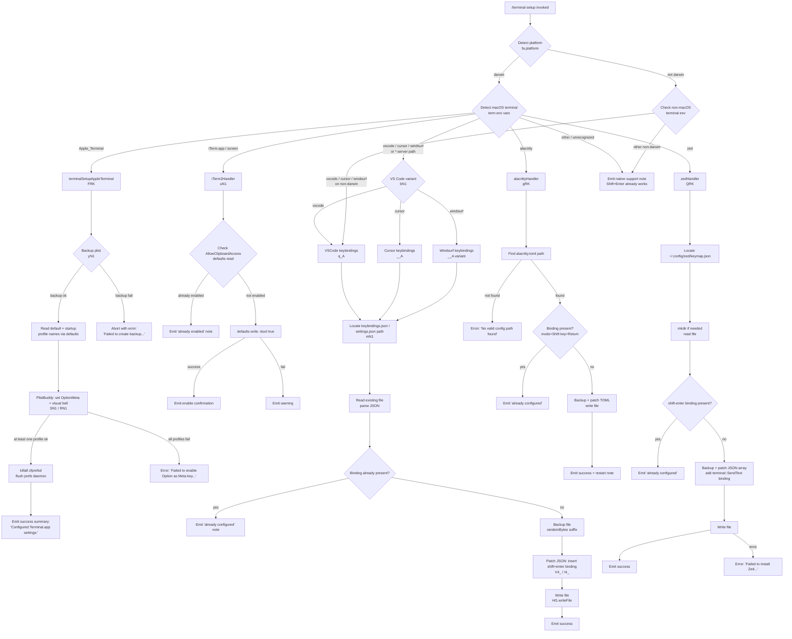

# `/terminal-setup`

> Analysis basis: CC v2.1.133 bundle.js (AST extraction + Claude interpretation)
> Minimum version: v2.1.133

---

## Overview

`/terminal-setup` detects the user's active terminal emulator and installs a Shift+Enter (or Option+Enter) key binding that sends a newline escape sequence to Claude Code's input field. The command supports multiple terminal targets — Apple Terminal.app, iTerm2, VS Code, Cursor, Windsurf, Alacritty, and Zed — and performs per-terminal configuration file manipulation including backup, patch, and atomic write operations. On macOS terminals where native Shift+Enter is not applicable, it modifies preference plists or JSON keymaps; on terminals already supporting Shift+Enter natively, it emits an informational note instead.

---

## Registration

| Field | Value |
|---|---|
| type | `local-jsx` |
| name | `terminal-setup` |
| description | `Install Shift+Enter key binding for newlines` |
| loc_byte | `11072068` |
| loc_byte_end | `11072606` |
| loc_line | `6864` |
| isHidden | `null` |
| module_id | `pN1` |
| load_inline | `true` |
| arbor_handler.name | `BRK` |
| arbor_handler.fqn | `claude-2.1.133::BRK` |
| arbor_handler.kind | `AsyncFunction` |
| arbor_handler.resolution_path | `module_id` |
| arbor_handler.n_hits | `1` |

Analysis basis: CC v2.1.133 bundle.js:+11072068

---

## Input Branching

The command branches across seven distinct terminal targets (plus a fallback path), making a Mermaid flowchart the appropriate representation.



Analysis basis: CC v2.1.133 bundle.js:+3764856 (handler entry `BRK`), +3762920 (platform detection), +3763179 (terminal dispatch `Xn6`)

---

## Behavioral Spec

### Top-level Handler (`BRK`)

The Arbor-resolved handler is `BRK` (AsyncFunction, resolved via `module_id` → `pN1`).

```
async function terminalSetupHandler(args, appState):
    platform = os.platform()                         // fa.platform
    terminalName = detectTerminal(platform)          // uN1 → returns descriptive name string
    emit dim-styled preamble with terminal name

    if platform == "darwin":
        run macOSDispatch(terminalName, appState)    // Xn6
    else:
        // non-darwin: only VS Code family handled
        run vscodeVariantDispatch(terminalName)      // subset of Xn6 paths

    emit contextual note about backslash+return or native support
```

Analysis basis: CC v2.1.133 bundle.js:+3764856 (`BRK` → `fa.platform`), +3765052 (`BRK` → `uN1`), +3766326 (`BRK` → `Xn6`)

---

### Terminal Detection (`uN1`)

```
function detectCurrentTerminal(platform):
    read relevant environment variables (TERM_PROGRAM, LC_TERMINAL, etc.)
    trim whitespace from values                      // _.trim
    resolve color-rendering capability              // K_
    match against known terminal identifiers:
        "iTerm.app" | "screen" → return "iTerm2"
        "Apple_Terminal"       → return "Apple_Terminal"
        others                 → return raw env value or "your current terminal"
    emit dim output of detected terminal name
    return terminal name string
```

Analysis basis: CC v2.1.133 bundle.js:+3763848 (`uN1` entry), +3763891 (`uN1` → `Y8` env read), +3763972 (`uN1` → `_.trim`), +3763996 (`uN1` → `K_` color resolve), +3764527 (`uN1` → `fH` log)

---

### macOS Dispatch (`Xn6`)

`Xn6` is the macOS-level dispatcher. It calls sub-handlers based on the detected terminal string:

```
async function macOSDispatch(terminalName, appState):
    if isRemoteVSCodeEnv(terminalName):              // bN1
        await vscodeSetup(terminalName)              // q_A or __A
    elif terminalName contains "Apple_Terminal":
        await appleTerminalSetup()                   // FRK
    elif terminalName contains "Cursor":
        await cursorSetup()                          // __A
    elif terminalName contains "Windsurf":
        await windsurfSetup()                        // __A variant
    elif terminalName contains "alacritty":
        await alacrittySetup()                       // gRK
    elif terminalName contains "zed":
        await zedSetup()                             // QRK
    else:
        emit note: terminals like iTerm2, WezTerm, Ghostty, Kitty, Warp,
                   Windows Terminal support Shift+Enter natively
```

Analysis basis: CC v2.1.133 bundle.js:+3763179 (`Xn6` → `FRK`), +3763213 (`Xn6` → `q_A`), +3763238 (`Xn6` → `__A`), +3763426 (`Xn6` → `gRK`), +3763457 (`Xn6` → `QRK`), +3763493 (`Xn6` → `e6`), +3763812 (`Xn6` → `guH`)

---

### Remote VS Code Detection (`bN1`)

```
function isRemoteVSCodeServer(terminalName):
    return terminalName.includes(".vscode-server")
        or terminalName.includes(".cursor-server")
        or terminalName.includes(".windsurf-server")
```

Analysis basis: CC v2.1.133 bundle.js:+3762497 (`bN1` → `H.includes` `.vscode-server`), +3762538 (`.cursor-server`), +3762568 (`.windsurf-server`)

---

### Apple Terminal Setup (`FRK`)

The most complex sub-handler. Operates on macOS Terminal.app preferences via `defaults` CLI and `/usr/libexec/PlistBuddy`.

```
async function appleTerminalSetup():
    // Step 1: Backup the plist
    backupResult = await backupTerminalPlist()       // yN1
    if backupResult indicates failure:
        throw Error("Failed to create backup of Terminal.app preferences, bailing out")
                                                     // loc_byte: 3770400

    // Step 2: Read default profile name
    defaultProfile = await runCommand(
        ["defaults", "read", "com.apple.Terminal", "Default Window Settings"]
    )                                               // Y8 at 3770495; literals: 3770510, 3770538
    if defaultProfile is empty after trim:
        throw Error("Failed to read default Terminal.app profile")
                                                     // loc_byte: 3770598

    // Step 3: Read startup profile name
    startupProfile = await runCommand(
        ["defaults", "read", "com.apple.Terminal", "Startup Window Settings"]
    )                                               // literals: 3770715
    if startupProfile is empty after trim:
        throw Error("Failed to read startup Terminal.app profile")
                                                     // loc_byte: 3770775

    // Step 4: Apply PlistBuddy changes to each unique profile
    successItems = []
    profileSet = deduplicate([defaultProfile, startupProfile])
    for each profile in profileSet:
        result = await applyPlistBuddySettings(profile)  // SN1 (enable OptionMeta) + RN1 (visual bell)
        if result ok:
            successItems.push(result)

    if successItems is empty:
        throw Error("Failed to enable Option as Meta key or disable audio bell for any Terminal.app profile")
                                                     // loc_byte: 3770985

    // Step 5: Flush preferences daemon
    await runCommand(["killall", "cfprefsd"])        // literals: 3771084, 3771095

    // Step 6: Emit success summary
    emit "success" styled "Configured Terminal.app settings:"  // loc_byte: 3771137
    if OptionMeta enabled:
        emit "- Enabled \"Use Option as Meta key\""  // loc_byte: 3771204
    if visual bell enabled:
        emit "- Switched to visual bell"             // loc_byte: 3771266
    emit "Shift+Return will now enter a newline."    // loc_byte: 3771311
    emit "Option+Enter will now enter a newline."    // loc_byte: 3771360
    emit "You must restart Terminal.app for changes to take effect."
                                                     // loc_byte: 3771445
```

Analysis basis: CC v2.1.133 bundle.js:+3770354 (`FRK` → `fq_`), +3770382 (`FRK` → `yN1`), +3770394 (`FRK` → `Error`), +3770495 (`FRK` → `Y8`), +3770855 (`FRK` → `SN1`), +3770870 (`FRK` → `RN1`), +3771084 (killall cfprefsd)

---

### Plist Backup (`yN1`)

```
async function backupTerminalPlist():
    plistPath = path.join(os.homedir(), "Library", "Preferences",
                          "com.apple.Terminal.plist")
                                                     // literals: 3759979, 3759989, 3760003
    stat = await fs.stat(plistPath)                  // sAA.stat at 3760179
    if stat fails:
        return { status: "no_backup" }               // literal: 3760386

    // Run: defaults export com.apple.Terminal <tmpfile>
    await runCommand(["defaults", "export", "com.apple.Terminal", tmpFile])
                                                     // literals: 3760102, 3760114, 3760123

    if export fails:
        return { status: "failed" }                  // literal: 3760595

    return { status: "ok", path: tmpFile }
```

Analysis basis: CC v2.1.133 bundle.js:+3760058 (`yN1` → `duH` homedir join), +3760179 (`yN1` → `sAA.stat`), +3760271 (`yN1` → `mRK` run command)

---

### PlistBuddy Profile Configurator (`SN1`, `RN1`)

```
async function enableOptionMeta(profileName):         // SN1
    cmd = ["/usr/libexec/PlistBuddy", "-c",
           "Set :Window\ Settings:<profileName>:useOptionAsMetaKey true",
           plistPath]
    result = await runCommand(cmd)
    if fails: return { status: "failed" }
    return { status: "ok", label: "Option as Meta" }

async function enableVisualBell(profileName):         // RN1
    cmd = ["/usr/libexec/PlistBuddy", "-c",
           "Set :Window\ Settings:<profileName>:Bell false",
           plistPath]
    result = await runCommand(cmd)
    if fails: return { status: "failed" }
    return { status: "ok", label: "visual bell" }
```

Analysis basis: CC v2.1.133 bundle.js:+3769640 (`SN1` → `Y8`), +3769643 (`/usr/libexec/PlistBuddy`), +3770019 (`RN1` → `Y8`), +3770102 (`RN1` → `duH`)

---

### VS Code / Cursor / Windsurf Keybindings — Install (`q_A`)

```
async function installVSCodeKeybinding(variant):
    // variant: "VSCode" | "Cursor" | "Windsurf"
    keybindingsPath = resolveVSCodeKeybindingsPath(variant)  // mN1
                                                     // mN1 → fa.homedir, fa.platform
    fs.mkdir(dir, { recursive: true })               // HG.mkdir at 3768450
    existing = await fs.readFile(keybindingsPath, "utf-8")
                                                     // HG.readFile at 3768510
              ?? "[]"                                // literal: 3768483

    parsed = parseJSON(existing)                     // nh8 → tN6/nh

    if binding for "shift+enter" already present:    // literal: 3768869
        emit "already configured"
        return

    // Backup existing file
    backupSuffix = crypto.randomBytes(n).toString("hex")
                                                     // IK6.randomBytes at 3768601
    await fs.copyFile(keybindingsPath, keybindingsPath + ".backup." + suffix)
                                                     // HG.copyFile at 3768664

    // Patch JSON: insert new binding entry
    newEntry = {
        key: "shift+enter",                          // literal: 3768869
        command: "workbench.action.terminal.sendSequence",
                                                     // literal: 3768891
        args: { text: "\x1b\r" },                   // literal: 3768943 (ESC + CR)
        when: "terminalFocus"                        // literal: 3768958
    }
    patched = jsonPatch(parsed, newEntry)            // V4_ at 3769347
    await fs.writeFile(keybindingsPath, patched)     // HG.writeFile at 3769369
    emit success
```

Analysis basis: CC v2.1.133 bundle.js:+3767749 (`q_A` → `bN1`), +3768401 (`q_A` → `mN1`), +3768420 (keybindings.json), +3768551 (`q_A` → `nh8`), +3768601 (randomBytes), +3768664 (copyFile), +3769347 (`q_A` → `V4_`), +3769369 (writeFile)

---

### VS Code Config Path Resolver (`mN1`)

```
function resolveVSCodeConfigPath(variant):
    platform = os.platform()
    if platform == "win32":
        base = path.join(os.homedir(), "AppData", "Roaming")
                                                     // literals: 3766458, 3766474, 3766484
    elif platform == "darwin":
        base = path.join(os.homedir(), "Library", "Application Support")
                                                     // literal: 3766547
    else:
        base = path.join(os.homedir(), ".config")    // literal: 3766587

    appDir = variant == "VSCode" ? "Code" :
             variant == "Cursor" ? "Cursor" :
             variant == "Windsurf" ? "Windsurf" : "Code"
                                                     // literals: 3766405, 3763285, 3763355
    return path.join(base, appDir, "User", "keybindings.json")
                                                     // literals: 3766496, 3768420
```

Analysis basis: CC v2.1.133 bundle.js:+3766421 (`mN1` → `QS.join`), +3766429 (`mN1` → `fa.homedir`), +3766442 (`mN1` → `fa.platform`), +3766458 (win32), +3766547 (Application Support)

---

### Cursor / Windsurf Settings Patch (`__A`)

Operates on `settings.json` (not `keybindings.json`) for Cursor and Windsurf variants. Follows the same backup → read → check-present → patch → write pattern as `q_A`, but targets a different file path and JSON key structure.

```
async function installCursorOrWindsurfBinding(variant):
    settingsPath = resolveSettingsPath(variant)      // mN1 variant → "settings.json"
                                                     // literal: 3766759
    existing = await fs.readFile(settingsPath) ?? "{}"
                                                     // literal: 3766786
    parsed = parseJSON(existing)                     // nh8

    if binding present:
        emit already configured
        return

    backupSuffix = crypto.randomBytes(...)           // IK6.randomBytes at 3767286
    await fs.copyFile(...)                           // HG.copyFile at 3767337
    patched = jsonPatch(parsed, newBindingEntry)     // I4_ at 3767162
    await fs.writeFile(settingsPath, patched)        // HG.writeFile at 3767473

    if error:
        emit warning "VSCode"                        // literals: 3767734, 3767767
```

Analysis basis: CC v2.1.133 bundle.js:+3766638 (`__A` → `M6.dim`), +3766714 (`__A` → `bN1`), +3766744 (`__A` → `QS.join`), +3766808 (`__A` → `HG.readFile`), +3767162 (`__A` → `I4_`), +3767473 (`__A` → `HG.writeFile`)

---

### Alacritty Setup (`gRK`)

```
async function alacrittySetup():
    candidates = [
        "~/.config/alacritty/alacritty.toml",
        "~/.alacritty.toml",
        ...
    ]
    configPath = candidates.find(p => fileExists(p))
    if not found:
        throw Error("No valid config path found for Alacritty")
                                                     // literal: 3772366

    content = await fs.readFile(configPath)          // HG.readFile at 3772253

    if content.includes('mods = "Shift"') and
       content.includes('key = "Return"'):           // literals: 3772434, 3772464
        emit "Alacritty Shift+Enter key binding already configured"
                                                     // literal: 3772507
        return

    // Backup
    suffix = crypto.randomBytes(...)                 // IK6.randomBytes at 3772606
    await fs.copyFile(configPath, backupPath)        // HG.copyFile at 3772669
    if backup fails:
        throw Error("Error backing up existing Alacritty config. Bailing out.")
                                                     // literal: 3772717

    // Append TOML keyboard section
    dir = path.dirname(configPath)                   // QS.dirname at 3772874
    await fs.mkdir(dir, { recursive: true })         // HG.mkdir at 3772865
    if content.endsWith("\n") → adjust
    await fs.writeFile(configPath, patchedContent)   // HG.writeFile at 3773035

    emit "Installed Alacritty Shift+Enter key binding"
                                                     // literal: 3773091
    emit "You may need to restart Alacritty for changes to take effect"
                                                     // literal: 3773161
    if error:
        emit "Failed to install Alacritty Shift+Enter key binding"
                                                     // literal: 3773289
```

Analysis basis: CC v2.1.133 bundle.js:+3771976 (`gRK` → `_.push`), +3772044 (`gRK` → `fa.homedir`), +3772101 (`gRK` → `fa.platform`), +3772253 (`gRK` → `HG.readFile`), +3772315 (`gRK` → `Z9`), +3772423 (`gRK` → `K.includes`)

---

### Zed Setup (`QRK`)

```
async function zedSetup():
    keymapPath = path.join(os.homedir(), ".config", "zed", "keymap.json")
                                                     // QS.join + fa.homedir at 3773373/3773381
    await fs.mkdir(dir, { recursive: true })         // HG.mkdir at 3773448
    existing = await fs.readFile(keymapPath) ?? "[]"
    parsed = JSON.parse(existing)                    // p6 at 3773979; HG.readFile at 3773503

    if not Array.isArray(parsed):
        parsed = []

    if any entry has binding "shift-enter":          // literal: 3773589
        emit "Zed Shift+Enter key binding already configured"
                                                     // literal: 3773629
        return

    // Backup
    suffix = crypto.randomBytes(...)                 // IK6.randomBytes at 3773722
    await fs.copyFile(keymapPath, backupPath)        // HG.copyFile at 3773785
    if backup fails:
        throw Error("Error backing up existing Zed keymap. Bailing out.")
                                                     // literal: 3773833

    // Append binding entry
    newEntry = {
        context: "Terminal",                         // literal: 3774042
        bindings: {
            "shift-enter": "terminal::SendText",     // literals: 3773589, 3774078
            // args: "\x1b\r" (ESC CR escape sequence)
        }
    }
    parsed.push(newEntry)                            // K.push at 3774026
    serialized = JSON.stringify(parsed, null, 2)     // SH at 3774133
    await fs.writeFile(keymapPath, serialized)       // HG.writeFile at 3774118

    emit "Installed Zed Shift+Enter key binding"     // literal: 3774189
    if error:
        emit "Failed to install Zed Shift+Enter key binding"
                                                     // literal: 3774294
```

Analysis basis: CC v2.1.133 bundle.js:+3773373 (`QRK` → `QS.join`), +3773503 (`QRK` → `HG.readFile`), +3773555 (`QRK` → `Z9`), +3773578 (`QRK` → `q.includes`), +3773613 (`QRK` → `K_`), +3774026 (`QRK` → `K.push`), +3774133 (`QRK` → `SH`)

---

### iTerm2 Setup (`uN1` path for iTerm2)

When the detected terminal is `iTerm2`, the handler calls `defaults` to enable clipboard access rather than installing a key binding (iTerm2 handles Shift+Enter natively).

```
async function iTerm2Setup():
    result = await runCommand(
        ["defaults", "read", "com.googlecode.iterm2", "AllowClipboardAccess"]
    )                                               // literals: 3763913, 3763937
    if result == "1" or "yes" or "on":
        emit "iTerm2 clipboard access already enabled"
                                                     // literal: 3764012
        return

    writeResult = await runCommand([
        "defaults", "write",
        "com.googlecode.iterm2", "AllowClipboardAccess",
        "-bool", "true"
    ])                                              // literals: 3764100, 3764155
    if writeResult fails:
        emit warning "Couldn't update iTerm2 clipboard setting."
                                                     // literal: 3764206
        return

    emit "Enabled \"Applications in terminal may access clipboard\" in iTerm2"
                                                     // literal: 3764297
    emit "Restart iTerm2 for this to take effect. Undo: defaults write ..."
                                                     // literal: 3764380
```

Analysis basis: CC v2.1.133 bundle.js:+3763848 (`uN1`), +3763891 (`uN1` → `Y8`), +3763913 (com.googlecode.iterm2), +3764012 (already enabled message), +3764957 (iTerm.app literal), +3765006 (screen literal)

---

### Shell Command Runner (`Y8` / `GA`)

Internal utility used by multiple sub-handlers to execute system commands.

```
async function runShellCommand(argv, options):
    spawn process with argv                          // GA
    collect stdout / stderr
    wait for exit code
    if exitCode != 0:
        log error via logError
    return { stdout, stderr, exitCode }
```

- Timeout constant observed at depth-2 call site: 10 (units: <!-- TODO: not found in depth-2 traversal; needs --depth 4 -->)
- Concurrent-execution limit: 1,000,000 (internal semaphore) — Analysis basis: CC v2.1.133 bundle.js:+989587
- Queue management: `NJL` rotates a fixed-size queue via `AN6.shift` / `AN6.push` — Analysis basis: CC v2.1.133 bundle.js:+912141, +912153

Analysis basis: CC v2.1.133 bundle.js:+3760099 (`yN1` → `Y8`), +989120 (`GA` depth-2 entry), +989626 (1,000,000 constant), +989763, +989819, +989942

---

### JSON Patch Helper (`V4_`, `I4_`)

Both `V4_` and `I4_` implement a structured JSON patch operation used when modifying keybinding arrays.

```
function patchJSONArray(existingText, newEntry):
    trimmed = existingText.trim()                    // H.trim at 1032267
    serialized = JSON.stringify(newEntry)            // SH at 1032288
    // Normalize existing JSON structure via nh / tN6
    // Check if Array.isArray
    if is array:
        use ch8 (insert operation) to append entry  // ch8 at 1032362
    else:
        use lh8 (modify operation) to set entry     // lh8 at 1032516
    return patched JSON string
```

Analysis basis: CC v2.1.133 bundle.js:+1032267 (`V4_` → `H.trim`), +1032288 (`V4_` → `SH`), +1032309 (`V4_` → `nh`), +1032327 (`V4_` → `Array.isArray`), +1031953 (`I4_` → `H.trim`)

---

### Color / Dim Rendering (`K_`, `a5H`)

Used throughout to render dim-styled terminal output for progress messages.

```
function renderColorSegment(text, colorSpec):
    if colorSpec.startsWith("foreground"):           // literal: 3553244
        apply foreground color
    elif colorSpec.startsWith("rgb("):               // literal: 3553301
        parse r,g,b and apply M6.rgb
    elif colorSpec.startsWith("ansi256("):           // literal: 3553342
        parse index and apply M6.ansi256
    elif colorSpec.startsWith("ansi:"):              // literal: 3553368
        map named color to M6 method
    else:
        apply M6.dim or named color method
    return styled string
```

Analysis basis: CC v2.1.133 bundle.js:+3553288 (`K_` → `H.startsWith`), +3553384 (`K_` → `a5H`), +3227667 (`a5H` → `A.startsWith`), +3227748 (`a5H` → `M6.black`)

---

### Onboarding Hook (`guH`)

After the core setup completes, `guH` is invoked to record onboarding state.

```
function recordOnboardingComplete(appState):
    telemetryEvent = "onboarding_project_complete"   // literal: 3759317
    update appState via dM (state mutation)          // dM at 3759212
    register new project context via IN1 / aAA       // IN1 at 3759257
    log config change via G$ (config writer)         // G$ at 3759263
    update hook state via hH                         // hH at 3759314
```

Analysis basis: CC v2.1.133 bundle.js:+3763812 (`Xn6` → `guH`), +3759212 (`guH` → `dM`), +3759257 (`guH` → `IN1`), +3759263 (`guH` → `G$`), +3759314 (`guH` → `hH`), +3759317 (onboarding_project_complete literal)

---

## State & Side Effects

| Item | Detail |
|---|---|
| Telemetry | `tengu_config_auth_loss_prevented` (bundle.js:+3108610), `tengu_bg_spare_enable` (+14156457), `tengu_bg_low_mem_mb` (+14156207), `tengu_bg_spare_spawn` (+14156817), `tengu_config_lock_contention` (+3111273), `tengu_config_stale_write` (+3111409), `tengu_config_parse_error` (+3113854), `tengu_feature_ok` (+907381) |
| Filesystem writes | Modifies `~/Library/Preferences/com.apple.Terminal.plist` (via `defaults export`), `keybindings.json` or `settings.json` (VS Code family), `~/.config/alacritty/alacritty.toml`, `~/.config/zed/keymap.json`. All writes are preceded by a random-suffix backup copy. |
| Backup files | Created via `HG.copyFile` / `IK6.randomBytes`; suffix format `.backup.<hex>`. Existing backup is never overwritten. |
| Process spawning | Spawns `defaults`, `/usr/libexec/PlistBuddy`, and `killall cfprefsd` on macOS. |
| appState changes | `onboarding_project_complete` state flag set via `guH` → `dM` on completion. |
| Config lock | Uses file-based config locking (`fe8` / `G$`); emits `tengu_config_lock_contention` when acquisition exceeds threshold. Lock timeout: 60,000 ms (bundle.js:+3111954). |
| Sound | No sound side effects found in depth-2 traversal. |
| Hook registration | `guH` → `IN1` → `aAA` registers/updates a project context entry referencing `CLAUDE.md` (literal: +3758805) and `workspace` scope (literal: +3758843). |

---

## Version History

| Version | Change |
|---|---|
| v2.1.133 | Initial analysis. Supports Apple Terminal, iTerm2, VS Code, Cursor, Windsurf, Alacritty, and Zed. |

---

## Common Mistakes

1. **Running on a non-macOS terminal that is already natively supported** — iTerm2, WezTerm, Ghostty, Kitty, Warp, and Windows Terminal handle Shift+Enter without any configuration. Running `/terminal-setup` on these terminals will emit only an informational note; no changes are made. (bundle.js:+3766184)

2. **Forgetting to restart the terminal after setup** — Apple Terminal.app changes require a full restart (`tengu_config_auth_loss_prevented` flush via `killall cfprefsd` is automatic, but the UI restart is not). The command always emits the restart reminder at bundle.js:+3771445. Alacritty similarly may require a restart (bundle.js:+3773161).

3. **Invoking on Apple Terminal without plist write permissions** — If `defaults export` fails, the command aborts before making any changes (`no_backup` / `failed` states at bundle.js:+3760386, +3760595). No partial writes occur.

4. **Expecting VS Code remote-server environments to behave like local VS Code** — When the terminal reports `.vscode-server`, `.cursor-server`, or `.windsurf-server` in its path, `bN1` redirects to the server-side keybinding path (`q_A`), which writes to the remote user's config directory, not the local machine.

5. **Assuming the binding survives a VS Code keybindings reset** — The command writes to `keybindings.json` directly. Any VS Code operation that resets or overwrites this file will remove the installed binding without warning.

6. **Multiple Claude instances contending on config lock** — If another Claude Code instance is running simultaneously, `tengu_config_lock_contention` may fire and the config write may be delayed or skipped with a stale-write guard (bundle.js:+3111184, +3111409).

---

## Appendix — Identifier Mapping

> For bundle debugging only. Identifiers change across versions.

| Identifier | Role |
|---|---|
| `BRK` | Top-level `/terminal-setup` async handler (Arbor-resolved) |
| `Xn6` | macOS terminal dispatch router |
| `FRK` | Apple Terminal.app setup (plist + PlistBuddy) |
| `yN1` | Apple Terminal plist backup helper |
| `mRK` | Shell command execution wrapper (inner) |
| `duH` | Home-directory path joiner |
| `SN1` | PlistBuddy: enable Option-as-Meta-key per profile |
| `RN1` | PlistBuddy: enable visual bell per profile |
| `QuH` | Command result accumulator / output buffer |
| `Dn6` | Plist import/restore helper for backup rollback |
| `pRK` | Plist restore orchestrator |
| `uN1` | Terminal name detector + iTerm2 clipboard setup |
| `Yn6` | Terminal identification utility |
| `t2H` | Platform check helper (darwin gate) |
| `q_A` | VS Code keybindings.json patch installer |
| `__A` | Cursor / Windsurf settings.json patch installer |
| `bN1` | Remote VS Code server environment detector |
| `mN1` | VS Code-family config path resolver |
| `gRK` | Alacritty TOML key binding installer |
| `QRK` | Zed keymap.json binding installer |
| `guH` | Onboarding completion hook registrar |
| `dM` | App state mutation handler |
| `IN1` | Project context registration helper |
| `aAA` | CLAUDE.md / workspace context builder |
| `IN6` | Context entry constructor |
| `G$` | Config file writer with lock |
| `fe8` | Config file read/write with lock and backup |
| `hH` | Hook state updater |
| `Y8` | Shell command runner (async, with semaphore) |
| `GA` | Process spawner (low-level) |
| `N6` | Command queue manager |
| `NJL` | Sliding-window queue rotate (shift/push) |
| `K_` | Color-spec string renderer |
| `a5H` | ANSI / named-color / RGB / hex style applicator |
| `M6` | Chalk-style color library reference |
| `V4_` | JSON array patch helper (VS Code keybindings) |
| `I4_` | JSON object patch helper (Cursor/Windsurf settings) |
| `ch8` | JSON insert-operation executor |
| `X4_` | JSON node insertion logic |
| `lh8` | JSON slice/modify operation executor |
| `sN6` | JSON substring replacement utility |
| `nh8` | JSON parse with error fallback |
| `nh` | JSON comment-strip / normalize prefix |
| `Z9` | Error code classifier (ENOENT, EACCES, etc.) |
| `w8` | Error code string matcher |
| `dS` | File URL conversion helper |
| `s0` | Platform integer parser |
| `SH` | JSON.stringify wrapper |
| `p6` | JSON.parse wrapper |
| `e6` | Global config save with auth-loss guard |
| `fH` | Structured logger |
| `HA` | Error formatter |
| `kH` | String coercion helper |
| `yq` | Network traffic classifier |
| `R6` | Telemetry event emitter |
| `MxH` | Timestamp recorder |
| `m5H` | Config file reader with parse and backup |
| `Me8` | Backup directory path builder |
| `KhH` | Atomic file write with permission preservation |
| `lq6` | Config lock acquire/release |
| `d` | Async delay / sleep |
| `Ke8` | Config file atomic overwrite |
| `ql_` | Object assign merger |
| `k` | Log entry formatter |
| `fxH` | Log level filter |
| `J6` | Background spare process launcher |
| `_d6` | Spare process deduplication tracker |
| `XDq` | Process disposal handler |
| `sFA` | Spare process factory |
| `lFA` | Background daemon spawner (Bun.spawn) |
| `h9` | Daemon config builder |
| `Qe9` | Spare socket path resolver |
| `de9` | Daemon socket path resolver |
| `Yg` | Base socket path builder |
| `hd7` | Daemon metadata builder |
| `vd7` | Daemon environment builder |
| `_N` | Daemon log reader |
| `Y` | Spare process record / lifecycle manager |
| `$` | Process disposal wrapper |
| `Bq6` | Spawn configuration builder |
| `gq6` | Spare process pool accessor |
| `Po` | Process handle wrapper |
| `M_A` | Telemetry emitter variant A |
| `K_A` | Telemetry emitter variant B |
| `f_A` | Telemetry emitter variant C |
| `L_A` | Telemetry emitter variant D |

---

> Note: index built via Arbor fallback; some signals (telemetry, literals) may be missing — see arbor-fallback.js.