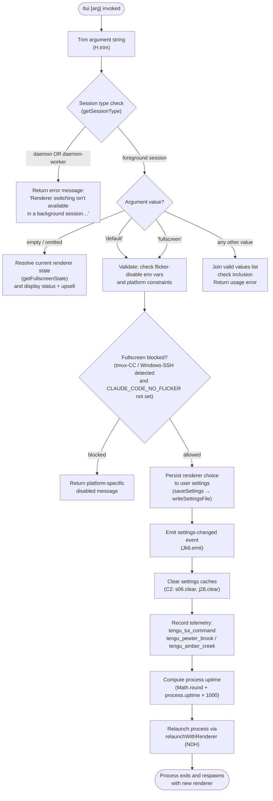

# `/tui`

> Analysis basis: CC v2.1.132 bundle.js (AST extraction + Claude interpretation)
> Minimum version: v2.1.132

---

## Overview

The `/tui` slash command allows the user to switch between the two available terminal UI rendering modes — `default` and `fullscreen` — at runtime without restarting Claude Code. It validates the requested mode against a set of environment and platform constraints, persists the selection to user settings, and then relaunches the CLI process so that the new renderer takes effect immediately.

---

## Registration

| Field | Value |
|---|---|
| type | `local` |
| name | `tui` |
| description | `Set the terminal UI renderer (default \| fullscreen)` |
| argumentHint | `[default\|fullscreen]` |
| supportsNonInteractive | `false` |
| module_id | `$5q` |

Analysis basis: CC v2.1.132 bundle.js:+11075045

---

## Input Branching

The command handler (`$$7`) first trims the raw argument string, then routes execution through several validation and persistence stages before triggering a process relaunch.



Analysis basis: CC v2.1.132 bundle.js:+11073687 (trim), +11073827 (join/includes), +11073960 (session-type gate), +11073990 (background-session error string), +11074371 (settings persist entry), +11074379 (telemetry), +11074442 (uptime), +11074755 (relaunch)

---

## Behavioral Spec

### 1. Argument Normalisation

```
function normaliseArgument(rawInput):
    trimmed = rawInput.trim()
    return trimmed
```

The raw CLI argument is whitespace-stripped before any further processing.

Analysis basis: CC v2.1.132 bundle.js:+11073687

---

### 2. Valid-Mode List and Inclusion Check

```
VALID_MODES = ["default", "fullscreen"]

function validateMode(trimmedArg):
    if trimmedArg not in VALID_MODES:
        return error("Expected one of: " + VALID_MODES.join(" | "))
    return ok(trimmedArg)
```

The valid-mode array is joined for display and checked via `.includes()`.

Analysis basis: CC v2.1.132 bundle.js:+11073827 (join), +11073849 (includes)

---

### 3. Background-Session Guard

```
function checkSessionType(sessionType):
    BLOCKED_TYPES = ["daemon", "daemon-worker"]
    if sessionType in BLOCKED_TYPES:
        return error(
            "Renderer switching isn't available in a background session " +
            "— press ← to detach and run /tui from a foreground session."
        )
    return ok
```

- Blocked session types: `"daemon"` (bundle.js:+2121050) and `"daemon-worker"` (bundle.js:+2121064).
- Error string literal: bundle.js:+11073990.

Analysis basis: CC v2.1.132 bundle.js:+11073960

---

### 4. Fullscreen Eligibility Resolution

The `getFullscreenState` function (`u5H`) computes an eligibility descriptor that captures why fullscreen may be forced on or off. The function internally calls `resolveFullscreenEnvFlags` (`Ne8`), `resolveSettingValue` (`Id`), and `resolveOsConstraints` (`oq6`), producing one of the following named states:

| State key | Meaning |
|---|---|
| `env_off` | `CLAUDE_CODE_DISABLE_ALTERNATE_SCREEN` env var is set |
| `env_on` | `CLAUDE_CODE_NO_FLICKER` env var overrides platform blocks |
| `tmux_cc_auto_off` | tmux `-CC` (iTerm2 integration) detected; fullscreen suppressed |
| `win_ssh_auto_off` | Windows-over-SSH (ConPTY) detected; fullscreen suppressed |
| `bg_forced_on` | Background/flag setting forces fullscreen on |
| `settings_on` | User settings explicitly enable fullscreen |
| `settings_off` | User settings explicitly disable fullscreen |
| `downsell_on` | Fullscreen upsell/downsell logic active |
| `gb_on` | Gradual-rollout bucket: fullscreen on |
| `gb_off` | Gradual-rollout bucket: fullscreen off |

Analysis basis: CC v2.1.132 bundle.js:+3189308 (Ne8 call), +3189390 (Id call), +3189424 (oq6 call), +3189320 (`env_off`), +3189378 (`env_on`), +3189402 (`tmux_cc_auto_off`), +3189436 (`win_ssh_auto_off`), +3189508 (`bg_forced_on`), +3189563 (`settings_on`), +3189597 (`settings_off`), +3189670 (`downsell_on`), +3189735 (`gb_on`), +3189743 (`gb_off`)

---

### 5. Platform Fullscreen-Block Detection

```
function resolveOsConstraints(platform):
    if platform == "windows":
        return { blocked: true,
                 reason: "fullscreen disabled: Windows over SSH (ConPTY re-rendering) detected " +
                         "· set CLAUDE_CODE_NO_FLICKER=1 to override" }
    if tmuxCCDetected():
        return { blocked: true,
                 reason: "fullscreen disabled: tmux -CC (iTerm2 integration mode) detected " +
                         "· set CLAUDE_CODE_NO_FLICKER=1 to override" }
    return { blocked: false }
```

- tmux-CC block message: bundle.js:+3188549
- Windows-SSH block message: bundle.js:+3188735
- Platform string `"windows"`: bundle.js:+3188143
- The `CLAUDE_CODE_NO_FLICKER` env var overrides both blocks: bundle.js:+11074830

Analysis basis: CC v2.1.132 bundle.js:+3188675 (oq6), +3188143, +3188549, +3188735

---

### 6. Settings Persistence

```
function persistRendererChoice(mode):
    # mode is "fullscreen" or "default"
    settingsKey = "tui"          # stored under user settings layer
    settingsValue = mode
    writeSettingsFile(userSettingsPath, { tui: settingsValue })
    emitSettingsChangedEvent()
    clearSettingsCache()
```

Settings layers consulted / written (from literals):

| Layer | File |
|---|---|
| userSettings | `~/.claude/settings.json` (bundle.js:+1158044, +1158288, +1158298) |
| projectSettings | `.claude/settings.json` (bundle.js:+1158092) |
| localSettings | `.claude/settings.local.json` (bundle.js:+1158114, +1158360) |
| policySettings | policy layer (bundle.js:+1159426) |
| flagSettings | flag layer (bundle.js:+1159448) |

The `/tui` command writes exclusively to the **userSettings** layer.

The atomic write path (`QyH`) uses:
- `randomBytes` (6 bytes, hex-encoded) for temp-file naming: bundle.js:+952797, +952813, +952825
- `fchmodSync` to copy original permissions to the temp file: bundle.js:+953291
- `fsyncSync` to flush before rename: bundle.js:+953357
- `renameSync` for atomic swap: bundle.js:+953485
- `unlinkSync` on failure cleanup: bundle.js:+953642

Analysis basis: CC v2.1.132 bundle.js:+11074268 (CA entry), +1160289 (ub — settings load), +1160313 (Jk6.emit — event emit), +1160139 (C2 — cache clear)

---

### 7. Settings Cache Invalidation

```
function clearSettingsCache():
    primaryCache.clear()    # s06
    secondaryCache.clear()  # j28
```

Both in-memory caches are cleared immediately after the write so that subsequent reads within the same process lifetime (before relaunch completes) do not serve stale data.

Analysis basis: CC v2.1.132 bundle.js:+24901 (s06.clear), +24913 (j28.clear)

---

### 8. Terminal Capability Detection (used by eligibility resolver)

The `resolveTerminalCapabilities` function (`Cd`) checks the following terminal emulator identifiers:

| Identifier string | loc_byte |
|---|---|
| `"xterm.js"` | +3268735 |
| `"JetBrains-JediTerm"` | +3270620 |
| `"cursor"` | +3270754 |
| `"vscode"` | +3270803 |

Version thresholds used during capability checks:

- Lower bound: `1092000` (bundle.js:+3270873)
- Upper bound: `1105000` (bundle.js:+3270884)

Numeric limits inside `resolveTerminalScore` (`CTK`):
- Minimum score floor: `3` (bundle.js:+3271094)
- Maximum score cap: `20` (bundle.js:+3271214)
- Uses `parseFloat` → `Number.isNaN` guard → `Math.min` clamp: bundle.js:+3271158, +3271179, +3271203

Platform strings checked: `"darwin"` (bundle.js:+3270210), `"win32"` (bundle.js:+3270257).

The string `"unset"` is used as a sentinel when a terminal variable is absent: bundle.js:+3270382.

Analysis basis: CC v2.1.132 bundle.js:+11074371 (Cd call)

---

### 9. Process Relaunch Sequence

```
function relaunchWithRenderer(targetMode):
    # 1. Stat the current bundle file to confirm it exists
    stat(currentBundlePath)

    # 2. Flush pending output
    unmountCurrentRenderer()     # WUH: H.unmount
    writeSync(stdout, "")        # WUH: XUH.writeSync

    # 3. Gather scroll summary telemetry
    emit("tengu_scroll_summary")

    # 4. Set renderer state for resumed session
    setRendererFlag(targetMode)  # ft6 → r_

    # 5. Await concurrent cleanup tasks with timeouts
    Promise.all([
        withTimeout(flushLogs(),   30000),   # "flush timeout (relaunch)"
        withTimeout(cleanup(),      2000),   # "cleanup timeout"
    ])

    # 6. Remove existing signal handlers; re-register for relaunch
    process.removeAllListeners("SIGINT")
    process.removeAllListeners("SIGTERM")
    process.removeAllListeners("SIGHUP")
    process.on("SIGINT",  ignoreSignal)
    process.on("SIGTERM", ignoreSignal)

    # 7. Spawn successor process
    childProcess = L5q.spawnSync(
        "claude",           # argv[0]
        ["--resume", ...],  # pass --resume flag
        { stdio: "inherit" }
    )

    # 8. On spawn failure, write error marker and exit 128
    if spawnFailed:
        writeFileSync(errorMarkerPath, "relaunch_spawn_error")
        process.exit(128)

    # 9. Normal exit — signal parent if needed
    process.kill(process.pid, exitSignal)
    process.exit(childProcess.status)
```

Key literals:

| Literal | Value | loc_byte |
|---|---|---|
| Flush timeout | `30000` ms | +11072520 |
| Flush timeout label | `"flush timeout (relaunch)"` | +11072526 |
| Cleanup timeout | `2000` ms | +11072577 |
| Cleanup timeout label | `"cleanup timeout"` | +11072582 |
| Resume flag | `"--resume"` | +11072458 |
| Spawn stdio | `"inherit"` | +11072966 |
| Process argv[0] | `"claude"` | +7746108 |
| Error marker string | `"relaunch_spawn_error"` | +11073160 |
| Exit code on spawn failure | `128` | +11073297 |
| Signal: SIGINT | `"SIGINT"` | +11072845 |
| Signal: SIGTERM | `"SIGTERM"` | +11072854 |
| Signal: SIGHUP | `"SIGHUP"` | +11072864 |
| beforeExit event | `"beforeExit"` | +11073024 |
| exit event | `"exit"` | +11073065 |

Analysis basis: CC v2.1.132 bundle.js:+11072329 (Cy — path helpers), +11072405 (stat), +11072481 (WUH — unmount/flush), +11072487 (ft6 — scroll summary), +11072499 (Promise.all), +11072512 (nM — timeout race), +11072874 (removeAllListeners), +11072904 (process.on), +11072931 (spawnSync), +11073157 (AZ — error marker write), +11073184 (process.exit), +11073249 (process.kill)

---

### 10. Uptime Measurement

```
function measureUptime():
    uptimeSeconds = process.uptime()
    uptimeMs      = Math.round(uptimeSeconds * 1000)
    return uptimeMs
```

Uptime multiplier: `1000` (bundle.js:+11074470). The result is attached to the `tengu_tui_command` telemetry event.

Analysis basis: CC v2.1.132 bundle.js:+11074442 (Math.round), +11074453 (process.uptime), +11074470 (constant 1000)

---

### 11. Environment Variable Overrides

| Environment variable | Effect | loc_byte |
|---|---|---|
| `CLAUDE_CODE_NO_FLICKER` | Overrides tmux-CC and Windows-SSH auto-blocks; forces fullscreen eligible | +11074830 |
| `CLAUDE_CODE_DISABLE_ALTERNATE_SCREEN` | Forces renderer to `default` regardless of settings | +11074855 |
| `CLAUDE_CODE_FORCE_FULLSCREEN_UPSELL` | Forces the fullscreen upsell/promotion UI to appear | +11074894 |

Analysis basis: CC v2.1.132 bundle.js:+11074830, +11074855, +11074894

---

## State & Side Effects

| Item | Detail |
|---|---|
| Telemetry: `tengu_tui_command` | Fired on every `/tui` invocation; carries uptime and chosen mode. bundle.js:+11074381 |
| Telemetry: `tengu_pewter_brook` | Fired during renderer-state resolution (fullscreen eligibility path). bundle.js:+3189030 |
| Telemetry: `tengu_amber_creek` | Fired during renderer-state resolution (alternate eligibility branch). bundle.js:+3189122 |
| Telemetry: `tengu_scroll_summary` | Fired immediately before process relaunch to flush scroll metrics. bundle.js:+5043828 |
| Settings write | Atomically writes chosen renderer to `~/.claude/settings.json` via temp-file + rename. |
| Cache invalidation | Clears two in-memory settings caches (`s06`, `j28`) after write. bundle.js:+24901, +24913 |
| Event emission | `Jk6.emit` broadcasts a settings-changed notification to in-process subscribers. bundle.js:+1160313 |
| Signal handler replacement | Removes all existing SIGINT/SIGTERM/SIGHUP listeners and replaces them with no-ops before spawning the successor process. bundle.js:+11072874, +11072904 |
| Process exit | The current process exits (code derived from child status or `128` on spawn failure) and a successor `claude --resume` process is spawned with inherited stdio. bundle.js:+11073184, +11073249 |
| Sound | <!-- TODO: not found in depth-2 traversal; needs --depth 4 --> |
| appState changes | <!-- TODO: not found in depth-2 traversal; needs --depth 4 --> |

---

## Version History

| Version | Change |
|---|---|
| v2.1.132 | Initial analysis |

---

## Common Mistakes

1. **Running `/tui` inside a background (daemon) session.** The command immediately returns an error and performs no action. Detach from the background session first (press `←`) and re-run `/tui` from a foreground interactive session. (bundle.js:+11073990)

2. **Expecting an in-process renderer switch.** `/tui` always relaunches the entire `claude` process with `--resume`. Any unsaved in-memory state that is not flushed before the relaunch (within the 30-second flush window) may be lost. (bundle.js:+11072520)

3. **Setting `CLAUDE_CODE_DISABLE_ALTERNATE_SCREEN` and then requesting `fullscreen`.** The environment variable takes precedence over user settings, so the written setting is effectively overridden until the variable is unset. (bundle.js:+11074855)

4. **Passing an unrecognised argument.** Any value other than `default` or `fullscreen` is rejected with a usage error listing the valid options. No settings are written and no relaunch occurs. (bundle.js:+11073849)

5. **Assuming fullscreen is always available on macOS/Linux.** If `tmux -CC` (iTerm2 integration mode) is active, fullscreen is automatically suppressed. Set `CLAUDE_CODE_NO_FLICKER=1` to override this behaviour. (bundle.js:+3188549)

---

## Appendix — Identifier Mapping

> For bundle debugging only. Identifiers change across versions.

| Identifier | Role |
|---|---|
| `$$7` | `/tui` command handler (top-level entry point) |
| `H` | Random/timer utility (Math.random + setTimeout host) |
| `uA` | Load settings from disk |
| `ub` | Settings loader core (dispatches to Kp, _2L, $q, ZdA) |
| `r_` | Renderer eligibility resolver (main branch dispatcher) |
| `jyH` | Local-agent type checker (aDL.has lookup) |
| `Ne8` | Fullscreen environment-flag resolver |
| `yH` | Value-to-string coercion helper |
| `Id` | Settings-value reader (calls PWK) |
| `k` | Log/debug writer (handles "debug" level, trim, format) |
| `oq6` | OS/platform constraint resolver (Boolean + s6) |
| `WWK` | Renderer-mode persistence wrapper (calls j6) |
| `j6` | Core renderer-state writer (hq6, Rq6, Oo, V5H, uQ6, kq6, mU, R6) |
| `G9` | Session-type getter (calls Tr; returns "daemon"/"daemon-worker"/foreground) |
| `Tr` | Session-type primitive reader |
| `u5H` | Full fullscreen-state resolver (aggregates env, settings, OS, bucket) |
| `CA` | Settings persistence orchestrator (write + emit + cache-clear) |
| `EO` | Settings file builder / serialiser |
| `F6` | File-existence checker |
| `G7_` | Settings object merger (Object.keys iteration over layers) |
| `wE` | Write-path helper (calls bp) |
| `D8` | ENOENT-tolerant file reader (j8 wrapper) |
| `Wh8` | Timestamp recorder (xN6.set + Date.now) |
| `E6H` | Settings file path resolver (MX.resolve + ULH + MX.dirname) |
| `QyH` | Atomic file writer (temp-file + fchmod + fsync + rename) |
| `RH` | JSON serialiser wrapper (JSON.stringify) |
| `C2` | Settings cache invalidator (s06.clear + j28.clear) |
| `NN6` | Log/settings file appender (cKH.mkdir/readFile/appendFile/writeFile) |
| `xb` | Settings directory path builder (MX.join + ".claude") |
| `_A` | Home-directory resolver |
| `fH` | Error logger (EQ.logError + kyH.push) |
| `Cd` | Terminal capability detector (xterm.js, JetBrains, cursor, vscode) |
| `_c6` | Terminal query primitive |
| `VwH` | Terminal variable reader |
| `EHA` | Terminal capability branch handler (calls RTK) |
| `n5H` | Terminal info aggregator |
| `GHA` | Terminal environment inspector |
| `CTK` | Terminal score calculator (parseFloat + isNaN + Math.min, cap 20) |
| `d` | Telemetry event emitter |
| `NDH` | Process relaunch orchestrator (stat → flush → spawn → exit) |
| `Cy` | Claude process path resolver (dO6.join + rs + dM) |
| `Bl` | Bundle/executable path accessor |
| `v6` | Pre-relaunch state serialiser |
| `Ef6` | Pre-relaunch state writer (Z5A) |
| `WUH` | Renderer unmount + stdout flush (XUH.writeSync + H.unmount + mk + nc6) |
| `ft6` | Scroll-summary telemetry flusher (tT + Rr1 + Sr1 + r_) |
| `nM` | Timeout-race utility (setTimeout + Promise.race + clearTimeout) |
| `RT` | Signal-handling setup (hK) |
| `ENH` | Concurrent cleanup runner (Promise.all + Array.from) |
| `xhA` | Successor process environment builder (Bl + _A + M5q.dirname + f$ + mK) |
| `AZ` | Spawn-error marker writer (FNH.writeFileSync + IG8.join) |