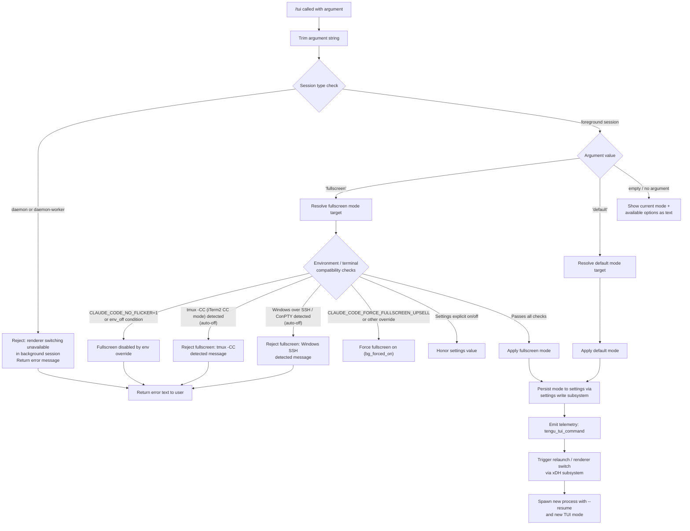

# `/tui`

> Analysis basis: CC v2.1.133 bundle.js (AST extraction + Claude interpretation)
> Minimum version: v2.1.133

---

## Overview

The `/tui` command allows users to switch the terminal UI renderer between `default` and `fullscreen` modes at runtime. It inspects the current session context, environment variables, and terminal capabilities before applying or refusing the mode change. When a renderer switch is accepted, the command relaunches the Claude Code process with the new rendering mode active.

---

## Registration

| Field | Value |
|---|---|
| `type` | `local` |
| `name` | `tui` |
| `description` | `Set the terminal UI renderer (default \| fullscreen)` |
| `argumentHint` | `[default\|fullscreen]` |
| `supportsNonInteractive` | `false` |
| `module_id` | `g5q` |
| `load_inline` | `true` |
| `loc_byte` | `11092290` |
| `loc_byte_end` | `11092494` |
| `loc_line` | `6867` |
| `arbor_handler.name` | `mO7` |
| `arbor_handler.fqn` | `claude-2.1.133::mO7` |
| `arbor_handler.kind` | `AsyncFunction` |
| `arbor_handler.resolution_path` | `module_id` |
| `arbor_handler.n_hits` | `0` |

Analysis basis: CC v2.1.133 bundle.js:+11092290

---

## Input Branching

The command has 5+ distinct branches depending on argument value, session type, environment flags, and terminal compatibility checks.



Analysis basis: CC v2.1.133 bundle.js:+11090932, +11091094, +11091205, +11091235, +3194768, +3194954

---

## Behavioral Spec

### 1. Entry Point — Handler (`mO7`)

The primary handler is the async function `mO7`, resolved via `module_id` → `g5q`.

```
async function tuiCommandHandler(userArgument, appContext):
    trimmedArg = userArgument.trim()                        // H.trim @ +11090932

    settingsSnapshot = loadSettings(appContext)             // mA @ +11090957
    sessionKind      = resolveSessionKind(appContext)       // s_ @ +11090968

    if sessionKind is "daemon" or "daemon-worker":          // E9 @ +11091205
        return errorText(
            "Renderer switching isn't available in a " +
            "background session — press ← to detach " +
            "and run /tui from a foreground session."       // literal @ +11091235
        )

    validModes = ["default", "fullscreen"]                  // ISA literals
    if trimmedArg not in validModes:                        // ISA.includes @ +11091094
        return helpText(validModes.join(" | "))             // ISA.join @ +11091072

    targetMode = trimmedArg                                 // "fullscreen"|"default" @ +3195158/+3195184

    resolvedMode = resolveFullscreenMode(                   // c5H @ +11091497
        targetMode,
        settingsSnapshot,
        environmentContext
    )

    applyModeToSettings(resolvedMode, appContext)           // xA @ +11091513

    emitTelemetry("tengu_tui_command", {                    // gd @ +11091616
        mode:    resolvedMode,
        uptime:  Math.round(process.uptime()),              // @ +11091687, +11091698
        ...terminalMetrics                                  // gd sub-calls
    })

    await relaunchWithNewRenderer(resolvedMode, appContext) // xDH @ +11092000

    return successMessage(resolvedMode)
```

Analysis basis: CC v2.1.133 bundle.js:+11090932

---

### 2. Session Kind Resolution (`s_`)

Determines whether the current process is running as a foreground interactive session or as a background daemon.

```
function resolveSessionKind(appContext):
    agentType = detectAgentType(appContext)   // CyH @ +3194605

    if agentType is "local-agent":            // literal @ +3194613
        modeFlags = parseEnvironmentFlags()   // fHA @ +3194639
        termInfo   = detectTerminalKind()     // kH  @ +3194657
        return buildSessionDescriptor(        // Cd  @ +3194708
            modeFlags,
            termInfo,
            Boolean(appContext.bgFlag)        // KL6 @ +3194894
        )

    writeSettingsIfNeeded(appContext)         // mA  @ +3195144
    emitSessionEvent(                        // Q0K @ +3195206
        buildSessionRecord()                 // J6  @ +3195246
    )
    return agentType
```

Analysis basis: CC v2.1.133 bundle.js:+3194605

---

### 3. Fullscreen Mode Resolution (`c5H`)

Evaluates a priority-ordered set of conditions to decide whether fullscreen is permitted, forced off, forced on, or delegated to settings.

```
function resolveFullscreenMode(requestedMode, settings, env):
    // Priority 1: explicit env disable
    if env.CLAUDE_CODE_DISABLE_ALTERNATE_SCREEN == "1"      // literal @ +11092100
       or env NO_FLICKER flag is "off" / "no":              // literals @ +25388,+25393
        return { mode: "default", reason: "env_off" }       // @ +3195539

    // Priority 2: explicit env enable
    if env NO_FLICKER flag is "on" / "yes":                 // literals @ +25237,+25243
        return { mode: "fullscreen", reason: "env_on" }     // @ +3195597

    // Priority 3: tmux control-mode auto-disable
    if isRunningInTmuxControlMode():                        // g0K/F0K @ +3193868,+3193893
        // tmux display-message -p #{client_control_mode}   // @ +3194078,+3194101
        // spawnSync with 2000 ms timeout                   // BP1.spawnSync @ +3194056, literal @ +3194152
        if controlModeResult indicates iTerm2 CC mode:      // "iTerm.app" @ +3193800
            return { mode: "default", reason: "tmux_cc_auto_off" }  // @ +3195621

    // Priority 4: Windows over SSH (ConPTY) auto-disable
    if platform is "windows" and isSSHSession():            // @ +3194362
        return { mode: "default", reason: "win_ssh_auto_off" }      // @ +3195655

    // Priority 5: background-flag forced on
    if env.CLAUDE_CODE_FORCE_FULLSCREEN_UPSELL == "1":      // @ +11092139
        return { mode: "fullscreen", reason: "bg_forced_on" }       // @ +3195727

    // Priority 6: settings explicit value
    if settings.fullscreenMode == "fullscreen":
        return { mode: "fullscreen", reason: "settings_on" }        // @ +3195782
    if settings.fullscreenMode == "default":
        return { mode: "default",    reason: "settings_off" }       // @ +3195816

    // Priority 7: downsell / gradual-rollout gates
    if downsellActive():
        return { mode: "default", reason: "downsell_on" }           // @ +3195889

    // Priority 8: gradual-rollout bucket
    if gradualBucketEnabled():
        return { mode: "fullscreen", reason: "gb_on" }              // @ +3195954
    else:
        return { mode: "default",    reason: "gb_off" }             // @ +3195962
```

Analysis basis: CC v2.1.133 bundle.js:+3194768, +3194954

---

### 4. Settings Persistence (`xA`)

Writes the resolved mode to the appropriate settings layer and notifies the rest of the application.

```
async function applyModeToSettings(resolvedMode, appContext):
    settingsPath = buildSettingsPath(                // ZO/Qb @ +1165231, +1165910
        homeDir,
        ".claude",                                  // literal @ +1161364
        "settings.json"                             // literal @ +1161374
    )

    if settingsPath does not exist:
        createDirectory(settingsPath.parent)        // via Vtq/$V.mkdir

    currentContent = readSettingsFile(settingsPath) // _4H.readFile @ +1012698
    if currentContent is undefined:
        currentContent = {}

    updated = merge(currentContent,                 // Object.assign / Object.keys
        { "theme": resolvedMode }                   // text key @ +11091019
    )

    writeAtomically(settingsPath, updated)          // KhH @ +1165739
        // uses temp file + rename strategy
        // writes random-named temp, fchmod, fsync, then rename
        // handles ELOOP / ENOTDIR symlink errors  // @ +953624, +953637

    clearCaches()                                   // l2 @ +1165881
        // JG6.clear, Q28.clear                    // @ +24901, +24913

    reloadSettings(appContext)                      // iN6 @ +1165906
    appendToSessionLog(resolvedMode)               // fH  @ +1166011
    persistSessionRecord()                         // db  @ +1166031
    emitSettingsChangedEvent()                     // uk6.emit @ +1166055
```

Analysis basis: CC v2.1.133 bundle.js:+1165231

---

### 5. Renderer Relaunch (`xDH`)

Tears down the current renderer and spawns a new Claude Code process with the updated mode.

```
async function relaunchWithNewRenderer(resolvedMode, appContext):
    binaryPath = resolveClaudeBinary(               // pu @ +11089574
        versionsDir,                                // "versions" @ +7756450
        "claude"                                    // @ +7756441
    )

    currentPid = process.pid
    stat(binaryPath)                               // U5q.stat @ +11089650

    // Flush pending I/O and scroll-summary
    await Promise.all([                            // @ +11089744
        flushScrollSummary(),                      // kt6 @ +11089732 → tengu_scroll_summary
        waitWithTimeout(30000,                     // FM @ +11089757, literal @ +11090765
            "flush timeout (relaunch)"             // @ +11089771
        )
    ])

    // Unmount current Ink/React renderer
    unmountCurrentRenderer()                       // FUH @ +11089726
    stopIntervalTimers()                           // Sf6 @ +11089720

    // Teardown cleanup with timeout
    await cleanupWithTimeout(                      // mNH @ +11089816
        "cleanup timeout"                          // @ +11089827
    )

    // Re-register process signal handlers
    process.removeAllListeners(...)                // @ +11090119
    process.on("SIGINT",  handler)                 // @ +11090149, literal @ +11090090
    process.on("SIGTERM", handler)
    process.on("SIGHUP",  handler)
    process.on("beforeExit", handler)              // @ +11090269
    process.on("exit",    handler)                 // @ +11090310

    persistRelaunchState(                          // oT @ +11090402
        "relaunch_spawn_error"                     // @ +11090405
    )

    // Spawn replacement process
    result = p5q.spawnSync(                        // @ +11090176
        binaryPath,
        ["--resume", ...args],                     // "--resume" @ +11089703
        { stdio: "inherit" }                       // @ +11090211
    )

    if spawn failed:
        writeErrorState(result)                    // oT
        process.exit(128 + signalCode)             // @ +11090429, literal @ +11090542

    // Signal original process to terminate
    process.kill(originalPid, "SIGTERM")           // @ +11090494
```

Analysis basis: CC v2.1.133 bundle.js:+11089574, +11090176

---

### 6. Telemetry Emission (`gd`)

Records a structured telemetry event at the point of mode commitment.

```
function emitTuiCommandTelemetry(resolvedMode, context):
    terminalId  = detectTerminalEmulator(           // Ic6/kwH @ +3276274, +3276282
        /* checks: ghostty, xterm.js,              // @ +3273921, +3274954
           JetBrains-JediTerm,                     // @ +3276839
           cursor, vscode,                         // @ +3276973, +3277022
           darwin/win32 platform,                  // @ +3276429, +3276476
           "(no reply)" fallback */                // @ +3276335
    )

    termVersion = detectTerminalVersion(            // A6A/AIK @ +3276301
        /* version bounds: 1092000–1105000 */      // @ +3277092, +3277103
    )

    colorDepth  = parseColorDepth(                  // _IK @ +3276520
        parseFloat(rawValue),                       // @ +3277377
        clampTo(20)                                 // Math.min, literal @ +3277433
    )

    emit("tengu_tui_command", {                     // @ +11091626
        mode:        resolvedMode,
        terminal:    terminalId,
        termVersion: termVersion,
        colorDepth:  colorDepth,
        uptime:      Math.round(process.uptime()),  // @ +11091687, +11091698
        reason:      resolvedMode.reason
    })

    emit("tengu_pewter_brook", { ... })             // @ +3195249
    emit("tengu_amber_creek",  { ... })             // @ +3195341
```

Analysis basis: CC v2.1.133 bundle.js:+11091616

---

## State & Side Effects

| Item | Detail |
|---|---|
| **Telemetry** | `tengu_tui_command` (bundle.js:+11091626), `tengu_pewter_brook` (bundle.js:+3195249), `tengu_amber_creek` (bundle.js:+3195341), `tengu_scroll_summary` (bundle.js:+5051913 — emitted during relaunch flush) |
| **Settings write** | Atomically updates `~/.claude/settings.json` via temp-file-rename strategy; applies `fchmod` and `fsync` before rename |
| **Settings reload** | Clears in-memory caches (`JG6`, `Q28`) and re-reads all settings layers: `flagSettings`, `policySettings`, `userSettings`, `projectSettings`, `localSettings` |
| **Cache invalidation** | Two internal caches cleared via `l2` (bundle.js:+1165881) |
| **Event emission** | `uk6.emit` fires a settings-changed event so other subsystems react without polling (bundle.js:+1166055) |
| **Process signal re-registration** | Existing `SIGINT`/`SIGTERM`/`SIGHUP`/`beforeExit`/`exit` listeners are removed and re-added around relaunch (bundle.js:+11090119) |
| **Process relaunch** | `spawnSync` with `stdio: "inherit"` and `--resume` flag; on failure writes error state and calls `process.exit(128 + signal)` |
| **Renderer unmount** | Current Ink/React renderer is unmounted (`FUH`) and interval timers stopped (`Sf6`) before spawn |
| **Memory snapshot** | `process.memoryUsage()` captured in settings-load telemetry path (`Oq`, bundle.js:+170152) |
| **Sound** | None detected |
| **Non-interactive** | Command is blocked (`supportsNonInteractive: false`); will not execute in piped/headless sessions |

---

## Environment Variables

| Variable | Effect |
|---|---|
| `CLAUDE_CODE_NO_FLICKER` | When set to `1`, disables fullscreen mode (bundle.js:+11092075) |
| `CLAUDE_CODE_DISABLE_ALTERNATE_SCREEN` | When set to `1`, disables alternate screen / fullscreen (bundle.js:+11092100) |
| `CLAUDE_CODE_FORCE_FULLSCREEN_UPSELL` | When set to `1`, forces fullscreen on regardless of other checks (bundle.js:+11092139) |

---

## Constants and Limits

| Constant | Value | Location |
|---|---|---|
| `tmux spawnSync timeout` | 2000 ms | bundle.js:+3194152 |
| `flush timeout (relaunch)` | 30000 ms | bundle.js:+11089765 |
| `process.exit base signal offset` | 128 | bundle.js:+11090542 |
| `color depth clamp` | 20 | bundle.js:+3277433 |
| `terminal version lower bound` | 1092000 | bundle.js:+3277092 |
| `terminal version upper bound` | 1105000 | bundle.js:+3277103 |

---

## Version History

| Version | Change |
|---|---|
| v2.1.133 | Initial analysis |

---

## Common Mistakes

1. **Running `/tui` in a background/daemon session** — The command explicitly refuses with a human-readable error message pointing users to detach first and re-run from a foreground session (bundle.js:+11091235).
2. **Expecting `/tui fullscreen` to always work** — The command may silently resolve to `default` mode when tmux control-mode (`-CC`) or Windows-over-SSH (ConPTY) is detected, regardless of the user's argument. Check the `reason` field in telemetry (`tengu_tui_command`) to diagnose.
3. **Setting `CLAUDE_CODE_NO_FLICKER=1` to suppress flicker, then wondering why fullscreen is gone** — This env var also disables the alternate-screen renderer entirely.
4. **Assuming `/tui` is available non-interactively** — `supportsNonInteractive: false` means the command is rejected in piped or headless invocations.
5. **Expecting immediate visual effect without restart** — The command always performs a full `spawnSync` process relaunch; it does not hot-swap the renderer in-place.

---

## Appendix — Identifier Mapping

> For bundle debugging only. Identifiers change across versions.

| Identifier | Role |
|---|---|
| `mO7` | Main `/tui` command handler (AsyncFunction, arbor FQN: `claude-2.1.133::mO7`) |
| `H` | General utility / string helper (trim, includes, startsWith, etc.) |
| `mA` | Settings accessor / writer utility |
| `db` | Settings persistence coordinator |
| `Yp` | Settings sub-helper (called from `db`) |
| `vWL` | `loadSettingsFromDisk` core implementation |
| `Oq` | Telemetry event recorder (captures memory usage) |
| `E8` | Log file appender (appendFileSync, mkdirSync) |
| `XG6` | Settings layer merge helper |
| `Lk` | Flag/policy settings loader (adds `flagSettings`, `policySettings`) |
| `X5_` | User settings file loader |
| `L` | String padding / formatting helper |
| `q` | File cleanup queue (unlinkSync) |
| `ZO` | Settings file path builder (userSettings) |
| `K` | Async operation tracker (add/has/delete with finally) |
| `Hr` | Settings writer helper |
| `Y5_` | SDK inline settings loader |
| `$cA` | Settings finalization helper |
| `s_` | Session kind resolver |
| `CyH` | Agent-type detector |
| `fHA` | Environment flag parser |
| `Zq` | Boolean "no/off" string normalizer |
| `kH` | Boolean "yes/on" string normalizer |
| `Cd` | Session descriptor builder |
| `g0K` | tmux control-mode detector |
| `F0K` | Terminal prefix checker (startsWith) |
| `k` | Logger / structured log emitter |
| `Ztq` | Log transport initializer |
| `xcA` | Log channel setup (doq/coq) |
| `SH` | JSON serializer (JSON.stringify wrapper) |
| `A` | String / uppercase utility |
| `Uf` | Log path builder (replace, lastIndexOf, slice) |
| `rnA` | Log category mapper |
| `_` | String lowercase / path utility |
| `LkH` | stdout writer wrapper |
| `UnA` | Raw stream writer (H.write) |
| `vtq` | Session log writer (file append) |
| `uNH` | Debounced / batched log flusher (setTimeout/setImmediate) |
| `aHH` | Log entry assembler |
| `F6` | Error class / error helper |
| `dG8` | Log file metadata helper |
| `_iA` | Log file path joiner |
| `AiA` | Log file rotation helper (stat, rename, unlink) |
| `Vtq` | Async log file appender (mkdir, appendFile, rotate) |
| `y1` | State-set updater (Object.assign, d08 add/delete) |
| `KL6` | Boolean flag normalizer for bg context |
| `Q0K` | Session event emitter |
| `J6` | Session record builder |
| `Bq6` | Session record field: start time |
| `gq6` | Session record field: version |
| `Po` | Session record field: terminal info |
| `_d6` | Session dedup tracker (Ut8 set) |
| `R6` | Session metrics emitter (Date.now) |
| `E9` | Session / daemon type checker |
| `hr` | Daemon session descriptor |
| `c5H` | Fullscreen mode resolver (priority chain) |
| `xA` | Settings persistence + cache-clear coordinator |
| `j5_` | Project/local settings path builder |
| `OE` | File reading / import helper |
| `Fp` | File content reader (readFileSync, BOM detection) |
| `Z3` | Filesystem stat / symlink / FIFO checker |
| `hH6` | File error classifier |
| `Py8` | BOM/encoding detector |
| `D8` | Error wrapper |
| `w8` | Error code extractor |
| `rh8` | Cache timestamp writer (Ak6.set, Date.now) |
| `C6H` | Settings file locator (resolve, dirname) |
| `LA` | Path / config helper |
| `oLH` | Settings layer normalizer |
| `KhH` | Atomic file writer (temp + fchmod + fsync + rename) |
| `O` | Symlink status helper |
| `d8` | Symlink state descriptor |
| `f` | File descriptor closer |
| `l2` | Cache invalidator (JG6.clear, Q28.clear) |
| `iN6` | Settings file read/write orchestrator |
| `N6` | Async-local-storage settings context getter |
| `zN6` | Store accessor (ON6.getStore) |
| `Ch8` | Settings schema validator (YK) |
| `mh8` | git-check-ignore runner |
| `GA` | File relevance checker (sJH, qPL, fH) |
| `yPL` | XDG config path builder (homedir + .config) |
| `fH` | Settings file read helper + error logger |
| `HA` | Error string normalizer |
| `yq` | Traffic classification checker (`essential-traffic`) |
| `NJL` | Log rotation queue manager (AN6 shift/push) |
| `Qb` | `.claude` directory path builder |
| `gd` | Telemetry emitter for `tengu_tui_command` |
| `Ic6` | Terminal emulator ID detector |
| `kwH` | Terminal query helper |
| `A6A` | Terminal version reader |
| `AIK` | Terminal version parser |
| `AfH` | Terminal platform detector |
| `H6A` | Terminal environment prober |
| `_IK` | Color depth parser (parseFloat, Math.min, NaN guard) |
| `d` | Generic small utility / constant |
| `xDH` | Renderer relaunch orchestrator |
| `pu` | Claude binary locator |
| `Cq8` | Version directory enumerator |
| `UM` | Array normalization helper |
| `r$H` | Version path builder (o18 + _O6.join) |
| `At` | Binary path resolver |
| `o18` | XDG data-home resolver (hJ9.homedir) |
| `il` | Current binary path getter |
| `v6` | Async file-existence checker |
| `Sf6` | Interval timer stopper (clearInterval) |
| `ffA` | Animation/ticker cleaner |
| `FUH` | Ink renderer unmounter (writeSync, unmount, Fk) |
| `Fk` | Renderer state resetter |
| `wl6` | Alternate-screen exit writer (ESC-8, go.writeSync) |
| `Zc6` | Terminal capability coercer (g01.coerce, ghostty check) |
| `I2H` | Terminal output helper |
| `NE` | Escape sequence replacer (replaceAll `\e\e`) |
| `kt6` | Scroll-summary flusher (`tengu_scroll_summary`) |
| `nT` | Scroll-summary data collector |
| `Wo1` | Scroll-summary serializer |
| `Po1` | Scroll-summary metrics builder (Date.now, Math.max/round) |
| `Xo1` | Scroll-summary uploader |
| `FM` | Promise timeout racer (setTimeout, Promise.race, clearTimeout) |
| `IT` | Cleanup task runner (RK) |
| `RK` | Pending-task finalizer (y1) |
| `mNH` | Parallel cleanup awaiter (Promise.all, Array.from) |
| `ZSA` | Relaunch environment builder (F5q.dirname, L$, uK) |
| `uK` | Environment variable merger |
| `oT` | Relaunch error state persister (qkH.writeFileSync) |

---

Note: index built via Arbor fallback; some signals (telemetry, literals) may be missing — see arbor-fallback.js.