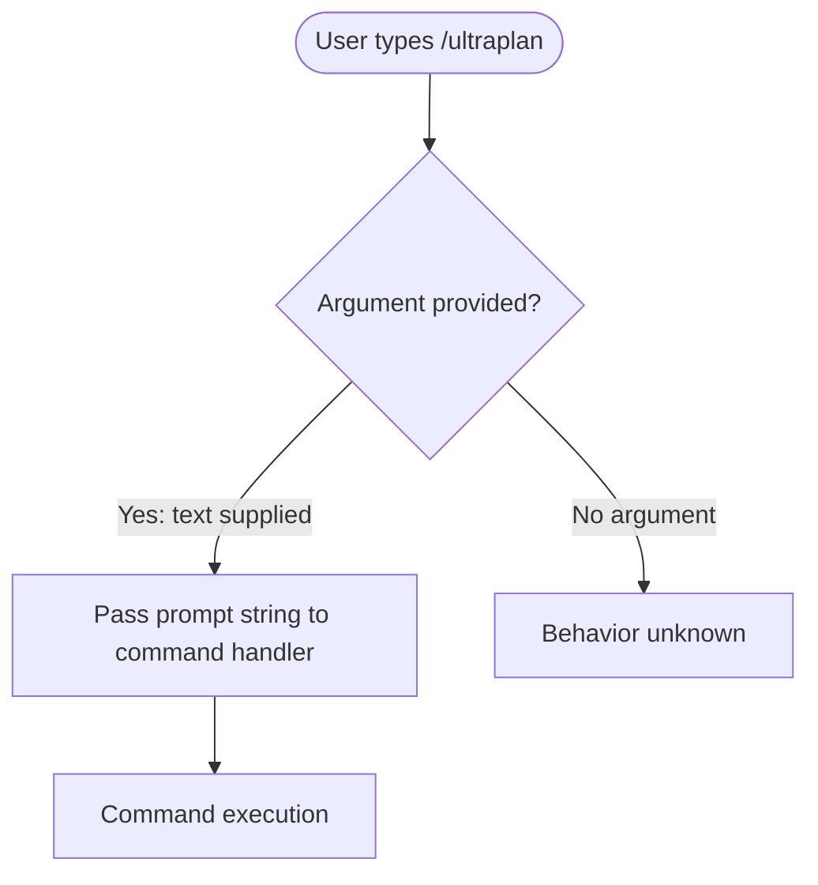

# `/ultraplan`

> Analysis basis: CC v2.1.133 bundle.js (AST extraction + Claude interpretation)
> Minimum version: v2.1.133

---

## Overview

`/ultraplan` is a registered local-JSX slash command in Claude Code v2.1.133 that accepts a free-form text prompt as its sole argument. Based on the registration record, it is intended to trigger an extended or enhanced planning workflow within the CLI. The command's internal implementation module was not resolvable at depth-2 traversal, so behavioral details beyond registration metadata cannot be verified from the current extraction.

---

## Registration

| Field | Value |
|---|---|
| type | `local-jsx` |
| name | `ultraplan` |
| description | `null` |
| argumentHint | `<prompt>` |

Analysis basis: CC v2.1.133 bundle.js:+10965307

---

## Input Branching

The AST extraction returned an empty call graph (`callGraph: []`) for this command, and the note field explicitly states: `"no entry functions found for module 'undefined'"`. This indicates the command's implementation module reference was unresolved at the time of extraction, and no branching logic could be traced at depth ≤ 2.

The following flowchart represents the registration-level input model only, derived solely from the `argumentHint` field:



Analysis basis: CC v2.1.133 bundle.js:+10965307

---

## Behavioral Spec

Because `callGraph`, `literals`, `telemetry`, and `identifiers` are all empty arrays, and because the extraction note confirms no entry functions were resolved for the implementing module, no verified behavioral pseudocode can be written for this command.

### Command Dispatch

```
function handleUltraplanCommand(rawInput):
    prompt = extractArgument(rawInput, hint="<prompt>")
    # Further dispatch logic:
    # <!-- TODO: not found in depth-2 traversal; needs --depth 4 -->
```

Analysis basis: CC v2.1.133 bundle.js:+10965307

### Internal Planning Logic

<!-- TODO: not found in depth-2 traversal; needs --depth 4 -->

### Output / Response Rendering

<!-- TODO: not found in depth-2 traversal; needs --depth 4 -->

---

## State & Side Effects

| Item | Detail |
|---|---|
| Telemetry | None detected — `telemetry: []` at depth-2 traversal. <!-- TODO: not found in depth-2 traversal; needs --depth 4 --> |
| Hook registration | <!-- TODO: not found in depth-2 traversal; needs --depth 4 --> |
| appState changes | <!-- TODO: not found in depth-2 traversal; needs --depth 4 --> |
| Sound | <!-- TODO: not found in depth-2 traversal; needs --depth 4 --> |
| Module identity | Implementation module name resolved as `undefined` at extraction time |

Analysis basis: CC v2.1.133 bundle.js:+10965307

---

## Version History

| Version | Change |
|---|---|
| v2.1.133 | Initial analysis — registration confirmed; implementation module unresolved at depth-2 |

---

## Common Mistakes

1. **Assuming `/ultraplan` behaves identically to `/plan`**: The `ultraplan` name implies a distinct or extended planning mode, but no implementation details were recoverable at this traversal depth. Do not conflate the two commands.
2. **Omitting the `<prompt>` argument**: The `argumentHint` field declares `<prompt>` as the expected input. Invoking `/ultraplan` without a prompt argument may result in undefined or no-op behavior — this cannot be confirmed without deeper traversal.
3. **Expecting telemetry coverage**: No `tengu_*` telemetry events were found at depth-2. Users or integrators should not assume this command emits observable telemetry events without verification at greater traversal depth.
4. **Relying on the `description` field**: The `description` is `null` in the registration object. Any human-readable tooltip or help text shown in the CLI for this command either originates from a different rendering layer or is absent entirely.

---

## Appendix — Identifier Mapping

> For bundle debugging only. Identifiers change across versions.

| Identifier | Role |
|---|---|
| *(none)* | No obfuscated identifiers were returned by the depth-2 AST extraction (`identifiers: []`). <!-- TODO: not found in depth-2 traversal; needs --depth 4 --> |