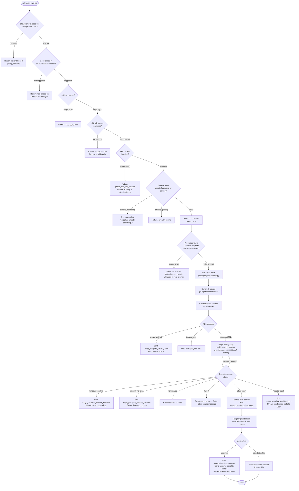

# `/ultraplan`

> Analysis basis: CC v2.1.133 bundle.js (AST extraction + Claude interpretation)
> Minimum version: v2.1.133

---

## Overview

`/ultraplan` launches a remote Claude Code web session that drafts a structured plan for a given prompt, then streams the plan back to the local CLI for user review and approval. The command orchestrates a full lifecycle: precondition checks (login, git, GitHub App, org policy), repository bundling and upload, remote session creation and polling, plan extraction, and final approval or rejection. Results from an approved plan are ultimately delivered as a pull request from the remote session.

---

## Registration

| Field | Value |
|---|---|
| type | `local-jsx` |
| name | `ultraplan` |
| description | `" ... · Claude Code on the web drafts a plan you can edit and approve. See ..."` |
| argumentHint | `<prompt>` |
| load_inline | `true` |
| load_ident | `K$7` |
| loc_byte | `10965307` |
| loc_byte_end | `10965550` |
| loc_line | `6647` |
| arbor_handler.name | `K$7` |
| arbor_handler.fqn | `claude-2.1.133::K$7` |
| arbor_handler.kind | `AsyncFunction` |
| arbor_handler.resolution_path | `load_ident` |
| arbor_handler.n_hits | `1` |

Analysis basis: CC v2.1.133 bundle.js:+10965307

The registration object spans bytes `(10965307, 10965550)`. The handler was inlined as `load: () => Promise.resolve({ call: K$7 })`, with no separate `module_id`. Arbor resolved `K$7` via the `load_ident` path with exactly 1 hit.

---

## Input Branching

The command has more than three distinct decision branches, so a Mermaid flowchart is used.



Analysis basis: CC v2.1.133 bundle.js:+10963462 (handler entry), +10960976 (already_polling / already_launching guards), +10961040 (usage hint), +10963903 (precondition checks), +10963975 (polling entry), +10947253 (plan_ready / needs_input status strings), +10962121 (create_api_fail / teleport_null), +10957487 (approved), +10958359 (failed)

---

## Behavioral Spec

### 1. Handler Entry (`K$7`)

The top-level async handler is `K$7` (Arbor-resolved, `load_ident` path).

```
async function ultraplanHandler(invocation, appContext):
    # Step 1: Check allow_remote_sessions config
    remoteAllowed = checkRemoteSessionsConfig(appContext)  # rO8 → checks "allow_remote_sessions"
    if not remoteAllowed:
        return policyBlockedError()

    # Step 2: Auth + eligibility checks (LL / iL9 / bg_remote_eligibility_check)
    eligibility = await checkRemoteEligibility(appContext)
    # Checks: logged-in, git repo, github remote, github app, org policy
    if eligibility.error:
        return eligibility.error

    # Step 3: Guard against concurrent launches
    sessionState = appContext.getAppState()
    if sessionState == "already_launching":
        return alreadyLaunchingWarning()   # literal: "ultraplan: already launching…"
    if sessionState == "already_polling":
        return alreadyPollingWarning()

    # Step 4: Normalize prompt
    rawPrompt = invocation.args
    normalizedPrompt = normalizePromptText(rawPrompt)  # rO8 → H.slice, _.replace, $1$2 substitution
    if not isValidPrompt(normalizedPrompt):
        return usageHint()   # "Usage: /ultraplan <prompt>, or include 'ultraplan' anywhere in your prompt"

    # Step 5: Build local plan draft, bundle repository, launch remote
    appContext.setAppState("already_launching")
    result = await launchRemoteUltraplanSession(normalizedPrompt, appContext)  # Lj6 / L$7

    # Step 6: Update app state based on result
    if result.error:
        emitTelemetry("tengu_ultraplan_create_failed")
        appContext.setAppState(null)
        return errorMessage(result)
    elif result == null:
        return teleportNullError()

    # Step 7: Present plan and handle approval
    appContext.setAppState("already_polling")
    planOutcome = await pollAndPresentPlan(result.sessionId, appContext)  # tnH / kQH / bG9
    appContext.setAppState(null)
    return planOutcome
```

Analysis basis: CC v2.1.133 bundle.js:+10963462, +10963515, +10963590, +10963786, +10964004

---

### 2. Remote Eligibility Check (`iL9`)

```
async function checkRemoteEligibility(appContext):
    results = await Promise.all([
        getRemoteUrl(appContext),        # qk → git config --get remote.origin.url
        checkGitHubAppInstalled(appContext),  # IGH → X8.get check, X8.isAxiosError
        getEnvironmentsList(appContext),  # _l → teleport_environments_list
    ])

    # Check 1: login state
    if not appContext.hasAccessToken():
        return { error: "not_logged_in", message: "Please run /login and sign in..." }

    # Check 2: git repo
    if not appContext.isInGitRepo():
        return { error: "not_in_git_repo" }

    # Check 3: github remote
    if not results.remoteUrl:
        return { error: "no_git_remote",
                 message: "Background tasks require a GitHub remote. Add one with `git remote add origin REPO_URL`." }

    # Check 4: github app
    if not results.githubAppInstalled:
        return { error: "github_app_not_installed" }

    # Check 5: org policy (allow_remote_sessions)
    if orgPolicyBlocks():
        return { error: "policy_blocked",
                 message: "Remote sessions are disabled by your organization's policy..." }

    # Check 6: byoc / bundle seed eligibility
    emitTelemetry("tengu_ccr_bundle_seed_enabled")
    return { ok: true }
```

Analysis basis: CC v2.1.133 bundle.js:+10944285 (`tnH` / `iL9`), +6451541 (`bg_remote_eligibility_check`), +7832950 (not_logged_in), +7833051 (not_in_git_repo), +7833189 (no_git_remote), +7833306 (github_app_not_installed), +7833460 (policy_blocked)

---

### 3. Prompt Normalization (`rO8` / `R4q`)

```
function normalizePromptText(rawInput):
    # Strip leading/trailing whitespace
    trimmed = rawInput.slice(trimStart)   # rO8 → H.slice

    # Remove "ultraplan" keyword from prompt body if user typed it inline
    # Uses regex with "gi" flag (global, case-insensitive), replace pattern "$1$2"
    cleaned = trimmed.replace(ultraplanRegex_gi, "$1$2")   # rO8 → _.replace, literal "gi", "$1$2"

    # Check for startsWith sentinel (index 0)
    if cleaned.startsWith(sentinel):
        return cleaned

    # Collect matched segments via matchAll
    segments = cleaned.matchAll(segmentPattern)  # R4q → H.matchAll

    # Validate: at least one valid segment exists
    if not segments.some(validSegmentPredicate):
        return null   # triggers usage hint

    # Push into result queue, limit to 5 segments
    result = []
    for seg in segments:        # R4q → q.push, literal 5
        result.push(seg)

    return result.join()
```

Analysis basis: CC v2.1.133 bundle.js:+10949546 (`rO8`), +10949083 (`matchAll`), +10949075 (literal `"gi"`), +10949671 (literal `"$1$2"`), +10949694 (literal `5`), +10948677 (`H.startsWith`), +10948722 (literal `0`)

---

### 4. Repository Bundle & Upload (`nXA` / `teleport_git_bundle_upload`)

```
async function bundleAndUploadRepository(appContext):
    emitTelemetry("tengu_ccr_bundle_upload")

    # Validate git state
    if not isInGitRepo():
        return { error: "empty_repo", message: "Not in a git repository" }

    # Attempt to stash working changes under refs/seed/stash
    stashResult = git("stash", "create")   # literals: "stash", "create"
    if stashResult.status != 200:
        return { error: "stash_failed" }

    # Determine HEAD ref (rev-parse --verify HEAD)
    headRef = git("rev-parse", "--verify", "HEAD")   # literals: "rev-parse", "--verify", "HEAD"

    # Package bundle file (ccr-seed.bundle)
    bundlePath = tempDir + "/ccr-seed.bundle"   # literals: "ccr-seed", ".bundle"
    writeBundleFile(bundlePath)

    # Upload
    uploadResult = await uploadBundleToRemote(bundlePath)
    if uploadResult == "failed":
        emitTelemetry("tengu_teleport_bundle_mode")
        return { error: "upload_failed" }

    # Determine bundle mode: head / fallback_head / squashed / fallback_squashed
    mode = determineBundleMode(uploadResult)
    # possible values: "head", "fallback_head", "squashed", "fallback_squashed"

    # Clean up temp file (vQH.unlink)
    cleanupTempBundle(bundlePath)

    return { success: true, mode, seedRef: headRef }
```

Analysis basis: CC v2.1.133 bundle.js:+7808771 (`teleport_git_bundle_upload`), +7808800 (empty_repo), +7809064 (`tengu_ccr_bundle_upload`), +7809256 (stash), +7809553 (stash_failed), +7809910 (ccr-seed), +7810358 (upload_failed), +7810507 (success), +7810571 (head/fallback modes), +7810846 (`vQH.unlink`)

---

### 5. Remote Session Launch (`l1H` / `teleportToRemote`)

```
async function teleportToRemote(prompt, bundleResult, appContext):
    # Auth header assembly
    token = getAccessToken()
    if not token:
        raise Error("No access token found for remote session creation")

    orgUUID = getOrgUUID()
    if not orgUUID:
        raise Error("Unable to get organization UUID for remote session creation")

    # Beta header: ccr-byoc-2025-07-29
    headers = {
        "Content-Type": "application/json",
        "anthropic-version": "2023-06-01",
        "anthropic-beta": "ccr-byoc-2025-07-29",
        "x-organization-uuid": orgUUID,
    }

    # Determine source decision (bundle / explicit_env_bundle / git_repository / no_git_at_all)
    sourceDecision = determineSourceDecision(bundleResult)
    emitTelemetry("tengu_teleport_source_decision")

    # Environment selection: list environments → pick bridge or auto-create Default
    envs = await listEnvironments(appContext)   # _l → teleport_environments_list
    if envs is empty:
        # Auto-create default cloud env
        defaultEnv = await createDefaultEnvironment(appContext)
        # Default env: anthropic_cloud, python 3.11, node 20, /home/user
        if not defaultEnv:
            log("warn", "Could not create a cloud environment. Set one up at https://claude.ai/code/onboarding?magic=env-setup")
            return null
        emitTelemetry("tengu_ccr_session_link")

    targetEnv = selectBridgeEnv(envs) or defaultEnv

    # Generate title for task (max 75 chars, template: "claude/task")
    titleResult = await generateTitle(prompt)  # wN4 → teleport_generate_title
    branch = titleResult.branch

    # Build session payload
    payload = {
        event: "control_request",
        set_permission_mode: "user",
        prompt: normalizedPrompt,
        workflowName: "Ultraplan",
        sourceDecision,
        branch,
    }

    # POST session creation (HTTP 201 = success, 500 = server error)
    response = await X8.post(sessionEndpoint, payload, { headers })
    if response.status == 500:
        return { error: "create_api_fail" }
    if response.status != 201:
        return { error: "unexpected_error" }

    sessionId = response.data.sessionId
    if not sessionId:
        raise Error("Server returned a malformed session response (no session id)")

    # Emit UUID + session link telemetry
    emitTelemetry("tengu_ccr_session_link")

    return { sessionId, branch, envId: targetEnv.id }
```

Analysis basis: CC v2.1.133 bundle.js:+7822944 (`l1H`), +7823113 (no access token), +7823423 (no org UUID), +7823745 (anthropic-beta header), +7823762 (`ccr-byoc-2025-07-29`), +7824983 (`X8.post`), +7825037 (500), +7825075 (201), +7825365 (malformed session), +7818574 (`tengu_ccr_session_link`), +7829054 (`tengu_teleport_source_decision`), +7825559 (auto-created log), +7825717 (warn / env-setup URL), +7811906 (`wN4` title gen), +7812215 (`teleport_generate_title`)

---

### 6. Session Polling Loop (`kQH` / `bG9`)

```
async function pollUltraplanSession(sessionId, appContext):
    emitTelemetry("tengu_ultraplan_launched")

    # Generate random token for polling identity (8 random bytes via YPq.randomBytes)
    pollToken = generatePollToken(8)

    # Open browser/remote URL via xn.open (tq8)
    openRemoteUrl(sessionUrl)

    startTime = Date.now()
    POLL_INTERVAL_MS = 1000        # literal: 1000
    MAX_TIMEOUT_MS   = 1800000     # literal: 1800000 (30 minutes)

    loop:
        elapsed = Date.now() - startTime
        if elapsed >= MAX_TIMEOUT_MS:
            emitTelemetry("tengu_ultraplan_timeout_seconds")
            return { error: "timeout_pending" or "timeout_no_plan" }

        # GET session status
        statusResponse = await X8.get(sessionStatusUrl(sessionId))
        status = statusResponse.data.status

        switch status:
            case "pending" | "running" | "starting":
                await sleep(POLL_INTERVAL_MS)
                continue

            case "archived" | "completed":
                # Find last "result" message
                resultMsg = statusResponse.data.messages.findLast(m => m.type == "result")
                planText = extractPlanText(resultMsg)
                emitTelemetry("tengu_ultraplan_plan_ready")
                return { status: "plan_ready", plan: planText }

            case "plan_ready":
                emitTelemetry("tengu_ultraplan_plan_ready")
                plan = extractPlan(statusResponse)
                return { status: "plan_ready", plan }

            case "needs_input":
                emitTelemetry("tengu_ultraplan_awaiting_input")
                return { status: "needs_input" }

            case "approved":
                emitTelemetry("tengu_ultraplan_approved")
                return { status: "approved",
                         message: "Results will land as a pull request when the remote session finishes..." }

            case "requires_action":
                # Remote needs user input
                return handleRequiresAction(statusResponse)

            case "terminated" | "failed":
                emitTelemetry("tengu_ultraplan_failed")
                return { error: status }

            case "remote session returned an error":
                return { error: "remote_error" }

            case "remote session exceeded 30 minutes":
                return { error: "timeout" }

            default:
                await sleep(POLL_INTERVAL_MS)
                continue
```

Analysis basis: CC v2.1.133 bundle.js:+7836527 (`kQH`), +7838264 (`bG9`), +11895164 (`YPq.randomBytes`), +11895180 (literal `8`), +11894199 (`xn.open`), +7838118 (1000 ms), +7838125 (1800000 ms), +10947253 (plan_ready), +10947268 (needs_input), +10947063 (terminated), +10946876 (approved), +10947605 (timeout_pending), +10947623 (timeout_no_plan), +10956367 (`tengu_ultraplan_timeout_seconds`), +10957079 (`tengu_ultraplan_plan_ready`), +10957487 (`tengu_ultraplan_approved`), +10958359 (`tengu_ultraplan_failed`), +7840647 (remote error string), +7840688 (30-minute exceeded string)

---

### 7. Plan Presentation & Approval (`H$7` / `Lj6`)

```
async function presentPlanAndAwaitApproval(plan, sessionId, appContext):
    # Assemble draft plan message
    draftMessage = "Here is a draft plan to refine:\n" + plan   # literal: "Here is a draft plan to refine:"

    # Emit task-notification event to UI
    emitAppEvent("task-notification", { sessionId, plan: draftMessage })

    # Display with label "Refine local plan" (literal: "Refine local plan")
    displayPlanPanel(draftMessage, label="Refine local plan")

    # Collect user response
    userChoice = await awaitUserApproval()

    if userChoice == "approved":
        emitTelemetry("tengu_ultraplan_approved")
        # Send approve signal to remote (mF → X8.post, HTTP 409 = duplicate guard)
        await sendApproveSignal(sessionId, token)
        return successMessage("Results will land as a pull request when the remote session finishes. There is nothing to do here.")

    elif userChoice == "skip":
        # Archive orphaned session; log failure if archival fails
        tryArchiveSession(sessionId)  # literal: "ultraplan: failed to archive orphaned session"
        return { status: "skip" }

    else:
        # Unexpected error branch
        emitTelemetry("tengu_ultraplan_failed")
        appContext.injectSystemMessage(
            "Remote Ultraplan session failed. Wait for the user's next instructions."
        )
        return { error: "unexpected_error",
                 message: "Ultraplan hit an unexpected error during launch. Wait for the user's next instructions." }
```

Analysis basis: CC v2.1.133 bundle.js:+10956708 (draft plan prefix), +10961885 (Refine local plan), +10961741 (task-notification), +10957973 (PR message), +10958764 (remote session failed message), +10963147 (failed to archive), +10962999 (unexpected error message), +10962841 (unexpected_error), +10964122 (skip), +7830716 (`X8.post` approval), +7830812 (409 duplicate guard)

---

### 8. Timeout & Elapsed-Time Tracking (`k4q`)

```
function trackRemoteSessionTimeout(startTime, statusPayload):
    elapsed = Date.now() - startTime

    # Convert to minutes for user display (integer division by 60000)
    elapsedMinutes = Math.round(elapsed / 60000)   # literal: 60000

    # Choose singular/plural
    unit = if elapsedMinutes == 1 then "minute" else "minutes"   # literals: "minute", "minutes"

    # Timeout categories
    if sessionState == "pending" and elapsed > TIMEOUT:
        emitTelemetry("tengu_ultraplan_timeout_seconds", { seconds: Math.round(elapsed / 1000) })
        return "timeout_pending"

    if sessionHasNoPlan and elapsed > TIMEOUT:
        emitTelemetry("tengu_ultraplan_timeout_seconds")
        return "timeout_no_plan"

    # Permanent error from remote (extract_marker_missing)
    if statusPayload.marker == null:
        return { error: "extract_marker_missing" }

    # Network failure path: retry exhausted
    if networkError:
        return { error: "network_or_unknown",
                 message: "Lost connection to the remote session after repeated retries — the session may still be running" }
```

Analysis basis: CC v2.1.133 bundle.js:+10946067 (`k4q`), +10947370 (`Math.round`), +10947383 (60000), +10947398 (minute), +10947407 (minutes), +10947605 (timeout_pending), +10947623 (timeout_no_plan), +10946822 (extract_marker_missing), +10946490 (network_or_unknown), +10946563 (lost connection message)

---

### 9. Ultraplan Session Timeout Constant

Maximum remote session wait time: **1,800,000 ms (30 minutes)** (bundle.js:+7838125)

Poll interval: **1,000 ms** (bundle.js:+7838118)

Remote session creation retry delay: **1,500 ms** (bundle.js:+10962773)

---

## State & Side Effects

| Item | Detail |
|---|---|
| Telemetry — launch | `tengu_ultraplan_launched` (bundle.js:+10962432) |
| Telemetry — create failed | `tengu_ultraplan_create_failed` (bundle.js:+10960761) |
| Telemetry — awaiting input | `tengu_ultraplan_awaiting_input` (bundle.js:+10957011) |
| Telemetry — plan ready | `tengu_ultraplan_plan_ready` (bundle.js:+10957079) |
| Telemetry — approved | `tengu_ultraplan_approved` (bundle.js:+10957487) |
| Telemetry — failed | `tengu_ultraplan_failed` (bundle.js:+10958359) |
| Telemetry — timeout | `tengu_ultraplan_timeout_seconds` (bundle.js:+10956367) |
| Telemetry — prompt id | `tengu_ultraplan_prompt_identifier` (bundle.js:+10956534) |
| Telemetry — bundle upload | `tengu_ccr_bundle_upload` (bundle.js:+7809064) |
| Telemetry — bundle seed | `tengu_ccr_bundle_seed_enabled` (bundle.js:+6451936) |
| Telemetry — bundle mode | `tengu_teleport_bundle_mode` (bundle.js:+7824158) |
| Telemetry — session link | `tengu_ccr_session_link` (bundle.js:+7818576) |
| Telemetry — source decision | `tengu_teleport_source_decision` (bundle.js:+7829054) |
| Telemetry — title gen | `tengu_ccr_bundle_upload` → `teleport_generate_title` (bundle.js:+7812215) |
| Telemetry — env list | `teleport_environments_list` (bundle.js:+6447433) |
| Telemetry — env create | `teleport_default_environment_create` (bundle.js:+6448159) |
| Telemetry — eligibility | `bg_remote_eligibility_check` (bundle.js:+6451541) |
| Telemetry — MCP retry | `tengu_mcp_retry_failed_remote` (bundle.js:+13870729) |
| Telemetry — Kestrel | `tengu_slate_kestrel` (bundle.js:+9780268) |
| Telemetry — config error | `tengu_config_parse_error` (bundle.js:+3113854) |
| Telemetry — bg dispatch | `tengu_bg_dispatch_sigkill_escalate`, `tengu_bg_dispatch_low_mem`, `tengu_bg_spare_enable`, `tengu_bg_spare_claim`, `tengu_bg_spare_spawn`, `tengu_bg_spare_claim_fail`, `tengu_bg_sendclaim_failed`, `tengu_bg_low_mem_mb` |
| appState changes | Sets `"already_launching"` before remote call; sets `"already_polling"` while waiting; resets to `null` on completion or error. (`A.getAppState` / `A.setAppState`, bundle.js:+10963786, +10964004) |
| File system | Writes and deletes temporary git bundle file (`ccr-seed.bundle`); deletes via `vQH.unlink` on cleanup; `Ydq.unlinkSync` on queue cleanup (bundle.js:+7810846, +14137065) |
| Network | HTTP POST to create session; HTTP GET poll; HTTP POST to approve; `xn.open` to open remote URL in browser (bundle.js:+11894199) |
| Git operations | `stash create`, `rev-parse --verify HEAD`, `for-each-ref`, `update-ref -d`, `symbolic-ref --short refs/remotes/origin/HEAD`, `git config --get remote.origin.url` |
| Sound | <!-- TODO: not found in depth-2 traversal; needs --depth 4 --> |
| Hook registration | Event `task-notification` emitted to UI layer (bundle.js:+10961741); `RC1.emit` used for state freezing (bundle.js:+4164290) |

---

## Version History

| Version | Change |
|---|---|
| v2.1.133 | Initial analysis — full lifecycle: precondition checks, git bundle upload, remote session creation, polling, plan extraction, approval, PR delivery |

---

## Common Mistakes

1. **Not logged in with Claude.ai** — The command requires a Claude.ai OAuth account, not an API key. Running `/login` with an API key is insufficient; the error message explicitly states "API key authentication is not sufficient" (bundle.js:+6447517).

2. **No GitHub remote configured** — The command requires `git remote add origin <REPO_URL>` before invocation; without it the `no_git_remote` error fires even if you are inside a git repository (bundle.js:+7833189).

3. **GitHub App not installed** — Even with a valid remote, the GitHub App must be installed at `https://claude.ai/code`; without it the `github_app_not_installed` guard blocks launch (bundle.js:+7833306).

4. **Invoking while session is launching** — If `/ultraplan` has already been triggered and is in the `already_launching` state, re-invoking returns the warning `"ultraplan: already launching. Please wait for the session to start."` rather than starting a second session (bundle.js:+10959588).

5. **Omitting the prompt argument** — The command expects a non-empty `<prompt>`. If the prompt does not pass the segment-validation step, the usage hint `"Usage: /ultraplan <prompt>, or include 'ultraplan' anywhere in your prompt"` is returned (bundle.js:+10961040).

6. **Organization policy block** — Administrators can set `allow_remote_sessions = false`; users in such organizations receive `"Remote sessions are disabled by your organization's policy. Contact your organization admin to enable them."` (bundle.js:+7833483).

7. **Repository with no commits** — The git bundle step requires at least one commit; an empty repository returns `"Repository has no commits — run git add . && git commit -m 'initial' then retry"` (bundle.js:+7828491).

---

## Appendix — Identifier Mapping

> For bundle debugging only. Identifiers change across versions.

| Identifier | Role |
|---|---|
| `K$7` | Main async handler for `/ultraplan` (Arbor-resolved, `load_ident`) |
| `rO8` | Prompt normalization — strips "ultraplan" keyword, applies `$1$2` regex substitution |
| `iO8` | Prompt segment iterator / inner normalization helper |
| `R4q` | Prompt validation — `matchAll` segmenter, `startsWith` sentinel check |
| `LL` | Remote session pre-flight (login + plan loader orchestrator) |
| `pr9` | Plan loader helper called from `LL` |
| `yVA` | Plan content reader (calls `ur9` for file read) |
| `Wm` | Eligibility dispatcher — checks firstParty / enterprise / team tiers |
| `ur9` | File reader for plan content (`br9.readFileSync`, utf-8) |
| `yq` | Telemetry / traffic-mode resolver |
| `J9_` | No-telemetry / essential-traffic gate |
| `kH` | String coercion utility |
| `WOH` | AppState accessor |
| `Lj6` | Launch orchestrator — coordinates eligibility → bundle → create → poll |
| `K` | Async task tracker (add / delete via finally) |
| `B4q` | Pre-launch state guard (already_launching / already_polling) |
| `sO8` | State setter for polling-in-progress |
| `aO8` | Session identifier / prompt-id emitter (`tengu_ultraplan_prompt_identifier`) |
| `J6` | Event emitter / subscription manager |
| `a37` | Auxiliary session-record helper |
| `L$7` | Core launch function — assembles payload, calls `l1H`, handles result |
| `NQH` | Calls remote eligibility check pipeline |
| `iL9` | Remote eligibility check (`bg_remote_eligibility_check`) |
| `N5` | State update emitter (calls `YMH` / `IWH`) |
| `YMH` | Object.freeze + RC1.emit state broadcaster |
| `IWH` | Inner state write helper |
| `e37` | Plan draft assembler — pushes "Here is a draft plan to refine:" prefix |
| `t37` | Draft plan formatter (`o37`) |
| `l1H` | `teleportToRemote` — full remote session creation (auth, env, POST) |
| `N6` | Logger / diagnostic helper |
| `A7` | Auth token accessor |
| `sXA` | Access-token / org-UUID reader |
| `fH` | Error logger (`yQ.logError`, push to `cyH`) |
| `SV` | HTTP error classifier |
| `q_` | Environment / OAuth URL resolver (local / staging / prod) |
| `R5` | API response validator |
| `nXA` | Git bundle creator and uploader (`teleport_git_bundle_upload`) |
| `v6` | Version info accessor |
| `qk` | Git remote URL fetcher (`git config --get remote.origin.url`) |
| `SG9` | Remote-task entry builder (UUID generator via `rXA.randomUUID`) |
| `k` | Log-level / debug formatter |
| `SH` | JSON serializer (`JSON.stringify`) |
| `hG9` | Session-link telemetry helper |
| `_l` | `teleport_environments_list` — fetches available cloud environments |
| `oBH` | `teleport_default_environment_create` — auto-creates default cloud environment |
| `vH` | String coercion (wraps `String()`) |
| `wN4` | Title generator for remote task (`teleport_generate_title`, max 75 chars) |
| `xS` | GitHub App status checker (extended) |
| `IGH` | `checkGithubAppInstalled` — GET + `isAxiosError` guard |
| `LZ` | Default branch resolver (`symbolic-ref --short refs/remotes/origin/HEAD`) |
| `mq` | Notification / modal dispatcher |
| `HA` | Error string normalizer |
| `JD` | API base-URL selector (localhost / staging / prod) |
| `A_` | Module initializer / ES-module interop |
| `PqA` | API client factory |
| `_$7` | Orphaned-session archiver |
| `kQH` | Remote session polling orchestrator (opens URL, starts poll loop) |
| `ky` | Poll token generator (`YPq.randomBytes`) |
| `tq8` | Browser/URL opener (`xn.open`) |
| `_2` | Polling interval timer (`Date.now` + `L3`) |
| `ZN4` | Session-status string converter |
| `bG9` | Main polling body — status switch, message extraction, telemetry dispatch |
| `vy` | Task event broadcaster (task_started / task_updated) |
| `aeK` | `task_started` event emitter |
| `reK` | `task_updated` event emitter |
| `seK` | Task retention tracker (`Date.now` + `ZfA`) |
| `teK` | Task key enumerator (`Object.keys`) |
| `H$7` | Plan result processor — extracts plan, dispatches approval flow |
| `k4q` | Timeout / elapsed-time tracker and error classifier |
| `r37` | Session routing helper (calls `J6`) |
| `q$7` | Plan extraction utility |
| `Pz6` | Session cleanup (`rbA`, `SK.unlink`, `Z9`) |
| `L` | Column formatter (`K.map` + `f.padEnd`) |
| `mF` | Plan-approval HTTP sender (`X8.post`, 409 guard) |
| `y1` | UI state toggle (`d08.add` / `d08.delete` / `Object.assign`) |
| `Qoq` | Undefined-check helper |
| `A$7` | Auxiliary launch-state helper |
| `R6` | Config file reader with watch (`u2K`, `m5H`) |
| `m5H` | Config file parser (JSON, backup handling, `readFileSync`) |
| `p6` | JSON parser wrapper |
| `nh` | String prefix normalizer (`startsWith` / `slice`) |
| `w8` | Error-code classifier |
| `PX1` | Backup config path resolver |
| `Me8` | Config directory join helper |
| `w` | Background daemon process manager (spawn, kill, memory checks) |
| `nFA` | IPC claim/connect handler (`gm.claim`, `NP8.connect`) |
| `tFA` | Background session lifecycle manager (add/delete/finally, `IY.unlink`) |
| `Y` | Daemon lifecycle controller (dispose, spawn, memory) |
| `sFA` | macOS memory reporter |
| `x` | Process write/timeout handler |
| `u2K` | Config file watcher (`Yd6.watchFile` / `Yd6.unwatchFile`) |
| `kd` | Config-watch debounce helper |
| `tnH` | Final pre-launch coordinator (Promise.all of `qk`, `xS`, `YK`, `N6`, `kH`, `IGH`) |
| `M` | MCP retry/remote message queue manager |

---

Note: index built via Arbor fallback; some signals (telemetry, literals) may be missing — see arbor-fallback.js.