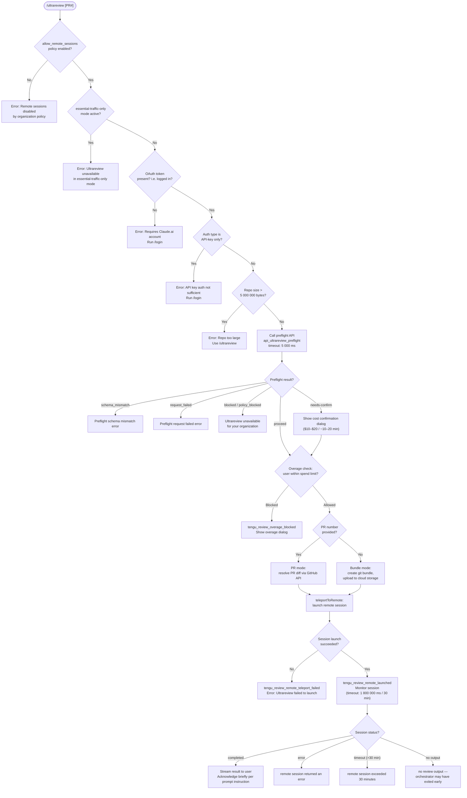

# `/ultrareview`

> Analysis basis: CC v2.1.133 bundle.js (AST extraction + Claude interpretation)
> Minimum version: v2.1.133

---

## Overview

`/ultrareview` is a first-party slash command that launches a remote bug-hunting session on Claude Code for the web. It bundles the local Git repository (or targets a specific pull-request number), uploads the code to Anthropic's cloud infrastructure, and runs an automated review agent that finds and verifies bugs in the branch. Estimated cost is `$10–$20` USD per run with a runtime of approximately `~10–20 min`.

---

## Registration

| Field | Value |
|---|---|
| type | `local-jsx` |
| name | `ultrareview` |
| description | ` ... · Est. cost ... USD · Finds and verifies bugs in your branch. Runs in Claude Code on the web. See ...` |
| loc_byte | `10976457` |
| loc_byte_end | `10976716` |
| loc_line | `6672` |
| module_id | `l4q` |
| load_inline | `true` |
| arbor_handler.name | `E$7` |
| arbor_handler.fqn | `claude-2.1.133::E$7` |
| arbor_handler.kind | `AsyncFunction` |
| arbor_handler.resolution_path | `module_id` |
| arbor_handler.n_hits | `1` |

Analysis basis: CC v2.1.133 bundle.js:+10976457

---

## Input Branching

The command execution involves more than three distinct decision branches (policy check, authentication check, repo-size check, PR-mode vs. bundle-mode, preflight API call, overage check, confirmation flow, and remote session launch). A flowchart is used below.



---

## Behavioral Spec

### 1. Entry Point — Main Handler (`asyncUltrareviewHandler`)

The Arbor-resolved handler `E$7` is an `AsyncFunction` reached via `module_id → l4q`. It orchestrates the entire command lifecycle.

Analysis basis: CC v2.1.133 bundle.js:+10974244

```
async function asyncUltrareviewHandler(commandArgs, appState):

    // Step 1 — policy gate
    if not organizationPolicyAllows("allow_remote_sessions"):
        emit telemetry("tengu_review_remote_precondition_failed")
        return error("Remote sessions are disabled by your organization's policy. ...")

    // Step 2 — wait a small randomised jitter before continuing
    //           (Math.random * 2, then setTimeout)
    await randomJitterDelay()

    // Step 3 — run precondition suite
    result = await checkRemotePreconditions(appState)
    if result is not OK:
        return result.errorMessage

    // Step 4 — run bughunter launch flow
    launchResult = await launchBughunterSession(commandArgs, appState)
    if launchResult.failed:
        return error("Ultrareview failed to launch the remote session. ...")

    // Step 5 — post-launch: render output, acknowledge per system instruction
    renderBriefAcknowledgement(launchResult)

    // Step 6 — handle cancellation
    if cancelled:
        return "Ultrareview cancelled."
```

Analysis basis: CC v2.1.133 bundle.js:+10974244 – +10975186

---

### 2. Remote Precondition Check (`checkRemotePreconditions`)

Called from the main handler; identified via call edge `E$7 → UhA`.

Analysis basis: CC v2.1.133 bundle.js:+10936269

```
async function checkRemotePreconditions(appState):

    // 2a — essential-traffic-only guard
    trafficMode = getTrafficMode()   // calls N6 / LA
    if trafficMode == "blocked":
        return blocked("Ultrareview runs in Claude Code on the web and is unavailable
                        when essential-traffic-only mode is active.")

    // 2b — authentication guard
    authToken = getOAuthToken()      // calls N6
    if not authToken or authType == "zdr":
        return blocked("Ultrareview requires a Claude.ai account. Run /login ...")

    // 2c — no_oauth_token guard
    if tokenMissing:
        return { status: "no_oauth_token" }

    // 2d — organisation UUID guard (calls Rz → SV)
    orgUUID = resolveOrganisationUUID()
    if not orgUUID:
        return error("Unable to get organization UUID")

    // 2e — repo size guard (calls yG9 → kG9)
    //   git count-objects -v, parsed; threshold 5 000 000 bytes (1024 bytes/kb)
    repoBytes = measureRepoSize()
    if repoBytes > 5_000_000:
        return error("Repo is too large to bundle. Push a PR and use
                     `/ultrareview <PR#>` instead.")

    // 2f — branch / merge-base resolution
    currentBranch  = getCurrentBranch()   // git branch --abbrev-ref HEAD
    defaultBranch  = getDefaultBranch()   // git symbolic-ref --short refs/remotes/origin/HEAD
                                          //   fallbacks: "main", "master"
    mergeBase      = getMergeBase()       // git merge-base <defaultBranch> <currentBranch>

    // 2g — diff shortstat (git diff --shortstat)
    diffStat = getDiffShortstat(mergeBase)

    // 2h — preflight API call (timeout 5 000 ms)
    preflightResult = await callPreflightAPI({
        endpoint: "api_ultrareview_preflight",
        headers: {
            "x-organization-uuid": orgUUID,
            "anthropic-version": "2023-06-01",
            "Content-Type": "application/json"
        },
        timeout: 5000
    })

    match preflightResult.status:
        "schema_mismatch" → return error(schema_mismatch_msg)
        "request_failed"  → return error(request_failed_msg)
        "blocked"         → return error("Ultrareview is unavailable for your organization.")
        "needs-confirm"   → show confirmation dialog with cost "$10–$20" / "~10–20 min"
        "proceed"         → continue

    return OK
```

Analysis basis: CC v2.1.133 bundle.js:+10936434, +10936580, +10937315, +10937865, +10937886, +10937920, +10938435, +10935596

---

### 3. Overage / Spend-Limit Check (`overageCheck`)

Called from the main handler after preconditions pass; identified via call edge `E$7 → d` and `E$7 → FL8`.

Analysis basis: CC v2.1.133 bundle.js:+10974544, +10974689

```
function overageCheck(appState):
    if userIsOverSpendLimit(appState):
        emit telemetry("tengu_review_overage_blocked")
        showOverageBlockedDialog()
        return BLOCKED
    if overageDialogShown:
        emit telemetry("tengu_review_overage_dialog_shown")
    return ALLOWED
```

---

### 4. Bughunter Launch Flow (`launchBughunterSession`)

Identified via call edges `E$7 → BhA → T4q` and `E$7 → G$7 → FhA`.

Analysis basis: CC v2.1.133 bundle.js:+10938827, +10973813

```
async function launchBughunterSession(commandArgs, appState):

    // 4a — determine source mode
    prNumber = parsePRNumber(commandArgs)   // calls T4q → p6 (JSON.parse)

    if prNumber is present:
        sourceMode = "pr"
        sourceRef  = prNumber
    else:
        // 4b — bundle mode; check size again at bundle level
        bundleResult = await buildAndUploadBundle()  // calls nXA (teleport_git_bundle_upload)
        if bundleResult.status == "too_large":
            return error("Repo is too large. Push a PR and use `/ultrareview <PR#>` instead.")
        sourceMode = bundleResult.mode   // "bundle", "explicit_env_bundle", "git_repository", etc.

    // 4c — cost / timing constants
    estimatedCost    = "$10-$20"
    estimatedRuntime = "~10–20 min"
    budgetMin        = 5      // credits
    budgetMax        = 20     // credits
    timeoutMin       = 600    // seconds lower bound
    timeoutMax       = 1800   // seconds upper bound (= 30 min)

    // 4d — resolve cloud environment (calls _l, oBH → teleport_environments_list)
    //   auto-creates "Default" anthropic_cloud env if none exists (timeout 15 000 ms)
    environment = await resolveOrCreateCloudEnvironment()
    if not environment:
        return error("No environments available for session creation")

    // 4e — generate session title (calls wN4 → teleport_generate_title)
    title = await generateTaskTitle(prNumber or diffSummary)

    // 4f — check GitHub App installation (calls IGH → checkGithubAppInstalled)
    githubAppOK = await checkGithubAppInstalled(orgUUID, accessToken)
    emit telemetry(githubAppOK ? "github_preflight_ok" : "github_preflight_failed")

    // 4g — create remote session (calls l1H → SG9 → rXA.randomUUID)
    session = await createRemoteSession({
        title:       title,
        environment: environment,
        sourceMode:  sourceMode,
        task:        "ultrareview",
        permissionMode: "set"
    })
    if not session.id:
        return error("Server returned a malformed session response (no session id)")

    emit telemetry("tengu_review_remote_launched")

    // 4h — monitor session (calls bG9; poll loop, timeout 1 800 000 ms)
    return await monitorRemoteSession(session.id, timeoutMs=1_800_000)
```

Analysis basis: CC v2.1.133 bundle.js:+10934896, +10934951, +10935140, +10935352, +10940955, +7824158, +7829054, +7825505, +7827285, +7836827, +7841211

---

### 5. Git Bundle Upload (`uploadGitBundle`)

Identified via call edge `FhA → l1H → nXA`; telemetry event `tengu_ccr_bundle_upload`.

Analysis basis: CC v2.1.133 bundle.js:+7808742

```
async function uploadGitBundle(repoPath):

    // Verify in a git repo
    if not isInsideWorkTree():
        return { status: "not_in_git_repo" }

    // Ensure repo has at least one commit
    commitCount = gitForEachRef("--count=1", "refs/")
    if commitCount == 0:
        return error("Repository has no commits yet")

    // Seed stash refs for efficient incremental uploads
    stashRef = git("stash", "create")   // refs/seed/stash
    rootRef  = git("update-ref", "-d", "refs/seed/root")

    // Create bundle (name pattern: "ccr-seed.bundle" / "_source_seed.bundle")
    bundleFile = createGitBundle(repoPath)

    // Upload; check HTTP 200 for success
    uploadResult = await httpUpload(bundleFile)

    emit telemetry("tengu_ccr_bundle_upload", {
        status: uploadResult.status,   // "success" | "failed" | "upload_failed"
        mode:   bundleMode             // "head" | "fallback_head" | "squashed" | "fallback_squashed"
    })

    // Cleanup seed refs
    cleanupSeedRefs()

    return uploadResult
```

Analysis basis: CC v2.1.133 bundle.js:+7808771, +7809064, +7809910, +7810507

---

### 6. Remote Session Monitor (`monitorRemoteSession`)

Identified via call edge `FhA → kQH → bG9`.

Analysis basis: CC v2.1.133 bundle.js:+7836827, +7837006

```
async function monitorRemoteSession(sessionId, timeoutMs=1_800_000):

    startTime = Date.now()

    loop:
        elapsed = Date.now() - startTime
        if elapsed > timeoutMs:
            return error("remote session exceeded 30 minutes")

        sessionState = await pollSessionState(sessionId)

        match sessionState.status:
            "pending"   → continue polling
            "running"   → continue polling
            "starting"  → continue polling
            "idle"      → continue polling
            "hook_started"   → emit progress event
            "hook_progress"  → emit progress event
            "hook_response"  → emit progress event
            "SessionStart"   → emit progress event
            "completed" → return sessionState.result
            "archived"  → return sessionState.result
            "error"     → return error("remote session returned an error")

        if result is empty:
            return error("no review output — orchestrator may have exited early")

        await setTimeout(pollIntervalMs)
```

Analysis basis: CC v2.1.133 bundle.js:+7838664, +7839695, +7838569, +7838644, +7840647, +7840688, +7840725, +7841187

---

### 7. Post-Launch Output Rendering (`renderPostLaunch`)

Identified via call edges `E$7 → G$7 → FhA` and `G$7 → W$7`.

Analysis basis: CC v2.1.133 bundle.js:+10973813, +10973852

```
function renderPostLaunch(launchResult, sessionURL):

    // Display brief acknowledgement per system prompt instruction:
    // "The output above is already visible to the user.
    //  Briefly acknowledge it without repeating the target, URL, or billing note.
    //  Findings will arrive via task-notification."
    // (≤30-char fragment cited; full text © Anthropic PBC)

    // Construct admin-settings link  ("/admin-settings/")
    adminLink = buildAdminSettingsURL()

    // Map session results → JSX messages (W$7 → H.map)
    messageList = sessionResult.map(item => renderSessionItem(item))

    return messageList
```

Analysis basis: CC v2.1.133 bundle.js:+10973907, +10974668, +10973850

---

### 8. Telemetry Mode / Traffic Gate (`checkTrafficMode`)

Identified via call edges `LL → pr9 → yVA → Wm` and literals at +9780061–+9780354.

Analysis basis: CC v2.1.133 bundle.js:+9783583

```
function checkTrafficMode(appConfig):

    // Wm checks these sub-properties
    sourceType = appConfig.sourceType    // literal "firstParty" at +9780068
    priority   = appConfig.priority      // literal 1 at +9780088; 0 at +9780162

    if orgTier in ["enterprise", "team"]:  // literals at +9780354, +9780389
        return ALLOWED

    telemetryMode = resolveTelemetryMode()   // yq → J9_ → kH
    // modes: "essential-traffic" (+911386), "no-telemetry" (+911445),
    //        "default" (+911519), "yes" (+25237), "on" (+25243)

    if telemetryMode == "essential-traffic":
        return BLOCKED

    emit telemetry("tengu_slate_kestrel")
    return ALLOWED
```

Analysis basis: CC v2.1.133 bundle.js:+9780061, +9780094, +9780123, +9780193, +9780265, +9780354, +9780389

---

## Constants and Limits

| Constant | Value | Source |
|---|---|---|
| Estimated cost range | `$10–$20` USD | bundle.js:+10934523 |
| Estimated runtime | `~10–20 min` | bundle.js:+10934615 |
| Budget minimum (credits) | `5` | bundle.js:+10940436 |
| Budget maximum (credits) | `20` | bundle.js:+10940438 |
| Timeout lower bound | `600` seconds | bundle.js:+10940565 |
| Timeout upper bound | `1 800` seconds (30 min) | bundle.js:+10940569 |
| Session poll hard timeout | `1 800 000` ms | bundle.js:+7838125 |
| Preflight API timeout | `5 000` ms | bundle.js:+10935472 |
| Repo size limit (bundle mode) | `5 000 000` bytes | bundle.js:+7806213 |
| Environment list timeout | `15 000` ms | bundle.js:+6447948 |
| Jitter multiplier | `2` (Math.random × 2) | bundle.js:+12285767 |
| Git object size unit | `1 024` bytes/kb | bundle.js:+7805987 |
| Remote session HTTP 200 OK | `200` | bundle.js:+7809435 |
| Remote session HTTP 201 Created | `201` | bundle.js:+7825075 |
| GitHub App check HTTP 400 | `400` | bundle.js:+6450219 |
| BYOC beta header value | `ccr-byoc-2025-07-29` | bundle.js:+7823762 |
| Default cloud env working dir | `/home/user` | bundle.js:+6448560 |
| Default cloud env Python version | `3.11` | bundle.js:+6448639 |
| Default cloud env Node version | `20` | bundle.js:+6448668 |

---

## State & Side Effects

| Item | Detail |
|---|---|
| Telemetry: `tengu_slate_kestrel` | Emitted during traffic-mode gate check (bundle.js:+9780268) |
| Telemetry: `tengu_review_remote_precondition_failed` | Emitted when org policy blocks remote sessions (bundle.js:+10936284) |
| Telemetry: `tengu_review_bughunter_config` | Emitted when bughunter config is resolved (bundle.js:+10934406) |
| Telemetry: `tengu_review_overage_blocked` | Emitted when user is over spend limit (bundle.js:+10974546) |
| Telemetry: `tengu_review_overage_dialog_shown` | Emitted when overage dialog is displayed (bundle.js:+10974881) |
| Telemetry: `tengu_ccr_bundle_max_bytes` | Emitted during repo-size measurement (bundle.js:+7805687) |
| Telemetry: `tengu_ccr_bundle_seed_enabled` | Emitted when seed-bundle mode is active (bundle.js:+6451936) |
| Telemetry: `tengu_ccr_bundle_upload` | Emitted after bundle upload attempt (bundle.js:+7809064) |
| Telemetry: `tengu_teleport_bundle_mode` | Records which bundle mode was selected (bundle.js:+7824158) |
| Telemetry: `tengu_teleport_source_decision` | Records source-type decision (bundle.js:+7829054) |
| Telemetry: `tengu_ccr_session_link` | Emitted when session link is available (bundle.js:+7818576) |
| Telemetry: `tengu_review_remote_teleport_failed` | Emitted when remote session launch fails (bundle.js:+10941716) |
| Telemetry: `tengu_review_remote_launched` | Emitted on successful remote session launch (bundle.js:+10942200) |
| Telemetry: `tengu_bg_spare_enable` | Background spare-agent enable event (bundle.js:+14156457) |
| Telemetry: `tengu_bg_spare_spawn` | Background spare-agent spawn event (bundle.js:+14156817) |
| Telemetry: `tengu_daemon_control` | Emitted during daemon stop/control lifecycle (bundle.js:+14191366) |
| Telemetry: `tengu_daemon_config_reload` | Emitted when daemon config is reloaded (bundle.js:+14170592) |
| Telemetry: `tengu_feature_ok` / `tengu_feature_bad` / `tengu_feature_sad` | Feature health signals throughout execution (bundle.js:+907381, +907437, +907507) |
| appState changes | Remote session status stored; daemon status written to `daemon.status.json` (bundle.js:+11406987) |
| File I/O | Git bundle written to temp path (`ccr-seed.bundle`, `_source_seed.bundle`); uploaded then deleted (bundle.js:+7809910, +7810213) |
| File I/O | Session state persisted via atomic write (`Lo.writeFile` → `Lo.rename`, using `randomBytes` hex name) (bundle.js:+2867005, +2867052, +2867105) |
| Network | Preflight API call to Anthropic backend with `x-organization-uuid` header (bundle.js:+10935439) |
| Network | Bundle upload to cloud storage (bundle.js:+7809064) |
| Network | Session creation POST, expected HTTP 201 (bundle.js:+7825075) |
| Daemon | Daemon stop sequence via `daemon_stop` / `daemon_stop_failed` (bundle.js:+14191291, +14191328) |
| Sound | <!-- TODO: not found in depth-2 traversal; needs --depth 4 --> |
| Hook registration | Hooks registered on remote session events: `hook_started`, `hook_progress`, `hook_response` (bundle.js:+7839779, +7839259, +7839288) |

---

## Version History

| Version | Change |
|---|---|
| v2.1.133 | Initial analysis. `AsyncFunction` handler `E$7` in module `l4q`. Repo-size limit 5 MB. 30-min session timeout. BYOC beta header `ccr-byoc-2025-07-29`. |

---

## Common Mistakes

1. **Running without a Claude.ai account.** `/ultrareview` requires OAuth authentication (not an API key). API-key-only users receive an explicit error directing them to `/login` (bundle.js:+6442794).

2. **Running on an oversized local repo without a PR number.** Repos exceeding 5 000 000 bytes (~5 MB of Git objects) cannot be bundled. Users must push a PR first and invoke `/ultrareview <PR#>` (bundle.js:+10937389, +10941821).

3. **Invoking in essential-traffic-only mode.** Organizations that restrict network traffic to essential routes only will see the command blocked immediately, before any API call is made (bundle.js:+10934997).

4. **Invoking when the org policy `allow_remote_sessions` is off.** The org admin must enable remote sessions in admin settings (`/admin-settings/`) before this command can function (bundle.js:+10974247, +10974668).

5. **No GitHub remote configured.** Bundle-mode teleport requires a GitHub remote (`git remote add origin REPO_URL`). Without one, the command errors with a clear message (bundle.js:+7833211).

6. **Empty repository.** A repo with no commits cannot be bundled. The fix is `git add . && git commit -m "initial"` (bundle.js:+7828491).

7. **GitHub App not installed.** Even with a GitHub remote, the Anthropic GitHub App must be installed on the repository. Setup is prompted at `https://claude.ai/code` (bundle.js:+7828396).

8. **Ignoring the cost confirmation dialog.** The preflight can return `needs-confirm`, which shows a `$10–$20` cost prompt. Dismissing without confirming cancels the run silently.

---

## Appendix — Identifier Mapping

> For bundle debugging only. Identifiers change across versions.

| Identifier | Role |
|---|---|
| `E$7` | Main async handler for `/ultrareview` (Arbor-resolved entry point) |
| `LL` | Traffic/telemetry mode gate checker |
| `pr9` | Telemetry mode resolver (inner) |
| `yVA` | Policy/source-type evaluator |
| `Wm` | Source-type sub-property checker (firstParty, priority, org tier) |
| `ur9` | File-based config reader (readFileSync, utf-8) |
| `yq` | Telemetry string normaliser |
| `J9_` | Telemetry string mapper |
| `kH` | String coercion utility |
| `H` | Jitter delay helper (Math.random + setTimeout) |
| `UhA` | Remote preconditions suite orchestrator |
| `A68` | Git repo presence verifier (rev-parse --is-inside-work-tree) |
| `N6` | App-state/context accessor |
| `zN6` | AsyncLocalStorage store reader |
| `LA` | Secondary context accessor |
| `GA` | Git subprocess runner (general) |
| `sJH` | Git child-process spawner with callbacks |
| `Y` | System resource / memory monitor |
| `qPL` | String output formatter |
| `fH` | Error logging helper |
| `d` | Generic state/value helper |
| `qk` | Git remote URL resolver (remote.origin.url) |
| `dp` | Cached remote-URL fetcher |
| `Wh8` | H4H cache getter (remoteUrl key) |
| `L` | Padded text formatter |
| `K` | Async task-set tracker (add/delete/finally) |
| `k` | Credential/token formatter (redacts secrets) |
| `Ztq` | Token parsing helper |
| `SH` | JSON.stringify wrapper |
| `Uf` | Credential redactor (`[REDACTED]`) |
| `LkH` | Token unpacker |
| `vtq` | File-content context bundler (Buffer.byteLength, dirname) |
| `JhH` | URL credential scrubber (`://***@`) |
| `eJH` | Git URL parser / protocol extractor (https, http) |
| `H4_` | URL component splitter |
| `s9` | String slice helper (indexOf + slice) |
| `yG9` | Repo-size measurer (git count-objects -v) |
| `kG9` | Git object-count parser (1024 bytes/kb) |
| `NG9` | Repo-size limit enforcer (5 000 000 byte threshold) |
| `J6` | Background-session state-machine controller |
| `Y8` | Git-state reader |
| `z` | Daemon lifecycle controller (daemon_stop) |
| `hH` | Daemon-stop success reporter |
| `uH` | Daemon-stop failure reporter |
| `bS` | Daemon shutdown sequencer |
| `jo` | Exit-code handler |
| `ePH` | Shutdown callback dispatcher |
| `mt8` | Session-event emitter (randomUUID) |
| `cC` | Process-exit coordinator (Promise.race, Promise.all) |
| `dU` | C5H shutdown caller |
| `iU` | clearTimeout / cleanup runner |
| `r8` | Timed abort helper (setTimeout + clearTimeout) |
| `LZ` | Default-branch resolver (symbolic-ref, "main"/"master" fallbacks) |
| `Gh8` | H4H cache getter (defaultBranch key) |
| `cw` | Current-branch resolver (git branch --abbrev-ref HEAD) |
| `jh8` | H4H cache getter (branch key) |
| `$` | Atomic file-write helper (randomBytes + writeFile + rename) |
| `XDq` | Daemon status file writer (daemon.status.json) |
| `yr` | Status persistence helper |
| `iY` | Atomic file operations (writeFile, rename, copyFile, unlink) |
| `Sj6` | Path joiner for daemon status (JDq.join) |
| `BhA` | Bughunter session launch flow (T4q + sIH) |
| `T4q` | PR-number parser and branch-diff resolver |
| `p6` | JSON.parse wrapper |
| `Rz` | OAuth session validator / API-auth gate |
| `A7` | Access-token fetcher |
| `SV` | Organisation UUID resolver |
| `q_` | API environment (prod/staging/local) resolver |
| `q1_` | Environment URL builder |
| `PwL` | OAuth URL validator |
| `R5` | API error classifier (zAH) |
| `zAH` | HTTP error code mapper |
| `Z8` | State value setter |
| `sIH` | Session notification hook registrar |
| `onH` | Background-task event emitter |
| `FL8` | Overage/spend-limit checker |
| `XZ` | Overage dialog renderer |
| `Z5H` | Subscription-type resolver |
| `F7` | Auth-credential builder |
| `rY` | HTTP client factory (ANTHROPIC_API_KEY, apiKeyHelper) |
| `R6` | API request dispatcher (Date.now timing) |
| `C_` | Auth-config builder |
| `wU` | Boolean flag coercer |
| `ab` | User role / plan gate (max, pro, admin, billing, owner) |
| `U9` | Subscription-type checker (stripe, apple, google_play) |
| `zu_` | Plan resolver helper |
| `Ou_` | Subscription status helper |
| `Zn` | Background-task notification emitter |
| `G$7` | Post-launch output renderer |
| `FhA` | Full bughunter UI flow (result rendering + session monitor) |
| `NQH` | Remote eligibility background checker |
| `iL9` | Eligibility sub-checks (policy_blocked, not_logged_in, byoc, not_in_git_repo, no_git_remote, github_app_not_installed) |
| `E` | Key-event handler (preventDefault + dispatch) |
| `u` | UI event source |
| `QP` | User-settings accessor |
| `D` | Supervisor daemon config updater |
| `WOH` | Session result formatter |
| `G4q` | Background-task event forwarder |
| `l1H` | Remote session creator / teleporter (full lifecycle) |
| `sXA` | Session request builder |
| `nXA` | Git bundle uploader (`teleport_git_bundle_upload`) |
| `v6` | Bundle file path builder |
| `SG9` | Remote session record initialiser (randomUUID) |
| `hG9` | Session-link recorder (`tengu_ccr_session_link`) |
| `_l` | Cloud environment lister (`teleport_environments_list`) |
| `oBH` | Cloud environment creator (`teleport_default_environment_create`) |
| `vH` | String utility (String coercion) |
| `wN4` | Task-title generator (`teleport_generate_title`) |
| `xS` | Extended background-session state machine |
| `IGH` | GitHub App installation checker |
| `mq` | Message queue helper |
| `HA` | Error-to-string converter |
| `kQH` | Remote-agent session launcher (remote_agent) |
| `ky` | Session token generator (randomBytes, 8 bytes) |
| `tq8` | Browser/tab opener (xn.open) |
| `_2` | Session pending-state handler |
| `ZN4` | Session result string formatter |
| `bG9` | Session poll loop / event dispatcher (1 800 000 ms timeout) |
| `HTH` | Session dialogue manager |
| `JD` | Prompt/question UI component |
| `W$7` | Result-item list mapper (H.map) |
| `phA` | Final cleanup / teardown after ultrareview |

---

Note: index built via Arbor fallback; some signals (telemetry, literals) may be missing — see arbor-fallback.js.