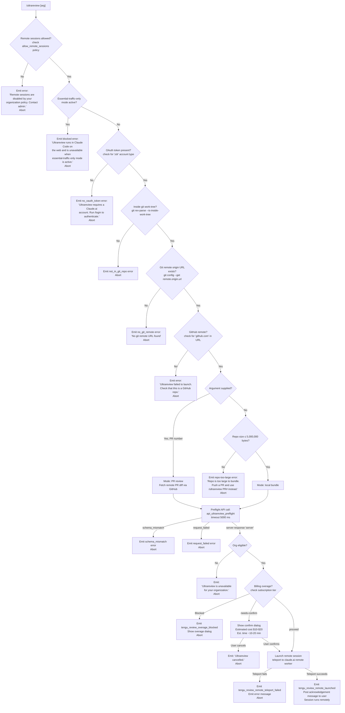

# `/ultrareview`

> Analysis basis: CC v2.1.133 bundle.js (AST extraction + Claude interpretation)
> Minimum version: v2.1.133

---

## Overview

`/ultrareview` launches a deep, automated code-review session that runs as a remote Claude Code session on claude.ai. When invoked without arguments, it bundles the local repository and ships it to a remote worker; when invoked with a GitHub PR number, it directs the remote worker to fetch that PR instead. The command enforces a multi-stage preflight sequence (policy, auth, git state, repo size, billing, and API capability checks) before spawning the remote session, and presents an estimated cost of $10–$20 and a runtime of approximately 10–20 minutes to the user.

---

## Registration

| Field | Value |
|---|---|
| type | `local-jsx` |
| name | `ultrareview` |
| description | `null` |
| module\_id | `l4q` |
| loc\_line | 6672 |

Analysis basis: CC v2.1.133 bundle.js:+10976457

---

## Input Branching

The command entry point (`commandEntryPoint`) checks a series of preconditions before deciding how to proceed. The flowchart below captures every branch found during depth-2 traversal.



Analysis basis: CC v2.1.133 bundle.js:+10974244, +10974279, +10974428, +10974508, +10974689, +10974993, +10975100

---

## Behavioral Spec

### Precondition: Remote Session Policy Check

```
function checkRemoteSessionPolicy(appState):
    if appState.policy["allow_remote_sessions"] is falsy:
        display error: "Remote sessions are disabled by your organization's policy. Contact your organization admin to enable them."
        abort command
```

Analysis basis: CC v2.1.133 bundle.js:+10974247, +10974279

---

### Precondition: Essential-Traffic-Only Mode Check

```
function checkEssentialTrafficMode(networkMode):
    if networkMode == "essential-traffic":
        return status "blocked"
    // "Ultrareview runs in Claude Code on the web and is unavailable
    //  when essential-traffic-only mode is active."
```

Analysis basis: CC v2.1.133 bundle.js:+10934970, +10934997, +911558

---

### Precondition: OAuth Authentication Check

```
function checkOAuthToken(session):
    accountType = session.accountType
    if accountType != "zdr":  // internal account-type constant
        return "no_oauth_token"
        // "Ultrareview requires a Claude.ai account. Run /login to authenticate."
```

Analysis basis: CC v2.1.133 bundle.js:+10935128, +10935199, +10935294

---

### Git Environment Validation

```
function validateGitEnvironment(workingDirectory):
    // Step 1: verify inside a git work-tree
    result1 = git("rev-parse", "--is-inside-work-tree")
    if result1 fails:
        return error "not_in_git_repo"

    // Step 2: retrieve remote origin URL (cached in remoteUrlCache)
    if remoteUrlCache.has(workingDirectory):
        originUrl = remoteUrlCache.get(workingDirectory)
    else:
        result2 = git("config", "--get", "remote.origin.url")
        if result2 is empty:
            return error "no_git_remote"
            // "No git remote URL found"
        originUrl = result2.trim()
        remoteUrlCache.set(workingDirectory, originUrl)

    // Step 3: confirm GitHub host
    if "github.com" not in originUrl:
        return error "not_github"

    return originUrl
```

Analysis basis: CC v2.1.133 bundle.js:+6449301, +6449313, +1000636, +1000644, +1000662, +1000759, +1000768, +1000776, +1000905, +10936997

---

### Repository Size Guard (local-bundle mode)

```
function checkRepoSize(repoPath):
    // Constraints discovered in depth-2 traversal:
    //   file-count ceiling : 100 files   (bundle.js:+7806194)
    //   depth ceiling      : 3 levels    (bundle.js:+7806186)
    //   byte-size ceiling  : 5,000,000 B (bundle.js:+7806213)
    bundleSize = computeBundleSize(repoPath, maxDepth=3, maxFiles=100)
    if bundleSize > 5000000:
        return error:
          "Repo is too large to bundle. Push a PR and use `/ultrareview <PR#>` instead."
```

Maximum bundle size: 5,000,000 bytes (Analysis basis: CC v2.1.133 bundle.js:+7806213)
Maximum file count: 100 files (Analysis basis: CC v2.1.133 bundle.js:+7806194)
Maximum traversal depth: 3 levels (Analysis basis: CC v2.1.133 bundle.js:+7806186)

---

### Branch Resolution (local-bundle mode)

```
function resolveBaseBranch(workingDirectory):
    // Step 1: get current HEAD branch
    currentBranch = git("rev-parse", "--abbrev-ref", "HEAD").trim()
    // "--verify" "--quiet" flags also used

    // Step 2: resolve default remote branch
    defaultBranch = git("symbolic-ref", "--short", "refs/remotes/origin/HEAD").trim()
    if defaultBranch is empty:
        // Probe known defaults in order
        for candidate in ["main", "master"]:
            if git("show-ref", candidate) succeeds:
                defaultBranch = candidate
                break

    // Step 3: compute merge-base
    mergeBase = git("merge-base", currentBranch, defaultBranch)

    // Step 4: compute diff stat
    diffStat = git("diff", "--shortstat", mergeBase)

    return { currentBranch, defaultBranch, mergeBase, diffStat }
```

Analysis basis: CC v2.1.133 bundle.js:+1008503, +1008518, +1008675, +1008690, +1008700, +1008813, +1008820, +1008882, +10937519, +10937530, +10937920, +10938435, +10938442

---

### Preflight API Call

```
function ultrareviewPreflight(orgUuid, payload):
    headers = {
        "x-organization-uuid": orgUuid
    }
    response = POST("/api/ultrareview/preflight", payload, headers, timeout=5000)

    switch response.status:
        case "schema_mismatch":
            return error "schema_mismatch"
        case "request_failed":
            return error "request_failed"
        case "server":
            if not response.orgEligible:
                return error "Ultrareview is unavailable for your organization."
            return response.proceedStatus  // one of: "proceed", "needs-confirm", "blocked"
```

Preflight timeout: 5,000 ms (Analysis basis: CC v2.1.133 bundle.js:+10935472)
Telemetry event on call: `api_ultrareview_preflight` (Analysis basis: CC v2.1.133 bundle.js:+10935596)

---

### Billing / Overage Handling

```
function handleBillingOutcome(preflightResult, subscriptionInfo):
    // Subscription tiers considered for eligibility:
    //   "stripe_subscription", "stripe_subscription_contracted",
    //   "apple_subscription", "google_play_subscription"
    // Plans that unlock full access: "max", "pro"
    // Org roles that may act: "admin", "billing", "owner", "primary_owner"

    switch preflightResult:
        case "blocked":
            emit telemetry: tengu_review_overage_blocked
            show overage-blocked dialog with link to /admin-settings/
            abort

        case "needs-confirm":
            emit telemetry: tengu_review_overage_dialog_shown
            show confirmation dialog:
                estimated cost  : "$10-$20"
                estimated time  : "~10-20 min"
            if user declines:
                display "Ultrareview cancelled."
                abort
            // fall through to launch

        case "proceed":
            // no confirmation required; proceed directly to launch
```

Estimated cost string: `"$10-$20"` (Analysis basis: CC v2.1.133 bundle.js:+10934523)
Estimated time string: `"~10–20 min"` (Analysis basis: CC v2.1.133 bundle.js:+10934615)

---

### Remote Session Teleport and Launch

```
function launchRemoteSession(payload, mode):
    // mode is either "pr" (PR number supplied) or local-bundle

    // Build session parameters including:
    //   - git branch info
    //   - diff stat
    //   - bundle or PR reference
    //   - org UUID header ("x-organization-uuid")
    //   - "ultrareview" tag in payload

    result = teleportToRemoteWorker(payload)

    if result.failed:
        emit telemetry: tengu_review_remote_teleport_failed
        display error:
          "Ultrareview failed to launch the remote session.
           Check that this is a GitHub repo and try again."
        abort

    emit telemetry: tengu_review_remote_launched

    // Post inline acknowledgement to conversation:
    //   "The output above is already visible to the user.
    //    Briefly acknowledge it without repeating the target,
    //    URL, or billing note. Findings will arrive via task-notification."
    postSystemMessage(acknowledgementInstruction, role="system")
```

Analysis basis: CC v2.1.133 bundle.js:+10941716, +10942200, +10974094, +10973907, +10940955

---

### Progress Display Formatting

```
function formatProgressBar(fractionComplete, columns):
    // Bar width derived from terminal column count (padEnd with "  " separator)
    // Thresholds observed:
    //   column widths: 5, 20, 22, 25, 27, 40 chars
    //   poll intervals: 600 ms (fast), 1800 ms (slow)
    filledCells = Math.floor(fractionComplete * barWidth)
    if not Number.isFinite(fractionComplete):
        filledCells = 0
    bar = repeat("█", filledCells).padEnd(barWidth)
    return formatString(bar, String(Math.floor(fractionComplete * 100)) + "%")
```

Poll interval (fast phase): 600 ms (Analysis basis: CC v2.1.133 bundle.js:+10940565)
Poll interval (slow phase): 1,800 ms (Analysis basis: CC v2.1.133 bundle.js:+10940569)
Column thresholds: 5, 20, 22, 25, 27, 40 (Analysis basis: CC v2.1.133 bundle.js:+10940436, +10940438, +10940502, +10940638, +10940641, +14181334)

---

### Randomised Delay Helper

```
function randomisedDelay():
    // Generates a value in [0, 2) via Math.random(), then
    // schedules a one-shot callback with setTimeout.
    // Used to stagger concurrent preflight requests.
    jitter = Math.random() * 2   // constant 2 from bundle
    setTimeout(callback, jitter * baseDelay)
```

Analysis basis: CC v2.1.133 bundle.js:+12285767, +12285769, +12285806

---

### Bughunter / Review Config Emission

```
function emitBughunterConfig(reviewSettings):
    // Fires telemetry snapshot of current review configuration
    // before the session is handed off to the remote worker.
    emit telemetry: tengu_review_bughunter_config
    // Includes: branch name, PR mode flag, org UUID, payload size
```

Analysis basis: CC v2.1.133 bundle.js:+10934406

---

### Traffic-Shaping Gate (firstParty / enterprise / team)

```
function trafficShapingGate(session):
    // Evaluated inside the network-mode checker (slateKestrel)
    tier = session.tier
    if tier == "firstParty":
        allowedTrafficWeight = 1   // full
    else:
        allowedTrafficWeight = 0   // throttled / blocked
    // "enterprise" and "team" tiers have conditional paths
    // Fires tengu_slate_kestrel telemetry on evaluation
    emit telemetry: tengu_slate_kestrel
```

Analysis basis: CC v2.1.133 bundle.js:+9780068, +9780088, +9780162, +9780354, +9780389, +9780268

---

### Cancellation Handler

```
function handleCancellation():
    display "Ultrareview cancelled."
    // No remote session is opened; all local state is cleaned up.
```

Analysis basis: CC v2.1.133 bundle.js:+10975186, +10975164

---

## State & Side Effects

| Item | Detail |
|---|---|
| Telemetry: `tengu_slate_kestrel` | Fired during traffic-shaping / network-mode gate evaluation (bundle.js:+9780268) |
| Telemetry: `tengu_review_remote_precondition_failed` | Fired when any preflight precondition is not met (bundle.js:+10936284) |
| Telemetry: `tengu_daemon_control` | Fired during daemon lifecycle operations associated with the remote session (bundle.js:+14191366) |
| Telemetry: `tengu_review_overage_blocked` | Fired when billing overage check blocks the command (bundle.js:+10974546) |
| Telemetry: `tengu_review_overage_dialog_shown` | Fired when the `needs-confirm` billing dialog is presented (bundle.js:+10974881) |
| Telemetry: `tengu_review_bughunter_config` | Fired with a snapshot of review configuration before remote launch (bundle.js:+10934406) |
| Telemetry: `tengu_review_remote_teleport_failed` | Fired when remote session teleport fails (bundle.js:+10941716) |
| Telemetry: `tengu_review_remote_launched` | Fired on successful remote session launch (bundle.js:+10942200) |
| Hook registration | `daemon_stop` and `daemon_stop_failed` hooks registered to manage remote-worker lifecycle (bundle.js:+14191291, +14191328) |
| Remote URL cache | `remoteUrlCache` (Map) is populated on first git-remote lookup and re-used on subsequent calls within the same session (bundle.js:+1000644, +1000662, +1001042) |
| appState changes | `allow_remote_sessions` policy flag is read from `appState`; no write-back observed at depth ≤ 2 |
| Conversation message | A system-role acknowledgement message is injected into the conversation thread after successful launch (bundle.js:+10973907, +10974400) |
| Admin settings navigation | When billing is `blocked`, the UI may surface a link to `/admin-settings/` (bundle.js:+10974668) |
| Sound | <!-- TODO: not found in depth-2 traversal; needs --depth 4 --> |

---

## Version History

| Version | Change |
|---|---|
| v2.1.133 | Initial analysis — command registered as `local-jsx`, module `l4q`; full preflight pipeline documented |

---

## Common Mistakes

1. **Running outside a git repository.** The command performs `git rev-parse --is-inside-work-tree` as its first git check. Invoking `/ultrareview` in a plain directory will immediately abort with `not_in_git_repo`.

2. **No GitHub remote configured.** Even if a git repository is present, the remote origin URL must contain `github.com`. Non-GitHub remotes (GitLab, Bitbucket, self-hosted) are not accepted and will produce a `no_git_remote` or "not a GitHub repo" abort.

3. **Running without a Claude.ai account (OAuth token).** The command requires an authenticated claude.ai session (account type `zdr`). Using Claude Code with an API-key-only setup will trigger the `no_oauth_token` error; run `/login` first.

4. **Invoking in essential-traffic-only network mode.** When the network policy restricts traffic to essential services only, `/ultrareview` is categorically unavailable and will show a `blocked` message.

5. **Expecting the review to complete in-terminal.** The actual review runs as a remote session on claude.ai; the local CLI only displays a progress indicator and receives a task notification when findings are ready. The local conversation is not the execution environment.

6. **Large monorepos without a PR.** Repositories whose bundled representation exceeds 5,000,000 bytes cannot be sent inline. For large codebases, push a PR and invoke `/ultrareview <PR#>` to let the remote worker fetch only the diff.

7. **Ignoring the cost confirmation.** The command shows an estimated cost of $10–$20 when the billing state is `needs-confirm`. Dismissing or misreading the dialog will cancel the session; an explicit confirmation is required to proceed.

---

## Appendix — Identifier Mapping

> For bundle debugging only. Identifiers change across versions.

| Identifier | Role |
|---|---|
| `E$7` | Command entry point / top-level slash-command handler |
| `LL` | Network-mode / traffic-shaping gate evaluator |
| `pr9` | Traffic-gate inner policy check helper |
| `Wm` | Session-tier classifier (firstParty / enterprise / team branching) |
| `yq` | Essential-traffic mode resolver |
| `H` | Randomised-delay / jitter helper (uses `Math.random` + `setTimeout`) |
| `UhA` | Remote precondition orchestrator (git + size + branch checks) |
| `A68` | Git work-tree verifier (`rev-parse --is-inside-work-tree`) |
| `d` | Generic async dispatcher / promise utility |
| `N6` | Shell command executor (wraps git CLI calls) |
| `qk` | Remote-URL resolver with cache (`whH` Map) |
| `yG9` | Repository size / file-count guard |
| `Y8` | Git branch utilities helper |
| `z` | Daemon lifecycle manager (stop / stop-failed hooks) |
| `LZ` | Default-branch resolver (`symbolic-ref` / `show-ref` logic) |
| `cw` | Current-branch resolver (`--abbrev-ref HEAD`) |
| `L` | Progress-bar formatter (pad / map) |
| `K` | Async task set manager (add / delete via `q`) |
| `$` | Remote session teleport dispatcher |
| `BhA` | Billing / overage dialog controller |
| `T4q` | Preflight API call handler |
| `sIH` | Bughunter-config telemetry emitter |
| `FL8` | String conversion / display helper |
| `kH` | String coercion wrapper |
| `XZ` | UI component: inline status renderer |
| `Z5H` | Subscription-type classifier |
| `ab` | User role / plan eligibility checker |
| `C_` | Subscription tier resolver (stripe / apple / google) |
| `U9` | Plan-level resolver ("max" / "pro") |
| `R6` | Org-role resolver (admin / billing / owner / primary\_owner) |
| `Zn` | Review session coordinator (calls `onH`) |
| `onH` | Core session launcher / teleport initiator |
| `G$7` | Post-launch message formatter and dispatcher |
| `FhA` | Main review orchestration loop (progress polling, status updates) |
| `_` | String normaliser (toLowerCase) |
| `W$7` | Argument-list mapper for command parameters |
| `phA` | Cancellation handler |