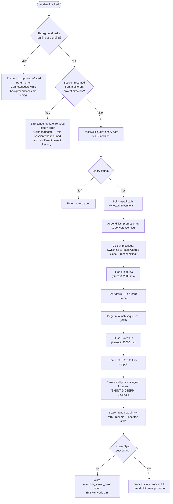

# `/update`

> Analysis basis: CC v2.1.133 bundle.js (AST extraction + Claude interpretation)
> Minimum version: v2.1.133

---

## Overview

The `/update` slash command upgrades Claude Code to the latest available version while preserving the active conversation. It performs a coordinated in-process relaunch: it validates preconditions, flushes all pending I/O, tears down the current runtime, and replaces the running process via `spawnSync` with the newly installed binary, automatically resuming the prior session via `--resume`.

---

## Registration

| Field | Value |
|---|---|
| type | `local` |
| name | `update` |
| description | `Switch to the latest version (conversation continues)` |
| supportsNonInteractive | `false` |
| isHidden | `true` |
| module_id | `cOq` |

Analysis basis: CC v2.1.133 bundle.js:+11354763

---

## Input Branching

The command handler performs a series of blocking precondition checks before initiating the update sequence. Each failed check emits a refusal event and returns early with a user-visible error message.



---

## Behavioral Spec

### Precondition — Background Task Guard

Before any update action is taken, the handler inspects the current set of background tasks. Any task whose state is `"running"` or `"pending"` blocks the update.

```
function checkBackgroundTasksAllowUpdate(appState):
    for each task in Object.values(appState.backgroundTasks):
        if task.status == "running" OR task.status == "pending":
            emitTelemetry("tengu_update_refused")
            return Error(
                "Cannot /update while background tasks are running" +
                " — wait for them to finish, then try again."
            )
    return OK
```

Analysis basis: CC v2.1.133 bundle.js:+11352664, +11352887, +11352925, +11352947, +11353028

---

### Precondition — Resumed-Session Directory Guard

The handler checks whether the active session was resumed from a project directory that differs from the current working directory. If so, an in-process relaunch cannot safely reconstruct the correct working context.

```
function checkResumedSessionDirectory(appState):
    if sessionWasResumedFromDifferentDirectory(appState):
        emitTelemetry("tengu_update_refused")
        return Error(
            "Cannot /update — this session was resumed from a different" +
            " project directory. Restart manually with --resume to" +
            " continue on the latest version."
        )
    return OK
```

Analysis basis: CC v2.1.133 bundle.js:+11353269

---

### Binary Resolution

The command locates the active `claude` executable using `Bun.which`. It then derives the versioned install path by joining `~/.local/bin` with a `versions` subdirectory component.

```
function resolveBinaryPath():
    executableName = "claude"                        // literal at +11352567
    resolved = Bun.which(executableName)             // call at +1000120
    if resolved == null:
        return Error("claude binary not found")

    versionedDir = path.join(
        homedir(), ".local", "bin", "versions"       // literals at +7400277, +7400286, +7756450
    )
    return { resolved, versionedDir }
```

Analysis basis: CC v2.1.133 bundle.js:+11352564, +1000163, +1000120, +7756450, +7400277, +7400286

---

### Conversation State Preservation

Before teardown, the handler appends a `"last-prompt"` marker entry to the active conversation log so that the resumed session can reconstruct context from the correct point.

```
function preserveConversationState(conversationLog, appState):
    entry = buildLastPromptEntry(appState)           // RRA → A.appendEntry at +11818473
    conversationLog.appendEntry("last-prompt", entry) // literal at +11818493
    sessionId = generateUUID()                        // QOq → _D8.randomUUID at +11351655
    return sessionId
```

Analysis basis: CC v2.1.133 bundle.js:+11353487, +11818473, +11818493, +11351655

---

### Bridge Flush and SDK Teardown

The handler signals the user with a status message, then performs an ordered shutdown of the I/O bridge before spawning the replacement process.

```
function flushAndTeardown(outputBridge):
    displayText("Switching to latest Claude Code… reconnecting")
                                                     // literal at +11353761

    // Phase 1: bridge flush with 2000 ms soft deadline
    await raceWithTimeout(
        outputBridge.flush(),                        // call at +11353831
        timeoutMs = 2000,                            // literal at +11353841
        label    = "bridge flush"                    // literal at +11353846
    )

    // Phase 2: SDK stream teardown
    outputBridge.writeSdkMessages(stopPayload)       // call at +11353737
    outputBridge.teardown()                          // call at +11353882
```

Analysis basis: CC v2.1.133 bundle.js:+11353761, +11353831, +11353841, +11353846, +11353737, +11353882

---

### Relaunch Sequence

The relaunch function (`xDH`) is the core of the update mechanism. It handles final cleanup, UI unmounting, signal handler removal, synchronous process replacement, and error recording.

```
function relaunchProcess(resolvedBinaryPath, sessionId):

    // 1. Stat the resolved binary to confirm it exists on disk
    stat = fs.stat(resolvedBinaryPath)               // call at +11089650

    // 2. Flush remaining output and clean up with a hard 30 000 ms deadline
    await Promise.all([
        raceWithTimeout(flush(), 30000, "flush timeout (relaunch)"),
                                                     // literals at +11089765, +11089771
        raceWithTimeout(cleanup(), timeout, "cleanup timeout")
                                                     // literal at +11089827
    ])                                               // call at +11089744

    // 3. Unmount terminal UI; write final sync output
    unmountUI()                                      // FUH → H.unmount at +5050532
    writeSync(finalOutput)                           // FUH → UUH.writeSync at +5050455

    // 4. Emit scroll-summary telemetry for the outgoing session
    emitTelemetry("tengu_scroll_summary")            // at +5051913

    // 5. Remove inherited signal handlers so the child does not inherit them
    process.removeAllListeners("SIGINT")             // literals at +11090090
    process.removeAllListeners("SIGTERM")            //             +11090099
    process.removeAllListeners("SIGHUP")             //             +11090109
    process.on("beforeExit", noopHandler)            // literal at +11090269
    process.on("exit", noopHandler)                  // literal at +11090310

    // 6. Synchronously replace the running process
    result = child_process.spawnSync(
        resolvedBinaryPath,
        ["--resume", sessionId],                     // literal at +11089703
        { stdio: "inherit" }                         // literal at +11090211
    )                                                // call at +11090176

    // 7. Handle spawn failure
    if result indicates error:
        writeRelaunchSpawnError(                     // oT → qkH.writeFileSync at +150866
            label = "relaunch_spawn_error"           // literal at +11090405
        )
        process.exit(128)                            // literal at +11090542

    // 8. Hand off execution to the new process
    process.exit()   // or process.kill(pid, signal) // calls at +11090429, +11090494
```

Analysis basis: CC v2.1.133 bundle.js:+11089574, +11089650, +11089703, +11089726, +11089732, +11089744, +11089757, +11089765, +11089771, +11089816, +11089827, +11090015, +11090090, +11090099, +11090109, +11090119, +11090149, +11090176, +11090211, +11090231, +11090269, +11090310, +11090402, +11090405, +11090429, +11090494, +11090542

---

### App State Mutation

After preconditions pass and before the flush phase, the handler reads and patches the application state to record that an update is in flight.

```
function markUpdateInProgress(stateAccessor):
    current = stateAccessor.getAppState()            // call at +11353515
    patched = applyUpdateFlag(current)               // ly at +11353594
    stateAccessor.setAppState(patched)               // call at +11353651
```

Analysis basis: CC v2.1.133 bundle.js:+11353515, +11353594, +11353651

---

### Error Output Formatting

If the update fails at any stage (precondition refusal, binary not found, spawn error), a formatted error block is produced and dim-styled for the terminal.

```
function formatUpdateError(reason):
    lines = [
        String(reason),
        "",
        "report the issue at https://github.com/anthropics/claude-code/issues",
                                                     // literal at +11354235
    ]
    return dimStyle(lines.join("\n"))                // M6.dim call at +11354191
```

Analysis basis: CC v2.1.133 bundle.js:+11354054, +11354191, +11354235

---

## State & Side Effects

| Item | Detail |
|---|---|
| Telemetry — update refused | `tengu_update_refused` fired on every precondition failure (background tasks running, wrong-directory resume). Analysis basis: bundle.js:+11352664 |
| Telemetry — scroll summary | `tengu_scroll_summary` fired during relaunch cleanup, capturing the outgoing session's scroll state. Analysis basis: bundle.js:+5051913 |
| App state mutation | `A.getAppState` / `A.setAppState` called to set an in-flight update flag before teardown. Analysis basis: bundle.js:+11353515, +11353651 |
| Conversation log | A `"last-prompt"` entry is appended to the conversation log so the resumed process can restore context. Analysis basis: bundle.js:+11818493 |
| SDK output stream | `O.writeSdkMessages` + `O.teardown` called to drain and close the outgoing SDK stream. Analysis basis: bundle.js:+11353737, +11353882 |
| Bridge flush | `O.flush` called with a 2 000 ms soft timeout before teardown. Analysis basis: bundle.js:+11353831, +11353841 |
| Signal handlers | All listeners for `SIGINT`, `SIGTERM`, and `SIGHUP` removed from the current process before `spawnSync`. Analysis basis: bundle.js:+11090090, +11090099, +11090109 |
| UI unmount | Terminal UI is synchronously unmounted via `H.unmount` before the new process is launched. Analysis basis: bundle.js:+5050532 |
| Relaunch spawn error record | On `spawnSync` failure, an error record is written to disk via `qkH.writeFileSync` with label `"relaunch_spawn_error"`. Analysis basis: bundle.js:+11090405, +150866 |
| Process replacement | `process.exit` / `process.kill` terminates the current process after `spawnSync` completes, with exit code `128` on spawn failure. Analysis basis: bundle.js:+11090429, +11090494, +11090542 |
| Sound | <!-- TODO: not found in depth-2 traversal; needs --depth 4 --> |

---

## Version History

| Version | Change |
|---|---|
| v2.1.133 | Initial analysis. Command is hidden (`isHidden: true`); does not support non-interactive mode. |

---

## Common Mistakes

1. **Running `/update` while background tasks are active.** The command will immediately refuse with a message asking you to wait. Check that all background agents have finished before invoking `/update`. Analysis basis: bundle.js:+11353028

2. **Running `/update` inside a session resumed from a different project directory.** The relaunch cannot reconstruct the original working context. The command refuses with an explicit instruction to restart manually using `--resume`. Analysis basis: bundle.js:+11353269

3. **Expecting `/update` to work in non-interactive mode.** The `supportsNonInteractive` field is `false`; calling this command from a script or pipe will not function as intended. Analysis basis: bundle.js:+11354763

4. **Assuming `/update` appears in the slash-command menu.** The command is registered as hidden (`isHidden: true`) and will not surface in autocomplete or help listings. Analysis basis: bundle.js:+11354763

5. **Interrupting the process during the flush window.** The bridge flush has only a 2 000 ms soft deadline, and the full relaunch cleanup has a 30 000 ms hard deadline. Sending `SIGINT` or `SIGTERM` during this window may leave the conversation log in an inconsistent state, because signal handlers are removed partway through the sequence. Analysis basis: bundle.js:+11353841, +11089765, +11090090

---

## Appendix — Identifier Mapping

> For bundle debugging only. Identifiers change across versions.

| Identifier | Role |
|---|---|
| `LD8` | Top-level update command handler / entry point |
| `pM` | Binary resolution wrapper (calls `eK_` → `Bun.which`) |
| `eK_` | `Bun.which` invocation helper for locating the `claude` executable |
| `pu` | Versioned install-path builder (joins `.local/bin/versions`) |
| `Cq8` | Path segment assembly helper used by `pu` |
| `At` | Secondary path joiner (`.local` + `bin` segments) |
| `UM` | Array normalization utility (`Array.isArray` guard) |
| `Cw7` | Core update orchestrator (precondition checks → flush → relaunch) |
| `E9` | Process-mode classifier (checks for `bg`, `daemon`, `daemon-worker`) |
| `hr` | Mode string provider used by `E9` |
| `d` | General-purpose logger / diagnostic emitter |
| `vW` | Basename-based binary identity resolver (`Cj.basename`) |
| `v6` | Async error propagation / rejection helper |
| `il` | File-system path utility (used in multiple places) |
| `ZSA` | Directory creation helper (`F5q.dirname` + `L$` + `uK`) |
| `LA` | Directory existence check used by `ZSA` |
| `uK` | Recursive mkdir implementation used by `ZSA` |
| `be` | Conversation state serializer |
| `yn` | Hook-set membership checker (`hG7.has`, `FY8`) |
| `FY8` | Hook registry map |
| `RRA` | Last-prompt entry appender (`A.appendEntry`, `"last-prompt"`) |
| `RK` | Conversation log record builder |
| `A` | App-state accessor object (`getAppState`, `setAppState`, `appendEntry`) |
| `fH` | Network traffic / request queue manager (`essential-traffic`, error logging) |
| `HA` | Error construction wrapper |
| `kH` | String coercion utility |
| `yq` | Traffic channel selector (`J9_`) |
| `NJL` | Request queue shift/push manager (`AN6.shift`, `AN6.push`) |
| `ly` | App-state update-flag patcher |
| `O` | SDK output bridge object (`writeSdkMessages`, `flush`, `teardown`) |
| `d8` | SDK `"stopped"` / `"background session"` message builder |
| `QOq` | UUID generator wrapper (`_D8.randomUUID`) |
| `FM` | Race-with-timeout utility (`setTimeout`, `Promise.race`, `clearTimeout`) |
| `xDH` | Full relaunch execution function (stat, flush, unmount, spawnSync, exit) |
| `Sf6` | Pre-unmount finalizer (`ffA`) |
| `FUH` | UI unmount and sync-write coordinator (`UUH.writeSync`, `H.unmount`, `Fk`, `wl6`) |
| `kt6` | Scroll-summary emitter (`tengu_scroll_summary`, `nT`, `Wo1`, `Po1`, `s_`) |
| `IT` | Post-relaunch conversation record writer (`RK`) |
| `mNH` | Parallel cleanup runner (`Promise.all`, `Array.from`, `H`) |
| `oT` | Spawn-error record writer (`qkH.writeFileSync`, `tG8.join`) |