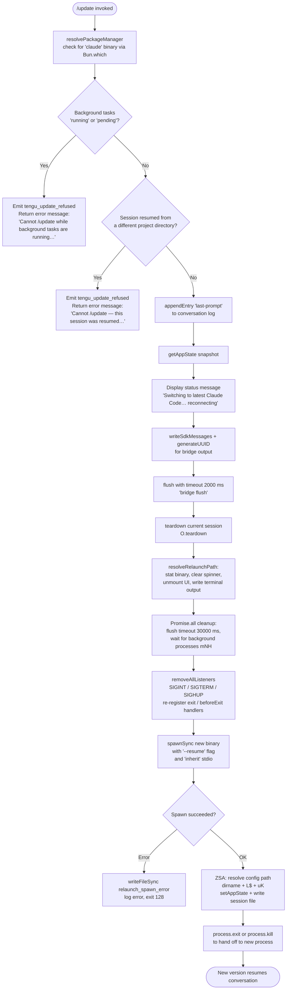

# `/update`

> Analysis basis: CC v2.1.133 bundle.js (AST extraction + Claude interpretation)
> Minimum version: v2.1.133

---

## Overview

The `/update` command performs an in-process upgrade of Claude Code to the latest available version without terminating the current conversation. It resolves the new binary, validates that preconditions are met (no active background tasks, no cross-project resume), tears down the current session, and re-executes the process via `spawnSync` so the conversation resumes seamlessly on the new version.

---

## Registration

| Field | Value |
|---|---|
| `type` | `local` |
| `name` | `update` |
| `description` | `"Switch to the latest version (conversation continues)"` |
| `isHidden` | `true` |
| `supportsNonInteractive` | `false` |
| `module_id` | `cOq` |
| `load_inline` | `true` |
| `loc_byte` | `11354763` |
| `loc_byte_end` | `11354965` (registration block spans bytes `11354763`–`11354965`) |
| `loc_line` | `7115` |
| `arbor_handler.name` | `Cw7` |
| `arbor_handler.fqn` | `claude-2.1.133::Cw7` |
| `arbor_handler.kind` | `AsyncFunction` |
| `arbor_handler.resolution_path` | `module_id` (Arbor followed `module_id` → `cOq` → exports → `Cw7`) |
| `arbor_handler.n_hits` | `0` |

Analysis basis: CC v2.1.133 bundle.js:+11354763

---

## Input Branching

The command has more than three distinct branching paths (background-task check, cross-project resume check, binary path resolution, flush/teardown, spawn), so a Mermaid flowchart is used.



Analysis basis: CC v2.1.133 bundle.js:+11352650 – +11354191

---

## Behavioral Spec

### 1. Pre-flight: Binary and Package Manager Resolution

Before any state change, the handler calls the package-manager resolver (`pM`) which in turn invokes the `eK_` helper. `eK_` uses `Bun.which` to locate the `"claude"` binary on the system path.

```
function resolveBinary():
    packageManager = resolvePackageManager()          # pM → eK_ → Bun.which("claude")
    binaryPath = packageManager.which("claude")       # literal "claude" at +11352567
    return binaryPath
```

Analysis basis: CC v2.1.133 bundle.js:+11352564, +11352567, +1000120

The installation path helper (`pu`) builds the versioned binary directory by:
1. Calling the home-directory resolver (`o18` → `hJ9.homedir`).
2. Joining `~/.local/share/` (literals `".local"` at +7400207, `"share"` at +7400216).
3. Appending `"versions"` (+7756450) and `"bin"` (+7400286) segments via `_O6.join`.

```
function buildVersionedBinDir(version):
    home = os.homedir()                               # hJ9.homedir
    versionsRoot = path.join(home, ".local", "share", "versions")
    binDir = path.join(versionsRoot, version, "bin")
    return binDir
```

Analysis basis: CC v2.1.133 bundle.js:+7756552, +7400165, +7400207, +7400216, +7756450, +7400286

---

### 2. Pre-flight: Background Task Guard

The handler inspects active task states using `Object.values` over the tasks map (+11352887) and checks for tasks in states `"running"` (+11352925) or `"pending"` (+11352947).

```
function checkBackgroundTasks(taskMap):
    activeStates = ["running", "pending"]
    tasks = Object.values(taskMap)
    for task in tasks:
        if task.state in activeStates:
            emitTelemetry("tengu_update_refused")     # +11352664
            return Error("Cannot /update while background tasks are running — wait for them to finish, then try again.")
            # full literal at +11353028
    return OK
```

Analysis basis: CC v2.1.133 bundle.js:+11352887, +11352925, +11352947, +11353028

---

### 3. Pre-flight: Cross-Project Resume Guard

The handler checks whether the current session was resumed from a project directory different from the current working directory. If so, relaunch cannot safely continue.

```
function checkProjectDirectory(appState, currentCwd):
    if appState.resumedProjectDir != null
       and appState.resumedProjectDir != currentCwd:
        emitTelemetry("tengu_update_refused")         # +11352664
        return Error("Cannot /update — this session was resumed from a different project directory. Restart manually with --resume to continue on the latest version.")
        # full literal at +11353269
    return OK
```

Analysis basis: CC v2.1.133 bundle.js:+11353269

---

### 4. Conversation Persistence — Last-Prompt Append

Before teardown begins the handler appends the last user prompt back to the conversation log so the new process can resume it after restart.

```
function persistLastPrompt(conversationLog, lastPrompt):
    appendEntry = buildConversationEntry(
        role = "assistant-" + <suffix>,              # literal "assistant-" at +11353569
        entryType = "last-prompt"                    # literal at +11818493
    )
    conversationLog.appendEntry(appendEntry)          # A.appendEntry +11818473
```

Analysis basis: CC v2.1.133 bundle.js:+11353452, +11353487, +11818473, +11818493, +11353569

---

### 5. Status Message Emission and SDK Bridge Flush

The handler emits a user-visible status text message and then flushes the SDK bridge with a 2000 ms timeout.

```
function emitStatusAndFlush(outputChannel):
    message = buildTextMessage(
        content = "Switching to latest Claude Code… reconnecting",  # +11353761
        role    = "assistant",                                       # +11351631
        uuid    = generateUUID()                                     # QOq → _D8.randomUUID +11351655
    )
    writeSdkMessages(outputChannel, [message])        # O.writeSdkMessages +11353737

    flushWithTimeout(outputChannel,
        timeout_ms = 2000,                            # +11353841
        label      = "bridge flush"                   # +11353846
    )                                                 # FM → setTimeout + Promise.race + clearTimeout
```

Analysis basis: CC v2.1.133 bundle.js:+11353737, +11353757, +11353761, +11353828, +11353841, +11353846

---

### 6. Session Teardown

```
function teardownSession(session):
    appState = session.getAppState()                  # A.getAppState +11353515
    updatedState = computeUpdatedState(appState)      # ly +11353594
    session.setAppState(updatedState)                 # A.setAppState +11353651
    session.teardown()                                # O.teardown +11353882
```

Analysis basis: CC v2.1.133 bundle.js:+11353515, +11353594, +11353651, +11353882

---

### 7. Relaunch Path Resolution and Terminal UI Teardown (`xDH`)

The relaunch orchestrator (`xDH`) performs the following steps:

```
function relaunchOrchestrator(binaryPath, resumeArgs):
    # Resolve binary using pu (versioned path) + il (path helper)
    resolvedPath = resolveBinaryPath(binaryPath)      # pu + il +11089574, +11089581

    # Stat the binary to confirm it exists
    stat = fs.stat(resolvedPath)                      # U5q.stat +11089650

    # Clear the spinner / progress indicator
    clearSpinner()                                    # Sf6 → ffA → clearInterval +11089720

    # Unmount the React/Ink UI and write terminal output
    unmountUI()                                       # FUH → H.unmount +5050532
    writeTerminalOutput()                             # FUH → wl6 → go.writeSync +3528875
                                                      # includes ANSI save/restore cursor
                                                      # ESC7 (+3529009) / ESC8 (+3529020)

    # Update scroll summary metrics
    updateScrollSummary()                             # kt6 → Po1 → Date.now, Math.max, Math.round
                                                      # emits tengu_scroll_summary +5051913

    # Wait for all cleanup with dual timeout / background drain
    Promise.all([
        flushWithTimeout(30000, "flush timeout (relaunch)"),  # +11089765, +11089771
        drainBackgroundProcesses()                             # mNH → Promise.all + Array.from +11089816
    ])

    # Signal teardown
    process.removeAllListeners("SIGINT")              # +11090119 (also SIGTERM +11090099, SIGHUP +11090109)
    process.on("beforeExit", ...)                     # +11090269
    process.on("exit", ...)                           # +11090310

    # Spawn new binary
    result = child_process.spawnSync(resolvedPath,
        args  = ["--resume", ...resumeArgs],          # "--resume" literal +11089703
        stdio = "inherit"                             # +11090211
    )                                                 # p5q.spawnSync +11090176

    if result.error:
        writeErrorFile("relaunch_spawn_error", result.error)  # oT → qkH.writeFileSync +150866
                                                               # literal at +11090405
        process.exit(128)                             # +11090542

    # Write session state file for new process
    writeSessionFile(ZSA)                             # ZSA: il + LA + F5q.dirname + L$ + uK
                                                      # +11090231, +11090662

    process.exit(0)  # or process.kill to hand off    # +11090429 / +11090494
```

Analysis basis: CC v2.1.133 bundle.js:+11354071, +11089574, +11089650, +11089720, +11089726, +11089744, +11089757, +11089760, +11089816, +11090119, +11090176, +11090211, +11090231, +11090402, +11090429, +11090494, +11090542

---

### 8. Failure Fallback — Error Info Display

If the overall update flow encounters an unrecoverable error, the handler displays diagnostic information including the package name `"@anthropic-ai/claude-code"` (+11354318), documentation URL `"https://code.claude.com/docs/en/overview"` (+11354357), current version `"2.1.133"` (+11354408), the issue tracker URL `"https://github.com/anthropics/claude-code/issues"` (+11354435), and instructs the user to report the issue (+11354235). The build metadata (`2026-05-07T18:26:46Z` at +11354497, commit `cba57ffec4f5d5c279b5f66ea9d7a2544fa410ec` at +11354528) is included in diagnostics output rendered with `M6.dim` styling (+11354191).

Analysis basis: CC v2.1.133 bundle.js:+11354054, +11354191, +11354235, +11354318, +11354357, +11354408, +11354435, +11354497, +11354528

---

## State & Side Effects

| Item | Detail |
|---|---|
| Telemetry — `tengu_update_refused` | Emitted when either pre-flight guard blocks the update (background tasks running, or cross-project resume detected). Analysis basis: +11352664 |
| Telemetry — `tengu_scroll_summary` | Emitted during terminal UI teardown, capturing scroll metrics. Analysis basis: +5051913 |
| Telemetry — `tengu_amber_creek` | Emitted in the fullscreen-state path during terminal teardown. Analysis basis: +3195341 |
| Telemetry — `tengu_pewter_brook` | Emitted in an alternative fullscreen-detection branch during terminal teardown. Analysis basis: +3195249 |
| `A.appendEntry` | Appends the `"last-prompt"` entry so the new process can replay the last user turn on resume. Analysis basis: +11818473 |
| `A.getAppState` / `A.setAppState` | Snapshot-and-update of application state before teardown. Analysis basis: +11353515, +11353651 |
| `O.writeSdkMessages` | Writes the `"Switching to latest Claude Code… reconnecting"` status message to the SDK output bridge. Analysis basis: +11353737 |
| `O.flush` | Drains pending SDK bridge output before process replacement. Analysis basis: +11353831 |
| `O.teardown` | Full session teardown (closes streams, cleans resources). Analysis basis: +11353882 |
| `process.removeAllListeners` | Clears SIGINT, SIGTERM, SIGHUP handlers before re-exec. Analysis basis: +11090119 |
| `process.on` | Re-registers `beforeExit` and `exit` handlers to manage graceful shutdown in new process context. Analysis basis: +11090149, +11090269, +11090310 |
| `p5q.spawnSync` | Synchronously re-executes the new binary with `--resume` and `inherit` stdio. Analysis basis: +11090176 |
| `qkH.writeFileSync` | Writes a `relaunch_spawn_error` file if spawn fails. Analysis basis: +150866, +11090405 |
| `process.exit(128)` | Exit code on spawn failure. Analysis basis: +11090542 |
| Terminal UI | Spinner cleared (`clearInterval`), Ink UI unmounted (`H.unmount`), ANSI cursor save/restore sequences written (ESC7/ESC8). Analysis basis: +5051791, +5050532, +3529009, +3529020 |
| Fullscreen detection | During teardown, checks for tmux -CC / iTerm2 integration mode (+3194768) and Windows-over-SSH ConPTY (+3194954). Sets or disables fullscreen accordingly. |
| `isHidden` | The command does not appear in `/help` listings. |
| `supportsNonInteractive` | `false` — the command is blocked in non-interactive (piped / SDK) mode. |
| Flush timeout | 2000 ms for bridge flush (+11353841); 30000 ms for relaunch flush (+11089765). |

---

## Version History

| Version | Change |
|---|---|
| v2.1.133 | Initial analysis. Command is hidden (`isHidden: true`). Supports in-place re-exec with `--resume`. Two pre-flight guards: background task check and cross-project resume check. Flush timeouts: 2000 ms (bridge), 30000 ms (relaunch). Build timestamp `2026-05-07T18:26:46Z`, commit `cba57ffec4f5d5c279b5f66ea9d7a2544fa410ec`. |

---

## Common Mistakes

1. **Running `/update` while background tasks are active.** The command will refuse with an explicit error and emit `tengu_update_refused`. Wait for all background tasks to reach a terminal state before invoking `/update`.
2. **Invoking `/update` in a session that was resumed from a different project directory.** The cross-project resume guard will block the command. The user must exit and manually restart with `--resume` pointing to the correct project.
3. **Expecting `/update` to appear in `/help`.** The command is registered with `isHidden: true` and will not appear in user-facing command listings.
4. **Using `/update` in non-interactive (piped or SDK) mode.** `supportsNonInteractive: false` means the command is only available in interactive terminal sessions.
5. **Assuming instant completion.** The command performs a full session teardown, SDK bridge flush (up to 2000 ms), and process re-exec with a 30000 ms safety timeout before the new version appears.
6. **Expecting a new conversation.** The `--resume` flag is passed to the replacement process and the last prompt is persisted via `appendEntry`, so the conversation continues without a hard reset.

---

## Appendix — Identifier Mapping

> For bundle debugging only. Identifiers change across versions.

| Identifier | Role |
|---|---|
| `Cw7` | Main async handler for `/update` (Arbor-resolved entry point, `AsyncFunction`) |
| `LD8` | Pre-flight checker (binary resolution + background task guard entry) |
| `pM` | Package manager resolver (calls `eK_` → `Bun.which`) |
| `eK_` | Binary locator (wraps `Bun.which`) |
| `pu` | Versioned binary directory path builder (uses home dir + `.local/share/versions/bin`) |
| `Cq8` | Versioned path join helper (uses `Hz6.join`, `r$H`, `UM`) |
| `UM` | Array-shape normaliser (`Array.isArray` guard) |
| `r$H` | Home-relative path resolver (calls `o18` + `_O6.join`) |
| `o18` | Home directory getter (wraps `hJ9.homedir`) |
| `At` | Binary subdirectory path builder (calls `o18` + `_O6.join`) |
| `E9` | Telemetry emitter for `tengu_update_refused` |
| `hr` | Underlying telemetry dispatch helper |
| `d` | General utility / logger |
| `vW` | Filename extractor (uses `Cj.basename` + `v6`) |
| `v6` | Path/string utility |
| `il` | Path helper (used in binary path resolution and session file write) |
| `ZSA` | Session-file writer (uses `il`, `LA`, `F5q.dirname`, `L$`, `uK`) |
| `LA` | Config/state directory locator |
| `uK` | Session filename builder |
| `be` | State accessor helper |
| `yn` | Background-task state inspector (uses `FY8`, `hG7.has`) |
| `FY8` | Task-state enumeration helper |
| `RRA` | Last-prompt append orchestrator (calls `RK`, `A.appendEntry`, `v6`) |
| `RK` | Conversation log entry builder |
| `y1` | Entry mutation helper (uses `Qoq`, `d08.add/delete`, `Object.assign`) |
| `Qoq` | Entry initialiser |
| `A` | App-state / conversation-log interface (`getAppState`, `setAppState`, `appendEntry`) |
| `fH` | Network/stream error handler (uses `HA`, `kH`, `yq`, `NJL`, `cyH.push`, `yQ.logError`) |
| `HA` | Error normaliser (`Error` + `String`) |
| `kH` | String coercion helper |
| `yq` | Stream error classifier (calls `J9_`) |
| `J9_` | Error-type resolver |
| `NJL` | Rolling-buffer manager (`AN6.shift` + `AN6.push`) |
| `ly` | App-state mutation function |
| `O` | SDK output channel interface (`writeSdkMessages`, `flush`, `teardown`) |
| `d8` | SDK output channel implementation |
| `QOq` | UUID generator (wraps `_D8.randomUUID`) |
| `FM` | Timed-flush helper (`setTimeout` + `Promise.race` + `clearTimeout`) |
| `xDH` | Relaunch orchestrator (binary stat, UI teardown, spawnSync, session file write) |
| `Sf6` | Spinner/progress-indicator clearer (calls `ffA` → `clearInterval`) |
| `ffA` | `clearInterval` wrapper |
| `FUH` | Terminal UI teardown (unmount Ink, write output, calls `wl6`, `kH`) |
| `H` | Ink renderer / UI root (`unmount`, `replaceAll`; also `Math.random` + `setTimeout` for animation) |
| `Fk` | Terminal write helper |
| `wl6` | Terminal output writer (ANSI sequences, `go.writeSync`, `Zc6`, `I2H`, `NE`) |
| `Zc6` | Terminal capability checker (`g01.coerce`, `o0`; detects Ghostty ≥1.2.0, iTerm ≥3.6.6) |
| `I2H` | Additional terminal output helper |
| `NE` | ANSI escape normaliser (`H.replaceAll` using ESC+ESC literal) |
| `kt6` | Scroll-summary metric recorder (calls `nT`, `Wo1`, `d`, `Po1`, `s_`; emits `tengu_scroll_summary`) |
| `nT` | Scroll position reader |
| `Wo1` | Scroll metric accumulator |
| `Po1` | Metric calculator (`Date.now`, `Math.max`, `Math.round`, `Object.assign`, `Xo1`) |
| `Xo1` | Metric storage helper |
| `s_` | Fullscreen / terminal-state manager (calls `CyH`, `fHA`, `kH`, `Cd`, `k`, `KL6`, `mA`, `Q0K`, `J6`) |
| `CyH` | Terminal-type set checker (`JwL.has`) |
| `fHA` | Fullscreen precondition evaluator (`Zq`, `kH`) |
| `Cd` | Fullscreen state writer (`g0K`) |
| `k` | Terminal-capability renderer (ANSI, `NsH`, `Ztq`, `H.includes`, `SH`, `A.toUpperCase`, `Uf`, `H.trim`, `dN`, `LkH`, `vtq`) |
| `KL6` | Fullscreen-guard for Windows (`a6`, `Boolean`) |
| `mA` | Fullscreen-disable logger (`db`) |
| `Q0K` | Fullscreen completion callback router (`J6`) |
| `J6` | Render-cycle scheduler (`Bq6`, `gq6`, `Po`, `b5H.has`, `_d6`, `pq6.add`, `cU.has/get`, `R6`) |
| `IT` | Background-process interrupt helper (calls `RK`) |
| `mNH` | Background-process drainer (`Promise.all` + `Array.from` + `H`) |
| `oT` | Error-file writer (`qkH.writeFileSync` + `tG8.join`; records `relaunch_spawn_error`) |

---

Note: index built via Arbor fallback; some signals (telemetry, literals) may be missing — see arbor-fallback.js.