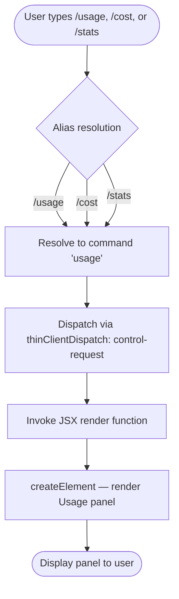

# `/usage`

> Analysis basis: CC v2.1.133 bundle.js (AST extraction + Claude interpretation)
> Minimum version: v2.1.133

---

## Overview

The `/usage` command renders a JSX panel displaying session cost, plan usage, and activity statistics for the current Claude Code session. It is a read-only, display-only command that produces no side effects on application state and emits no telemetry events. The command is aliased as `/cost` and `/stats`, all three aliases triggering identical behavior.

---

## Registration

| Field | Value |
|---|---|
| type | `local-jsx` |
| name | `usage` |
| description | `Show session cost, plan usage, and activity stats` |
| aliases | `["cost", "stats"]` |
| thinClientDispatch | `control-request` |
| module_id | `I5q` |

Analysis basis: CC v2.1.133 bundle.js:+11073352

---

## Input Branching

The command accepts no user-supplied arguments. Regardless of which alias (`/usage`, `/cost`, `/stats`) is used to invoke it, the implementation unconditionally delegates to the same JSX rendering function. There is no conditional branching based on input.



Analysis basis: CC v2.1.133 bundle.js:+11072687, +11072745, +11072761

---

## Behavioral Spec

### JSX Panel Rendering

The command's sole implementation function constructs and returns a JSX element tree representing the usage panel. No arguments are consumed from the slash-command input. The rendered panel presents at minimum two labeled sections, identified by the string constants `"Stats"` and `"Usage"` found in the implementation.

```
function renderUsagePanel():
    statsSection  = createElement(StatsComponent,  label="Stats")
    usageSection  = createElement(UsageComponent,  label="Usage")
    panel         = createElement(PanelContainer, [statsSection, usageSection])
    return panel
```

Analysis basis: CC v2.1.133 bundle.js:+11072687 (createElement call), +11072753 (`"Stats"` literal), +11072761 (`"Usage"` literal), +11072745 (`"stats"` identifier literal)

### Dispatch Mechanism

Because the registration field `thinClientDispatch` is set to `"control-request"`, the command's output is routed through the control-request dispatch path rather than being streamed as a model turn. This means the panel is rendered locally in the CLI process without a round-trip to the Anthropic API.

Analysis basis: CC v2.1.133 bundle.js:+11073352

### Alias Handling

The registration declares two aliases in addition to the canonical name:

| Invocation | Resolves to |
|---|---|
| `/usage` | canonical |
| `/cost` | alias → `usage` |
| `/stats` | alias → `usage` |

All three invocations produce identical output. The string literal `"stats"` at bundle offset +11072745 corresponds to the alias entry; it does not gate any conditional logic.

Analysis basis: CC v2.1.133 bundle.js:+11072745, +11073352

---

## State & Side Effects

| Item | Detail |
|---|---|
| Telemetry | None — `telemetry` array is empty; no `tengu_*` events are emitted |
| Hook registration | <!-- TODO: not found in depth-2 traversal; needs --depth 4 --> |
| appState changes | None detected at depth-2 traversal |
| Sound | <!-- TODO: not found in depth-2 traversal; needs --depth 4 --> |
| API round-trip | None — dispatched as `control-request` (local rendering) |
| Persistence | None detected at depth-2 traversal |

---

## Version History

| Version | Change |
|---|---|
| v2.1.133 | Initial analysis — `local-jsx`, `control-request` dispatch, aliases `cost` and `stats`, no telemetry |

---

## Common Mistakes

1. **Expecting model output**: Because `thinClientDispatch` is `"control-request"`, invoking `/usage` does not produce a streamed model response. Callers that wait for a message-turn response will time out or receive nothing from the model layer.
2. **Treating aliases as distinct commands**: `/cost` and `/stats` are pure aliases. Any tooling that inspects the command registry by canonical name only will miss invocations made through these aliases.
3. **Expecting telemetry coverage**: Unlike many other slash commands, `/usage` emits zero telemetry events. Dashboards or test suites that rely on `tengu_*` events to confirm command execution will not receive a signal from this command.
4. **Passing arguments**: The command registration and call graph show no argument-parsing logic. Any tokens typed after `/usage` are silently ignored rather than raising an error.
5. **Assuming network latency**: Because the panel is rendered locally via `local-jsx` + `control-request`, response time is bounded by local rendering, not by API latency. Latency budgets designed for model-turn commands do not apply here.

---

## Appendix — Identifier Mapping

> For bundle debugging only. Identifiers change across versions.

| Identifier | Role |
|---|---|
| `ZO7` | Usage panel JSX render function — the top-level component factory for the `/usage` command; calls `PSA.createElement` to construct the display panel |