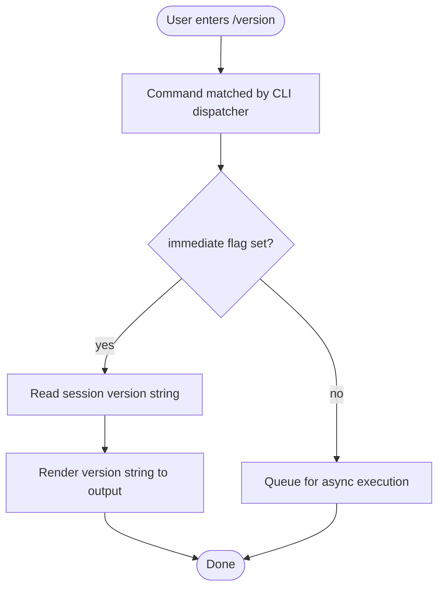

```
---
type: feature-spec
feature: "version"
cc_version: 2.1.133
updated: "2026-05-18"
tags: ["version", "commands", "slash-commands"]
source: "bundle-analysis"
bundle_verified: true
inherited_from: 2.1.132
analysis_basis: "CC v2.1.132 bundle.js (AST extraction + Claude interpretation)"
author: "ryujaeuk <ryujaeuk@gmail.com>"
repository: "https://github.com/MyLittleLuckyDog/cc-gnothi"
license: "AGPL-3.0-only"
---

# `/version`

> Analysis basis: CC v2.1.132 bundle.js (AST extraction + Claude interpretation)
> Minimum version: v2.1.132

---

## Overview

The `/version` command prints the version string of the currently running Claude Code session. It explicitly reports the version that was used to start the session, not any newer version that may have been downloaded in the background by the auto-update mechanism. Because it is registered with `immediate: true`, it executes and renders output without waiting for any asynchronous operation.

---

## Registration

| Field | Value |
|---|---|
| type | `local-jsx` |
| name | `version` |
| description | `Print the version this session is running (not what autoupdate downloaded)` |
| immediate | `true` |

Analysis basis: CC v2.1.132 bundle.js:+11277970

---

## Input Branching

Because the AST traversal returned an empty call graph and no extracted literals, no conditional branching paths were observed at depth ≤ 2. The command appears to follow a single, unconditional execution path: read the session version value and render it.



> Note: The `immediate: true` flag is confirmed in registration data.
> Analysis basis: CC v2.1.132 bundle.js:+11277970
> The `E` branch (async queuing) is the general-case path for non-immediate commands and is shown for completeness; `/version` always takes the `C -- yes` path.

---

## Behavioral Spec

### Session Version Retrieval and Rendering

Because the depth-2 call graph traversal returned no call edges and no string or numeric literals, the precise internal function names and the exact source of the version value (e.g., a compiled-in constant, a package manifest read, or a process environment variable) could not be confirmed from the extracted data.

```
function handleVersionCommand():
    sessionVersion = readSessionVersionString()
    // sessionVersion is the version active in this running process,
    // not the version downloaded by the auto-updater.
    renderOutput(sessionVersion)
    return
```

The command type is `local-jsx`, meaning the output is rendered as a JSX component rather than plain text. The rendered component receives `sessionVersion` as its data.

Analysis basis: CC v2.1.132 bundle.js:+11277970

### Immediate Execution Semantics

Commands registered with `immediate: true` are dispatched and their output is rendered synchronously within the command-handling cycle, without being placed in an asynchronous work queue. For `/version` this means the version string appears in the interface before any pending background tasks complete.

```
function dispatchCommand(command):
    if command.immediate == true:
        result = command.handler()
        renderResult(result)
    else:
        enqueueAsyncWork(command)
```

Analysis basis: CC v2.1.132 bundle.js:+11277970

### Auto-Update Version Distinction

The registration description explicitly states the version printed is the one **this session is running**, not what the auto-updater has downloaded. This implies the CLI maintains at least two distinct version values at runtime: the active session version and the pending auto-update version. `/version` exposes only the active session version.

<!-- TODO: the identity of the auto-update version store and the mechanism by which the session version is kept separate were not found in the depth-2 traversal; needs --depth 4 -->

---

## State & Side Effects

| Item | Detail |
|---|---|
| Telemetry | None detected (telemetry array is empty at depth ≤ 2) |
| Hook registration | <!-- TODO: not found in depth-2 traversal; needs --depth 4 --> |
| appState changes | None observed; command is read-only |
| Sound | None observed |
| Auto-update side effect | None; command reads version, does not trigger or suppress update |
| Network | None; no outbound calls observed |

---

## Version History

| Version | Change |
|---|---|
| v2.1.132 | Initial analysis |

---

## Common Mistakes

1. **Confusing session version with auto-update version.** The value printed by `/version` is the version of the running process. If the auto-updater has already downloaded a newer release in the background, that newer version number will _not_ appear until the process is restarted. Do not rely on `/version` output to confirm whether an auto-update has been applied.

2. **Expecting `/version` to block or await anything.** Because `immediate: true` is set, the command renders output synchronously. Any assumption that it waits for network checks, update polls, or async state hydration before printing is incorrect.

3. **Treating the output as a semver API.** The version string format is not specified in the extracted data. Parsing it programmatically in scripts may break across releases if the format changes.

---

## Appendix — Identifier Mapping

> For bundle debugging only. Identifiers change across versions.

| Identifier | Role |
|---|---|
| _(none)_ | No obfuscated identifiers were present in the depth-2 AST extraction for this command. |
```