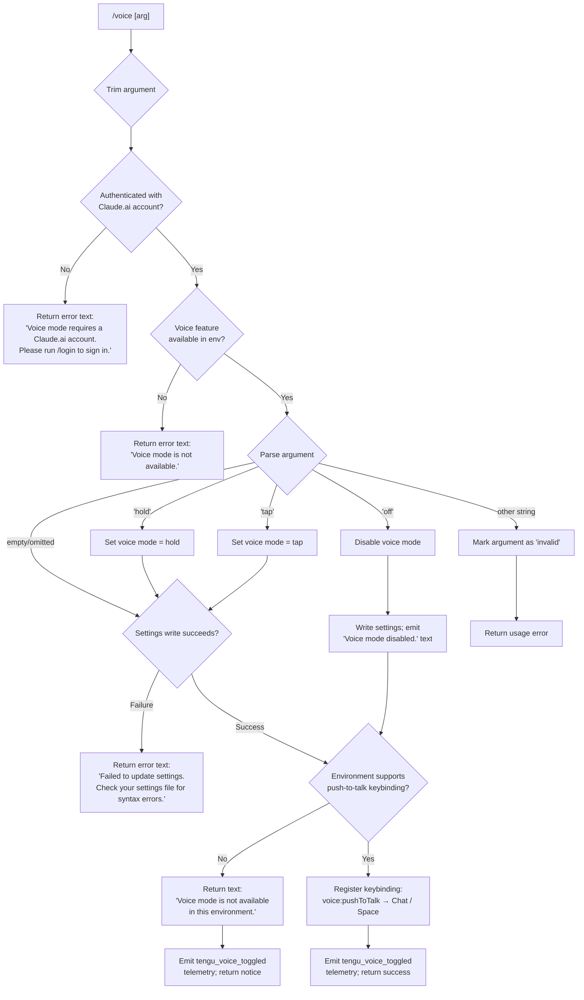

# `/voice`

> Analysis basis: CC v2.1.133 bundle.js (AST extraction + Claude interpretation)
> Minimum version: v2.1.133

---

## Overview

The `/voice` slash command toggles voice mode in Claude Code, accepting an optional argument of `hold`, `tap`, or `off` to set the interaction style. It validates authentication (requires a Claude.ai account), checks environment availability, and persists the chosen mode to settings — emitting a telemetry event on every successful toggle.

## Registration

| Field | Value |
|---|---|
| type | `local` |
| name | `voice` |
| description | `Toggle voice mode` |
| argumentHint | `[hold\|tap\|off]` |
| supportsNonInteractive | `false` |
| module_id | `DJq` |

Analysis basis: CC v2.1.133 bundle.js:+11629305

---

## Input Branching

The command handler (`commandHandler`) performs a multi-stage decision tree before committing a voice-mode change.



Analysis basis: CC v2.1.133 bundle.js:+11626759, +11626770, +11626984, +11627051, +11627299, +11627416, +11627525, +11628566, +11628700

---

## Behavioral Spec

### Argument Parsing

```
function parseVoiceArgument(rawInput):
    arg = rawInput.trim()          // Analysis basis: +11627051
    if arg == "hold":              // Analysis basis: +11626676
        return "hold"
    elif arg == "tap":             // Analysis basis: +11626688
        return "tap"
    elif arg == "off":             // Analysis basis: +11626699
        return "off"
    elif arg == "":
        return null                // no-arg → toggle/cycle behaviour
    else:
        return "invalid"           // Analysis basis: +11626720
```

Analysis basis: CC v2.1.133 bundle.js:+11626676

---

### Authentication Guard

```
function checkVoiceAuthEligibility(appState):
    isAuthenticated = getOAuthTokenPresence(appState)   // calls accountStateReader
    if not isAuthenticated:
        return ErrorResult(
            type = "text",
            text = "Voice mode requires a Claude.ai account. Please run /login to sign in."
        )                          // Analysis basis: +11626800
    return null                    // proceed
```

Analysis basis: CC v2.1.133 bundle.js:+11626787, +11626800

---

### Availability Check

```
function checkVoiceAvailability(appState):
    available = resolveVoiceFeatureFlag(appState)       // calls featureFlagReader
    if not available:
        return ErrorResult(
            text = "Voice mode is not available."
        )                          // Analysis basis: +11626899
    return null
```

Analysis basis: CC v2.1.133 bundle.js:+11626899

---

### Settings Persistence

The command delegates to the settings-write subsystem (`settingsWriter`) to persist the new voice mode value.

```
function persistVoiceMode(parsedArg):
    try:
        settings = loadSettingsFromDisk()              // calls settingsLoader
        if parsedArg == "off":
            settings.voiceMode = disabled
        elif parsedArg in ["hold", "tap"]:
            settings.voiceMode = parsedArg
        else:
            settings.voiceMode = toggle(settings.voiceMode)

        writeResult = saveSettingsToDisk(settings)    // calls atomicSettingsWriter
        return writeResult
    catch ParseError:
        return ErrorResult(
            text = "Failed to update settings. Check your settings file for syntax errors."
        )                          // Analysis basis: +11627218
```

Settings files involved (resolved at runtime):

| Key | File |
|---|---|
| `userSettings` | `~/.claude/settings.json` (Analysis basis: +1161120, +1161364, +1161374) |
| `localSettings` | `<project>/.claude/settings.local.json` (Analysis basis: +1161190, +1161436) |
| `projectSettings` | `<project>/.claude/settings.json` (Analysis basis: +1161168) |
| `policySettings` | managed policy layer (Analysis basis: +1165169) |
| `flagSettings` | feature-flag layer (Analysis basis: +1165191) |

Analysis basis: CC v2.1.133 bundle.js:+11627218

---

### Disable Path

```
function handleVoiceOff():
    persistVoiceMode("off")
    emitText("Voice mode disabled.")          // Analysis basis: +11627356
    emitTelemetry("tengu_voice_toggled")      // Analysis basis: +11627301
```

Analysis basis: CC v2.1.133 bundle.js:+11627356

---

### Environment / Push-to-Talk Check

After a successful settings write (for `hold` or `tap`), the handler checks whether the host environment supports the push-to-talk keybinding action.

```
function registerPushToTalkIfSupported(appState):
    actionId = "voice:pushToTalk"             // Analysis basis: +11628569
    chatKey  = "Chat"                         // Analysis basis: +11628588
    spaceKey = "Space"                        // Analysis basis: +11628595

    envSupported = queryKeybindingRegistry(actionId, chatKey, spaceKey)

    if not envSupported:
        return NoticeResult(
            text = "Voice mode is not available in this environment."
        )                                     // Analysis basis: +11627600

    macOsPermissionHint = "System Settings → Privacy & Security → Microphone"
                                              // Analysis basis: +11628107
    registerKeybinding(actionId, chatKey, spaceKey)
    return SuccessResult()
```

Analysis basis: CC v2.1.133 bundle.js:+11628566, +11628700

---

### Telemetry Emission

```
function emitVoiceToggleTelemetry(context):
    emit("tengu_voice_toggled", {
        mode: context.resolvedMode,
        environment: context.envId
    })
```

The `tengu_voice_toggled` event is emitted on every code path that reaches a completed mode change (including disable).

Analysis basis: CC v2.1.133 bundle.js:+11627301

---

### Keybinding Fallback

When the standard keybinding action identifier cannot be resolved, the keybinding subsystem (`keybindingRouter`) fires a separate telemetry event and falls back to a default binding.

```
function keybindingFallback(actionId):
    if not actionRegistry.has(actionId):       // Analysis basis: +3616459
        emit("tengu_keybinding_fallback_used") // Analysis basis: +3616388
        applyDefaultBinding(actionId)
```

Analysis basis: CC v2.1.133 bundle.js:+3616388, +3616459

---

### Atomic Settings Write (supporting subsystem)

The settings writer uses a lock-and-rename strategy to prevent concurrent writes from corrupting configuration.

```
function atomicSettingsWriter(filePath, data):
    acquireLock(filePath)                      // lock contention → tengu_config_lock_contention
    tmpPath = filePath + ".tmp." + randomHex(6)
    writeFileSync(tmpPath, JSON.stringify(data))
    fchmodSync(tmpPath, originalPermissions)
    fsyncSync(tmpPath)
    renameSync(tmpPath, filePath)
    releaseLock(filePath)
```

Guard: if a re-read of the config reveals that auth fields are missing that were present in the in-memory cache, the write is aborted to prevent wiping credentials (see GH #3117).

Analysis basis: CC v2.1.133 bundle.js:+3111273, +3111409, +3111600, +3111752, +954399, +954457, +954523

---

## State & Side Effects

| Item | Detail |
|---|---|
| Telemetry: `tengu_voice_toggled` | Fired on every completed voice mode change (enable or disable). Analysis basis: +11627301 |
| Telemetry: `tengu_keybinding_fallback_used` | Fired when `voice:pushToTalk` action ID is not found in the keybinding registry. Analysis basis: +3616388 |
| Telemetry: `tengu_config_lock_contention` | Fired when settings lock acquisition is delayed (indicates another Claude instance running). Analysis basis: +3111273 |
| Telemetry: `tengu_config_stale_write` | Fired when the settings writer detects a stale write condition. Analysis basis: +3111409 |
| Telemetry: `tengu_config_auth_loss_prevented` | Fired when a write is aborted to protect auth fields (GH #3117 guard). Analysis basis: +3111752 |
| Telemetry: `tengu_config_parse_error` | Fired on JSON parse failure of the settings file. Analysis basis: +3113854 |
| Telemetry: `tengu_mcp_retry_failed_remote` | Fired by MCP retry subsystem traversed during session refresh on mode change. Analysis basis: +13870729 |
| Hook registration | Registers `voice:pushToTalk` bound to `Chat` + `Space` keys when environment supports it. Analysis basis: +11628566, +11628569, +11628588, +11628595 |
| appState changes | Writes resolved voice mode (`hold` / `tap` / disabled) to the applicable settings layer (`userSettings` or `localSettings`). Analysis basis: +11627120, +1165191 |
| macOS microphone hint | The string `"System Settings → Privacy & Security → Microphone"` is available for display when microphone permission is needed. Analysis basis: +11628107 |
| Sound | <!-- TODO: not found in depth-2 traversal; needs --depth 4 --> |

---

## Version History

| Version | Change |
|---|---|
| v2.1.133 | Initial analysis. Supports `hold`, `tap`, `off` arguments; requires Claude.ai OAuth; push-to-talk keybinding via `voice:pushToTalk` / `Chat`+`Space`. |

---

## Common Mistakes

1. **Running `/voice` without a Claude.ai account.** The command requires OAuth authentication; API-key-only sessions are rejected with the message *"Voice mode requires a Claude.ai account. Please run /login to sign in."* (Analysis basis: +11626800).

2. **Using `/voice` in a non-interactive pipeline.** `supportsNonInteractive` is `false` (Analysis basis: +11629305), so the command is silently unavailable when `--non-interactive` / `--print` flags are active.

3. **Passing an unrecognised argument.** Any argument other than `hold`, `tap`, or `off` is classified as `"invalid"` (Analysis basis: +11626720), resulting in a usage error rather than a toggle.

4. **Corrupt settings file.** If `settings.json` contains a JSON syntax error, the write fails with *"Failed to update settings. Check your settings file for syntax errors."* and the mode is not changed (Analysis basis: +11627218).

5. **Assuming voice works in all terminal environments.** Environments that do not support the `voice:pushToTalk` keybinding action will receive the notice *"Voice mode is not available in this environment."* even after a successful settings write (Analysis basis: +11627600).

6. **Concurrent Claude instances.** If another Claude Code process holds the settings lock, the write may be delayed and `tengu_config_lock_contention` will be emitted (Analysis basis: +3111273); the command does not retry indefinitely.

---

## Appendix — Identifier Mapping

> For bundle debugging only. Identifiers change across versions.

| Identifier | Role |
|---|---|
| `X27` | Top-level voice command handler (entry point) |
| `piH` | Authentication / account-state checker called before enabling voice |
| `tCA` | Inner auth-resolution helper; checks numeric auth state (0/1) |
| `ej6` | Secondary auth helper called from `piH` |
| `rY` | Settings reader / resolver (loads merged settings layers) |
| `HK` | Low-level config key-value accessor |
| `NS` | Settings-layer merger (combines policy, flag, user, project, local layers) |
| `kH` | String coercion / primitive conversion utility |
| `_O` | API key / OAuth token resolver |
| `o96` | Single-layer settings reader helper |
| `mA` | Settings loader orchestrator (calls `db`) |
| `db` | Disk-read settings loader (reads JSON from disk) |
| `J27` | Argument trim / normalise helper |
| `H` | General utility object (includes `Math.random`, `setTimeout`, string helpers) |
| `xA` | Atomic settings writer (main write path) |
| `ZO` | Settings path builder / resolver |
| `F6` | Filesystem existence / access check helper |
| `j5_` | Settings path sub-resolver |
| `OE` | Platform / environment capability probe |
| `D8` | Error-code classifier (e.g. `ENOENT`) |
| `k` | Logging / debug utility |
| `rh8` | Write-timestamp recorder (uses `Date.now`) |
| `C6H` | Config file path constructor |
| `KhH` | Atomic file-rename writer (temp-file + rename strategy) |
| `SH` | JSON serialiser wrapper |
| `l2` | Cache-clear utility (clears `JG6` and `Q28` caches) |
| `iN6` | Async file I/O helper (mkdir / readFile / appendFile / writeFile) |
| `Qb` | `.claude/settings.json` path joiner |
| `LA` | Settings-layer label resolver |
| `fH` | Error logger / error-push helper |
| `d` | Telemetry emitter |
| `K` | Active-connection / resource-set manager |
| `q` | File-system operations namespace (unlinkSync, statSync, etc.) |
| `f` | Connection / stream handle |
| `L` | List formatter / padEnd helper |
| `M` | MCP session manager |
| `iZH` | MCP server connection orchestrator |
| `mFq` | MCP update applicator / cleanup handler |
| `$` | MCP client accessor |
| `J6` | MCP tool-permission resolver |
| `Og7` | MCP remote-server retry manager |
| `jX` | Keybinding router / action dispatcher |
| `VI1` | Keybinding registry initialiser |
| `ul6` | Keybinding lookup helper (`findLast`) |
| `ENH` | Locale / language detector |
| `A` | Generic collection / namespace object |
| `R6` | Global config reader (reads `~/.claude.json`) |
| `He8` | Config file path provider for global config |
| `m5H` | Global config parser and backup manager |
| `u2K` | File-watch subscription manager |
| `e6` | Global config writer (lock-based) |
| `fe8` | Config write-with-lock implementation |
| `fxH` | Config lock state tracker |
| `jX1` | Config entry iterator |
| `MxH` | Config write-timestamp helper |
| `lq6` | Config file lock-token generator |
| `Ke8` | Config safe-write finaliser |