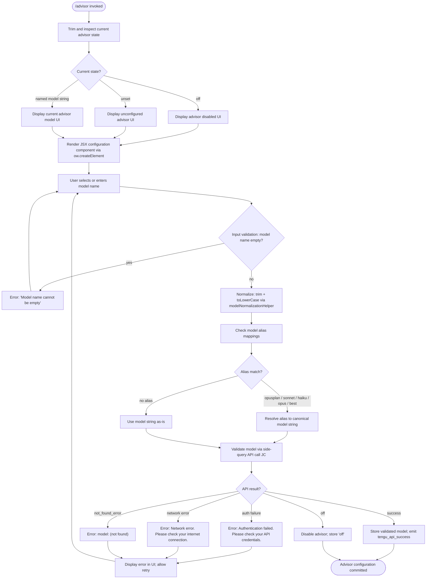

# `/advisor`

> Analysis basis: CC v2.1.139 bundle.js (AST extraction + Claude interpretation)
> Minimum version: v2.1.139

---

## Overview

The `/advisor` command configures the Advisor Tool, which enables Claude Code to consult a stronger backing model for guidance at key moments during task execution. It presents a JSX-rendered UI for selecting and validating the advisor model, then stores the configured model reference for use by the agent during subsequent task steps.

---

## Registration

| Field | Value |
|---|---|
| type | `local-jsx` |
| name | `advisor` |
| description | `Configure the Advisor Tool to consult a stronger model for guidance at key moments during a task` |
| module_id | `yjq` |
| load_inline | `true` |
| argumentHint | `null` |
| isHidden | `null` |
| loc_byte | `11444232` |
| loc_byte_end | `11444519` |
| loc_line | `7145` |
| arbor_handler.name | `ZG7` |
| arbor_handler.fqn | `claude-2.1.139::ZG7` |
| arbor_handler.kind | `AsyncFunction` |
| arbor_handler.resolution_path | `module_id` |
| arbor_handler.n_hits | `1` |

Analysis basis: CC v2.1.139 bundle.js:+11444232

---

## Input Branching

The command has multiple distinct paths depending on the current advisor state (off / unset / named model), model validation outcome (empty name, auth failure, network error, not-found error), and rendering of the JSX configuration UI. A Mermaid flowchart is used.



Analysis basis: CC v2.1.139 bundle.js:+11443690, +11443766, +11443777, +11436191, +11436890, +11436992, +11437111

---

## Behavioral Spec

### Top-Level Handler (advisorCommandHandler)

The primary handler is the async function `ZG7` (resolved via Arbor from module `yjq` using `resolution_path: module_id`).

```
async function advisorCommandHandler(commandInput):
    trimmedInput = commandInput.trim()             // ZG7 → A.trim, loc +11443690
    element = renderJSXComponent(trimmedInput)     // ZG7 → ow.createElement, loc +11443726
    modelList = buildAvailableModelList()          // ZG7 → Kq, loc +11443844
    validationResult = validateAndStoreModel(      // ZG7 → zJ8, loc +11443858
        trimmedInput, modelList
    )
    currentState = resolveAdvisorState(trimmedInput) // ZG7 → H, loc +11443884
    supportedModels = getModelSupportList()          // ZG7 → r36, loc +11443932
    display(joinParts(supportedModels))              // ZG7 → bFH.join, loc +11444001
    return element
```

Analysis basis: CC v2.1.139 bundle.js:+11443690

---

### Model List Builder (buildAvailableModelList)

Constructs the list of models available for selection. Recognizes short aliases and maps them to canonical identifiers.

```
function buildAvailableModelList(rawInput):
    normalized = rawInput.trim()                    // Kq → H.trim, loc +2141154
    lowerCased = normalized.toLowerCase()           // Kq → _.toLowerCase, loc +2141165
    providerCheck = checkProviderCompatibility(lowerCased)  // Kq → WG, loc +2141183
    sanitized = rawInput.replace(...)               // Kq → A.replace, loc +2141193
    isSupported = checkModelSupport(sanitized)      // Kq → O_H, loc +2141229

    // Alias resolution table (loc +2141250 – +2141406):
    // "opusplan"  → heavy planning model  (loc +2141250)
    // "[1m]"      → 1-million-token model  (loc +2141276)
    // "sonnet"    → Sonnet family          (loc +2141291)
    // "haiku"     → Haiku family           (loc +2141330)
    // "opus"      → Opus family            (loc +2141369)
    // "best"      → best available model   (loc +2141406)

    resolvedModels = resolveAliases(lowerCased, aliasTable)    // Kq → eZ, loc +2141268
    modelTierInfo = buildTierStructure(resolvedModels)         // Kq → kbH, loc +2141345
    contextualModels = applyContextFilter(modelTierInfo)       // Kq → tZ, loc +2141383
    overrideApplied = applyOverrideIfPresent(contextualModels) // Kq → _oA, loc +2141420
    unitCheck = unitModelCheck(overrideApplied)                // Kq → uM, loc +2141438
    eligibilityCheck = checkEligibility(unitCheck)             // Kq → EU6, loc +2141444
    displayForm = formatForDisplay(eligibilityCheck)           // Kq → ybH, loc +2141452
    finalName = displayForm.replace(...)                       // Kq → _.replace, loc +2141496
    return finalName
```

Analysis basis: CC v2.1.139 bundle.js:+2141154

---

### Model Validator (validateAndStoreModel)

Validates a proposed model identifier against the API, handling all error classes.

```
async function validateAndStoreModel(modelName, modelList):
    trimmedName = modelName.trim()                         // zJ8 → H.trim, loc +11436154
    if trimmedName is empty:
        raise Error("Model name cannot be empty")          // literal, loc +11436191

    lowerCased = trimmedName.toLowerCase()                 // zJ8 → _.toLowerCase, loc +11436314
    inBlocklist = checkBlocklist(lowerCased)               // zJ8 → $_H.includes, loc +11436333

    if validationCache.has(trimmedName):                   // zJ8 → Vjq.has, loc +11436435
        return cachedResult

    // Perform side-query API call for validation
    apiResult = await sideQueryValidate(modelName)         // zJ8 → JC, loc +11436480
    // JC dispatches as "side_query" (literal loc +12206698)
    // Uses 1024-token budget (literal loc +12206514)

    if apiResult is success:
        validationCache.set(trimmedName, result)           // zJ8 → Vjq.set, loc +11436643
        storeAdvisorModelConfig(apiResult)                 // zJ8 → zG7, loc +11436684
        emit tengu_api_success                             // telemetry, loc +12208122
        return result

    if apiResult.error is auth_failure:
        return "Authentication failed. Please check your API credentials."  // loc +11436890

    if apiResult.error is network_error:
        return "Network error. Please check your internet connection."      // loc +11436992

    if apiResult.error.type == "not_found_error":                          // loc +11437111
        return "model: " + modelName + " (not found)"                      // loc +11437193
```

Analysis basis: CC v2.1.139 bundle.js:+11436154

---

### Advisor Model Storage (storeAdvisorModelConfig)

Normalizes and stores the validated model identifier. Uses alias-to-canonical mappings for Opus variants.

```
function storeAdvisorModelConfig(validatedModel):
    normalized = String(validatedModel)                    // zG7 → String, loc +11437380
    internalForm = resolveToInternalAlias(normalized)      // zG7 → DG7, loc +11436739

    // Internal alias table (loc +11437460 – +11437768):
    // "opus-4-7"   → "opus_4_7"    (loc +11437460, +11437484)
    // "opus-4-6"   → "opus_4_6"    (loc +11437529, +11437553)
    // "opus-4-5"   → "opus_4_5"    (loc +11437598, +11437622)
    // "sonnet-4-6" → "sonnet_4_6"  (loc +11437667, +11437693)
    // "sonnet-4-5" → "sonnet_4_5"  (loc +11437742, +11437768)

    persistAdvisorSetting(internalForm)
```

Analysis basis: CC v2.1.139 bundle.js:+11436739

---

### Provider Compatibility Check (checkProviderCompatibility)

Determines whether the active API provider supports the advisor feature. Checks against known provider identifiers.

```
function checkProviderCompatibility(modelOrProvider):
    providerStrings = [
        "bedrock",       // loc +2001281
        "foundry",       // loc +2001331
        "anthropicAws",  // loc +2001387
        "mantle",        // loc +2001441
        "vertex",        // loc +2001489
        "firstParty",    // loc +2001498
        "gateway",       // loc +2001970
    ]
    activeProvider = resolveActiveProvider()   // WG → Y_H, loc +2874467
    compatible = providerStrings.includes(activeProvider)
    return compatible
```

Analysis basis: CC v2.1.139 bundle.js:+2874467

---

### Side-Query API Dispatch (sideQueryValidate)

Performs the lightweight validation call to the Anthropic API used to verify a model identifier exists and is accessible.

```
async function sideQueryValidate(modelName):
    // Dispatched with type "side_query" (loc +12206698)
    // Token budget: 1024 (loc +12206514)
    // Prompt cache enabled: "enabled" state checked (loc +12207482)
    // Cache duration: "1h" (loc +12207548)

    request = buildValidationRequest(modelName)
    headers = buildHeaders()               // rx → DY/AWL/LWL, loc +2863488
    // Headers include: "x-app", "User-Agent", "X-Claude-Code-Session-Id",
    // "x-claude-remote-container-id", "x-anthropic-additional-protection"
    // (literals loc +2863504, +2863532, +2863550, +2863594, +2864031)

    response = await fetch(request, headers)    // iU6 → fetch, loc +2185447
    // Timeout: 10000 ms (loc +2185529)

    return parseValidationResponse(response)
```

Analysis basis: CC v2.1.139 bundle.js:+12206666

---

### Eligibility Filter (checkEligibility)

Checks whether a candidate model is present in an allowed-model set maintained by the runtime.

```
function checkEligibility(modelId):
    allowedSet = getKnownModelList()         // EU6 → YKL.includes, loc +2141692
    isAllowed = allowedSet.includes(modelId)
    return isAllowed
```

Analysis basis: CC v2.1.139 bundle.js:+2141692

---

### Model Support Check (checkModelSupport / checkModelFamily)

Tests whether a model name belongs to the `anthropic.` namespace or the `claude-` family.

```
function checkModelSupport(modelName):
    isAnthropic = modelName.startsWith("anthropic.")   // literal loc +2135585
    isClaude    = modelName.startsWith("claude-")      // literal loc +2135206
    return isAnthropic || isClaude
```

Analysis basis: CC v2.1.139 bundle.js:+2135572, +2135585, +2135206

---

## State & Side Effects

| Item | Detail |
|---|---|
| Telemetry | `tengu_api_success` (loc +12208122) — emitted on successful model validation |
| Telemetry (background infra, reachable via callGraph) | `tengu_bg_dispatch_sigkill_escalate` (+14310587), `tengu_bg_dispatch_low_mem` (+14311166), `tengu_bg_spare_enable` (+14311781), `tengu_bg_spare_claim` (+14311902), `tengu_bg_spare_claim_fail` (+14312165), `tengu_bg_proto_mismatch` (+14299718), `tengu_bg_dispatch_stale_drop` (+14300957), `tengu_bg_attach_legacy_autorespawn` (+14302841), `tengu_bg_attach` (+14303251), `tengu_bg_attach_stall_gave_up` (+14304133), `tengu_bg_attach_stall_respawn` (+14304402), `tengu_bg_attach_kick` (+14305319), `tengu_prompt_cache_1h_config` (+12170323), `tengu_feature_bad` (+943693), `tengu_feature_ok` (+943635) |
| Validation cache | Model validation results are cached in `Vjq` (a Map-like store); `Vjq.has` checked before API call (loc +11436435); `Vjq.set` on success (loc +11436643) |
| Advisor setting persisted | The resolved internal alias form of the model name is stored to app configuration (`storeAdvisorModelConfig`); the values `"off"` (loc +11443766) and `"unset"` (loc +11443777) represent the disabled and unconfigured states respectively |
| JSX render | The command produces a `local-jsx` component rendered via `ow.createElement` (loc +11443726); no CLI text output beyond the UI component |
| appState changes | Advisor model setting updated in application state after successful validation |
| Sound | <!-- TODO: not found in depth-2 traversal; needs --depth 4 --> |
| Hook registration | <!-- TODO: not found in depth-2 traversal; needs --depth 4 --> |

---

## Version History

| Version | Change |
|---|---|
| v2.1.139 | Initial analysis |

---

## Common Mistakes

1. **Providing an empty model name**: The handler explicitly rejects blank input with the message `"Model name cannot be empty"` (loc +11436191). Ensure a non-empty string is provided as the argument.
2. **Using a model ID not in the allowed set**: `checkEligibility` tests the model against a known allowlist (`YKL.includes`, loc +2141692). Unsupported or misspelled model IDs will fail validation.
3. **Expecting instant persistence without network access**: `/advisor` performs a live side-query API call to validate the model (loc +12206698). In offline or air-gapped environments the validation step will fail with a network error.
4. **Confusing alias keywords with full model IDs**: Short aliases (`opus`, `sonnet`, `haiku`, `best`, `opusplan`) are resolved to canonical model strings internally. Passing partial strings that do not match a recognized alias may produce unexpected resolution or a not-found error.
5. **Assuming the `off` keyword disables via the same path as a model name**: The string `"off"` is treated as a special sentinel (loc +11443766) that disables the advisor entirely, separate from the model validation flow.
6. **Expecting the command to work on all API providers without restriction**: Provider compatibility is checked (loc +2874467); not all third-party provider configurations are guaranteed to support the advisor model consultation feature.

---

## Appendix — Identifier Mapping

> For bundle debugging only. Identifiers change across versions.

| Identifier | Role |
|---|---|
| `ZG7` | Top-level async handler for `/advisor` command (`advisorCommandHandler`) |
| `Kq` | Available-model list builder (`buildAvailableModelList`) |
| `zJ8` | Model validator and cache coordinator (`validateAndStoreModel`) |
| `zG7` | Advisor model storage and alias normalizer (`storeAdvisorModelConfig`) |
| `DG7` | Internal alias resolution for Opus/Sonnet model variants |
| `JC` | Side-query API dispatch function (`sideQueryValidate`) |
| `rx` | Core HTTP request constructor and header assembly (`buildApiRequest`) |
| `Po` | Model name parser / namespace classifier |
| `Wa7` | MCP server/client orchestration helper |
| `WIH` | MCP connection initializer (multi-transport) |
| `Niq` | MCP update applier (`applyMcpUpdate`) |
| `M` | MCP server state manager |
| `N` | Log-level / header formatter utility |
| `WG` | Provider compatibility dispatcher |
| `Y_H` | Provider resolution helper |
| `SH` | Boolean-string normalizer (yes/on/no) |
| `O_H` | Model support inclusion checker |
| `eZ` | Alias expansion entry point |
| `uM` | Unit model checker |
| `$M` | Model metadata assembler |
| `mAL` | Model attribute loader |
| `tBA` | Model entry-to-object transformer |
| `im6` | Model instance locator (find in registry) |
| `kbH` | Model tier structure builder |
| `tZ` | Context filter applier |
| `_oA` | Override applicator |
| `EU6` | Eligibility checker (`checkEligibility`) |
| `ybH` | Display-form formatter |
| `WA` | Provider identifier lookup |
| `ekH` | Model extended attribute helper |
| `OKL` | Qualified model name resolver |
| `zKL` | Model namespace classifier |
| `erA` | `claude-` prefix tester |
| `vbH` | `$KL` inclusion checker |
| `HoA` | Model index finder |
| `rm6` | Model record mapper |
| `m_` | Model base-record accessor |
| `r36` | Supported-model list builder (`getModelSupportList`) |
| `DY` | AsyncLocalStorage store getter for API context |
| `AWL` | URL/header string splitter |
| `Z1` | Background mode flag resolver |
| `Dc` | Error context loader (`ld6`) |
| `LWL` | SSE/streaming response handler |
| `$w` | Token/credential assembler |
| `fO` | Proxy-Authorization header builder |
| `_WL` | Response metadata parser |
| `U5H` | Token expiry / refresh coordinator |
| `EE8` | Timestamp utility (`Date.now` wrapper) |
| `OL6` | Response header normalizer (lowercase) |
| `kfH` | SDK warning logger |
| `kd6` | Rate-limit / retry state accessor |
| `db6` | Proxy auth helper invoker |
| `HWL` | Request signing helper |
| `T_` | Timeout/abort signal holder |
| `D7` | Additional protection header builder |
| `e_` | Credential resolver (`Pw`/`lU`/`kA`) |
| `M$` | Model string formatter |
| `iU6` | WIF credentials resolver and fetcher |
| `FbH` | Provider-based auth header injector |
| `Rj` | Response body parser (`w$`) |
| `WR` | Request pipeline executor |
| `U2H` | Request augmenter with model constraints |
| `R1` | Model validity gate (include/exclude logic) |
| `My` | Anthropic provider adapter |
| `DS7` | Message type finder (user/text) |
| `RB_` | Request hash generator (SHA-256) |
| `Ln6` | Conversation context builder |
| `vq` | String coercion utility |
| `ld6` | Error reporting context (`E$9.getStore`) |
| `Kn6` | Conversation state initializer |
| `uZH` | Prompt-cache annotation helper |
| `sE8` | Cache annotation state |
| `j6` | Cache-hit tracker |
| `tE8` | Cache annotation finalizer |
| `iT` | Away-summary initializer |
| `ae8` | Away-summary state builder |
| `v` | Main conversation turn dispatcher |
| `_58` | Application state getter |
| `_c7` | Away-summary config accessor |
| `SUq` | Rate-limit state accessor |
| `WA8` | AbortController / focus coordinator |
| `xH` | Feature flag checker (OK path) |
| `kH` | Feature flag checker (bad path) |
| `LHq` | UUID generator for conversation |
| `g` | Permission gate evaluator |
| `PVq` | Prompt variable expander |
| `uj` | Model ID sanitizer (replace) |
| `xd6` | Model capability checker |
| `K2` | Message mapper |
| `Y3H` | Response normalizer |
| `yH` | JSON stringifier wrapper |
| `tx` | Random bytes / nonce generator |
| `a7` | Tool-use payload builder |
| `tLH` | Turn-level hook dispatcher |
| `Q` | Turn result collector |
| `WGH` | Agent routing helper |
| `LoL` | Built-in agent dispatcher |
| `LH` | Logging / structured-error emitter |
| `WF` | Custom agent dispatcher |
| `KoL` | Agent name prefix parser |
| `NtH` | Non-turn hook dispatcher |
| `P` | IPC/socket message framer |
| `j` | IPC buffer accumulator |
| `w` | Background daemon process manager |
| `kf` | IPC stream ender |
| `ht7` | Background daemon message handler (full protocol) |
| `IH` | String coercion helper |
| `Vjq` | Validation result cache (Map) |

---

Note: index built via Arbor fallback; some signals (telemetry, literals) may be missing — see arbor-fallback.js.