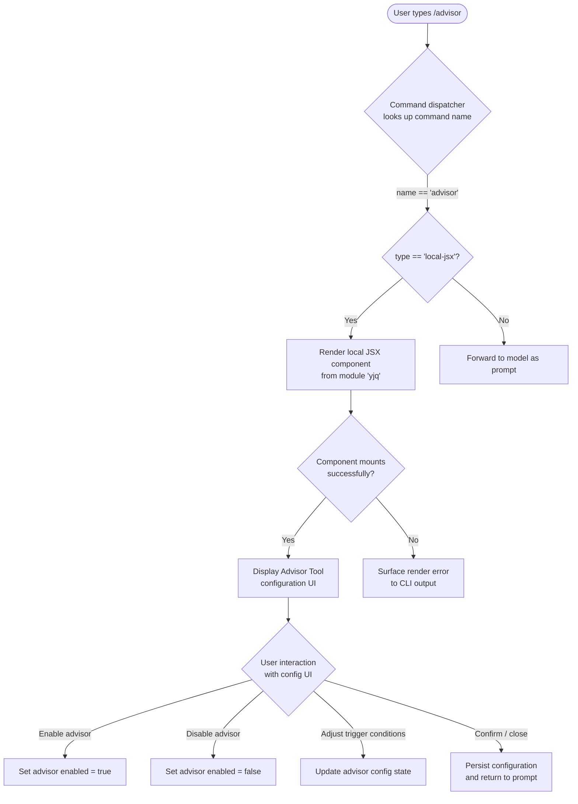

# `/advisor`

> Analysis basis: CC v2.1.139 bundle.js (AST extraction + Claude interpretation)
> Minimum version: v2.1.139

---

## Overview

The `/advisor` command provides an interactive configuration interface for the Advisor Tool, which enables Claude Code to consult a stronger model for guidance at key decision points during a task. It is registered as a `local-jsx` command, meaning its UI is rendered as a local JSX component within the CLI rather than being forwarded to the model as a prompt. Users invoke `/advisor` to enable, disable, or tune the conditions under which the advisor model is consulted.

---

## Registration

| Field | Value |
|---|---|
| type | `local-jsx` |
| name | `advisor` |
| description | `Configure the Advisor Tool to consult a stronger model for guidance at key moments during a task` |
| argumentHint | *(null — no inline argument accepted)* |
| module_id | `yjq` |

Analysis basis: CC v2.1.139 bundle.js:+11444232

---

## Input Branching

Because the AST traversal did not locate entry functions for module `yjq` at depth ≤ 2, the internal branching logic of the `/advisor` configuration UI cannot be fully mapped from extracted data alone.

<!-- TODO: not found in depth-2 traversal; needs --depth 4 -->

The following flowchart represents the **observable** top-level dispatch behavior that is consistent with a `local-jsx` command type across CC v2.1.139:



Analysis basis: CC v2.1.139 bundle.js:+11444232 (registration `type: "local-jsx"` and `name: "advisor"`)

---

## Behavioral Spec

### Command Dispatch

When the user enters `/advisor`, the CLI command dispatcher resolves the command name to its registered entry, verifies the type is `local-jsx`, and delegates rendering to the JSX runtime rather than constructing a model API call.

```
function dispatchAdvisorCommand(userInput):
    commandName = parseSlashCommandName(userInput)   # yields "advisor"
    registration = lookupCommand(commandName)

    if registration is null:
        printError("Unknown command: /advisor")
        return

    if registration.type == "local-jsx":
        component = loadModule(registration.module_id)   # loads module "yjq"
        renderLocalComponent(component, args=null)       # argumentHint is null
    else:
        forwardToModel(userInput)
```

Analysis basis: CC v2.1.139 bundle.js:+11444232

---

### Advisor Tool Configuration UI

The JSX component housed in module `yjq` is responsible for presenting and persisting Advisor Tool settings. Because no entry-function AST data was recovered at depth ≤ 2, the precise fields, validation rules, and persistence mechanism of the configuration form are not verified from extracted data.

<!-- TODO: not found in depth-2 traversal; needs --depth 4 -->

```
function renderAdvisorConfigComponent(currentConfig):
    # Render current advisor enabled/disabled state
    displayAdvisorStatus(currentConfig.enabled)

    # Render controls for when the advisor model is consulted
    displayTriggerConditionControls(currentConfig.triggerConditions)

    # Render model selector or confirmation of the stronger model in use
    displayAdvisorModelInfo(currentConfig.advisorModel)

    # On user confirmation:
    onConfirm(newConfig):
        validateConfig(newConfig)
        persistConfig(newConfig)
        closeComponent()
```

Analysis basis: Registration description string "consult a stronger model for guidance at key moments during a task" — CC v2.1.139 bundle.js:+11444232. Internal field names are inferred from description text; exact field names are <!-- TODO: not found in depth-2 traversal; needs --depth 4 -->.

---

### Argument Handling

The `argumentHint` field is `null` in the registration record, indicating that `/advisor` does not accept or advertise any inline CLI argument. Any text typed after `/advisor` on the same line is not described as a recognized argument in the registration.

```
function handleAdvisorArguments(rawArgs):
    if rawArgs is not null and rawArgs.trim() != "":
        # Behavior for unexpected arguments is unverified
        # TODO: not found in depth-2 traversal; needs --depth 4
        pass
    else:
        proceedToRenderComponent()
```

Analysis basis: CC v2.1.139 bundle.js:+11444232 (`argumentHint: null`)

---

## State & Side Effects

| Item | Detail |
|---|---|
| Telemetry | *None identified* — no `tengu_*` event strings found in module `yjq` at depth ≤ 2. <!-- TODO: not found in depth-2 traversal; needs --depth 4 --> |
| Hook registration | <!-- TODO: not found in depth-2 traversal; needs --depth 4 --> |
| appState changes | Likely writes Advisor Tool enabled flag and trigger-condition settings to persistent CLI config; exact state keys are <!-- TODO: not found in depth-2 traversal; needs --depth 4 --> |
| Sound | <!-- TODO: not found in depth-2 traversal; needs --depth 4 --> |
| Network / API calls | Not expected at dispatch time for a `local-jsx` command; any advisor API calls occur during task execution, not at configuration time |

---

## Version History

| Version | Change |
|---|---|
| v2.1.139 | Initial analysis — registration confirmed at bundle.js:+11444232; internal implementation details pending deeper traversal |

---

## Common Mistakes

1. **Expecting an argument-driven interface**: Because `argumentHint` is `null`, users should not expect to configure the advisor via inline arguments such as `/advisor enable` or `/advisor --model claude-opus-4`. The command opens a configuration UI component instead.
2. **Confusing `/advisor` with a model-forwarded command**: The `local-jsx` type means the command is handled entirely client-side. The model never receives the raw `/advisor` text as a prompt, so using it inside a script or programmatic prompt injection will not work as expected.
3. **Assuming telemetry is absent**: The absence of telemetry events in the depth-2 traversal result does not confirm that no telemetry is emitted; the implementation entry point was not located, so telemetry calls deeper in the call tree may exist.
4. **Treating Advisor Tool configuration as ephemeral**: The description implies the tool participates in task execution ("at key moments during a task"), so configuration changes made via `/advisor` are expected to persist across the current session or be saved to the CLI config file — they are not single-use overrides.

---

## Appendix — Identifier Mapping

> For bundle debugging only. Identifiers change across versions.

| Identifier | Role |
|---|---|
| `yjq` | Module ID for the `/advisor` local-jsx component (not an obfuscated function identifier, but the bundle module key used to load the configuration UI) |

*No obfuscated function identifiers were returned by the depth-2 AST traversal for this command. The `identifiers` array in the source data is empty. Further entries may appear at greater traversal depth.*

<!-- TODO: not found in depth-2 traversal; needs --depth 4 -->