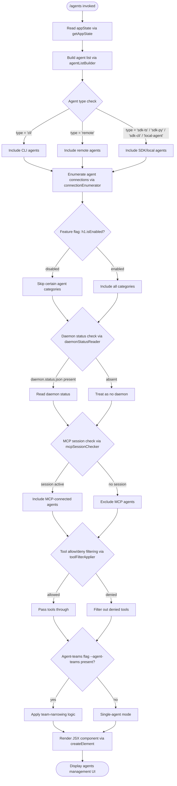

# `/agents`

> Analysis basis: CC v2.1.139 bundle.js (AST extraction + Claude interpretation)
> Minimum version: v2.1.139

---

## Overview

The `/agents` command provides an interactive management interface for agent configurations within Claude Code. It reads current application state, enumerates available and active agent sessions, and renders a JSX-based UI component that allows users to inspect, configure, and interact with agent instances. The command is a `local-jsx` type, meaning it renders an inline React/JSX component rather than issuing a text prompt to the model.

---

## Registration

| Field | Value |
|---|---|
| type | `local-jsx` |
| name | `agents` |
| description | `Manage agent configurations` |
| module_id | `AJq` |
| load_inline | `true` |
| loc_byte | `11382860` |
| loc_byte_end | `11382985` |
| loc_line | `7112` |
| arbor_handler.name | `L07` |
| arbor_handler.fqn | `claude-2.1.139::L07` |
| arbor_handler.kind | `AsyncFunction` |
| arbor_handler.resolution_path | `module_id` |
| arbor_handler.n_hits | `0` |

Analysis basis: CC v2.1.139 bundle.js:+11382860

---

## Input Branching

The command handler (`L07`) exhibits multiple distinct branches based on application state, agent type filtering, MCP connection status, daemon status, and feature-flag checks. A Mermaid flowchart is used to represent this branching.



---

## Behavioral Spec

### Main Handler: agentsCommandHandler (`L07`)

```
async function agentsCommandHandler(context):
    appState = getAppState()                          // reads global application state
    agentUI  = buildAgentManagementUI(appState)       // delegates to uiBuilder (iE)
    element  = createElement(agentUI, props)          // produces JSX element
    return element
```

Analysis basis: CC v2.1.139 bundle.js:+11382667, +11382707, +11382720

---

### Agent List Construction: agentListBuilder (`Qj`)

```
function agentListBuilder(state):
    results = []

    for each agent in state.agents:
        agentType = resolveAgentType(agent)           // calls typeResolver (TR)
        label     = buildLabel(agentType)             // calls labelBuilder (vq)
        header    = buildSectionHeader(agentType)     // calls sectionHeader (SH)

        if agentType in { 'cli', 'remote' }:
            emit telemetry: tengu_slate_harbor        // +3163029
        
        if agentType in {
            'sdk-ts', 'sdk-py', 'sdk-cli', 'local-agent'
        }:
            include in SDK group

        renderItem = buildRenderItem(agent, label)    // calls renderItemBuilder (j6)
        results.push(renderItem)

    return results
```

Analysis basis: CC v2.1.139 bundle.js:+3162847, +3162864, +3162909, +3163026

Agent type string constants observed:
- `"cli"` (bundle.js:+3162999)
- `"remote"` (bundle.js:+3163010)
- `"sdk-ts"` (bundle.js:+3163256)
- `"sdk-py"` (bundle.js:+3163270)
- `"sdk-cli"` (bundle.js:+3163284)
- `"local-agent"` (bundle.js:+3163299)

---

### Render Item Construction: renderItemBuilder (`j6`)

```
function renderItemBuilder(agent, label):
    base    = buildBaseEntry(agent)                   // calls baseEntryBuilder (L46)
    meta    = buildMetaEntry(agent)                   // calls metaEntryBuilder (M46)
    badge   = buildBadge(agent)                       // calls badgeBuilder (Ya)

    if dedupSet.has(agent.id):                        // gfH.has check (+3112491)
        item = fetchDeduped(agent.id)                 // deduplicationHandler (Ql6)
    else:
        pendingSet.add(agent.id)                      // q46.add (+3112514)

    if connectionMap.has(agent.id):                   // ZB.has (+3112528)
        connection = connectionMap.get(agent.id)      // ZB.get (+3112545)
        enriched   = enrichWithConnection(            // connectionEnricher (b6)
                         agent, connection)
        return enriched

    return { base, meta, badge, label }
```

Analysis basis: CC v2.1.139 bundle.js:+3112402, +3112439, +3112474, +3112491, +3112502, +3112514, +3112528, +3112545, +3112565

---

### Deduplication Handler: deduplicationHandler (`Ql6`)

```
function deduplicationHandler(agentId):
    if processedSet.has(agentId):                     // T8_.has (+3110202)
        cached = connectionCache.get(agentId)         // gfH.get (+3110226)
        return cached

    processedSet.add(agentId)                         // T8_.add (+3110242)
    fresh = buildFreshEntry(agentId)                  // G8_ (+3110253)
    store = storeEntry(agentId, fresh)                // k8_ (+3110327)
    return fresh
```

Analysis basis: CC v2.1.139 bundle.js:+3110202, +3110226, +3110242, +3110253, +3110327

---

### Connection Enricher: connectionEnricher (`b6`)

```
function connectionEnricher(agent, connection):
    base      = buildConnectionBase(connection)       // B6 (+3131668)
    transport = resolveTransport(connection)          // BW (+3131682)
    uptime    = computeUptime(connection)             // U8_ (+3131701)
    flags     = readConnectionFlags(connection)       // cfH (+3131705)
    timestamp = Date.now()                            // +3131757
    payload   = buildPayload(                         // pVL (+3131810)
                    base, transport, uptime, flags, timestamp)
    return payload
```

Analysis basis: CC v2.1.139 bundle.js:+3131668, +3131682, +3131701, +3131705, +3131757, +3131810

---

### Permission / Tool Filter: toolFilterApplier (`pe` + `W38`)

```
function toolFilterApplier(agents):
    filtered = agents.filter(isNotBlocked)            // H.filter (+8966590)
                                                      // "blocked" literal (+8966651)

    for each agent in filtered:
        toolList = getAvailableTools(agent)           // iDH (+9744379)
                                                      // uses wy_.flatMap (+9743669)
                                                      // deny-list checked (+9743746)
        narrowed = narrowToolset(toolList)            // Jy_ (+9744396)
                                                      // cliArg source (+9744316)
                                                      // toolsNarrowing mode (+9744337)
        agent.tools = narrowed

    return filtered
```

Analysis basis: CC v2.1.139 bundle.js:+8966590, +8966605, +9744379, +9743746, +9744316, +9744337

---

### Agent Context Builder: agentContextBuilder (`yu`)

```
function agentContextBuilder(agent):
    if platform == 'windows':                         // "windows" literal (+4319386)
        path = buildWindowsPath(agent)                // o6 (+4319379)
    else:
        path = buildUnixPath(agent)

    header    = buildContextHeader(agent)             // SH (+4319403)
    label     = buildContextLabel(agent)              // vq (+4319412)
    shellEnv  = resolveShellEnvironment(agent)        // W8H (+4319448)
    renderItem = buildRenderItem(agent, ...)          // j6 (+4319477)

    emit telemetry: tengu_cobalt_ridge                // +4319480

    return { path, header, label, shellEnv, renderItem }
```

Analysis basis: CC v2.1.139 bundle.js:+4319379, +4319386, +4319403, +4319412, +4319448, +4319477, +4319480

---

### Agent-Teams Handler: agentTeamsHandler (`q1`)

```
function agentTeamsHandler(state):
    if '--agent-teams' flag present:                  // "--agent-teams" literal (+5179401)
        header  = buildTeamHeader(state)              // SH (+5179436)
        config  = buildTeamConfig(state)              // Cq4 (+5179491)
        members = buildRenderItem(state)              // j6 (+5179510)
        emit telemetry: tengu_amber_flint             // +5179513
        return { header, config, members }
    else:
        return null
```

Analysis basis: CC v2.1.139 bundle.js:+5179401, +5179436, +5179491, +5179510, +5179513

---

### Model / Provider Selector: modelProviderSelector (`FN_`)

```
function modelProviderSelector(config):
    header = buildModelHeader(config)                 // SH (+9458638)
    if modelTier == 'standard':                       // "standard" (+9458699)
        return standardModelConfig(config)            // No1 (+9458751)
    if modelTier == 'tst':                            // "tst" (+9458778)
        if agentCount > 100:                          // 100 (+9458791)
            return testModelConfig(config)
    if modelTier == 'tst-auto':                       // "tst-auto" (+9458828)
        return autoTestModelConfig(config)
    provider = resolveModelProvider(config)           // n67 (+9458815)
    label    = buildProviderLabel(config)             // vq (+9458863)
    return { header, provider, label }
```

Model tier constants: `"standard"` (+9458699), `"tst"` (+9458778), `"tst-auto"` (+9458828)
Threshold constant: `100` agents (bundle.js:+9458791)

Analysis basis: CC v2.1.139 bundle.js:+9458638, +9458699, +9458778, +9458791, +9458828, +9458863

---

### API Provider Check: apiProviderChecker (`WA`)

Observed provider string constants routed through the provider check path:

| Provider Key | Location |
|---|---|
| `"bedrock"` | bundle.js:+2001281 |
| `"foundry"` | bundle.js:+2001331 |
| `"anthropicAws"` | bundle.js:+2001387 |
| `"mantle"` | bundle.js:+2001441 |
| `"vertex"` | bundle.js:+2001489 |
| `"firstParty"` | bundle.js:+2001498 |
| `"api.anthropic.com"` | bundle.js:+2002187 |

The Vertex AI path includes a special guard: when the provider is `vertex`, tool-search beta header is suppressed unless `ENABLE_TOOL_SEARCH=true` is set (literal: `"[ToolSearch:optimistic] disabled: Vertex AI does not accept the tool-search beta header. Set ENABLE_TOOL_SEARCH=true to override."` at bundle.js:+9459713).

Analysis basis: CC v2.1.139 bundle.js:+2001241, +9459713

---

### Daemon Status Reader: daemonStatusReader (`fW6` + `NXq`)

```
async function daemonStatusReader():
    statusPath = path.join(stateDir, 'daemon.status.json')  // +11520008, +11519994
    if fileExists(statusPath):
        raw    = readFile(statusPath)                        // i8 (+11520003)
        parsed = parseJSON(raw)                              // yH / JSON.stringify (+177562)
        return parsed
    return null
```

File constant: `"daemon.status.json"` (bundle.js:+11520008)

Analysis basis: CC v2.1.139 bundle.js:+11520003, +11520008, +11519994, +11520120, +11520152

---

### MCP Session / Background Session Checker (`A`, `K`, `O`)

```
function mcpSessionChecker(sessions):
    for each session in sessions:
        normalized = session.toLowerCase()            // A.has / f.toLowerCase (+14334909)
        if session.status == 'stopped':               // "stopped" (+14344917)
            markAsStopped(session)
        if session.type == 'background session':      // "background session" (+14344960)
            isEnabled = featureFlag.isEnabled(        // O.isEnabled (+8967623)
                            session)                  // x8 (+14344955)
            if not isEnabled:
                exclude session

    padded = sessions.map(s =>
        s.padEnd(40))                                 // K.map/padEnd (+14332978, +14332991, +14334983)
    return sessions
```

Constants: `"stopped"` (+14344917), `"background session"` (+14344960), pad width `40` (+14334983), two-space indent `"  "` (+14333012)

Analysis basis: CC v2.1.139 bundle.js:+14334909, +14344917, +14344960, +14344955, +14332978, +14334983

---

### Boolean / Flag Normalizer (`SH` → `String`)

```
function flagNormalizer(value):
    str = String(value)                               // String() call (+25188)
    if str in ['yes', 'on']:                          // +25237, +25243
        return true
    if str in ['no', 'off']:                          // +25388, +25393
        return false
    return Boolean(value)
```

String literals: `"yes"` (+25237), `"on"` (+25243), `"no"` (+25388), `"off"` (+25393)

Analysis basis: CC v2.1.139 bundle.js:+25188, +25237, +25243, +25388, +25393

---

### Persistent State Writer: persistentStateWriter (`RD`)

```
async function persistentStateWriter(key, data):
    salt   = crypto.randomBytes(4).toString('hex')   // +2179223, +2179239, +2179251
    raw    = JSON.stringify(data, null, 'utf8')       // +2179297
    tmpPath = buildTempPath(salt)
    await fs.writeFile(tmpPath, raw)                  // Io.writeFile (+2179270)
    await fs.rename(tmpPath, finalPath)               // Io.rename (+2179323)

    if deletionSet.has(key):                          // qaA.has (+2179374)
        await fs.unlink(finalPath)                    // Io.unlink (+2179450)
    if copySet.has(key):                              // KaA.has (+2179425)
        await fs.copyFile(tmpPath, finalPath)         // Io.copyFile (+2179396)
```

Analysis basis: CC v2.1.139 bundle.js:+2179223, +2179270, +2179323, +2179374, +2179396, +2179425, +2179450

---

### UI Builder Top-Level: uiBuilder (`iE`)

```
function uiBuilder(appState):
    agentList       = agentListBuilder(appState)      // Qj (+8967270)
    toolFilter      = toolFilterApplier(agentList)    // pe (+8967302)
    contextMap      = agentContextBuilder(appState)   // DI_ (+8967326)
    labelMap        = labelMapBuilder(appState)       // LK (+8967338)
    compositeView   = compositeViewBuilder(           // Be (+8967425)
                          agentList, contextMap,
                          labelMap, toolFilter)

    if featureFlag_h1.isEnabled():                    // h1.isEnabled (+8967493)
        extendedList = K.filter(...)                  // +8967569
        if not omitSet.has(id):                       // OmH.has (+8967584)
            mappedList = K.map(...)                   // +8967612
            if featureFlag_O.isEnabled():             // O.isEnabled (+8967623)
                include background sessions
    
    providerIncludes = $.includes(provider)           // +8967709
    if A.has(sessionKey):                             // +8967443
        if K.some(condition):                         // +8967470
            applyMLTransform(agentList)               // ML (+8967482)
    
    return compositeView
```

Analysis basis: CC v2.1.139 bundle.js:+8967231, +8967270, +8967302, +8967326, +8967338, +8967425, +8967443, +8967470, +8967482, +8967493, +8967569, +8967584, +8967612, +8967623, +8967665, +8967709

---

## State & Side Effects

| Item | Detail |
|---|---|
| Telemetry: `tengu_slate_harbor` | Fired when agent type is `cli` or `remote`; bundle.js:+3163029 |
| Telemetry: `tengu_cobalt_ridge` | Fired during agent context construction (Windows/non-Windows path resolution); bundle.js:+4319480 |
| Telemetry: `tengu_amber_flint` | Fired when `--agent-teams` flag is active; bundle.js:+5179513 |
| appState read | `_.getAppState()` called at handler entry; bundle.js:+11382667 |
| Daemon status file read | Reads `daemon.status.json` from state directory; bundle.js:+11520008 |
| Persistent state write | Atomic write via temp-file-then-rename; uses `crypto.randomBytes(4)` for salt; bundle.js:+2179223 |
| Deduplication sets | Maintains `T8_` (processed set) and `gfH` (connection cache) across renders; bundle.js:+3110202 |
| Pending agent set | `q46` accumulates pending agent IDs during list build; bundle.js:+3112514 |
| Connection map | `ZB` holds live connection objects keyed by agent ID; bundle.js:+3112528 |
| Feature flags | Two separate `isEnabled` checks (`h1`, `O`) gate extended agent list and background session inclusion; bundle.js:+8967493, +8967623 |
| JSX element creation | `bu_.createElement` produces the rendered UI element returned to the shell; bundle.js:+11382720 |
| Hook registration | <!-- TODO: not found in depth-2 traversal; needs --depth 4 --> |
| Sound | <!-- TODO: not found in depth-2 traversal; needs --depth 4 --> |

---

## Version History

| Version | Change |
|---|---|
| v2.1.139 | Initial analysis |

---

## Common Mistakes

1. **Expecting text output**: `/agents` is a `local-jsx` command — it renders an interactive UI component, not a text response. Piping or capturing its output programmatically will not yield plain text.
2. **Assuming `--agent-teams` is always active**: The team-narrowing code path and `tengu_amber_flint` telemetry only trigger when the `--agent-teams` CLI flag is present (bundle.js:+5179401). Without this flag, team management UI sections will not appear.
3. **Provider-specific tool search**: On Vertex AI, the tool-search beta header is silently disabled unless `ENABLE_TOOL_SEARCH=true` is explicitly set in the environment (bundle.js:+9459713). Agents configured with Vertex may appear to have fewer tools than expected.
4. **Daemon status dependency**: The command reads `daemon.status.json` at invocation time. If the daemon is not running or the file is stale, agent status information may be absent or incorrect (bundle.js:+11520008).
5. **Deduplication side effects**: The `T8_` processed-set and `gfH` connection cache persist across invocations in the same session. Rapidly re-invoking `/agents` may serve cached connection data rather than fresh state (bundle.js:+3110202, +3110226).
6. **Boolean flag strings**: Configuration values passed as strings (`"yes"`, `"on"`, `"no"`, `"off"`) are normalized to booleans internally (bundle.js:+25237, +25243, +25388, +25393). Passing numeric `1`/`0` directly may not behave as expected in all contexts.

---

## Appendix — Identifier Mapping

> For bundle debugging only. Identifiers change across versions.

| Identifier | Role |
|---|---|
| `L07` | Main async handler for `/agents` command (agentsCommandHandler) |
| `iE` | Top-level UI builder; orchestrates all sub-builders (uiBuilder) |
| `SH` | Section header / string normalization helper (sectionHeader / flagNormalizer wrapper) |
| `Qj` | Agent list construction from state (agentListBuilder) |
| `TR` | Agent type resolver (typeResolver) |
| `vq` | Label builder for agent entries (labelBuilder) |
| `j6` | Render item builder for individual agent rows (renderItemBuilder) |
| `L46` | Base entry builder (baseEntryBuilder) |
| `M46` | Meta entry builder (metaEntryBuilder) |
| `Ya` | Badge builder for agent rows (badgeBuilder) |
| `Ql6` | Deduplication handler; checks/updates processed-set (deduplicationHandler) |
| `b6` | Connection enricher; attaches live connection data to agent entries (connectionEnricher) |
| `pe` | Tool filter applicator; removes blocked/denied agents (toolFilterApplier) |
| `H` | Random/timer utility (used in filter context; randomTimerUtil) |
| `W38` | Tool list + narrowing orchestrator (toolNarrowingOrchestrator) |
| `iDH` | Available-tool enumerator using flatMap (toolEnumerator) |
| `Jy_` | Tool-set narrower; applies cliArg / toolsNarrowing modes (toolsetNarrower) |
| `tt1` | Trailing tool-list processor (trailingToolProcessor) |
| `DI_` | Agent context map builder (agentContextBuilder outer) |
| `yu` | Per-agent context builder; handles Windows/Unix paths (perAgentContextBuilder) |
| `t_` | Module initializer / ES-module bootstrap (moduleInitializer) |
| `$E6` | Bound export helper (boundExportHelper) |
| `LK` | Label map builder (labelMapBuilder) |
| `Be` | Composite view builder; assembles full agent management UI (compositeViewBuilder) |
| `Cz` | Component string formatter (componentStringFormatter) |
| `_P` | Sub-panel builder (subPanelBuilder) |
| `T_` | Panel type resolver (panelTypeResolver) |
| `WnH` | Warning/notice handler in UI (warningNoticeHandler) |
| `ar4` | Action row builder type A (actionRowBuilderA) |
| `q1` | Agent-teams handler (agentTeamsHandler) |
| `Cq4` | Team config builder (teamConfigBuilder) |
| `rr4` | Action row builder type B (actionRowBuilderB) |
| `or4` | Action row builder type C (actionRowBuilderC) |
| `Qm` | Model/provider selector orchestrator (modelProviderSelectorOrchestrator) |
| `FN_` | Model provider selector; handles standard/tst/tst-auto tiers (modelProviderSelector) |
| `N` | Model name normalizer; handles debug/uppercase/trim (modelNameNormalizer) |
| `WA` | API provider checker; routes bedrock/vertex/etc (apiProviderChecker) |
| `Q3` | Query/filter helper in model selector (modelQueryFilter) |
| `A` | MCP session map (mcpSessionMap) |
| `f` | Session connection object (sessionConnectionObject) |
| `q` | Session file set; manages unlink/temp files (sessionFileSet) |
| `L` | Session lifecycle manager (sessionLifecycleManager) |
| `K` | Sessions list array (sessionsListArray) |
| `ML` | ML transform applicator on agent list (mlTransformApplicator) |
| `O` | Background-session feature-flag checker (backgroundSessionFeatureFlag) |
| `x8` | Feature flag state reader (featureFlagStateReader) |
| `$` | Provider-includes helper; checks if provider string is in allowed list (providerIncludesHelper) |
| `NXq` | Daemon status file reader orchestrator (daemonStatusReaderOrchestrator) |
| `Eo` | State directory path builder (stateDirBuilder) |
| `RD` | Persistent state atomic writer (persistentStateWriter) |
| `fW6` | Status file path builder (statusFilePathBuilder) |
| `yH` | JSON serializer wrapper (jsonSerializerWrapper) |

---

Note: index built via Arbor fallback; some signals (telemetry, literals) may be missing — see arbor-fallback.js.