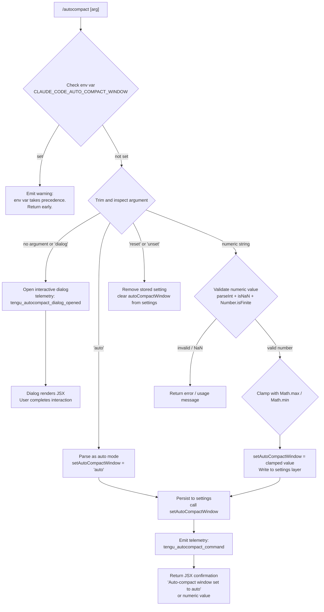

# `/autocompact`

> Analysis basis: CC v2.1.133 bundle.js (AST extraction + Claude interpretation)
> Minimum version: v2.1.133

---

## Overview

The `/autocompact` command allows users to configure the auto-compact window size for Claude Code sessions. It accepts either the special keyword `auto` (which enables fully automatic window management) or an explicit numeric token count, persisting the chosen value to user settings. When invoked without an argument, or with the special `dialog` sub-mode, it opens an interactive dialog to guide configuration.

---

## Registration

| Field | Value |
|---|---|
| `type` | `local-jsx` |
| `name` | `autocompact` |
| `description` | `Configure the auto-compact window size` |
| `argumentHint` | `[auto\|<tokens>]` |
| `isHidden` | `false` |
| `module_id` | `Ua9` |
| `load_inline` | `true` |
| `loc_byte` | `9880145` |
| `loc_byte_end` | `9880394` |
| `loc_line` | `5643` |
| `arbor_handler.name` | `s67` |
| `arbor_handler.fqn` | `claude-2.1.133::s67` |
| `arbor_handler.kind` | `AsyncFunction` |
| `arbor_handler.resolution_path` | `module_id` |
| `arbor_handler.n_hits` | `1` |

Analysis basis: CC v2.1.133 bundle.js:+9880145

---

## Input Branching

The command has four or more distinct input paths (no argument / `dialog` keyword, `auto` keyword, `reset`/`unset` keyword, and explicit numeric token count), making a Mermaid flowchart the appropriate representation.



Analysis basis: CC v2.1.133 bundle.js:+9874802 (argument trimming), +9874831 (`reset`/`unset` literals), +9355074 (`auto` literal), +9874700 (env-var precedence message), +9879907 (`dialog` literal)

---

## Behavioral Spec

### 1. Top-level Handler (`s67`)

The Arbor-resolved handler `s67` is an `AsyncFunction` reached via `module_id` → `Ua9`.

```
async function autocompactCommandHandler(options, appState):
    # Step 1: Render outer JSX wrapper using IM.createElement
    # Step 2: Invoke argumentDispatcher(options, appState)
    # Returns JSX element (type: "dialog" or inline result)
```

Analysis basis: CC v2.1.133 bundle.js:+9879830 (call to `FJ6`), +9879846 (reference to `H`), +9879863 (reference to `d`), +9879918 (`IM.createElement`)

---

### 2. Argument Dispatcher (`FJ6`)

This function performs the primary argument parsing and routing.

```
async function argumentDispatcher(rawArg, appState):

    # Guard: check environment variable override
    envValue = readEnvVar("CLAUDE_CODE_AUTO_COMPACT_WINDOW")
    if envValue is set:
        display warning:
            "CLAUDE_CODE_AUTO_COMPACT_WINDOW is set and takes precedence. Unset it to change this setting."
        return early (no-op)

    trimmedArg = rawArg.trim()

    if trimmedArg == "reset" or trimmedArg == "unset":
        clearAutoCompactWindowFromSettings(appState)
        return confirmationMessage

    parsedResult = parseTokenArgument(trimmedArg)   # calls XZA

    if parsedResult == "auto":
        appState.setAutoCompactWindow("auto")
        emitTelemetry("tengu_autocompact_command", { mode: "auto" })
        return "Auto-compact window set to auto"

    if parsedResult is valid numeric:
        appState.setAutoCompactWindow(parsedResult)
        emitTelemetry("tengu_autocompact_command", { mode: "set", value: parsedResult })
        return confirmationMessage(parsedResult)

    if trimmedArg == "" or trimmedArg == "dialog":
        openDialog(appState)
        emitTelemetry("tengu_autocompact_dialog_opened")
        return dialogJSX

    return usageErrorMessage
```

Analysis basis: CC v2.1.133 bundle.js:+9874802 (`H.trim`), +9874874 (`XZA` call), +9875042 (`xA` settings write), +9875219 (`A.setAutoCompactWindow`), +9875247 (telemetry `tengu_autocompact_command`), +9875301 (`"set"` literal), +9875445 (`ZK` / dialog branch), +9875461 (`"Auto-compact window set to auto"` literal), +9874700 (env-var warning), +9874831 (`"reset"` literal), +9874844 (`"unset"` literal)

---

### 3. Token Argument Parser (`XZA`)

Parses a raw string into either the sentinel `"auto"` or a validated, rounded integer token count.

```
function parseTokenArgument(input):
    trimmed = input.trim()

    if trimmed.endsWith("%"):
        raw = parseFloat(trimmed)
        if not Number.isFinite(raw):
            return null   # invalid
        # Convert percentage: multiply by scaling factor
        value = Math.round(raw * scalingFactor)
    else:
        # Minimum granularity: values expressed in thousands
        # Factor: 1000  (bundle.js:+9355179)
        # Minimum percentage divisor: 100  (bundle.js:+9355215)
        value = parseInt(trimmed)
        if not Number.isFinite(value):
            return null
        value = Math.round(value)

    if trimmed == "auto":
        return "auto"

    return value   # may be further clamped downstream
```

Analysis basis: CC v2.1.133 bundle.js:+9355044 (`H.trim`), +9355103 (`A.endsWith`), +9355121 (`parseFloat`), +9355195 (`parseInt`), +9355241 (`Number.isFinite`), +9355288 (`Math.round`), +9355074 (`"auto"` literal), +9355179 (`1000` constant), +9355215 (`100` constant)

---

### 4. Effective-Value Resolver (`qn`)

Resolves the final active token window by merging multiple configuration sources in precedence order, then clamping the result.

```
function resolveEffectiveAutoCompactWindow():
    # Source priority (highest to lowest):
    # 1. Environment variable: CLAUDE_CODE_AUTO_COMPACT_WINDOW  (bundle.js:+9355648)
    # 2. env layer                                               (bundle.js:+9355840)
    # 3. settings layer                                          (bundle.js:+9355910)

    envRaw = readEnvVar("CLAUDE_CODE_AUTO_COMPACT_WINDOW")      # ba()
    if envRaw is defined:
        parsed = parseInt(envRaw)
        if isNaN(parsed):
            # treat as invalid; result status = "invalid"       (bundle.js:+4384845)
        else:
            # result status = "valid"                           (bundle.js:+4384770)
            # may be capped                                      (bundle.js:+4384975)
            return clamp(parsed)

    settingsValue = readFromSettingsLayer()                      # kY
    if settingsValue is defined:
        parsed = parseTokenArgument(settingsValue)               # Tj
        if valid:
            return clamp(parsed)

    return defaultAutoCompactWindow                              # FW / _5

function clamp(value):
    # Math.max and Math.min used at bundle.js:+9355766, +9355806
    return Math.max(lowerBound, Math.min(upperBound, value))
```

Analysis basis: CC v2.1.133 bundle.js:+9355572 (`B9` model-list lookup), +9355580 (`Tj` token validator), +9355585 (`kY` settings reader), +9355645 (`ba` env reader), +9355648 (`"CLAUDE_CODE_AUTO_COMPACT_WINDOW"` literal), +9355766 (`Math.max`), +9355806 (`Math.min`), +9355928 (`FW` default resolver)

---

### 5. Token-Count Validator (`Tj`)

Validates a raw token string against model-specific and absolute bounds.

```
function validateTokenCount(raw, modelId):
    # Convert to string representation
    asString = toString(raw)                    # kH, bundle.js:+2857681

    # Radix-10 parse
    numeric = parseInt(asString, 10)            # bundle.js:+2857764
    if isNaN(numeric):                          # bundle.js:+2857824
        return errorResult()                    # B0

    # Model max-token lookup
    modelMax = lookupModelContextWindow(modelId)   # eQ → T8H

    # Hard absolute limits:
    #   lower bound: 0         (bundle.js:+2857836)
    #   upper bound: 1,000,000 (bundle.js:+2857863)
    #   base radix:  10        (bundle.js:+2857816)
    if numeric < 0 or numeric > 1000000:
        return outOfRangeResult()               # E8H

    # If model context window known, apply model cap
    if modelMax is defined and numeric > modelMax:
        return cappedResult(modelMax)           # QF6

    return validResult(numeric)
```

Analysis basis: CC v2.1.133 bundle.js:+2857681 (`kH`), +2857764 (`parseInt`), +2857824 (`isNaN`), +2857836 (`0`), +2857850 (`B0`), +2857863 (`1000000`), +2857894 (`eQ`), +2857816 (`10`), +2857914 (`E8H`), +2857938 (`QF6`)

---

### 6. Default Window Resolver (`FW` / `_5`)

Determines the default auto-compact window when no explicit configuration is present.

```
function resolveDefaultAutoCompactWindow(modelId, settingsLayers):
    # Check autoCompactEnabled flag in settings
    enabled = readSetting("autoCompactEnabled", settingsLayers)   # _5, bundle.js:+9356871

    # Source layers examined by _5:
    #   "legacyGlobalConfig"  (bundle.js:+3183794)
    #   "default"             (bundle.js:+3183838)

    if not enabled:
        return disabled sentinel

    # kH used again for string conversion
    return computedDefaultWindow(modelId)
```

Analysis basis: CC v2.1.133 bundle.js:+9356771 (`kH`), +9356868 (`_5`), +9356871 (`"autoCompactEnabled"` literal), +3183610 (`Lk`), +3183659 (`h8`), +3183712 (`vxH.includes`), +3183739 (`R6`), +3183794 (`"legacyGlobalConfig"` literal), +3183838 (`"default"` literal)

---

### 7. Settings Persistence (`xA`)

When a new value is accepted, it is written to the user settings layer through a multi-step settings write path.

```
async function persistAutoCompactSetting(value, settingsLayers):
    # Resolve config file paths
    configPaths = resolveConfigPaths()           # ZO, C6H
    # Settings files involved (in precedence order):
    #   "settings.json"          (bundle.js:+1161075)
    #   "settings.local.json"    (bundle.js:+1161436)
    #   "cowork_settings.json"   (bundle.js:+1161046)
    #   "managed-settings.json"  (bundle.js:+1157700)
    #   ".claude" directory      (bundle.js:+1161364)

    # Load current settings from disk
    currentSettings = loadSettingsFromDisk()     # db / vWL
    # Telemetry fired during load:
    #   "loadSettingsFromDisk_start"  (bundle.js:+1167214)
    #   "settings_load_started"       (bundle.js:+1167254)
    #   "settings_load_completed"     (bundle.js:+1167928)
    #   "loadSettingsFromDisk_end"    (bundle.js:+1168557)

    # Merge new value into userSettings layer
    updated = merge(currentSettings, { autoCompactWindow: value })

    # Atomic write (temp file + rename pattern)
    atomicWriteSettingsFile(configPath, updated)  # KhH
    # Uses randomBytes(6).toString("hex") for temp filename  (bundle.js:+953963, +953991)
    # Applies original file permissions to temp file         (bundle.js:+954478)

    # Clear in-memory caches
    clearSettingsCache()                         # l2 → JG6.clear, Q28.clear

    # Re-read and emit updated settings event
    reloadSettings()                             # iN6
    appEventBus.emit(settingsChangedEvent)       # uk6.emit (bundle.js:+1166055)
```

Analysis basis: CC v2.1.133 bundle.js:+1165231 (`ZO`), +1165266 (`F6`), +1165302 (`j5_`), +1165333 (`OE`), +1165416 (`Error`), +1165501 (`k`), +1165568 (`Fi`), +1165687 (`rh8`), +1165716 (`C6H`), +1165739 (`KhH`), +1165745 (`SH`), +1165881 (`l2`), +1165906 (`iN6`), +1165910 (`Qb`), +1166055 (`uk6.emit`)

---

### 8. Model Context-Window Lookup (`B9` / `gY`)

Used during validation to resolve the maximum token window for a given model identifier.

```
function lookupModelContextWindow(modelId):
    # Normalise model string
    normalised = modelId.toLowerCase()          # gY, bundle.js:+2117599

    # Model name matching uses substring checks:
    #   modelId.includes(fragment)              # bundle.js:+2117615, +2118583

    # Known model families and their context ceilings
    # (string literals found in traversal):
    modelTable = {
        "claude-opus-4-7":               <max>,
        "claude-opus-4-6":               <max>,
        "claude-opus-4-5":               <max>,
        "claude-opus-4-1":               <max>,
        "claude-opus-4-0":               <max>,
        "claude-sonnet-4-6":             <max>,
        "claude-sonnet-4-5":             <max>,
        "claude-sonnet-4-0":             <max>,
        "claude-haiku-4-5":              <max>,
        "claude-3-7-sonnet":             <max>,
        "claude-3-5-sonnet":             <max>,
        "claude-3-5-haiku":              <max>,
        "claude-3-opus":                 <max>,
        "claude-3-sonnet":               <max>,
        "claude-3-haiku":                <max>,
        "application-inference-profile": <max>,
    }
    # Exact ceiling values are not in the depth-2 traversal.
    <!-- TODO: not found in depth-2 traversal; needs --depth 4 -->

    # String normalisation applied before lookup
    normalised = applyModelNameNormalisation(modelId)   # mP → H.replace (bundle.js:+2121870)

    return modelTable[normalised] ?? null
```

Analysis basis: CC v2.1.133 bundle.js:+2117599 (`H.toLowerCase`), +2117615 (`H.includes`), +2118506 (`H.replace`), +2118583 (`H.includes`), +2118551 (`qx6`), +2118574 (`gY`), +2118634 (`m08`), +2118638 (`mP`); model name literals at +2117626 through +2118458; `"application-inference-profile"` at +2118594

---

### 9. Dialog Mode (`ZK` / `gq`)

When no argument is supplied, or the literal `"dialog"` is passed, an interactive JSX dialog is presented.

```
function openAutoCompactDialog(appState):
    # Emits telemetry before rendering:
    emitTelemetry("tengu_autocompact_dialog_opened")    # bundle.js:+9879865

    # Constructs JSX element via IM.createElement             # bundle.js:+9879918
    # Numeric formatting uses "en-US" locale, "compact" style # bundle.js:+169388, +169406
    # Decimal formatting: trailing ".0" stripped              # bundle.js:+167500

    dialogElement = buildDialogJSX(currentWindowSize, appState)
    return dialogElement
```

Analysis basis: CC v2.1.133 bundle.js:+9875445 (`ZK`), +9879865 (telemetry), +9879907 (`"dialog"` literal), +167486 (`gq`), +167433 (`ytq`), +169388 (`"en-US"`), +169406 (`"compact"`), +167500 (`".0"`)

---

## State & Side Effects

| Item | Detail |
|---|---|
| **Telemetry — `tengu_amber_redwood2`** | Fired inside `J6` (settings event deduplication path) at bundle.js:+9355460 |
| **Telemetry — `tengu_autocompact_command`** | Fired after a successful `set` or `auto` operation at bundle.js:+9875247 |
| **Telemetry — `tengu_autocompact_dialog_opened`** | Fired when the interactive dialog is opened at bundle.js:+9879865 |
| **Settings write** | User settings file (`settings.json` / `settings.local.json`) updated atomically via temp-file + rename pattern; permissions preserved |
| **In-memory cache invalidation** | `JG6.clear()` and `Q28.clear()` called after every successful write (bundle.js:+24901, +24913) |
| **Settings reload** | `iN6` re-reads settings from disk and propagates changes after write (bundle.js:+1165906) |
| **App event bus** | `uk6.emit` fires a settings-changed event so other subsystems react (bundle.js:+1166055) |
| **Timestamp tracking** | `rh8` records `Date.now()` into `Ak6` map on settings access (bundle.js:+1035031, +1035041) |
| **Memory usage sampling** | `Oq` records `process.memoryUsage()` during settings load (bundle.js:+170152) |
| **Env-var guard** | If `CLAUDE_CODE_AUTO_COMPACT_WINDOW` is set, the command is entirely blocked from mutating settings and a warning is displayed (bundle.js:+9874700) |
| **Sound** | No sound events found in depth-2 traversal |
| **Hook registration** | No hook registration found in depth-2 traversal |
| **`appState.autoCompactWindow`** | Updated directly via `A.setAutoCompactWindow` call (bundle.js:+9875219) |

---

## Version History

| Version | Change |
|---|---|
| v2.1.133 | Initial analysis — `local-jsx` command registered as `autocompact`; supports `auto`, numeric token count, `reset`/`unset`, and `dialog` sub-modes; env-var override guard introduced |

---

## Common Mistakes

1. **Setting a value while `CLAUDE_CODE_AUTO_COMPACT_WINDOW` is set in the environment.** The command will silently refuse to write settings and will only display a warning. Unset the environment variable first.
2. **Passing a token count above 1,000,000.** The validator (`Tj`) treats values above this absolute ceiling as out-of-range (bundle.js:+2857863). Use a smaller value or `auto`.
3. **Expecting `reset` to also clear the env-var.** The `reset`/`unset` argument only removes the value from the settings file layer; if `CLAUDE_CODE_AUTO_COMPACT_WINDOW` is set in the shell, it continues to take precedence.
4. **Confusing `auto` with "disabled".** The `auto` mode activates dynamic window management; it does not disable compaction. To inspect whether compaction is active, check the `autoCompactEnabled` setting (bundle.js:+9356871).
5. **Assuming percentage input is always supported.** The `XZA` parser does branch on a `%` suffix, but the scaling factor applied is not exposed at depth-2. Numeric tokens (without `%`) are the safest input form.

---

## Appendix — Identifier Mapping

> For bundle debugging only. Identifiers change across versions.

| Identifier | Role |
|---|---|
| `s67` | Top-level async command handler (`autocompactCommandHandler`); Arbor-resolved entry point |
| `FJ6` | Argument dispatcher — trims input, guards env-var, routes to set/reset/dialog/auto paths |
| `qn` | Effective-value resolver — merges env, settings, and default sources with clamping |
| `B9` | Model context-window table lookup |
| `qx6` | Model entry iterating helper (uses `Object.entries`) |
| `gY` | Model name normaliser (`toLowerCase` + `includes` + `replace`) |
| `H` | Randomised delay helper (`Math.random` + `setTimeout`) — likely jitter utility |
| `m08` | Secondary model lookup helper called from `B9` |
| `mP` | Model name string normalisation via `replace` |
| `Tj` | Token-count validator (`parseInt` + `isNaN` + model-cap check) |
| `kH` | Value-to-string converter (`String(x)`) |
| `B0` | Error result constructor for invalid token parse |
| `eQ` | Model-context-window reader used during validation |
| `E8H` | Out-of-range result constructor for token validation |
| `QF6` | Model-capped result constructor (uses `parseInt` + `Number.isFinite`) |
| `kY` | Settings-layer reader for `autoCompactWindow` |
| `ba` | Environment variable parser (`parseInt` + `isNaN`; returns `valid`/`invalid`/`capped`) |
| `k` | Logging / debug utility (`debug` level; uses `NsH`, `Ztq`, `SH`, `dN`, etc.) |
| `FW` | Default auto-compact window resolver (delegates to `_5`) |
| `_5` | Settings-layer flag reader for `autoCompactEnabled` (checks `legacyGlobalConfig` and `default`) |
| `XH8` | Settings composition helper — calls `FW`, `NA`, `J6`, `XZA` |
| `NA` | <!-- TODO: not found in depth-2 traversal; needs --depth 4 --> |
| `J6` | Settings deduplication / event emission (Set-based, fires `tengu_amber_redwood2`) |
| `XZA` | Token argument parser (`trim` + `endsWith` + `parseFloat`/`parseInt` + `Math.round`) |
| `xA` | Settings persistence orchestrator (atomic write, cache clear, reload, event emit) |
| `ZO` | Config path resolver (uses `wj.join`, `C6H`, `TWL`, `Qb`, `GWL`, `oLH`) |
| `C6H` | Individual config file path builder (`wj.resolve`, `wj.dirname`) |
| `TWL` | Config path helper (uses `IaH`, `kH`) |
| `Qb` | Path joiner helper (`wj.join`) |
| `GWL` | Managed-settings path resolver (`managed-settings.json`) |
| `oLH` | <!-- TODO: not found in depth-2 traversal; needs --depth 4 --> |
| `F6` | <!-- TODO: not found in depth-2 traversal; needs --depth 4 --> |
| `j5_` | Settings file walk orchestrator (calls `X5_`, `ZO`, `Hr`, `Y5_`, `Fi`) |
| `X5_` | Settings file enumerator (`Object.keys`, `J5_`, `ShH`, `Fi`) |
| `Hr` | Settings file reader helper (`wcA`, `Ch`, `EWL`, `JcA`) |
| `Y5_` | SDK inline settings parser (`GaH`, `Ch`, `np`, `b0`, `O4H`) |
| `OE` | Settings file loader wrapper (calls `Fp`) |
| `Fp` | Raw file reader (`readFileSync`, 4096-byte chunk, `replaceAll`) |
| `D8` | Error code classifier (checks `"ENOENT"` etc.) |
| `w8` | Low-level error helper |
| `rh8` | Settings-access timestamp recorder (`Ak6.set` + `Date.now`) |
| `KhH` | Atomic file writer (temp file via `randomBytes`, `fchmodSync`, `fsyncSync`, `renameSync`) |
| `q` | Filesystem module alias (used for `lstatSync`, `statSync`, `renameSync`, `unlinkSync`) |
| `O` | Filesystem stats result object (`.isSymbolicLink`) |
| `f` | File-close utility (wraps `q.close`) |
| `SH` | JSON serialiser (`JSON.stringify`) |
| `l2` | In-memory settings cache invalidator (`JG6.clear`, `Q28.clear`) |
| `iN6` | Settings reload-from-disk orchestrator (`_4H.readFile`, `_4H.writeFile`, `_4H.appendFile`) |
| `N6` | Settings normaliser (`zN6`, `LA`) |
| `Ch8` | Settings schema validator (`YK`) |
| `mh8` | Git-ignore checker for settings path (`git check-ignore`) |
| `yPL` | Settings path builder using `z4_.homedir` and `.config` directory |
| `fH` | Settings-write finaliser (`HA`, `kH`, `yq`, `NJL`, `cyH.push`, `yQ.logError`) |
| `LA` | <!-- TODO: not found in depth-2 traversal; needs --depth 4 --> |
| `db` | Settings load coordinator (`Yp`, `vWL`, `Oq`, `$cA`) |
| `Yp` | <!-- TODO: not found in depth-2 traversal; needs --depth 4 --> |
| `vWL` | Settings load worker (emits `loadSettingsFromDisk_start`/`_end` telemetry, iterates paths) |
| `Oq` | Memory usage sampler (`process.memoryUsage`, pushes to `XiA`) |
| `$cA` | <!-- TODO: not found in depth-2 traversal; needs --depth 4 --> |
| `mA` | <!-- TODO: not found in depth-2 traversal; needs --depth 4 --> |
| `A` | App-state / settings object (exposes `setAutoCompactWindow`) |
| `d` | <!-- TODO: not found in depth-2 traversal; needs --depth 4 --> |
| `ZK` | Dialog-open coordinator (calls `gq`) |
| `gq` | Dialog JSX builder (calls `ytq`; formats numbers with `"en-US"` / `"compact"`) |
| `ytq` | Number formatter helper (strips trailing `".0"`) |

---

Note: index built via Arbor fallback; some signals (telemetry, literals) may be missing — see arbor-fallback.js.