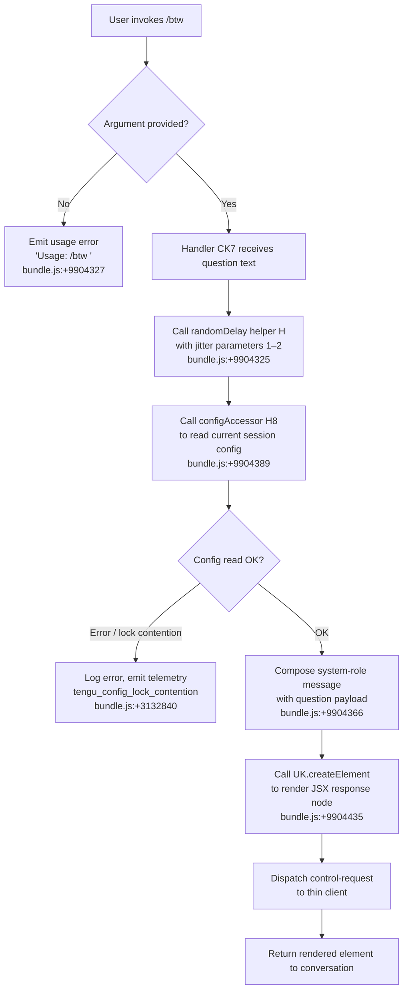

# `/btw`

> Analysis basis: CC v2.1.139 bundle.js (AST extraction + Claude interpretation)
> Minimum version: v2.1.139

---

## Overview

The `/btw` ("by the way") command lets the user pose a quick side question to the agent without disrupting the primary conversation flow. It is a `local-jsx` command that dispatches a `control-request` to the thin client immediately upon invocation, and its handler (`CK7`) constructs and injects a system-role message before rendering a React element as the UI representation.

---

## Registration

| Field | Value |
|---|---|
| type | `local-jsx` |
| name | `btw` |
| description | Ask a quick side question without interrupting the main conversation |
| argumentHint | `<question>` |
| immediate | `true` |
| thinClientDispatch | `control-request` |
| module_id | `A6q` |
| load_inline | `true` |
| loc_byte | `9904718` |
| loc_byte_end | `9904957` |
| loc_line | `5526` |
| arbor_handler.name | `CK7` |
| arbor_handler.fqn | `claude-2.1.139::CK7` |
| arbor_handler.kind | `AsyncFunction` |
| arbor_handler.resolution_path | `module_id` |
| arbor_handler.n_hits | `0` |

Analysis basis: CC v2.1.139 bundle.js:+9904718

---

## Input Branching

The command has three distinct input paths: no argument supplied (usage error), a valid question string, and an internal dispatch path that prepends a system-role wrapper. A Mermaid flowchart is used accordingly.



---

## Behavioral Spec

### 1. Entry — Handler `CK7` (AsyncFunction)

`CK7` is the sole entry point resolved by Arbor via the `module_id` path (`A6q`). It is an `AsyncFunction`, meaning all downstream I/O is awaited.

```
async function handleBtw(commandInput):
    question = commandInput.args  // text after "/btw "

    if question is empty or absent:
        return errorNode("Usage: /btw <your question>")
        // literal: bundle.js:+9904327

    await randomDelay()           // call to H
    config = await readSessionConfig()  // call to H8

    message = composeSideQuestion(question, role="system")
    // role literal "system": bundle.js:+9904366

    element = createElement(message)   // UK.createElement: bundle.js:+9904435
    return element
```

Analysis basis: CC v2.1.139 bundle.js:+9904325, +9904389, +9904435

---

### 2. Random Delay Helper (`H`)

Called immediately after the handler begins. It introduces a short randomised pause before processing continues, likely to avoid thundering-herd effects when multiple `/btw` calls are issued in quick succession.

```
function randomDelay():
    // draws a float in [1, 2) using Math.random
    // bundle.js:+12439007 (value 2), +12439023 (value 1)
    delayMs = Math.random() * (max - min) + min
    await setTimeout(delayMs)
    // setTimeout call: bundle.js:+12439046
```

Analysis basis: CC v2.1.139 bundle.js:+12439009, +12439046

---

### 3. Session Config Accessor (`H8`)

Reads (and optionally initialises) session configuration required for the side-question dispatch. It chains through several sub-calls:

```
async function readSessionConfig():
    baseDir = resolveConfigBaseDir()   // BW call: bundle.js:+3129846
    handler = getConfigHandler()       // H call: bundle.js:+3129866
    supplemental = buildSupplemental() // suH call: bundle.js:+3129898
    entries = buildEntryMap()          // E09 call: bundle.js:+3129917
    timestamp = getTimestamp()         // tuH / Date.now: bundle.js:+3129942
    validate()                         // N call: bundle.js:+3129958
    config = loadConfig()              // cfH call: bundle.js:+3130023
    fallback = loadW46()               // w46 call: bundle.js:+3130039
    cacheQ = checkCache()              // Q call: bundle.js:+3130175
    deltaWriter = getDeltaWriter()     // d8_ call: bundle.js:+3130289
    return assembledConfig
```

Analysis basis: CC v2.1.139 bundle.js:+3129842

---

### 4. Config Read / Write Core (`c8_`)

The deep config I/O helper reached through `H8`. It handles filesystem-level reads, directory creation, lock acquisition, backup rotation, and atomic writes.

```
async function configReadWriteCore(path, options):
    dir = path.dirname(path)           // Rz.dirname: bundle.js:+3132546
    ensureDir(dir)                     // B6, L.mkdirSync: bundle.js:+3132562, +3132567

    // Lock acquisition
    acquired = await acquireLock()     // ioA: bundle.js:+3132625
    if lock_took_too_long:
        logError("Lock acquisition took longer than expected...")
        // literal: bundle.js:+3132751
        emit("tengu_config_lock_contention")  // bundle.js:+3132840

    // Stale-write guard
    if staleWrite detected:
        emit("tengu_config_stale_write")      // bundle.js:+3132976

    // Auth-loss guard (GH #3117)
    if reReadConfigMissingAuth:
        logWarning("saveConfigWithLock: re-read config is missing auth...")
        // literal: bundle.js:+3133167
        emit("tengu_config_auth_loss_prevented")  // bundle.js:+3133319
        return  // refuse to write

    // Backup rotation — keep up to 5 backups
    // max backups: bundle.js:+3133770 (value 5)
    rotateBackups(dir, ".backup.")     // literal ".backup.": bundle.js:+3133637

    // Validate ENOENT is acceptable
    if error.code === "ENOENT":        // literal: bundle.js:+3133106
        handleMissing()

    writeConfig(path, data, mode=384)  // octal 0600: bundle.js:+3134052
```

Analysis basis: CC v2.1.139 bundle.js:+3129842

---

### 5. Config File Loader (`cfH`)

Loads, parses, and validates the on-disk config JSON. Raises a guarded error if config is accessed before the system is initialised.

```
function loadConfigFile(path):
    if accessedTooEarly:
        throw Error("Config accessed before allowed.")
        // literal: bundle.js:+3134784

    raw = fs.readFileSync(path, "utf-8")   // encoding: bundle.js:+3134867
    parsed = JSON.parse(raw)               // U6: bundle.js:+3134887

    // Strip internal prefix if present (cS)
    if value.startsWith(prefix):
        value = value.slice(prefixLen)     // bundle.js:+1066059, +1066082

    // Backup directory handling
    backupsDir = join(dir, "backups")      // literal: bundle.js:+3134352
    if not exists:
        fs.mkdirSync(backupsDir)           // bundle.js:+3135600
        // EEXIST is tolerated: bundle.js:+3135635

    // Parse error guard
    on parseError:
        emit("tengu_config_parse_error")   // bundle.js:+3135421

    timestamp = Date.now()                 // bundle.js:+3135911
    fs.copyFileSync(src, backupDest)       // bundle.js:+3135929
    return parsed
```

Analysis basis: CC v2.1.139 bundle.js:+3134778

---

### 6. Atomic File Writer (`dSH`)

Performs safe atomic writes using a temporary file, `fsync`, `fchmod`, and `rename`.

```
function atomicWrite(filePath, data):
    lstat = fs.lstatSync(filePath)              // bundle.js:+988148
    if isSymbolicLink(lstat):
        target = fs.readlinkSync(filePath)      // bundle.js:+987753
        if not path.isAbsolute(target):
            target = path.resolve(dir, target)  // bundle.js:+987792

    // Generate random temp name (6 random bytes as hex)
    tempName = crypto.randomBytes(6).toString("hex")  // bundle.js:+988378, +988406
    fd = fs.openSync(tempPath, flags)           // bundle.js:+987912

    try:
        fs.writeFileSync(fd, data)              // bundle.js:+988814
        originalMode = stat.mode & 0o777       // 8-bit mask: bundle.js:+988556
        fs.fchmodSync(fd, originalMode)         // bundle.js:+988872
        // log: "Applied original permissions to temp file"
        // literal: bundle.js:+988893
        fs.fsyncSync(fd)                        // bundle.js:+988938
    finally:
        fs.closeSync(fd)                        // bundle.js:+987899

    fs.renameSync(tempPath, filePath)           // bundle.js:+989066
    // On failure, clean up:
    fs.unlinkSync(tempPath)                     // bundle.js:+989223
```

Analysis basis: CC v2.1.139 bundle.js:+987666

---

### 7. Message Normaliser (`N`)

Validates and normalises the message object before it is wrapped in the system-role envelope.

```
function normaliseMessage(msg):
    logLevel = "debug"               // literal: bundle.js:+197070
    reformat(msg)                    // reH: bundle.js:+197094
    validate(msg)                    // y9K: bundle.js:+197112
    if H.includes(pattern):          // bundle.js:+197134
        sanitise()                   // yH: bundle.js:+197152
    role = "system".toUpperCase()    // bundle.js:+197196
    formatted = formatMessage(msg)   // LM: bundle.js:+197216
    trimmed = msg.trim()             // bundle.js:+197219
    annotate()                       // Hv: bundle.js:+197235
    checkSchema()                    // QyH: bundle.js:+197241
    writeToFile()                    // R9K: bundle.js:+197255
    return normalised
```

Analysis basis: CC v2.1.139 bundle.js:+197094

---

### 8. Background Session / Daemon Dispatch (`w`)

Reached transitively through the config path. Manages background daemon sessions including memory pressure checks and spare-session pre-warming.

```
function manageDaemonSession():
    existing = sessionMap.get(key)     // bundle.js:+14310469

    // Grace-period kill escalation
    // 30 s warning, 15 s before SIGKILL
    // values: bundle.js:+14310542, +14310553
    if overdue:
        process.kill(pid, "SIGKILL")   // literal: bundle.js:+14310635
        emit("tengu_bg_dispatch_sigkill_escalate")  // bundle.js:+14310587

    // Memory pressure guard
    freeMem = os.freemem()             // bundle.js:+14310996
    if freeMem < 1024 MB:              // threshold: bundle.js:+14311060
        emit("tengu_bg_dispatch_low_mem")  // bundle.js:+14311166

    // Spare session management
    if spareNeeded:
        emit("tengu_bg_spare_enable")  // bundle.js:+14311781
        sessionMap.set(key, session)   // bundle.js:+14311864

    claimAttempt = tryClaimSpare()
    if claimed:
        emit("tengu_bg_spare_claim")   // bundle.js:+14311902
    else:
        emit("tengu_bg_spare_claim_fail")  // bundle.js:+14312165
```

Analysis basis: CC v2.1.139 bundle.js:+14310469

---

## State & Side Effects

| Item | Detail |
|---|---|
| Telemetry — `tengu_config_lock_contention` | Fired when config lock takes longer than expected (bundle.js:+3132840) |
| Telemetry — `tengu_config_stale_write` | Fired when a stale config write is detected (bundle.js:+3132976) |
| Telemetry — `tengu_config_parse_error` | Fired when config JSON cannot be parsed (bundle.js:+3135421) |
| Telemetry — `tengu_config_auth_loss_prevented` | Fired when a write would have wiped auth credentials (bundle.js:+3133319) |
| Telemetry — `tengu_bg_dispatch_sigkill_escalate` | Fired when a background process is SIGKILL-escalated (bundle.js:+14310587) |
| Telemetry — `tengu_bg_dispatch_low_mem` | Fired when free memory falls below threshold (bundle.js:+14311166) |
| Telemetry — `tengu_bg_spare_enable` | Fired when spare background session is enabled (bundle.js:+14311781) |
| Telemetry — `tengu_bg_spare_claim` | Fired when spare session is successfully claimed (bundle.js:+14311902) |
| Telemetry — `tengu_bg_spare_claim_fail` | Fired when spare session claim fails (bundle.js:+14312165) |
| Thin-client dispatch | Sends a `control-request` message to the thin client immediately (`immediate: true`) |
| Config filesystem side effects | May create directories, rotate backups (up to 5), and atomically rewrite `~/.claude.json` |
| Auth-loss guard | Refuses to write config if re-read loses auth credentials; see GH #3117 (bundle.js:+3133167, +3130049) |
| JSX render | Calls `UK.createElement` to produce a React element returned to the conversation (bundle.js:+9904435) |
| Sound | <!-- TODO: not found in depth-2 traversal; needs --depth 4 --> |

---

## Version History

| Version | Change |
|---|---|
| v2.1.139 | Initial analysis |

---

## Common Mistakes

1. **Omitting the argument**: `/btw` with no text returns the usage hint `"Usage: /btw <your question>"` and does nothing else. Always supply a question string.
2. **Expecting a blocking pause**: Because `immediate: true` and the thin-client `control-request` dispatch are in effect, the side question is injected without waiting for the current agent turn to finish. Do not assume sequential ordering with the main thread.
3. **Treating it as a persistent context injection**: `/btw` wraps the question in a transient `system`-role message. It does not append to the permanent system prompt or alter the project's `.claude` configuration files.
4. **Concurrent invocations causing lock contention**: Rapid successive `/btw` calls (or simultaneous Claude instances) can trigger `tengu_config_lock_contention`. The random-jitter delay in helper `H` (1–2 unit range) mitigates but does not eliminate this.
5. **Assuming config writes always succeed**: The auth-loss guard (GH #3117) will silently abort a config write if the re-read copy is missing auth data. Operators should monitor `tengu_config_auth_loss_prevented` in their telemetry pipeline.

---

## Appendix — Identifier Mapping

> For bundle debugging only. Identifiers change across versions.

| Identifier | Role |
|---|---|
| `CK7` | Main handler — `AsyncFunction` for `/btw` command (Arbor-resolved via `module_id` `A6q`) |
| `H` | Random-delay helper; uses `Math.random` + `setTimeout` |
| `H8` | Session config accessor; orchestrates config read pipeline |
| `c8_` | Config read/write core; handles locking, backup rotation, atomic write |
| `_` | Filesystem abstraction (readdirStringSync, statSync) |
| `B6` | Path existence / directory utility |
| `L` | Filesystem wrapper (mkdirSync, statSync, readdirStringSync, copyFileSync, unlinkSync) |
| `q` | Secondary filesystem wrapper (readFileSync, statSync, mkdirSync, readdirStringSync, copyFileSync, unlinkSync, renameSync, lstatSync) |
| `f` | File handle / promise chain wrapper (close, finally) |
| `ioA` | Lock acquisition helper; calls `tl8` and `Object.assign` |
| `tl8` | Lock initialiser; calls `noA` |
| `N` | Message normaliser; validates and formats message before system-role wrapping |
| `y9K` | Message validator sub-step (calls `SZ`, `k9K`, `Xo_`) |
| `yH` | Message sanitiser; calls `JSON.stringify` |
| `LM` | Message formatter; handles redaction and path manipulation |
| `QyH` | Schema checker; calls `ms_` |
| `R9K` | File-write step for normalised message; handles Buffer byte-length, file descriptor management |
| `Q` | Cache-check helper |
| `w8` | Error code inspector |
| `cfH` | Config file loader; parses JSON, manages backups, emits parse-error telemetry |
| `U6` | JSON parse wrapper; calls `JSON.parse` |
| `cS` | String prefix stripper; calls `startsWith` / `slice` |
| `Z09` | Backup directory enumerator; walks directory tree |
| `LH` | Log error helper; pushes to error array, calls `Jd.logError` |
| `l8_` | Path join helper for backup entries |
| `w` | Background daemon session manager; handles SIGKILL escalation, memory pressure, spare sessions |
| `w46` | Fallback config loader |
| `A` | Case-normaliser wrapper; calls `toLowerCase` |
| `Z` | Path-prefix checker (startsWith) |
| `X` | MCP/SDK connection manager; handles transport selection and connection lifecycle |
| `U08` | Transport initialiser |
| `q_` | Error wrapping utility; constructs typed Error with String conversion |
| `V` | Result slice helper |
| `dSH` | Atomic file writer; uses random temp name, fsync, fchmod, rename |
| `O` | Stat result wrapper; calls `isSymbolicLink`, `x8` |
| `D8` | Error-code helper; calls `w8` |
| `suH` | Supplemental config builder |
| `E09` | Entry map builder; calls `Object.entries` |
| `tuH` | Timestamp helper; calls `Date.now` |
| `d8_` | Delta writer; handles symlink-aware path resolution and atomic write via `dSH` |