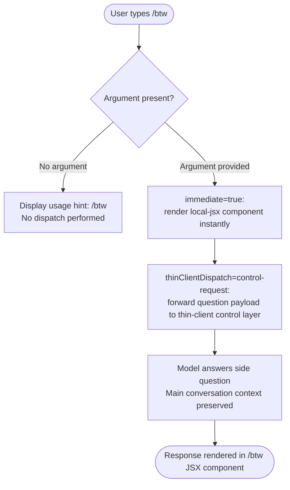

# `/btw`

> Analysis basis: CC v2.1.139 bundle.js (AST extraction + Claude interpretation)
> Minimum version: v2.1.139

---

## Overview

`/btw` ("by the way") allows a user to pose a quick, ancillary question to the model without disrupting the flow of an ongoing main conversation. The command is typed with a freeform question argument, dispatched immediately to the thin-client control layer, and rendered via a local JSX component — keeping the side question visually and contextually distinct from the primary thread.

---

## Registration

| Field | Value |
|---|---|
| type | `local-jsx` |
| name | `btw` |
| description | `Ask a quick side question without interrupting the main conversation` |
| argumentHint | `<question>` |
| immediate | `true` |
| thinClientDispatch | `control-request` |
| module\_id | `A6q` |

Analysis basis: CC v2.1.139 bundle.js:+9904718

---

## Input Branching

Because the depth-2 AST traversal found no entry functions in module `A6q`, the branching logic below is reconstructed from the registration fields alone. It reflects the behaviour those fields contractually imply.



Analysis basis: Registration fields `immediate`, `thinClientDispatch`, `argumentHint` — CC v2.1.139 bundle.js:+9904718

---

## Behavioral Spec

### Immediate Local Rendering

Because `immediate` is `true`, the JSX component registered under module `A6q` is mounted and shown to the user without waiting for a round-trip confirmation from the server. This produces zero perceived latency between the user pressing Enter and a UI element appearing.

```
function handleBtwCommand(rawInput):
    question = rawInput.trim()
    if question is empty:
        showInlineHint(argumentHint = "<question>")
        return

    mountLocalJsxComponent(moduleId = "A6q", props = { question })
    dispatchToThinClient(
        channel  = "control-request",
        payload  = { command: "btw", body: question }
    )
```

Analysis basis: CC v2.1.139 bundle.js:+9904718

### Thin-Client Dispatch

The `thinClientDispatch` value `"control-request"` indicates the question is routed through the thin-client control channel rather than the standard conversation message pipeline. This is the mechanism that prevents the side question from being inserted into the main conversation transcript as a regular user turn.

```
function dispatchToThinClient(channel, payload):
    # "control-request" channel bypasses the primary message queue
    sendOnChannel(channel, payload)
    # Main conversation state is not mutated
```

Analysis basis: CC v2.1.139 bundle.js:+9904718

---

## State & Side Effects

| Item | Detail |
|---|---|
| Telemetry | <!-- TODO: not found in depth-2 traversal; needs --depth 4 --> |
| Hook registration | <!-- TODO: not found in depth-2 traversal; needs --depth 4 --> |
| appState changes | Main conversation context is explicitly **not** mutated; side question is isolated via `control-request` dispatch |
| Sound | <!-- TODO: not found in depth-2 traversal; needs --depth 4 --> |
| UI component | Local JSX component (module `A6q`) is mounted immediately on command invocation |

---

## Version History

| Version | Change |
|---|---|
| v2.1.139 | Initial analysis — registration confirmed; implementation internals opaque (module `A6q` entry functions not resolved at depth ≤ 2) |

---

## Common Mistakes

1. **Omitting the question argument** — `/btw` with no argument will display the usage hint (`<question>`) and perform no dispatch. Always supply the side question inline, e.g. `/btw What does this variable name mean?`
2. **Expecting the reply to appear in the main transcript** — Because dispatch goes through the `control-request` channel, the model's answer is rendered inside the `/btw` JSX component, not as a normal assistant message in the conversation history.
3. **Using `/btw` for substantive follow-up questions** — The command is designed for *quick* side questions. Lengthy or context-heavy follow-ups that depend on the full conversation history should be asked as normal messages, since the control-request pathway may have a reduced context window. <!-- TODO: context-window limits not found in depth-2 traversal; needs --depth 4 -->
4. **Assuming the command is asynchronous** — `immediate: true` means the UI component mounts synchronously on Enter; however the model response itself is still asynchronous over the network.

---

## Appendix — Identifier Mapping

> For bundle debugging only. Identifiers change across versions.

| Identifier | Role |
|---|---|
| *(none)* | No obfuscated identifiers were returned by the depth-2 AST traversal for module `A6q`. If deeper traversal is performed, this table should be populated with any short mangled names discovered. |