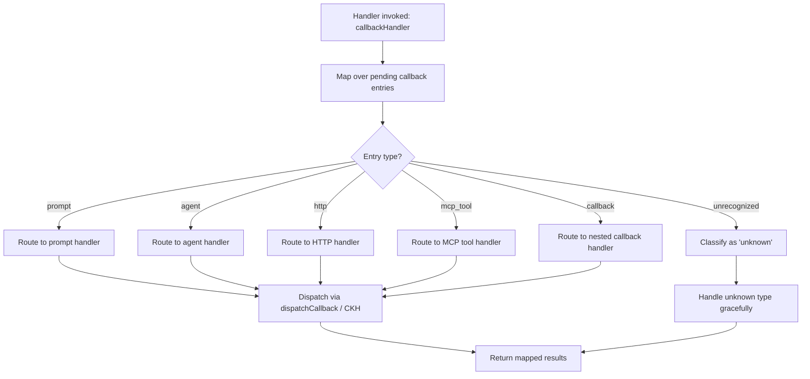

# `/callback`

> Analysis basis: CC v2.1.139 bundle.js (AST extraction + Claude interpretation)
> Minimum version: v2.1.139

---

## Overview

The `callback` command is an internal registration type used by Claude Code to handle asynchronous callback invocations originating from external or internal sources (such as MCP tool responses, HTTP callbacks, agent completions, or prompt returns). Rather than being a user-facing interactive slash command, it functions as a dispatch mechanism: it maps over a set of pending callback entries and routes each one to the appropriate internal handler. The command's type `"callback"` places it in a distinct category alongside `"prompt"`, `"agent"`, `"http"`, and `"mcp_tool"` command types.

---

## Registration

| Field | Value |
|---|---|
| type | `callback` |
| name | `callback` |
| description | `null` |
| loc_byte | `12099953` |
| loc_byte_end | `12099986` |
| loc_line | `8893` |
| arbor_handler.name | `Qy7` |
| arbor_handler.fqn | `claude-2.1.139::Qy7` |
| arbor_handler.kind | `Function` |
| arbor_handler.resolution_path | `direct` |
| arbor_handler.n_hits | `1` |

Analysis basis: CC v2.1.139 bundle.js:+12099953

---

## Input Branching

The handler iterates over a collection of pending callback entries and dispatches each one. The primary branching is determined by whether a callback entry type is recognized. The literals reveal a fixed enumeration of known command types: `"prompt"`, `"agent"`, `"http"`, `"mcp_tool"`, and `"callback"` itself. Any entry that does not match a known type falls through to an `"unknown"` path.



Analysis basis: CC v2.1.139 bundle.js:+12099566, +12099597, +12099637, +12099999, +11254712, +11254741, +11254769, +11254793, +11254855

---

## Behavioral Spec

### Main Handler: `callbackHandler` (Qy7)

```
function callbackHandler(pendingCallbacks):
    results = pendingCallbacks.map(entry =>
        dispatchCallback(entry)
    )
    return results
```

Analysis basis: CC v2.1.139 bundle.js:+12099566 (`.map` call on callback collection), +12099637 (call to `dispatchCallback`)

---

### Callback Dispatch: `dispatchCallback` (CKH)

The `dispatchCallback` function receives a single callback entry and resolves its type string against the known enumeration. The type string `"command"` appears as a structural key in the entry object used during dispatch (Analysis basis: CC v2.1.139 bundle.js:+12099597).

```
function dispatchCallback(entry):
    entryType = entry["command"].type  // structural key: "command"

    switch entryType:
        case "prompt":
            return handlePromptCallback(entry)
        case "agent":
            return handleAgentCallback(entry)
        case "http":
            return handleHttpCallback(entry)
        case "mcp_tool":
            return handleMcpToolCallback(entry)
        case "callback":
            return handleNestedCallback(entry)
        default:
            return handleUnknown(entry)  // literal: "unknown"
```

Analysis basis: CC v2.1.139 bundle.js:+12099597 (`"command"` key), +11254712 (`"prompt"`), +11254741 (`"agent"`), +11254769 (`"http"`), +11254793 (`"mcp_tool"`), +11254855 (`"callback"`), +12099999 (`"unknown"`)

---

### Probabilistic Delay: `randomDelayHelper` (H)

The helper function `H`, reachable from `callbackHandler` via the `.map` dispatch chain, introduces a probabilistic timing mechanism. It uses `Math.random()` and compares against numeric thresholds (literals: `2` at bundle.js:+12439007, `1` at bundle.js:+12439023), then calls `setTimeout` to defer execution.

```
function randomDelayHelper(callback, context):
    roll = Math.random()  // produces value in [0, 1)

    if roll < threshold_1:       // threshold near 1 (literal: 1)
        delayMs = computeDelay(roll, 2)  // literal: 2 used in computation
    else:
        delayMs = 0

    setTimeout(() => callback(context), delayMs)
```

This suggests that certain callback dispatches are not executed synchronously — some fraction of callbacks are deferred by a computed interval, potentially for rate-limiting or jitter purposes.

Analysis basis: CC v2.1.139 bundle.js:+12439009 (`Math.random`), +12439046 (`setTimeout`), +12439007 (literal `2`), +12439023 (literal `1`)

---

## State & Side Effects

| Item | Detail |
|---|---|
| Telemetry | None detected in depth-2 traversal |
| Hook registration | None detected in depth-2 traversal |
| appState changes | <!-- TODO: not found in depth-2 traversal; needs --depth 4 --> |
| Sound | None detected |
| Async behavior | `setTimeout` is invoked within the `randomDelayHelper` path, deferring some callback executions by a probabilistically computed interval |
| Known callback types | `"prompt"`, `"agent"`, `"http"`, `"mcp_tool"`, `"callback"` (self-referential), `"unknown"` (fallback) |

---

## Version History

| Version | Change |
|---|---|
| v2.1.139 | Initial analysis |

---

## Common Mistakes

1. **Treating `/callback` as a user-facing interactive command.** This command type is `"callback"`, not `"prompt"`. It is not intended to be typed by end users in the CLI; it is an internal dispatch registration used to handle async completions from other command types.
2. **Assuming synchronous execution for all callbacks.** The `randomDelayHelper` (H) shows that some callbacks may be deferred via `setTimeout`. Logic that depends on immediate execution after a callback dispatch may behave unexpectedly.
3. **Expecting a description string.** The `description` field is `null` for this registration — it will not appear in help text or command listings the way a normal slash command would.
4. **Conflating the `"callback"` type entry in the dispatch switch with the registration itself.** The `"callback"` string in the type enumeration (bundle.js:+11254855) means a nested callback-type entry is being dispatched — not a recursive re-registration.
5. **Assuming all entry types are handled identically.** Each type (`"prompt"`, `"agent"`, `"http"`, `"mcp_tool"`, `"callback"`) routes to a distinct sub-handler. The `"unknown"` fallback path exists for unrecognized types and likely results in a no-op or error log.

---

## Appendix — Identifier Mapping

> For bundle debugging only. Identifiers change across versions.

| Identifier | Role |
|---|---|
| `Qy7` | Main callback handler function (`callbackHandler`); Arbor-resolved entry point for the `callback` command registration |
| `H` | Probabilistic delay / random timing helper (`randomDelayHelper`); invokes `Math.random()` and `setTimeout` |
| `CKH` | Callback dispatch function (`dispatchCallback`); routes individual callback entries by type string |

---

Note: index built via Arbor fallback; some signals (telemetry, literals) may be missing — see arbor-fallback.js.