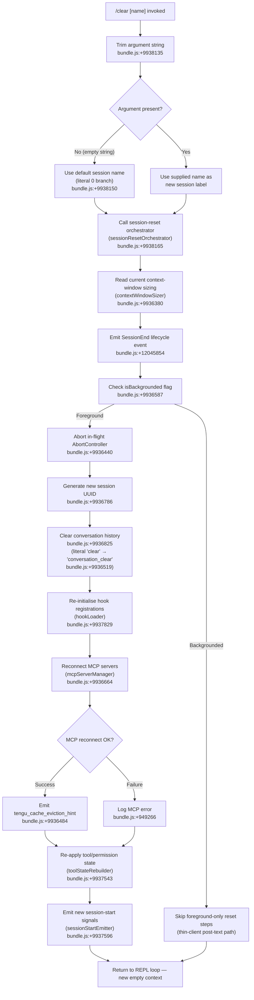

# `/clear`

> Analysis basis: CC v2.1.139 bundle.js (AST extraction + Claude interpretation)
> Minimum version: v2.1.139

---

## Overview

`/clear` (also accessible as `/reset` and `/new`) starts a brand-new conversation session with an empty context window while preserving the existing session on disk so it can be resumed with `/resume`. It is a `local` command type that runs synchronously without sending any prompt to the model — its work is entirely side-effectful: tearing down in-memory state, re-initialising session bookkeeping, re-connecting MCP servers, and emitting a `SessionEnd` lifecycle event.

---

## Registration

| Field | Value |
|---|---|
| type | `local` |
| name | `clear` |
| description | `Start a new session with empty context; previous session stays on disk (resumable with /resume)` |
| aliases | `reset`, `new` |
| argumentHint | `[name]` |
| supportsNonInteractive | `true` |
| thinClientDispatch | `post-text` |
| module_id | `h6q` |
| load_inline | `true` |
| loc_byte | `9938277` |
| loc_byte_end | `9938568` |
| loc_line | `5546` |
| arbor_handler.name | `$L7` |
| arbor_handler.fqn | `claude-2.1.139::$L7` |
| arbor_handler.kind | `AsyncFunction` |
| arbor_handler.resolution_path | `module_id` |
| arbor_handler.n_hits | `0` |

Analysis basis: CC v2.1.139 bundle.js:+9938277

---

## Input Branching

The handler has 3+ distinct execution paths depending on whether an optional session name argument is supplied, whether the session is backgrounded, and whether MCP server reconnection succeeds. A Mermaid flowchart is used.



---

## Behavioral Spec

### 1. Argument Parsing

```
function parseNameArgument(rawInput):
    trimmed = rawInput.trim()          // bundle.js:+9938135
    if trimmed == "":
        return DEFAULT_NAME            // literal 0 / empty branch, bundle.js:+9938150
    else:
        return trimmed
```

The optional `[name]` argument, if provided, sets a label for the new session. If omitted the runtime uses an internal default.

Analysis basis: CC v2.1.139 bundle.js:+9938135, +9938150

---

### 2. Session-Reset Orchestrator (`$L7` / `sessionResetOrchestrator`)

This is the Arbor-resolved main handler (`$L7`). It delegates to an inner reset function (`HX6` → `sessionInnerReset`) immediately after argument parsing.

```
async function sessionResetOrchestrator(args, appState):
    name = parseNameArgument(args)
    await sessionInnerReset(name, appState)
```

Analysis basis: CC v2.1.139 bundle.js:+9938165

---

### 3. Session Inner Reset (`HX6` / `sessionInnerReset`)

The bulk of the command's work:

```
async function sessionInnerReset(newName, appState):
    // 1. Read context-window sizing config
    sizeConfig = contextWindowSizer(appState)     // bundle.js:+9936380

    // 2. Emit SessionEnd hook event
    emitLifecycleEvent("SessionEnd", appState)    // bundle.js:+12045854 / +9936392

    // 3. Check background flag
    if appState["isBackgrounded"]:                // bundle.js:+9936587
        return  // thin-client dispatch handles the rest

    // 4. Signal abort to any running tool/agent
    abortCurrentOperation(appState.abortController) // bundle.js:+9936440

    // 5. Emit cache eviction hint telemetry
    emit("tengu_cache_eviction_hint")             // bundle.js:+9936484

    // 6. Generate new session UUID
    newSessionId = crypto.randomUUID()            // bundle.js:+9936786

    // 7. Clear conversation history store
    conversationStore.clear()                     // bundle.js:+9936825
    // internal event tag: "conversation_clear"   // bundle.js:+9936519

    // 8. Re-initialise state collections
    clearInternalCaches()                         // bundle.js:+9936819

    // 9. Update appState with new session id and name
    appState.sessionId   = newSessionId
    appState.sessionName = newName

    // 10. Reload hook registrations
    await hookLoader(appState)                    // bundle.js:+9937829

    // 11. Reconnect MCP servers (with timeout)
    await mcpServerManager(appState)              // bundle.js:+9936664

    // 12. Re-apply tool-permission state
    toolStateRebuilder(appState)                  // bundle.js:+9937543

    // 13. Emit SessionStart signals
    sessionStartEmitter(appState)                 // bundle.js:+9937596

    // 14. Apply pending config changes
    configChangeApplier(appState)                 // bundle.js:+9937035

    // 15. Flush pending output
    outputFlusher(appState)                       // bundle.js:+9937214
```

Analysis basis: CC v2.1.139 bundle.js:+9936380 – +9937920

---

### 4. SessionEnd Lifecycle Emission (`CIH` / `sessionEndEmitter`)

Before any state is torn down the handler fires the `SessionEnd` hook event, giving hook scripts a chance to react before the session is discarded.

```
function sessionEndEmitter(appState):
    runHooks("SessionEnd", appState)    // bundle.js:+12045854
    buildNewSessionContext(appState)    // bundle.js:+12046082
    maybeLogSessionEnd(appState)        // bundle.js:+12046087
```

Analysis basis: CC v2.1.139 bundle.js:+12045827, +12045854

---

### 5. Context-Window Size Preservation (`AX6` / `contextWindowSizer`)

Before clearing, the current context-window limit is read and clamped so the new session inherits the same sizing policy.

```
function contextWindowSizer(appState):
    raw    = parseInt(appState.contextLimit, 10)   // bundle.js:+12053873
    valid  = Number.isFinite(raw)                  // bundle.js:+12053895
    capped = Math.max(1000, Math.min(raw, ...))    // bundle.js:+12054091, +12054104
    return valid ? capped : DEFAULT_LIMIT
```

Minimum enforced value: `1000` tokens (bundle.js:+12054060). Radix for parseInt: `10` (bundle.js:+12053884).

Analysis basis: CC v2.1.139 bundle.js:+12053873

---

### 6. MCP Server Re-connection (`WIH` / `mcpServerManager`)

After the conversation store is cleared, all MCP servers are iterated and reconnected.  The reconnect logic uses `AbortSignal.timeout` to bound each attempt (bundle.js:+9936440) and emits `tengu_cache_eviction_hint` on the happy path.

```
async function mcpServerManager(appState):
    servers = Object.values(appState.mcpServers)   // bundle.js:+9936650
    for each server in servers:
        try:
            await reconnectServer(server)
            logMCPDebug(server)                    // bundle.js:+949387
        catch err:
            logMCPError(server, err)               // bundle.js:+949266
    await Promise.all(pendingConnections)          // bundle.js:+9565281
```

Analysis basis: CC v2.1.139 bundle.js:+9564126

---

### 7. Hook Re-initialisation (`Ih_` / `hookStateInitialiser`)

After session identity is reset, all hook-related caches are cleared and hooks are reloaded from config.

```
function hookStateInitialiser(appState):
    clearReplHookState()          // bundle.js:+9935334 (Gh_)
    clearSessionStartCache()      // bundle.js:+9935350 (xF9)
    clearCacheCtx()               // bundle.js:+9935359 (QtH)
    resetConversationCaches()     // bundle.js:+9935369 (dl)
    clearNotificationState()      // bundle.js:+9935382 (UnH)
    clearSessionHookLatch()       // bundle.js:+9935388 (af6)
    clearWorktreeState()          // bundle.js:+9935555 (hI1)
    clearToolPermissionCache()    // bundle.js:+9935564 (K_1)
    clearTimestampCache()         // bundle.js:+9935573 (zb8)
    clearOutputTokenCounter()     // bundle.js:+9935588 (m91)
    clearAbortState()             // bundle.js:+9935601 (tC8)
    clearCompactState()           // bundle.js:+9935613 (o61)
    resolveNewSessionPromise()    // bundle.js:+9935619
    reloadPluginHooks(appState)   // bundle.js:+9935649 (HV_)
```

Analysis basis: CC v2.1.139 bundle.js:+9935334

---

### 8. Non-Interactive / Thin-Client Path

When `supportsNonInteractive: true` and `thinClientDispatch: "post-text"`, the command can run headlessly. In that mode the `isBackgrounded` guard causes early return after `SessionEnd` is emitted, bypassing all foreground-UI steps. The new empty session is then established by the calling harness.

Analysis basis: CC v2.1.139 bundle.js:+9936587, registration at +9938277

---

## State & Side Effects

| Item | Detail |
|---|---|
| Telemetry | `tengu_cache_eviction_hint` (bundle.js:+9936484); `tengu_run_hook` (bundle.js:+12090694); `tengu_feature_ok` / `tengu_feature_bad` (bundle.js:+943635, +943693); `tengu_session_renamed` if name changes (bundle.js:+11951246); `tengu_repl_hook_finished` after hook execution (bundle.js:+12075939) |
| Hook lifecycle events | `SessionEnd` emitted before state teardown (bundle.js:+12045854); `SessionStart` emitted after re-initialisation (bundle.js:+12071595 / +9937596) |
| Conversation store | Cleared entirely via `conversationStore.clear()` — internal tag `"conversation_clear"` (bundle.js:+9936519, +9936825) |
| Session UUID | Regenerated via `crypto.randomUUID()` (bundle.js:+9936786) |
| AbortController | In-flight operations aborted before reset (bundle.js:+9936440) |
| MCP servers | All servers reconnected; failures logged but do not abort the clear (bundle.js:+9936664) |
| Hook caches | All cleared (bundle.js:+9935334 – +9935619) |
| Tool-permission state | Rebuilt from fresh config after clear (bundle.js:+9937543) |
| Disk state | Previous session file is **not** deleted; it remains resumable via `/resume` |
| Sound | <!-- TODO: not found in depth-2 traversal; needs --depth 4 --> |
| appState changes | `sessionId` updated to new UUID; `sessionName` set to argument or default; conversation history zeroed |

---

## Version History

| Version | Change |
|---|---|
| v2.1.139 | Initial analysis |

---

## Common Mistakes

1. **Expecting the old session to be gone.** `/clear` does not delete the previous session from disk. It only starts a new one in memory. The old session remains fully resumable with `/resume`.
2. **Using `/clear` to abort a tool mid-run.** The abort happens as part of the clear sequence, but if the tool has side effects already in progress (file writes, shell commands) those are not rolled back. Use Ctrl-C first if a clean abort is needed.
3. **Relying on hook output persisting across `/clear`.** Because all hook caches are reset during the clear sequence, any ephemeral hook state (e.g. session-scoped context injected by a `SessionStart` hook) must be re-emitted by the hooks themselves when the new `SessionStart` fires.
4. **Supplying a name argument and expecting it to persist across restarts.** The `[name]` argument labels the *new* session in memory; it is not written to a persistent config file.
5. **Assuming `/clear` and `/reset` differ in behaviour.** Both `reset` and `new` are registered as aliases and resolve to the identical handler (`$L7`). There is no behavioural difference.

---

## Appendix — Identifier Mapping

> For bundle debugging only. Identifiers change across versions.

| Identifier | Role |
|---|---|
| `$L7` | Main handler (`sessionResetOrchestrator`) — Arbor-resolved entry point for `/clear` |
| `HX6` | Session inner reset orchestrator (`sessionInnerReset`) |
| `AX6` | Context-window size clamping utility (`contextWindowSizer`) |
| `xw` | Policy settings reader |
| `v8` | Config value accessor |
| `CIH` | SessionEnd lifecycle emitter (`sessionEndEmitter`) |
| `q4` | Hook execution dispatcher |
| `V6` | Async utility / promise wrapper |
| `yk` | Effort-value resolver |
| `ij` | Model-name / effort compatibility checker |
| `TV` | Effort-to-thinking-budget mapper |
| `A` | Effort enum helper |
| `tN` | Context-window token formatter |
| `C6` | Output token counter helper |
| `uX` | Full session execution engine (agent runner) |
| `SH` | String coercion utility |
| `eu` | API metrics aggregator |
| `N` | Message role/type classifier |
| `oKH` | Tool-call context builder |
| `wB_` | Hook configuration loader (`hookLoader`) |
| `O` | Background-session status checker |
| `IZq` | MCP tool filter |
| `YB_` | Third-party hook filter |
| `vZq` | Hook result validator |
| `Q` | App-state snapshot accessor |
| `yH` | JSON stringify helper |
| `LH` | Hook runner (`hookRunner`) |
| `xH` | Feature-flag bad reporter |
| `rjH` | Feature-flag ok reporter |
| `BE` | AbortController manager |
| `j` | Callback registry |
| `cHH` | Worktree-create event emitter |
| `Gb` | Session string builder |
| `DB_` | MCP tool result handler |
| `vP8` | Hook output JSON parser |
| `zB_` | HTTP hook executor |
| `VZq` | HTTP hook response processor |
| `CKH` | Shell hook executor |
| `NP8` | Process-spawn hook runner |
| `kH` | Feature-flag checker |
| `rw6` | Session rename helper |
| `vtH` | Session init timeout guard |
| `M` | MCP server manager (top-level) |
| `WIH` | MCP server reconnect loop (`mcpServerManager`) |
| `Le` | MCP transport factory |
| `aV` | MCP client constructor helper |
| `K` | MCP server name formatter |
| `M_` | MCP server status setter |
| `NP6` | MCP server count reporter |
| `Q_7` | MCP session timestamp recorder |
| `vL8` | MCP tool registry updater |
| `A8` | MCP debug logger |
| `Kk_` | OAuth MCP connector |
| `Lk_` | OAuth callback handler |
| `oa1` | MCP server state file writer |
| `Ak_` | MCP stdio transport connector |
| `B2_` | MCP transport capability checker |
| `J` | Active subprocess registry |
| `h` | Output write helper |
| `O7` | MCP error logger |
| `IH` | String coercion / error formatter |
| `la1` | MCP connection label builder |
| `kP6` | MCP retry-count parser |
| `Nk_` | MCP timeout parser |
| `Niq` | MCP update applier |
| `vO8` | MCP state serialiser |
| `WI` | MCP cleanup orchestrator |
| `L` | Promise-with-cleanup wrapper |
| `q` | File unlink queue |
| `f` | Stream close helper |
| `$` | Session metrics emitter (`NXq` caller) |
| `NXq` | Session metrics event builder |
| `Wa7` | MCP server diff/reconnect planner |
| `_` | Misc utility (string/array operations) |
| `kL8` | MCP capability flag tester |
| `o8` | TCP connection helper with timeout |
| `DiH` | MCP state serialiser (yH caller) |
| `X` | MCP connection initiator |
| `U08` | MCP connection pool entry |
| `q_` | Error string builder |
| `Hj` | Session ID helper |
| `P` | PTY/socket frame parser |
| `w` | Background worker manager |
| `S` | Background session lifecycle controller |
| `ul_` | Memory usage reporter |
| `b` | Write-with-flush helper |
| `j6` | Session dispatch helper |
| `Sl_` | Socket connection helper |
| `ml_` | Worker roster manager |
| `Y` | Worker idle/cleanup scheduler |
| `w8` | Async error logger |
| `u` | Timer/interval handle |
| `kf` | Stream end helper |
| `ht7` | PTY message dispatcher |
| `U6` | JSON parse helper |
| `St7` | PTY state tracker |
| `PY` | Background-service marker |
| `bl_` | Worker lease tracker |
| `Maq` | Worker lease scheduler |
| `MG` | Path join helper |
| `AO` | Realpath resolver |
| `o4H` | Log file reader |
| `kt7` | Attach stall counter |
| `Z` | Session phase tracker |
| `OHH` | PTY resize event handler |
| `WK` | Worktree path builder |
| `yt7` | Worker lifecycle manager |
| `v` | Away-summary generator |
| `_H` | Voice focus timeout handler |
| `m` | Output throttle/flush scheduler |
| `a` | Voice transcription session manager |
| `W` | Skills hook event emitter |
| `F` | MCP tool-use filter |
| `g` | Permission classifier |
| `d` | PTY write multiplexer |
| `l` | Hook filter (i.filter wrapper) |
| `GT6` | Stream write/destroy helper |
| `G` | MCP pool size reporter |
| `IY` | Session init guard |
| `Ih_` | Hook state initialiser (`hookStateInitialiser`) |
| `Gh_` | REPL hook state reset |
| `le` | Session lifecycle event bus |
| `M1H` | Lifecycle event `SessionStart` constant |
| `K$8` | Lifecycle event `PreCompact` constant |
| `Hi1` | Lifecycle event `PostCompact` constant |
| `R$8` | Lifecycle event `Notification` constant |
| `xF9` | Session-start cache clearer |
| `fGH` | CLAUDE state file writer |
| `QtH` | Cache-context clearer |
| `dl` | Conversation state resetter |
| `Cu` | Compact-state helper |
| `M_8` | Ready-state gate |
| `af6` | Session-start latch resetter |
| `Jt` | Tool-error cache clearer |
| `MA1` | MCP init helper |
| `gl` | Git-state helper |
| `D_8` | Autonomous-loop delivered counter resetter |
| `I_1` | Output-token window clearer |
| `Gj` | Output-token registry flusher |
| `wD_` | Worktree-diff state resetter |
| `UnH` | Notification-state clearer |
| `hI1` | Worktree state clearer |
| `K_1` | Tool-permission cache clearer |
| `zb8` | Timestamp cache clearer |
| `qp9` | <!-- TODO: not found in depth-2 traversal; needs --depth 4 --> |
| `m91` | Output-token counter clearer |
| `lE8` | Abort-state has-check |
| `tC8` | Abort-state clearer |
| `gr1` | <!-- TODO: not found in depth-2 traversal; needs --depth 4 --> |
| `o61` | Compact-output state clearer |
| `rD` | Working-directory setter |
| `B6` | Path utility |
| `D8` | Async error helper |
| `_C8` | CWD store getter |
| `y6H` | Path normalise helper |
| `A_` | Async context helper |
| `JGH` | Session label applier |
| `cV` | Config-change applier |
| `sO` | Output flusher |
| `wP8` | Pending-operation set manager |
| `YQH` | CLI event emitter helper |
| `C31` | CLI event bus |
| `me9` | Session-start metadata builder |
| `H4H` | Session metadata store |
| `Q$` | Tool-state rebuilder |
| `uL` | Async context logger |
| `C9` | Active-task set manager |
| `nm` | Session-ready signal |
| `Tf` | Subagent context builder |
| `pQ` | Subagent prompt formatter |
| `_X6` | Subagent log writer |
| `XT8` | Session-start UUID emitter (`sessionStartEmitter`) |
| `rg` | Session-start async logger |
| `fb` | Session event emitter |
| `dvH` | Sync append-file helper |
| `UVH` | Symlink/worktree hook dir manager |
| `qB_` | Plugin dir creator |
| `FlH` | Plugin path builder |
| `y3` | Plugin symlink builder |
| `K78` | Plugin dir opener |
| `KT` | Subagent directory builder |
| `GM` | Session title helper |
| `lf` | Log-file path helper |
| `Lb` | Session log writer |
| `MHH` | Async log writer |
| `fEq` | Async append-file helper |
| `_m` | Plugin hooks loader |
| `fL` | Git bare-repo checker |
| `PBH` | Policy settings hook injector |
| `oSH` | Sync log writer |
| `G8` | Log file appender |
| `D` | Remote-control config manager |
| `fwH` | Config file reader |
| `rWq` | Config key width calculator |
| `T` | Remote-control event handler |
| `V` | Remote-control watcher |
| `haq` | Heartbeat sender |
| `Q$6` | Session main loop initialiser |
| `IX` | Full agent session runner |
| `M9` | Subagent UUID emitter |

---

Note: index built via Arbor fallback; some signals (telemetry, literals) may be missing — see arbor-fallback.js.