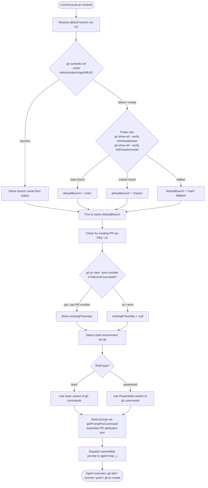

# `/commit-push-pr`

> Analysis basis: CC v2.1.139 bundle.js (AST extraction + Claude interpretation)
> Minimum version: v2.1.139

---

## Overview

`/commit-push-pr` is a `prompt`-type slash command that automates the full Git workflow of staging changes, committing, pushing to a remote, and opening a pull request. It resolves the current repository's default branch, detects the shell environment (bash vs. PowerShell), and dispatches a structured natural-language prompt to the agent that instructs it to perform all three operations in sequence, including PR attribution text.

---

## Registration

| Field | Value |
|---|---|
| type | `prompt` |
| name | `commit-push-pr` |
| description | `Commit, push, and open a PR` |
| loc_byte | `9965484` |
| loc_byte_end | `9966224` |
| loc_line | `5669` |
| handler_method | `getPromptForCommand` |
| handler_method_start | `9965688` |
| handler_method_end | `9966223` |
| prompt_body.length | `203` |
| prompt_body.trace | `call→de(...) (1 literals)` |
| arbor_handler.name | `getPromptForCommand` |
| arbor_handler.fqn | `claude-2.1.139::getPromptForCommand` |
| arbor_handler.kind | `Method` |
| arbor_handler.resolution_path | `direct` |
| arbor_handler.n_hits | `4` |

Analysis basis: CC v2.1.139 bundle.js:+9965484

---

## Input Branching

The command has 4+ distinct branches: shell-type detection (bash vs. PowerShell), default-branch resolution path (symbolic-ref lookup → fallback to `main`/`master` probe → cached value), existing-PR detection, and the final prompt assembly. A Mermaid flowchart is used.



Analysis basis: CC v2.1.139 bundle.js:+9965694 (call to `getPromptForCommand`), +9965734 (`Promise.all`), +9965747 (`UZ`), +9965775 (`P8q`), +9965885 (`de`)

---

## Behavioral Spec

### 1. Handler Entry Point — `getPromptForCommand`

The handler is registered as an inline `ObjectMethod` on the command registration object. The Arbor resolver confirmed this via `direct` resolution (n_hits = 4). The BFS synthetic entry `__handler_commit-push-pr` is bookkeeping only; the real bundle symbol is `getPromptForCommand`.

```
async function getPromptForCommand(context):
    [results] = await Promise.all([
        resolveDefaultBranch(context),   // UZ
        getRepoContext(context),          // $t1
        checkExistingPR(context),         // P8q
    ])
    promptText = buildPrompt(results)     // de(...)
    return promptText
```

Analysis basis: CC v2.1.139 bundle.js:+9965688

---

### 2. Default Branch Resolution — `resolveDefaultBranch`

Executes Git commands in sequence to determine the repository's default branch. Uses the shell execution engine (`$_` → `$PH`) with timeout and process management.

```
async function resolveDefaultBranch(context):
    // Step 1: try symbolic ref
    result = await runShellCommand(
        "git", ["symbolic-ref", "--short", "refs/remotes/origin/HEAD"]
    )
    if result.exitCode == 0 and result.stdout.trim() != "":
        branch = result.stdout.trim()
        // strip "origin/" prefix if present
        return branch.split("/").last()

    // Step 2: probe known defaults
    for candidate in ["main", "master"]:
        probe = await runShellCommand(
            "git", ["show-ref", "--verify", "--quiet",
                    "refs/heads/" + candidate]
        )
        if probe.exitCode == 0:
            return candidate

    // Step 3: hard fallback
    return "main"
```

Constants observed:
- `"symbolic-ref"` (bundle.js:+1044191)
- `"--short"` (bundle.js:+1044206)
- `"refs/remotes/origin/HEAD"` (bundle.js:+1044216)
- `"main"` (bundle.js:+1044329)
- `"master"` (bundle.js:+1044336)
- `"show-ref"` (bundle.js:+1044398)
- `"--verify"` (bundle.js:+1044409)
- `"--quiet"` (bundle.js:+1044420)
- Lookup key `"defaultBranch"` stored via `H7H.get` (bundle.js:+1033782, +1033790)

Analysis basis: CC v2.1.139 bundle.js:+1044149 (`Ab8`), +1044182 (`$_`)

---

### 3. Repository Context Collection — `getRepoContext`

Collects git remote metadata, memory/CLAUDE.md context, and conversation history to build attribution and context for the agent prompt.

```
async function getRepoContext(context):
    remoteInfo = getRemoteInfo(context)   // uses literal "remote" at +9673757
    settings   = loadSettings()           // m_ → Ix → vx8
    memories   = loadMemories()           // D97 → pw_
    prAttr     = getPRAttribution()       // J97 → z97 / w97

    // PR Attribution default path
    if no attribution data found:
        log("PR Attribution: returning default (no data)")
        // literal at +9674530

    // Memory keys: "memory" (+9674605), "memories" (+9674614)
    return { remoteInfo, settings, memories, prAttr }
```

Analysis basis: CC v2.1.139 bundle.js:+9673749 (`_yH`), +9673863 (`Tf6`), +9673879 (`xD`), +9673902 (`m_`), +9674199 (`Object.keys`), +9674316 (`Promise.all`), +9674329 (`D97`), +9674336 (`J97`)

---

### 4. Existing PR Detection — `checkExistingPR`

Probes the GitHub CLI for an existing open pull request on the current branch. Uses shell-variant-specific commands.

```
async function checkExistingPR(context):
    shellType = detectShell(context)   // de → shell detection

    if shellType == "bash":
        cmd = "gh pr view --json number 2>/dev/null || true"
        // literal at +9962561
    else:  // powershell
        cmd = "gh pr view --json number 2>$null; if (-not $?) { \"\" }"
        // literal at +9962608

    result = await runShellCommand(cmd, via=LK)
    if result contains valid JSON with "number":
        return parsedNumber
    return null
```

Analysis basis: CC v2.1.139 bundle.js:+9961679 (`IIH`), +9961694 (`X8q`), +9962556 (`LK`), +9962561, +9962608

---

### 5. Shell Detection and Prompt Construction — `buildPrompt`

The `de` function assembles the final prompt string that is sent to the agent. It performs shell-type detection and interpolates context values (default branch, existing PR number, attribution) into the prompt body. The raw prompt body is 203 characters and is generated via `call→de(...) (1 literals)`.

```
function buildPrompt(resolvedContext):
    shell = detectShell()   // checks for "bash" (+9390201) or "powershell" (+9390447)

    if shell == "bash":
        prViewCmd   = "gh pr view --json number 2>/dev/null || true"
        ghCreateCmd = buildBashGhCreateCommand(resolvedContext)
    elif shell == "powershell":
        prViewCmd   = "gh pr view --json number 2>$null; if (-not $?) { \"\" }"
        ghCreateCmd = buildPowerShellGhCreateCommand(resolvedContext)
    else:
        raise Error("unsupported shell")

    // Attribution suffix: ", ending with the attribution text shown in the example below"
    // literal at +9963744
    attributionSuffix = buildAttributionSuffix(resolvedContext.prAttr)

    // Assemble the prompt body (~203 chars after template substitution)
    // The prompt instructs the agent to:
    //   1. Stage and commit all changes
    //   2. Push the current branch
    //   3. Create or update a PR targeting defaultBranch
    //   4. Append attribution text to the PR body
    prompt = interpolate(PROMPT_TEMPLATE, {
        defaultBranch:   resolvedContext.defaultBranch,
        existingPrNum:   resolvedContext.existingPrNum,
        attributionText: attributionSuffix,
        ghCreateCmd:     ghCreateCmd,
    })

    return prompt
```

> **Shell-not-found guard:** If the command's skill frontmatter specifies `shell: bash` but Git Bash is absent on Windows, the prompt construction fails with a diagnostic message directing the user to install Git for Windows (`https://git-scm.com/downloads/win`) or change the frontmatter to `shell: powershell`. This guard is embedded in the `de` / `LK` execution path.

Analysis basis: CC v2.1.139 bundle.js:+9965885 (`de`), +9390201 (`"bash"`), +9390447 (`"powershell"`), +9390517 (`"!\``"`), +9963744 (attribution suffix literal), +9390960 (`br1.randomUUID` for unique prompt ID), +9390461 (`yu` / shell environment builder)

---

### 6. Agent Dispatch — `_j` (tool-execution loop)

After the prompt is constructed, it is forwarded to the standard agent tool-execution loop which handles permissions, sandboxing, and Bash tool calls.

```
async function agentLoop(prompt, context):
    appState = context.getAppState()
    toolPermCtx = context.getToolPermissionContext()

    // Permission check for Bash tool use
    permResult = checkPermissions(toolUse="Bash", context=toolPermCtx)
    // Outcomes: "allow", "deny", "ask", "auto"

    if permResult == "deny":
        throw PermissionDenied("Permission denied")
        // literal at +9390881

    if permResult == "ask" and headlessMode:
        throw Error(
            "Action requires interactive approval and permission prompts are not available in this context"
        )
        // literal at +9752786

    // Dispatch to Bash tool runner
    return executeToolCalls(prompt, toolPermCtx)
```

Analysis basis: CC v2.1.139 bundle.js:+9390639 (`_j`), +9749186 (`H.checkPermissions`), +9390881 (`"Permission denied"`), +9752786 (headless guard)

---

## State & Side Effects

| Item | Detail |
|---|---|
| Telemetry | `tengu_bg_spare_enable` (+14310004), `tengu_bg_low_mem_mb` (+14309754), `tengu_bg_spare_spawn` (+14310364), `tengu_daemon_config_reload` (+14324140), `tengu_daemon_control` (+14345083), `tengu_cobalt_ridge` (+4319480), `tengu_auto_mode_fallback_to_ask` (+9752907), `tengu_auto_mode_decision` (+9753699), `tengu_auto_mode_config` (+8013579), `tengu_auto_mode_malformed_tool_input` (+7999704), `tengu_bg_dispatch_sigkill_escalate` (+14310587), `tengu_bg_dispatch_low_mem` (+14311166), `tengu_bg_spare_claim` (+14311902), `tengu_bg_spare_claim_fail` (+14312165), `tengu_auto_mode_outcome` (+8014439), `tengu_bash_allowlist_strip_all` (+9755007), `tengu_iron_gate_closed` (+9757533), `tengu_auto_mode_denial_limit_exceeded` (+9746864), `tengu_tool_empty_result` (+4446200), `tengu_tool_result_persisted` (+4446440) |
| Hook registration | `wMA` registers `exit` and `error` event handlers on the child process (`H.on` at +1017207); `xfA`/`ufA` are bound as stdout/stderr stream handlers |
| appState changes | `TiH` calls `H.setAppState` (+9746410) after tool permission context updates; `k17` calls `TiH` (+9747209) to update state after tool result processing |
| Shell process management | `$PH` spawns shell subprocesses; `mfA` applies `Promise.race` with `setTimeout`/`clearTimeout` for per-command timeout; `UfA` issues `H.kill` for process teardown |
| Git side effects | `symbolic-ref` and `show-ref` git invocations are read-only probes; `gh pr view` is read-only; actual `git add`, `git commit`, `git push`, and `gh pr create` are issued by the agent as Bash tool calls after prompt dispatch |
| Sound | <!-- TODO: not found in depth-2 traversal; needs --depth 4 --> |
| Unique prompt ID | `br1.randomUUID` (+9390960) stamps each prompt invocation with a UUID |
| Tool result persistence | `o3H` → `pt6.writeFile` (+4445184) writes non-text tool results to disk; `tengu_tool_result_persisted` is emitted on success |

---

## Version History

| Version | Change |
|---|---|
| v2.1.139 | Initial analysis |

---

## Common Mistakes

1. **Missing GitHub CLI (`gh`)** — The command silently produces an empty PR number if `gh` is not installed or not authenticated. Ensure `gh auth login` has been completed before invoking `/commit-push-pr`.
2. **Wrong shell on Windows** — The command requires Git Bash (`shell: bash`) by default. If Git Bash is absent, the prompt construction raises a diagnostic error. Use `shell: powershell` in the skill frontmatter or install Git for Windows.
3. **Detached HEAD state** — If the working tree is in detached HEAD state, `git symbolic-ref` and `git push` will both fail. Check out a named branch first.
4. **No staged or unstaged changes** — The agent will attempt `git add` and `git commit`; if there is nothing to commit, the sequence may produce a non-fatal error that halts the push step. Ensure changes exist before invoking the command.
5. **Permission denial in headless / non-interactive mode** — If Claude Code is run with `--headless` and no Bash permission rule is configured, the `checkPermissions` call will throw rather than prompt, aborting the entire workflow.
6. **PR attribution text format** — The prompt instructs the agent to append a specific attribution suffix (ending with the text shown in the example). Manually editing the commit message after invocation may omit this suffix.

---

## Appendix — Identifier Mapping

> For bundle debugging only. Identifiers change across versions.

| Identifier | Role |
|---|---|
| `__handler_commit-push-pr` | BFS synthetic entry node; not a real bundle symbol — see `getPromptForCommand` |
| `UZ` | Default-branch resolver; runs `git symbolic-ref` and `show-ref` probe |
| `Ab8` | Reads `defaultBranch` key from branch cache map via `H7H.get` |
| `$_` | Shell command dispatcher; feeds into process-spawning pipeline |
| `$PH` | Core shell execution engine (spawn, pipe, timeout, kill) |
| `hMA` | Shell binary locator; handles win32 `.exe`/`cmd` suffixes |
| `QC8` | stdout stream handler factory |
| `dC8` | stderr stream handler factory |
| `lC8` | Combined `all` stream handler factory |
| `pfA` | Numeric validation helper (uses `Number.isFinite`) |
| `K_6` | Error wrapper / `bufferedData` aggregator |
| `gC8` | `Reflect.apply` / `Reflect.defineProperty` shim for process streams |
| `wMA` | Event-listener registrar for `exit` and `error` on child process |
| `mfA` | Timeout wrapper (`Promise.race` + `setTimeout`/`clearTimeout`) |
| `UfA` | Process kill helper (`H.kill` on timeout) |
| `xfA` | stdout data handler (bound) |
| `ufA` | stdin kill handler (bound) |
| `DMA` | Multi-stream aggregator (`Promise.all` over stdout/stderr) |
| `$_6` | Exit-code extractor |
| `OMA` | Pipe setup helper (`A.pipe`) |
| `zMA` | `fMA.default` / `A.add` — stream multiplexer setup |
| `QfA` | `RC8.bind` — stream binder |
| `Y` | Background daemon session manager (free-memory probe, session create/dispose) |
| `j6` | Session lookup / deduplication (`ZB.has`, `ZB.get`, `gfH.has`) |
| `ul_` | Background session spawner (calls `j6`) |
| `hl_` | PTY host spawner (`Bun.spawn`, `_aq.randomBytes`, `xp.mkdir/unlink`) |
| `Q` | Agent loop / background task scheduler |
| `LH` | Logger / error reporter (`SH`, `S1`, `CGK`, `RSH.push`, `Jd.logError`) |
| `_ZK` | String coercion utility |
| `_` | General-purpose utility / lodash-style helper |
| `$t1` | Repo-context collector (remote info, memories, PR attribution) |
| `_yH` | Remote info fetcher (uses literal `"remote"`) |
| `Tf6` | Repo root / path resolver |
| `xD` | Environment/URL resolver (local, staging, production) |
| `t_` | Module initializer / ES-module shim (`__esModule`) |
| `q` | Temp-file cleanup (`Aaq.unlinkSync`) |
| `V7_` | URL builder for staging/local environments |
| `ulL` | Staging URL constant holder |
| `m_` | Settings loader entry point |
| `Ix` | Settings load orchestrator (`loadSettingsFromDisk_start/end`) |
| `NS` | Settings namespace resolver |
| `P1` | Memory-usage tracker during settings load |
| `vx8` | Settings file reader (`settings_load_started/completed` events) |
| `nE6` | Settings post-processor |
| `H` | Random-delay / jitter helper (`Math.random`, `setTimeout`) |
| `N` | Terminal output / ANSI formatter |
| `y9K` | Shell type detector (`SZ`, `k9K`, `Xo_`) |
| `Xo_` | Shell capability probe (`h8K`, `S8K`) |
| `yH` | `JSON.stringify` wrapper |
| `LM` | String sanitizer / redactor (`[REDACTED]` literal) |
| `os_` | Path mapper (`Z9K.map`) |
| `A` | General string/array helper (`.toLowerCase`, `.map`, etc.) |
| `QyH` | Terminal write helper (`ms_`) |
| `ms_` | Raw `H.write` wrapper |
| `R9K` | Log file writer (mkdir, appendFile, rename, rotate) |
| `JyH` | Log line formatter (joins stdout/stderr buffers, `setImmediate`) |
| `n6H` | Log sink dispatcher (`AjH.join`, `V6`) |
| `B6` | Log buffer helper |
| `IV8` | EISDIR error handler |
| `qt_` | Log path joiner |
| `At_` | Log file rotator (`eI.stat`, `eI.rename`, `eI.unlink`) |
| `S9K` | Log file appender (`eI.mkdir`, `eI.appendFile`) |
| `C9` | Active-write-set tracker (`$Z8.add/delete`, `Object.assign`) |
| `D97` | Memory/context collector (`Array.from`, `Object.keys`, `pw_`) |
| `pw_` | CLAUDE.md / context file loader (file stat, diff, name-status) |
| `ZOH` | Context object factory (`C6`, `XL`, `A_`) |
| `V6` | Path joiner utility |
| `f` | Connection/stream lifecycle manager (`A.close`, `q.close`) |
| `D` | Daemon supervisor controller (`V.stop/start/updateConfig`, `f.set/get/delete`) |
| `z` | Daemon stop/control helper (`kH`, `xH`, `NR`, `Cb`) |
| `N31` | File-type classifier (extension, basename, regex test) |
| `Iw4` | Diff context builder (calls `ZOH`, `$_`, `C_`) |
| `y31` | Diff stat parser (parses `file changed`/`files changed` output, `parseInt`) |
| `L` | Promise-queue tracker (`q.add`, `f.finally`, `q.delete`) |
| `J97` | Conversation history truncator / compact-boundary finder |
| `Tf` | Compact-boundary marker builder (`pQ`, `r3`, `A_`, `t3.join`) |
| `pQ` | Compact marker prefix |
| `A_` | Compact marker type tag |
| `Ah6` | File reader with BOM detection and encoding handling |
| `JTK` | BOM pattern matcher (`"compact_boundary"`) |
| `WTK` | UTF-8 chunk decoder |
| `GTK` | Multi-chunk decoder with boundary detection |
| `TTK` | Buffer concatenator |
| `ETK` | Buffer slicer |
| `ZTK` | Line-end normalizer |
| `jPH` | JSON stream parser (`mZK`, `pZK`, `BZK`, `UZK`) |
| `mZK` | JSON parse initializer |
| `pZK` | JSON token scanner |
| `BZK` | JSON object boundary extractor |
| `UZK` | JSON value extractor |
| `K` | Array padding/display helper (`L.map`, `f.padEnd`) |
| `z97` | Message filter (user messages, sidechain/meta/compactSummary flags) |
| `O97` | Message type checker (`ft1`, `Array.isArray`, `q.some`) |
| `w97` | Tool-use message filter (`Y97.has`, `Hy_`) |
| `Hy_` | Team-member file detector (`qt1`, `YIH`, `At1.isTeamMemFile`) |
| `R1` | Model-ID normalizer (`rm6`, `zw`, `_Z8`, `uj`) |
| `rm6` | Model entry mapper (`Object.entries`) |
| `zw` | Model-string normalizer (`.toLowerCase`, `.includes`, `.replace`) |
| `_Z8` | Model alias table |
| `uj` | Model suffix replacer |
| `Tq` | Prompt/model context builder (`Xo`, `Kq`, `IJ`) |
| `Xo` | Model context assembler (`lI`, `LA`, `Po`) |
| `lI` | Base model info |
| `Po` | Model metadata parser (attributes, `OKL`, `O_H`, `HoA`) |
| `Kq` | Model display-name resolver (handles opusplan/sonnet/haiku/opus/best aliases) |
| `WG` | Model alias map (`Y_H`) |
| `O_H` | Supported-model membership checker (`$_H.includes`) |
| `eZ` | Extended-context model builder (`uM`, `$M`) |
| `kbH` | Model budget builder (`$M`) |
| `tZ` | Thinking-mode model builder (`uM`, `$M`) |
| `_oA` | Wrapper calling `tZ` |
| `uM` | Provider selector (`firstParty`/`anthropicAws`/`gateway`) |
| `EU6` | Model inclusion checker (`YKL.includes`) |
| `ybH` | Model capability flag setter (`SH`) |
| `IJ` | Model-context pipeline (`Kq`, `dP`) |
| `dP` | Full model descriptor builder (`e_`, `sU`, `C5H`, `hbH`, `tZ`, `xj`, `uM`, `WA`, `$M`, `eZ`) |
| `R31` | Opus-model membership check (`H.includes`, literal `"opus-4-7"` etc.) |
| `P8q` | Existing-PR checker orchestrator |
| `IIH` | PR-detection inner runner (calls `_yH`, `Tf6`, `xD`, `Tq`, `R5H`, `Nl8`, `m_`) |
| `R5H` | PR-related string validator (`.endsWith`, `R1`) |
| `Nl8` | PR-string normalizer (`R5H`) |
| `X8q` | PR number extractor from shell output (`.replace`) |
| `LK` | Shell runner for short-lived queries (`o6`, `W8H`) |
| `de` | Prompt builder / shell-type dispatcher (main prompt assembly) |
| `yu` | Shell environment builder (`o6`, `SH`, `vq`, `W8H`, `j6`) |
| `SH` | String coercion (`String`) |
| `vq` | Value stringifier (`String`) |
| `mt6` | Template-string replacer (`H.replace`) |
| `_j` | Agent tool-execution loop (permissions, sandbox, auto-mode) |
| `y17` | Tool-call permission evaluator (appState, sandboxing, JI, U7) |
| `W38` | Deny-rule permission evaluator (`iDH`, `Jy_`, `tt1`) |
| `et1` | Rule-based permission evaluator (`ViH`, `Jy_`, `tt1`) |
| `JI` | Sandbox permission gate (`aW`, `L3H`, `p_.isSandboxingEnabled`) |
| `U7` | Ask/passthrough permission builder (`e4`, `pP6`, `Js`, `Z8H`) |
| `gO8` | Permission result cache (recursive memoization) |
| `sn` | Permission ask recursion handler |
| `He1` | Hook-based permission handler |
| `at1` | Allow-rule matcher |
| `v17` | Version-check gate (`ZiH`, `Jy_`) |
| `i$6` | App-state update trigger |
| `TiH` | App-state setter (`Object.assign`, `H.setAppState`) |
| `Le1` | Post-tool-call cleanup |
| `M1` | MCP tool-name prefix checker (`mcp__`) |
| `s88` | Safety-check dispatcher |
| `ab` | Tool result accumulator |
| `F0_` | Fast-path error handler |
| `LA1` | Allowlist tracker (`q.add`) |
| `_w6` | Auto-mode classifier pipeline |
| `RN1` | Classifier input setter (`_.set`) |
| `bN1` | Classifier bootstrap (`CN1`) |
| `EN1` | Classifier session initializer (`j6`, `Tq`) |
| `nx4` | Permissions template formatter (`<permissions_template>`) |
| `SN1` | Message filter for classifier input |
| `dx4` | Classifier stage gate (`kE8`, `Ng`, `E78`) |
| `CN1` | Auto-mode input serializer (`toAutoClassifierInput`, `ZN1`, `yH`) |
| `w` | Background process manager (session spawn, kill, memory check) |
| `lJ` | Token-count helper (`n3H`, `Fg9`, `HM6`, `hV`) |
| `Ng` | Classifier configuration accessor |
| `E78` | Auto-mode mode reader (`auto_mode`) |
| `_u4` | Classifier fast-path helper (`pN1`) |
| `ex4` | Classifier request executor (two-stage XML pipeline) |
| `Au4` | Classifier result post-processor (`pN1`) |
| `TN1` | Classifier result type resolver |
| `mN1` | Classifier metric recorder |
| `s1H` | Classifier context builder (`Y1`, `K2`, ephemeral/global) |
| `p0_` | Classifier prompt builder (`BE`, `Hu4`, `JC`) |
| `u0_` | Classifier stage-2 prompt builder |
| `utH` | Classifier stage-2 result handler |
| `m0_` | Classifier stage-1 result handler |
| `wN1` | Tool-use block finder (`H.find`) |
| `vg` | Auto-mode outcome emitter (`permission_auto_mode_classifier`, `kH`, `xH`) |
| `Z78` | Classifier abort handler |
| `JN1` | Classifier schema validator (`_.safeParse`) |
| `BN1` | Classifier blocker (`oL_`) |
| `IH` | String coercion (`String`) |
| `hN1` | Classifier transcript file writer (`bZH.mkdir`, `bZH.writeFile`) |
| `UN1` | Classifier timeout/connection-error handler (`tJH`, `w8`) |
| `e9H` | Tool-use entry cleanup (`q.delete`) |
| `GU6` | Permission-denied error builder (`S5H`) |
| `S5H` | Permission-denied message formatter (`fKL`, `LKL`) |
| `ZtH` | `inputTokens` counter accessor |
| `Gj` | `outputTokens` counter accessor |
| `VtH` | `cacheReadInputTokens` counter accessor |
| `ItH` | `cacheCreationInputTokens` counter accessor |
| `oT` | Session token-counter updater (`j6`) |
| `Me1` | Tool-result post-processor |
| `i_1` | Tool-call finisher |
| `k17` | App-state updater after tool result (`r_1`, `Q`, `M1`, `N`, `TiH`) |
| `r_1` | Tool-state reset |
| `fe1` | Tool-error handler |
| `N17` | Permission-hook pipeline (`aqH`, `UP6`, `yVH`, `UR`, `XV`, `q_`) |
| `aqH` | Permission request object builder (`N`, `q4`, `IX`) |
| `UP6` | Permission-request evaluator |
| `yVH` | Permission-rule evaluator (mirrors `y17` for hook path) |
| `UR` | Permission hook runner (`Ls`) |
| `XV` | Hook executor (`Uf`) |
| `q_` | Error string builder (`Error`, `String`) |
| `Ke1` | Headless permission-denial handler |
| `Uw` | Stop-sequence / message-stop handler |
| `Fe1` | Agent completion handler (`$`, `M`) |
| `M` | Active-session map manager (`WIH`, `Niq`, `L.get/values`, `Wa7`) |
| `$BH` | Tool result mapper (`mapToolResultToToolResultBlockParam`, `MQ9`, `LQ9`) |
| `MQ9` | Tool result content builder (text/image/document handling) |
| `prL` | Text content validator (`H.trim`, `Array.isArray`, `H.every`) |
| `zQ9` | Array content type checker |
| `DQ9` | Content reducer (`H.reduce`) |
| `o3H` | Non-text result file persister (`pt6.writeFile`, `EEXIST` guard) |
| `s3H` | Content type switch helper |
| `a3H` | Binary result handler (`B1`) |
| `LQ9` | Token-limit calculator (`Number.isFinite`, `j6`, `Math.min`) |
| `xr1` | Prompt segment joiner (trims, pushes, joins) |
| `eH7` | Prompt section builder (`xr1`, `IH`) |

---

Note: index built via Arbor fallback; some signals (telemetry, literals) may be missing — see arbor-fallback.js.