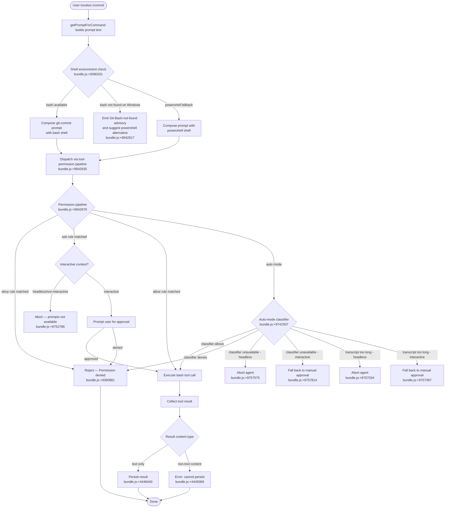

# `/commit`

> Analysis basis: CC v2.1.139 bundle.js (AST extraction + Claude interpretation)
> Minimum version: v2.1.139

---

## Overview

The `/commit` command instructs the Claude Code agent to create a git commit by constructing a prompt and dispatching it through the standard tool-permission pipeline. It is a `prompt`-type command whose handler (`getPromptForCommand`) builds the prompt text at invocation time — potentially resolving shell-environment details — before handing off to the agent's bash execution, permission-check, and tool-result persistence subsystems.

---

## Registration

| Field | Value |
|---|---|
| type | `prompt` |
| name | `commit` |
| description | `Create a git commit` |
| loc_byte | `9942714` |
| loc_byte_end | `9943266` |
| loc_line | `5589` |
| handler_method | `getPromptForCommand` |
| handler_method_start | `9942861` |
| handler_method_end | `9943265` |
| prompt_body.length | `203` |
| prompt_body.trace | `call→de(...) (1 literals)` |
| arbor_handler.name | `getPromptForCommand` |
| arbor_handler.fqn | `claude-2.1.139::getPromptForCommand` |
| arbor_handler.kind | `Method` |
| arbor_handler.resolution_path | `direct` |
| arbor_handler.n_hits | `3` |

Analysis basis: CC v2.1.139 bundle.js:+9942714

---

## Input Branching

The command's execution involves more than three distinct conditional branches: shell-environment detection (bash vs. PowerShell), permission-pipeline routing (deny / rule / ask / allow / auto-mode classifier), sandbox state checks, and tool-result persistence paths. A Mermaid flowchart is therefore used.



---

## Behavioral Spec

### Handler Entry Point — `getPromptForCommand`

The handler is an inline `ObjectMethod` on the registration object, resolved by Arbor via the `direct` path (the symbol falls inside the registration byte range `9942714`–`9943266`).

```
function getPromptForCommand(context):
    shellEnv = detectShellEnvironment(context)   // calls de() → bundle.js:+9942935
    if shellEnv == "bash" and bashNotFoundOnWindows():
        return advisoryText(
            "Git Bash not found; install or switch to powershell"
        )
    promptText = buildCommitPrompt(shellEnv)      // text type, loc_byte 9942917
    return promptText
```

Analysis basis: CC v2.1.139 bundle.js:+9942861

---

### Shell-Environment Resolution — `shellEnvironmentResolver` (`de`)

The function `de` (internally named here `shellEnvironmentResolver`) is the primary call from the handler (call-graph edge `__handler_commit → de` at bundle.js:+9942935). It:

1. Queries the platform/OS context via `platformWindowsChecker` (`LK`) — checking for `"windows"` (bundle.js:+4319529).
2. Resolves the shell string: prefers `"bash"` (bundle.js:+9390201); falls back to `"powershell"` (bundle.js:+9390447) when Git Bash is absent.
3. Scans the existing conversation context using `H.matchAll` (bundle.js:+9390488) and `H.includes` (bundle.js:+9390506) to detect shell-related markers such as `` "!`" `` (bundle.js:+9390517).
4. Fans out via `Promise.all` (bundle.js:+9390560) to collect any parallel sub-results.
5. Constructs and returns the prompt string via `promptAssembler` (`xr1`) — trimming, joining, and formatting segments (bundle.js:+9391154–9391272).

```
function shellEnvironmentResolver(context):
    platform = platformWindowsChecker(context)
    if platform == "windows":
        bashPath = locateBash()
        if bashPath is None:
            return buildWindowsFallbackPrompt("powershell")
    conversationHints = scanConversationForShellMarkers(context)
    subResults = await Promise.all(parallelChecks(context))
    return promptAssembler(subResults, conversationHints)
```

Analysis basis: CC v2.1.139 bundle.js:+9390210, +9390447, +9390517, +9390560

---

### Platform and Git-Repository Checks — `repoContextCollector` (`jL7`)

Called from `__handler_commit` at bundle.js:+9942898. This function calls:

- `platformWindowsChecker` (`LK`) — bundle.js:+9942041 — to gate Windows-specific logic.
- `gitStatusFetcher` (`W8H`) — bundle.js:+4319555 — to retrieve current repository status before prompt construction.

```
function repoContextCollector(context):
    platform = platformWindowsChecker(context)
    repoStatus = gitStatusFetcher(context)
    return { platform, repoStatus }
```

Analysis basis: CC v2.1.139 bundle.js:+9942041, +9942898

---

### Tool-Permission Pipeline — `toolPermissionDispatcher` (`_j`)

Reached via `__handler_commit → de → _j` (bundle.js:+9390639). This is the core permission-evaluation engine shared by all tool-dispatching commands. For `/commit` the relevant tool is `Bash`.

```
function toolPermissionDispatcher(toolCall, context):
    appState = getAppState(context)                        // bundle.js:+9751984
    permCtx  = getToolPermissionContext(context)           // bundle.js:+9942979

    // 1. Deny rules (settings)
    if denyRuleMatches(toolCall, permCtx):
        return Reject("Permission denied")                 // bundle.js:+9390881

    // 2. Auto-mode path
    if appState.mode == "auto":
        result = autoModeClassifier(toolCall, context)     // bundle.js:+9749010
        return handleClassifierResult(result)

    // 3. Ask / allow rules
    resolution = checkPermissions(toolCall, permCtx)       // bundle.js:+9749186
    if resolution == "ask":
        if isHeadless(context):
            abort("Action requires interactive approval…")  // bundle.js:+9752786
        return promptUserApproval(toolCall)

    if resolution == "allow":
        return executeToolCall(toolCall)

    // 4. Bypass mode
    if permCtx.bypassPermissions:                          // bundle.js:+9749614
        return executeToolCall(toolCall)

    return Reject("Permission denied")
```

Analysis basis: CC v2.1.139 bundle.js:+9751942, +9752786, +9749186, +9749614

---

### Auto-Mode Classifier — `autoModeClassifierOrchestrator` (`_w6`)

Invoked when the session is in `"auto"` mode (bundle.js:+9742307). Conducts a two-stage XML classification of the Bash tool call:

- **Stage 1 (fast):** `"xml_fast"` / `"xml_s1"` — lightweight classifier pass (bundle.js:+8003867, +8004502).
- **Stage 2 (thinking):** `"xml_2stage"` / `"xml_s2"` — deeper reasoning pass when Stage 1 is ambiguous (bundle.js:+8003843, +8005820).

Key thresholds and constants (bundle.js:+8004218, +8004222, +8005589):
- Stage 1 token budget: 256 tokens fast / 64 tokens minimum.
- Stage 2 max tokens: 4096.

Outcome strings: `"allowed"` (bundle.js:+9753736), `"blocked"` (bundle.js:+9754830), `"unavailable"` (bundle.js:+9754802).

```
function autoModeClassifierOrchestrator(toolCall, context):
    classifierInput = buildClassifierInput(toolCall)       // bundle.js:+7999605
    if classifierInput is None:
        log("Tool declares no classifier-relevant input")  // bundle.js:+8009395
        return "allow"

    stage1Result = runFastClassifier(classifierInput)      // xml_fast stage
    emit("tengu_auto_mode_config")                         // bundle.js:+8013579

    if stage1Result == "allowed":
        return "allowed"                                   // bundle.js:+8004778

    if stage1Result in ["refusal", "policy_refusal",
                        "max_tokens", "unparseable"]:      // bundle.js:+8004950–8005016
        return runThinkingClassifier(classifierInput)      // xml_2stage

    if stage1Result == "interrupted":
        emit("tengu_auto_mode_outcome")
        return "blocked"

    // Error / unavailability handling
    if classifierUnavailable():
        if isHeadless():
            return "unavailable"                           // fail closed
        else:
            return "fallback_ask"                          // fail open

    return stage1Result
```

Analysis basis: CC v2.1.139 bundle.js:+8003836, +8003867, +8004502, +8005820, +8009395

---

### Permission-Result Persistence — `toolResultPersister` (`o3H`)

After the Bash tool executes the git commit, results are persisted:

```
function toolResultPersister(toolResult):
    if not isTextOnlyResult(toolResult):                   // bundle.js:+4445001
        throw Error("Cannot persist tool results containing non-text content")
                                                           // bundle.js:+4445069
    tmpPath = buildTempPath(toolResult.id)
    fs.writeFile(tmpPath, toolResult.content, "wx")        // bundle.js:+4445184, +4445225
    if writeSucceeds:
        emit("tengu_tool_result_persisted")                // bundle.js:+4446440
    else if error.code == "EEXIST":                        // bundle.js:+4445305
        // File already persisted; silently skip
        pass
```

Analysis basis: CC v2.1.139 bundle.js:+4445001, +4445069, +4445184, +4446440

---

### Settings Loader — `settingsFromDiskLoader` (`Ix`)

Invoked transitively via `m_` at bundle.js:+9672142. Emits timing telemetry around disk I/O:

```
function settingsFromDiskLoader():
    emit("loadSettingsFromDisk_start")    // bundle.js:+1185200
    settings = readFromDisk()
    emit("loadSettingsFromDisk_end")      // bundle.js:+1185254
    return settings
```

Analysis basis: CC v2.1.139 bundle.js:+1185171, +1185197

---

### Dangerous-Command Safety Checks — `dangerousCommandChecker` (`sn`)

Evaluates the git commit Bash command against known dangerous patterns before execution:

```
function dangerousCommandChecker(command):
    if matchesDangerousRm(command):
        flag("Dangerous rm operation")         // bundle.js:+9749801
        return "deny"
    if matchesDangerousRmdir(command):
        flag("Dangerous rmdir operation")      // bundle.js:+9749848
        return "deny"
    return "pass"
```

Analysis basis: CC v2.1.139 bundle.js:+9749756, +9749801, +9749848

---

## State & Side Effects

| Item | Detail |
|---|---|
| Telemetry | `tengu_cobalt_ridge` (bundle.js:+4319480) — platform/OS probe |
| Telemetry | `tengu_auto_mode_fallback_to_ask` (bundle.js:+9752907) — classifier falls back to interactive ask |
| Telemetry | `tengu_auto_mode_decision` (bundle.js:+9753699) — records final allow/deny decision |
| Telemetry | `tengu_auto_mode_config` (bundle.js:+8013579) — classifier configuration snapshot |
| Telemetry | `tengu_auto_mode_malformed_tool_input` (bundle.js:+7999704) — malformed tool input detected |
| Telemetry | `tengu_auto_mode_outcome` (bundle.js:+8014439) — classifier pipeline outcome |
| Telemetry | `tengu_bash_allowlist_strip_all` (bundle.js:+9755007) — entire bash allowlist was stripped |
| Telemetry | `tengu_iron_gate_closed` (bundle.js:+9757533) — agent aborted due to classifier limits |
| Telemetry | `tengu_auto_mode_denial_limit_exceeded` (bundle.js:+9746864) — too many consecutive denials |
| Telemetry | `tengu_tool_empty_result` (bundle.js:+4446200) — tool returned empty result |
| Telemetry | `tengu_tool_result_persisted` (bundle.js:+4446440) — tool result successfully written to disk |
| Telemetry | `tengu_bg_dispatch_sigkill_escalate` (bundle.js:+14310587) — background process escalated to SIGKILL |
| Telemetry | `tengu_bg_dispatch_low_mem` (bundle.js:+14311166) — background dispatch suppressed due to low memory |
| Telemetry | `tengu_bg_spare_enable` (bundle.js:+14311781) — spare background session enabled |
| Telemetry | `tengu_bg_spare_claim` (bundle.js:+14311902) — spare session claimed |
| Telemetry | `tengu_bg_spare_claim_fail` (bundle.js:+14312165) — spare session claim failed |
| appState changes | `setAppState` called via `TiH` (bundle.js:+9746410) — updates session state after permission resolution |
| Permission context | `setToolPermissionContext` called via `N17` (bundle.js:+9745813) — stores resolved permission context |
| Disk I/O | `bZH.writeFile` (bundle.js:+7998467) — tool result written; `hN1` also calls `bZH.mkdir` (bundle.js:+7997922) |
| Disk I/O | `Aaq.unlinkSync` (bundle.js:+14290176) — temp file cleanup |
| Background process | `Ip.spawn` (bundle.js:+14312224) — background daemon spawned for async execution |
| Process signal | `S.kill` with `"SIGKILL"` (bundle.js:+14310628, +14310635) — force-terminates stalled background processes |
| Hook registration | Permission-request hooks evaluated at `N17` / `XV` / `UR` path (bundle.js:+9745845, +9745807) |
| Sound | <!-- TODO: not found in depth-2 traversal; needs --depth 4 --> |
| Literal route name | `"/commit"` registered as command route (bundle.js:+9943252) |

---

## Version History

| Version | Change |
|---|---|
| v2.1.139 | Initial analysis |

---

## Common Mistakes

1. **Invoking `/commit` in a headless/non-interactive session without pre-configured allow rules.** The permission pipeline will abort with "Action requires interactive approval and permission prompts are not available in this context" (bundle.js:+9752786) unless a matching allow rule exists in settings or `bypassPermissions` is set.

2. **Running on Windows without Git for Windows installed.** The shell-environment resolver (`de`) checks for bash availability; if Git Bash is absent, the agent receives the advisory prompt about installing Git for Windows or switching the shell to `powershell` (bundle.js:+9390447). The commit will not proceed until the environment is resolved.

3. **Exceeding the auto-mode classifier context window.** In auto mode, if the conversation transcript is too long, the classifier aborts in headless mode or falls back to manual approval in interactive mode (bundle.js:+9757034, +9757367). Use `/compact` to reduce conversation size before invoking `/commit`.

4. **Expecting the command to bypass dangerous-command guards.** The `dangerousCommandChecker` (`sn`) still runs even for `/commit`-generated bash calls. Any git command that internally triggers patterns matching dangerous `rm` or `rmdir` operations will be flagged (bundle.js:+9749801, +9749848).

5. **Assuming non-text tool results are supported.** If the git commit bash tool returns any non-text content blocks (images, documents), persistence will fail with "Cannot persist tool results containing non-text content" (bundle.js:+4445069). This is unlikely in normal use but possible with custom shell wrappers.

---

Note: index built via Arbor fallback; some signals (telemetry, literals) may be missing — see arbor-fallback.js.

---

## Appendix — Identifier Mapping

> For bundle debugging only. Identifiers change across versions.

| Identifier | Role |
|---|---|
| `__handler_commit` | Synthetic BFS entry point for the `/commit` command handler |
| `jL7` | `repoContextCollector` — collects platform and git repository context |
| `IIH` | Top-level commit orchestrator; fans out to shell, model, and settings helpers |
| `_yH` | Shell/environment sub-resolver (called from orchestrator) |
| `Tf6` | Shared utility: likely a formatting/template helper |
| `xD` | Environment detection dispatcher |
| `t_` | Module initializer / ES-module setup helper |
| `q` | Temp-file cleanup helper (calls `unlinkSync`) |
| `V7_` | URL/endpoint builder (references localhost and staging URLs) |
| `Tq` | Model-name resolution entry point |
| `Xo` | Model-list fetcher sub-routine |
| `Kq` | Model-name normalizer (trim, toLowerCase, replace, alias resolution) |
| `IJ` | Model-name-to-ID mapper |
| `R5H` | Model suffix handler (e.g. `" (1M context)"` annotation) |
| `H` | General-purpose utility object (random, setTimeout, string ops) |
| `R1` | Application-inference-profile resolver |
| `Nl8` | Model suffix delegator → `R5H` |
| `m_` | Settings loader dispatcher |
| `Ix` | `settingsFromDiskLoader` — reads settings from disk with telemetry |
| `LK` | `platformWindowsChecker` — detects Windows platform |
| `de` | `shellEnvironmentResolver` — resolves shell and builds commit prompt |
| `yu` | Prompt-string formatter (calls `o6`, `SH`, `vq`, `W8H`, `j6`) |
| `SH` | String coercer (wraps `String()`) |
| `vq` | Variant string coercer |
| `j6` | Token-usage tracker / conversation-record updater |
| `L46` | Token-usage field accessor |
| `M46` | Token-usage field mutator |
| `Ya` | Record builder for conversation entries |
| `Ql6` | Conversation-record deduplication cache |
| `b6` | Conversation-record timestamp stamper (calls `Date.now`) |
| `mt6` | String replacement helper (calls `H.replace`) |
| `_j` | `toolPermissionDispatcher` — main permission pipeline for tool calls |
| `y17` | Permission-check orchestrator (appState, sandbox, classifier, hooks) |
| `A` | App-state accessor object |
| `W38` | Sandboxing-enabled path handler |
| `et1` | Auto-allow-bash-if-sandboxed handler |
| `JI` | Sandbox permission resolver |
| `U7` | Permission-reason assembler (builds human-readable permission context) |
| `LH` | Permission-error logger (calls `logError`) |
| `gO8` | Plan-mode permission gatekeeper (recursive) |
| `sn` | `dangerousCommandChecker` — flags dangerous rm/rmdir patterns |
| `He1` | Allow-rule evaluator |
| `at1` | Additional tool-permission check |
| `v17` | Permission-context builder variant |
| `N` | Message/notification formatter (trim, toUpperCase, includes) |
| `yH` | JSON stringifier wrapper |
| `i$6` | Auto-mode initial state setter |
| `TiH` | App-state updater (calls `setAppState`) |
| `Le1` | Permission lifecycle event emitter |
| `Q` | Shared async queue / promise utility |
| `M1` | MCP-tool-name prefix checker (checks `"mcp__"` prefix) |
| `s88` | Safety-check result handler |
| `ab` | Permission-acceptance handler |
| `F0_` | Fast-path error handler |
| `LA1` | Allowlist set builder |
| `_w6` | `autoModeClassifierOrchestrator` — two-stage XML auto-mode classifier |
| `RN1` | Classifier state map setter |
| `bN1` | Classifier state initializer → `CN1` |
| `EN1` | Classifier entry (calls `j6` token tracker and `Tq` model resolver) |
| `nx4` | Permission-template builder (injects `<permissions_template>`, `<settings_deny_rules>`) |
| `SN1` | Classifier input assembler (array filter, push, has) |
| `dx4` | Classifier error/status handler (calls `kE8`, `Ng`, `E78`) |
| `CN1` | Classifier context builder (toAutoClassifierInput, `ZN1`, `yH`) |
| `w` | Background-process daemon manager (spawn, SIGKILL, freemem) |
| `lJ` | Token-slice utility for classifier prompts |
| `f` | Stream/channel close handler |
| `Ng` | Classifier outcome normalizer |
| `E78` | Auto-mode outcome recorder (calls `uZH`) |
| `_u4` | Classifier pre-check → `pN1` |
| `ex4` | Two-stage XML classifier executor (stage1/stage2, fast/thinking) |
| `Au4` | Post-classifier result handler → `pN1` |
| `TN1` | Classifier timeout/state guard |
| `mN1` | Classifier timestamp recorder |
| `s1H` | Cache-control annotator (ephemeral/global) |
| `p0_` | Classifier request builder (calls `BE`, `Hu4`, `JC`, `f`) |
| `u0_` | Classifier stage-2 input builder |
| `utH` | Classifier utility: transcript truncator |
| `m0_` | Classifier stage-2 model selector |
| `wN1` | Tool-use block finder (calls `H.find`) |
| `vg` | Auto-mode outcome telemetry emitter (`permission_auto_mode_classifier`) |
| `Z78` | Classifier abort/interrupt handler |
| `JN1` | Classifier response schema validator (calls `safeParse`) |
| `BN1` | Classifier block handler → `oL_` |
| `IH` | String coercer (wraps `String()`) |
| `hN1` | Tool-result file writer (mkdir, writeFile, utf-8) |
| `UN1` | Classifier timeout categorizer (wall_clock, connection, unavailable) |
| `e9H` | Allowlist-entry deleter |
| `GU6` | Hook result processor → `S5H` |
| `S5H` | Hook signal extractor (`fKL`, `LKL`) |
| `ZtH` | Input-token counter (`rkH`, `Object.values`) |
| `Gj` | Output-token counter |
| `VtH` | Cache-read-token counter |
| `ItH` | Cache-creation-token counter |
| `oT` | Conversation-record appender |
| `Me1` | Post-execution state updater |
| `i_1` | Execution result finalizer |
| `k17` | Permission-decision recorder (calls `TiH` setAppState) |
| `r_1` | Permission-decision log entry builder |
| `fe1` | Tool-execution error handler |
| `N17` | Permission-hook orchestrator (setToolPermissionContext, XV, UR) |
| `aqH` | Permission-request constructor (`PermissionRequest`, `q4`, `IX`) |
| `UP6` | Permission-upstream notifier |
| `yVH` | Permission-re-evaluation after hook (mirrors `y17` logic) |
| `UR` | Hook runner → `Ls` |
| `XV` | Hook-result applier → `Uf` |
| `q_` | Error constructor wrapper |
| `Ke1` | Final permission-result dispatcher |
| `Uw` | Agent-loop stop-sequence handler → `Fe1` |
| `Fe1` | Stop-sequence result builder (`$`, `M`) |
| `$` | Stop-sequence type resolver → `NXq` |
| `M` | Active-session map manager (get, values, set) |
| `L` | Promise-lifecycle tracker (add, delete, finally) |
| `$BH` | Tool-result block mapper (`mapToolResultToToolResultBlockParam`, `MQ9`, `LQ9`) |
| `MQ9` | Tool-result formatter (empty check, content assembly, Math.ceil) |
| `prL` | Tool-result text validator (trim, isArray, every) |
| `zQ9` | Non-text content type detector (image, document) |
| `DQ9` | Tool-result content reducer |
| `o3H` | `toolResultPersister` — writes tool results to disk |
| `s3H` | Tool-result size calculator |
| `a3H` | Tool-result content builder → `B1` |
| `LQ9` | Token-limit enforcer for tool results (Number.isFinite, Math.min) |
| `xr1` | `promptAssembler` — trims and joins prompt segments |
| `_` | Generic iteration/transformation helper |
| `K` | Padding/alignment helper (padEnd) |
| `eH7` | Prompt-variant builder (calls `xr1`, `IH`) |