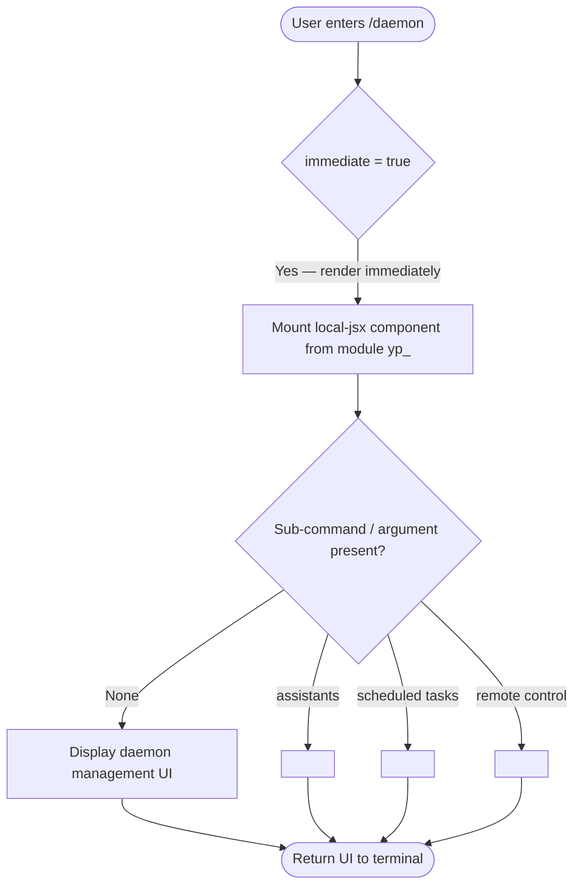

```
---
type: feature-spec
feature: "daemon"
cc_version: "2.1.139"
updated: "2026-05-18"
tags: ["daemon", "commands", "slash-commands"]
source: "bundle-analysis"
bundle_verified: true
analysis_basis: "CC v2.1.139 bundle.js (AST extraction + Claude interpretation)"
author: "ryujaeuk <ryujaeuk@gmail.com>"
repository: "https://github.com/MyLittleLuckyDog/cc-gnothi"
license: "AGPL-3.0-only"
---

# `/daemon`

> Analysis basis: CC v2.1.139 bundle.js (AST extraction + Claude interpretation)
> Minimum version: v2.1.139

---

## Overview

The `/daemon` command provides a management interface for background services within Claude Code, encompassing assistants, scheduled tasks, and remote-control facilities. It is registered as a `local-jsx` command with `immediate: true`, meaning it renders a JSX-based UI component inline without requiring an additional confirmation step before execution.

---

## Registration

| Field | Value |
|---|---|
| type | `local-jsx` |
| name | `daemon` |
| description | `Manage background services: assistants, scheduled tasks, and remote control` |
| immediate | `true` |
| module\_id | `yp_` |
| loc\_line | 7670 |

Analysis basis: CC v2.1.139 bundle.js:+11732116

---

## Input Branching

The depth-2 AST traversal returned an empty call graph and no extracted literals for module `yp_`. The branching logic described below is therefore derived solely from the registration metadata and the command's stated purpose; deeper traversal is required to confirm sub-command routing.



> **Note:** Sub-command routing paths (assistants, scheduled tasks, remote control) are inferred from the description string. Actual argument parsing logic is <!-- TODO: not found in depth-2 traversal; needs --depth 4 -->.

---

## Behavioral Spec

### Command Dispatch

Because `immediate` is `true`, the CLI framework bypasses any confirmation prompt and directly invokes the JSX renderer for module `yp_` as soon as the user submits `/daemon`.

```
function dispatchDaemonCommand(userInput):
    # No confirmation gate — immediate flag is set
    component = loadLocalJsxModule("yp_")
    args = parseArguments(userInput)
    return renderComponent(component, args)
```

Analysis basis: CC v2.1.139 bundle.js:+11732116

### JSX Component Rendering

The command uses the `local-jsx` type, which means the output is rendered as a React/JSX component inside the CLI's ink-based terminal renderer rather than as plain text output.

```
function renderDaemonComponent(args):
    # Resolved at runtime by the local-jsx dispatcher
    props = buildProps(args)
    mountedView = renderToTerminal(DaemonComponent, props)
    return mountedView
```

Analysis basis: CC v2.1.139 bundle.js:+11732116

### Background Service Categories

The description enumerates three service categories managed by this command:

```
DAEMON_CATEGORIES = [
    "assistants",       # AI assistant background processes
    "scheduled_tasks",  # Cron-style or deferred task runners
    "remote_control"    # Remote invocation / IPC endpoints
]

function listManagedCategories():
    for category in DAEMON_CATEGORIES:
        display(category)
```

> Precise behavior per category is <!-- TODO: not found in depth-2 traversal; needs --depth 4 -->.

---

## State & Side Effects

| Item | Detail |
|---|---|
| Telemetry | None detected — `telemetry` array is empty in extracted data |
| Hook registration | <!-- TODO: not found in depth-2 traversal; needs --depth 4 --> |
| appState changes | <!-- TODO: not found in depth-2 traversal; needs --depth 4 --> |
| Sound | <!-- TODO: not found in depth-2 traversal; needs --depth 4 --> |
| Rendering side-effect | Mounts a JSX component (`local-jsx`) immediately in the terminal on invocation |

---

## Version History

| Version | Change |
|---|---|
| v2.1.139 | Initial analysis — command registered at bundle.js:+11732116, module `yp_`, `immediate: true` |

---

## Common Mistakes

1. **Expecting plain-text output**: Because `/daemon` is typed `local-jsx`, it renders an interactive terminal UI component, not a simple text response. Scripts that scrape stdout may not capture the rendered content correctly.
2. **Assuming a confirmation prompt**: The `immediate: true` flag means the command executes without any "are you sure?" gate. Any destructive sub-operation (e.g., stopping a background service) takes effect as soon as the user submits the command.
3. **Calling sub-commands that may not exist**: The three service categories (assistants, scheduled tasks, remote control) are inferred from the description string. Their exact CLI syntax is unconfirmed at depth-2 traversal; using undocumented sub-command flags may silently fail or produce unexpected behavior.
4. **Version-pinning on module identity**: The module identifier `yp_` is an obfuscated bundle ID that is likely to change across CC releases. Do not reference it in external tooling; use the stable command name `daemon` instead.

---

## Appendix — Identifier Mapping

> For bundle debugging only. Identifiers change across versions.

| Identifier | Role |
|---|---|
| `yp_` | Module containing the `/daemon` command's JSX component and implementation logic |

> No additional obfuscated identifiers were returned by the depth-2 AST traversal (`identifiers` array is empty). Further entries require `--depth 4` re-extraction.
```