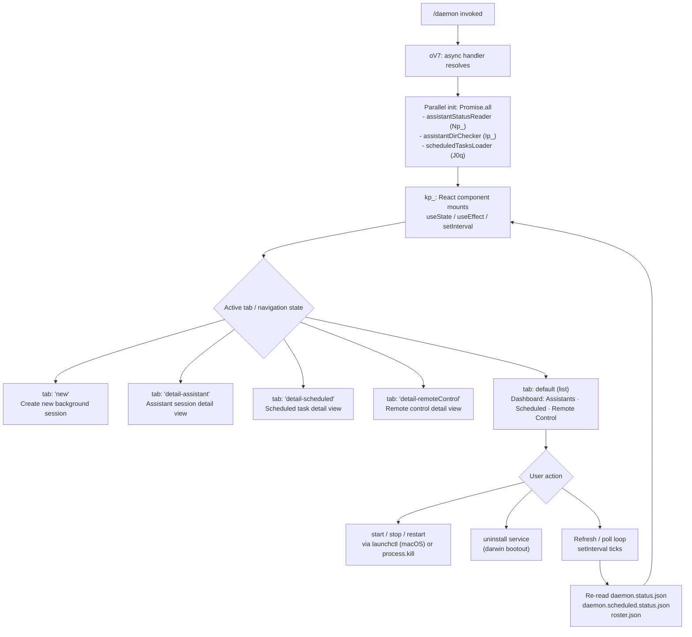

# `/daemon`

> Analysis basis: CC v2.1.139 bundle.js (AST extraction + Claude interpretation)
> Minimum version: v2.1.139

---

## Overview

The `/daemon` command provides an interactive management interface for Claude Code background services, encompassing assistant sessions, scheduled tasks, and remote control connections. It renders a live JSX dashboard (type `local-jsx`) that polls daemon state at regular intervals and exposes controls for starting, stopping, restarting, and inspecting each service category. The command's primary handler (`oV7`) is resolved via the `yp_` module and runs asynchronously.

---

## Registration

| Field | Value |
|---|---|
| type | `local-jsx` |
| name | `daemon` |
| description | `Manage background services: assistants, scheduled tasks, and remote control` |
| immediate | `true` |
| module_id | `yp_` |
| load_inline | `true` |
| loc_byte | `11732116` |
| loc_byte_end | `11732320` |
| loc_line | `7670` |
| arbor_handler.name | `oV7` |
| arbor_handler.fqn | `claude-2.1.139::oV7` |
| arbor_handler.kind | `AsyncFunction` |
| arbor_handler.resolution_path | `module_id` |
| arbor_handler.n_hits | `0` |

Analysis basis: CC v2.1.139 bundle.js:+11732116

---

## Input Branching

The command exposes a multi-tab interactive UI. Based on literals and call-graph evidence, there are at least five distinct UI states/views, warranting a Mermaid flowchart.



Analysis basis: CC v2.1.139 bundle.js:+11721093 (React state), +11731411 (tab constants), +11721346 (setInterval)

---

## Behavioral Spec

### 1. Entry Handler — `oV7` (AsyncFunction, module `yp_`)

```
async function daemonCommandHandler(context):
    [assistantStatus, dirCheckResult, scheduledTasksData] = await Promise.all([
        readAssistantDaemonStatus(),   // Np_
        checkAssistantDirectory(),     // Ip_
        loadScheduledTasks()           // J0q
    ])
    renderDaemonDashboard(assistantStatus, dirCheckResult, scheduledTasksData)
```

Analysis basis: CC v2.1.139 bundle.js:+11720882 (`oV7` → `Promise.all`), +11720895 (`Np_`), +11720901 (`Ip_`), +11720993 (`J0q`)

---

### 2. Assistant Status Reader — `Np_`

```
async function readAssistantDaemonStatus():
    results = await Promise.all([
        parseDaemonRoster(),          // M0q
        readAssistantStatusFile(),    // eWq  (reads daemon.status.json)
        readScheduledStatusFile(),    // yXq  (reads daemon.scheduled.status.json)
        readScheduledAuxStatus(),     // e2q
        readRosterJson(),             // Mp   (reads roster.json)
        queryLaunchctlService(),      // eg   (macOS: launchctl print)
    ])
    return Object.keys(results) mapped to status record
```

Status files read:
- `daemon.status.json` (bundle.js:+11520008)
- `daemon.scheduled.status.json` (bundle.js:+11611853)
- `roster.json` (bundle.js:+10391424)

Analysis basis: CC v2.1.139 bundle.js:+11720433 (`Promise.all`), +11720472 (`eWq`), +11720499 (`yXq`), +11720521 (`e2q`), +11720543 (`Mp`), +11720561 (`eg`), +11720674 (`Object.keys`)

---

### 3. Daemon Process Control — `o2` (process kill / stop helper)

```
async function stopDaemonProcess(pidFilePath):
    pidData = await readDaemonJsonFile(pidFilePath)   // ZX6 → zb.readFile
    if pidData.pid exists:
        process.kill(pidData.pid, signal)
    cleanup via SW
```

Called from both `eWq` (assistant status) and `Np_` (top-level status reader).

Analysis basis: CC v2.1.139 bundle.js:+10384920 (`process.kill`), +10384970 (`dS_`)

---

### 4. macOS Service Manager — `eg` / `oz8`

```
function queryLaunchctlService():
    result = spawnSync("launchctl", ["print", serviceLabel])   // O8
    uid = process.getuid()                                     // v9q
    return parsed service status
```

The string `"launchctl"` (bundle.js:+10388914) and `"print"` (bundle.js:+10388927) confirm macOS-specific service inspection. On non-darwin systems this path is skipped (literal `"darwin"` at bundle.js:+10388483).

Service lifecycle actions found in literals:
- `"start"` (bundle.js:+10387824)
- `"stop"` (bundle.js:+10387860)
- `"restart"` (bundle.js:+10387900)
- `"kickstart"` (bundle.js:+10387835)
- `"bootout"` / uninstall (bundle.js:+10387472)

Timeout guard: if daemon does not exit within 10 seconds of SIGTERM, restart is aborted before kickstart (bundle.js:+10388157). Poll interval: 50 ms × up to 50 iterations (bundle.js:+10388128).

Analysis basis: CC v2.1.139 bundle.js:+10388911 (`O8` → `launchctl`)

---

### 5. Roster Parser — `Mp` / `M0q`

```
async function parseRoster():
    raw = await fs.readFile(rosterPath)          // oiH.readFile
    parsed = JSON.parse(raw)                     // U6
    path = buildRosterPath($KH)                  // roster.json in config dir
    validateSchema(parsed, DM7)                  // checks Array.isArray / Object.keys
    if parse fails:
        emit telemetry "tengu_bg_roster_parse_failed"
    timestamp = eS_()   // Date.now-based freshness check
    if stale:
        rename old file (m9q)
        rebuild roster (LH)
    return roster entries
```

Analysis basis: CC v2.1.139 bundle.js:+10394583 (`Mp` → `U6`), +10394673 (telemetry), +10395215 (`oiH.rename`)

---

### 6. React Dashboard Component — `kp_`

```
function DaemonDashboard(props):
    [uiState, setUiState] = useState({ timestamp: Date.now(), ... })
    
    useEffect(() => {
        intervalId = setInterval(() => {
            refreshAllStatus()   // calls Np_ equivalent
            setUiState(...)
        }, POLL_INTERVAL)
        return () => clearInterval(intervalId)
    }, [])
    
    render based on activeTab:
        case "new":              renderNewSessionForm()
        case "detail-assistant": renderAssistantDetail()
        case "detail-scheduled": renderScheduledDetail()
        case "detail-remoteControl": renderRemoteControlDetail()
        default:                 renderDashboardList()
    
    sections in list view:
        - Assistants (hub sessions)
        - Scheduled tasks
        - Remote Control
        - "Claude Daemon" header
```

Tab name literals confirmed: `"new"` (bundle.js:+11721803), `"detail-scheduled"` (bundle.js:+11721705), `"detail-assistant"` (bundle.js:+11721863), `"detail-remoteControl"` (bundle.js:+11721984), `"remoteControl"` (bundle.js:+11722281), `"Scheduled"` (bundle.js:+11722632), `"Remote Control"` (bundle.js:+11722953), `"Claude Daemon"` (bundle.js:+11723238).

Analysis basis: CC v2.1.139 bundle.js:+11721093 (`useState`), +11721293 (`useEffect`), +11721346 (`setInterval`)

---

### 7. MCP Server Management — `WIH` (background MCP lifecycle)

Called transitively from the dashboard render path (`M` → `WIH`).

```
async function manageMcpServers(serverMap):
    for each [name, config] in Object.entries(serverMap):
        if config.type == "disabled": skip
        transport = config.type  // "stdio" | "sse" | "sse-ide" | "ws-ide" | "claudeai-proxy"
        
        if cached "needs-auth":
            log "Skipping connection (cached needs-auth)"
            continue
        
        connection = await connectMcpServer(config, transport)  // Kk_
        if connection requires OAuth:
            startOAuthFlow()   // se
        
        persist PID/status to mcp-needs-auth-cache.json   // oa1, IO8
```

Transport type strings: `"stdio"` (+9564326), `"sse"` (+7539353), `"sse-ide"` (+9564425), `"ws-ide"` (+9564461), `"claudeai-proxy"` (+9564733).

Analysis basis: CC v2.1.139 bundle.js:+9564126 (`WIH` → `Object.entries`), +9564224 (`"disabled"`), +9564853 (skip-auth log)

---

### 8. Background Session Supervisor — `w` / `ml_` / `Sl_`

The daemon supervisor manages background worker processes (PTY-based sessions):

```
async function supervisorLoop(config):
    while running:
        checkMemory()           // s08.freemem — low-mem guard
        for each session in A.values():
            session.retireIfSettled()
        
        spawnSpare()            // if spare slot available: Ip.spawn
        claimSpare(sessionId)   // Sl_ — socket claim protocol
        
        updateRosterEntry(sessionId, state)   // ml_ → _.rosterEntry
        
        if yield requested:
            emitTelemetry("tengu_daemon_yield")
            log "yielding to a foreground/service daemon"

    on idle timeout:
        emitTelemetry("tengu_daemon_idle_exit")
```

Memory limit: low-memory threshold uses `s08.freemem` and emits `tengu_bg_low_mem_mb` (bundle.js:+14309754). Spare session pool: `tengu_bg_spare_spawn` (bundle.js:+14310364), `tengu_bg_spare_claim` (bundle.js:+14311902).

Claim protocol timeout: 5000 ms (bundle.js:+14292941). Claim error `"send-claim timeout"` (bundle.js:+14292997). SIGTERM → SIGKILL escalation emits `tengu_bg_dispatch_sigkill_escalate` (bundle.js:+14310587).

Session states observed in literals: `"starting"`, `"adopted"`, `"idle"`, `"working"`, `"bg"`, `"blocked"`, `"crashed"`, `"done"`, `"killed"`, `"resuming"`, `"spare"`.

Analysis basis: CC v2.1.139 bundle.js:+14310469 (`w` → `A.get`), +14311881 (`ml_`), +14292390 (`Sl_` → `Ip.claim`)

---

### 9. OAuth Flow for MCP Servers — `se`

```
async function mcpOAuthFlow(server, config):
    emitTelemetry("tengu_mcp_oauth_flow_start")
    
    state = randomUUID()           // $O8.randomUUID
    server = createHttpServer()    // _a1.createServer
    server.listen("127.0.0.1", port)
    
    on GET /callback:
        if query.state != savedState:
            respond 400, "<h1>Authentication Error</h1>..."
            emitResult("state_mismatch")
            return
        respond 200, "<h1>Authentication Successful</h1>..."
        completeTokenExchange(query.code)
    
    timeout = setTimeout(reject, 300000)   // 5-minute auth timeout
    
    on success:
        emitTelemetry("tengu_mcp_oauth_flow_success")
    on error:
        emitTelemetry("tengu_mcp_oauth_flow_error")
        classify failure:
            "token_exchange_failed" | "timeout" | "state_mismatch"
            "provider_denied" | "port_unavailable" | "sdk_auth_failed"
```

OAuth timeout: 300,000 ms = 5 minutes (bundle.js:+9497405). Callback path: `"/callback"` (bundle.js:+9496153). Redirect URI template: `"http://localhost:<port>/callback"` (bundle.js:+9517211).

Analysis basis: CC v2.1.139 bundle.js:+9493369 (telemetry start), +9497831 (success), +9499003 (error), +9497308 (bind address)

---

### 10. Away Summary Generation — background worker (`v` / `S`)

```
function awaySummaryCheck(sessionState):
    if cacheAge == unknown:
        log "[awaySummary] skipped: cache age unknown"
        return
    if cacheStale (factor > 0.9):
        log "[awaySummary] skipped: cache stale"
        return
    if atRateLimit (factor > 0.8):
        log "[awaySummary] skipped: at or near rate limit"
        return
    if draftInputPresent:
        log "[awaySummary] skipped: draft input present"
        return
    
    generateSummary()
    emitTelemetry("away_summary_generate")
```

Stale threshold: 0.9 (bundle.js:+13148973). Rate-limit threshold: 0.8 (bundle.js:+13149811). Blur/focus window: `"blurred"` → triggers away mode; return to `"focused"` triggers summary. Max away interval: 3,600,000 ms = 1 hour (bundle.js:+13149755).

Analysis basis: CC v2.1.139 bundle.js:+13148904, +13149382 (telemetry `"away_summary_generate"`)

---

### 11. Assistant Directory Check — `Ip_`

```
async function checkAssistantDirectory():
    home = oWq.homedir()
    assistantDir = path.join(home, ...gKH, "assistant")
    stat = NW6.stat(assistantDir)   // checks existence
    if error:
        logError via LH
    return stat result
```

The string `"assistant"` appears at bundle.js:+11705067 confirming the subdirectory name.

Analysis basis: CC v2.1.139 bundle.js:+11705007 (`Ip_` → `A_`), +11705046 (`oWq.homedir`), +11705090 (`NW6.stat`)

---

## State & Side Effects

| Item | Detail |
|---|---|
| Telemetry | `tengu_bg_roster_parse_failed`, `tengu_mcp_oauth_flow_start`, `tengu_mcp_oauth_flow_success`, `tengu_mcp_oauth_flow_error`, `tengu_bg_spare_enable`, `tengu_bg_spare_spawn`, `tengu_daemon_config_reload`, `tengu_config_auth_loss_prevented`, `tengu_daemon_control`, `tengu_daemon_yield`, `tengu_config_parse_error`, `tengu_bg_dispatch_sigkill_escalate`, `tengu_feature_bad`, `tengu_feature_ok`, `tengu_bg_low_mem_mb`, `tengu_bg_dispatch_low_mem`, `tengu_bg_sendclaim_failed`, `tengu_bg_spare_claim`, `tengu_bg_spare_claim_fail`, `tengu_amber_anchor`, `tengu_bg_proto_mismatch`, `tengu_bg_dispatch_stale_drop`, `tengu_bg_attach_legacy_autorespawn`, `tengu_bg_attach`, `tengu_bg_attach_stall_ms`, `tengu_bg_attach_stall_gave_up`, `tengu_bg_attach_stall_respawn`, `tengu_voice_silent_drop_replay`, `tengu_voice_recording_completed`, `tengu_daemon_idle_exit`, `tengu_bg_attach_kick`, `tengu_iron_gate_closed` |
| Files read | `daemon.status.json`, `daemon.scheduled.status.json`, `daemon.json`, `roster.json`, `mcp-needs-auth-cache.json`, `gateway-models.json` |
| Files written / renamed | `roster.json` (rename on stale), `mcp-needs-auth-cache.json` (writeFile), PID files via `RD` (atomic write + rename) |
| Process signals sent | `SIGTERM` (graceful stop), `SIGKILL` (escalation after timeout) via `process.kill` |
| macOS launchctl calls | `launchctl print`, `launchctl start`, `launchctl stop`, `launchctl restart`, `launchctl kickstart`, `launchctl bootout` (darwin only) |
| React render | `M.render` / `M.unmount` — Ink-based JSX dashboard (local-jsx type) |
| Interval / timers | `setInterval` poll loop in `kp_`; `setTimeout` for OAuth (300 s), claim (5 s), SIGKILL escalation |
| appState changes | Roster entries updated (`_.rosterEntry`); MCP server map updated (`H.applyMcpUpdate` via `Niq`) |
| Unix domain socket | `r08.connect` used by `Sl_` claim protocol and `Et7` for supervisor IPC |
| Sound | <!-- TODO: not found in depth-2 traversal; needs --depth 4 --> |
| Hook registration | `immediate: true` — command executes immediately without waiting for a prompt response |

---

## Version History

| Version | Change |
|---|---|
| v2.1.139 | Initial analysis |

---

## Common Mistakes

1. **Running `/daemon` on non-macOS without a running daemon process** — The `launchctl` control path is darwin-only. On other platforms the service-control buttons have no effect; process management falls back to direct `process.kill`.
2. **Expecting instant status after `start`** — The poll interval via `setInterval` means the dashboard may lag by one tick before reflecting a newly started service. Do not assume the displayed state is real-time.
3. **Confusing `daemon.json` with `daemon.status.json`** — `daemon.json` holds configuration (read by `fwH`); `daemon.status.json` holds runtime PID/state (read by `yXq`). Editing `daemon.json` directly requires a restart to take effect.
4. **Detaching while a job is in `"resuming"` or `"starting"` state** — The literal `"Session is starting — it will appear once ready. Ctrl+Z to detach"` confirms the UI prompts for detach; detaching at this point leaves the session in an unattached `"adopted"` state without UI feedback.
5. **Stale roster after crash** — If the daemon crashes, `roster.json` may contain stale PID entries. The handler renames the old file (`m9q` → `oiH.rename`) and rebuilds automatically, but only after the parse passes the freshness check (`eS_`). A freshly corrupted roster may emit `tengu_bg_roster_parse_failed` without auto-recovery.
6. **OAuth callback on remote/SSH sessions** — The OAuth local HTTP server binds to `127.0.0.1`; on SSH-forwarded sessions the browser redirect to `http://localhost:<port>/callback` will fail to load. Users must manually paste the full redirect URL via the `complete_authentication` tool (bundle.js:+9519155).

---

## Appendix — Identifier Mapping

> For bundle debugging only. Identifiers change across versions.

| Identifier | Role |
|---|---|
| `oV7` | Primary async command handler (Arbor-resolved, module `yp_`) |
| `qI7` | Inner render/dispatch function called by the JSX component |
| `kp_` | React dashboard component (`DaemonDashboard`) |
| `Np_` | Top-level assistant + scheduled status reader |
| `M0q` | Daemon roster + log-queue parser |
| `SoH` | Scheduled-task status aggregator |
| `Rm_` | Generic daemon JSON file reader (UTF-8, `JSON.parse`) |
| `Lp_` | Scheduled-task list validator (`Array.isArray`) |
| `LH` | Log-entry appender / error logger |
| `o2` | Daemon process stop helper (`ZX6` + `process.kill`) |
| `ZX6` | PID-file reader for daemon process |
| `dS_` | Daemon log-tail reader (split lines, slice) |
| `SW` | Post-stop cleanup dispatcher |
| `eWq` | Assistant-daemon status reader (reads `daemon.status.json`) |
| `fwH` | Daemon config file reader (`daemon.json`, ENOENT handler) |
| `yXq` | Reads `daemon.status.json` via `RJ8.readFile` |
| `fW6` | Status-file path builder for `daemon.status.json` |
| `e2q` | Reads `daemon.scheduled.status.json` |
| `t2q` | Scheduled-status path builder |
| `Mp` | Roster JSON reader + freshness checker |
| `$KH` | Roster file path builder |
| `aIH` | Roster directory path builder |
| `eS_` | Roster freshness timestamp (`Date.now`-based) |
| `m9q` | Roster rename + rebuild on staleness |
| `DM7` | Roster schema validator (`Array.isArray`, `Object.keys`) |
| `eg` | macOS `launchctl` service query dispatcher |
| `O8` | `launchctl print` sync spawn wrapper |
| `oz8` | Service UID resolver (`process.getuid`) |
| `v9q` | `process.getuid()` wrapper |
| `Ip_` | Assistant home-directory checker (`oWq.homedir` + `NW6.stat`) |
| `Mh6` | Path utilities used by directory checker |
| `J0q` | Scheduled-tasks data loader |
| `piH` | Scheduled-task config builder and model-list resolver |
| `C47` | Background model/plan option factory |
| `WIH` | MCP server lifecycle manager (connect, reconnect, OAuth) |
| `Kk_` | MCP server connection worker (per-server coroutine) |
| `se` | MCP OAuth flow handler (HTTP callback server) |
| `KiH` | In-flight request tracker for MCP connections |
| `DO8` | MCP needs-auth cache file unlink helper |
| `Fg` | MCP server reconnect orchestrator |
| `Lk_` | MCP tool-list refresher |
| `oa1` | MCP needs-auth cache writer (`iqH.writeFile`) |
| `IO8` | MCP needs-auth cache path builder |
| `Ak_` | MCP server hash/identity checker (`sJ`, `QK`) |
| `B2_` | MCP transport capability checker |
| `vL8` | MCP server config normalizer (key enumeration + hash) |
| `IL8` | MCP config key normalizer |
| `sJ` | MCP server identity hash builder (SHA-256) |
| `Q_7` | MCP needs-auth cache reader (`vk_`) |
| `vk_` | Reads `mcp-needs-auth-cache.json` |
| `Niq` | MCP update applier (`H.applyMcpUpdate`) |
| `WI` | MCP server cleanup helper (`DiH`, `K.cleanup`) |
| `DiH` | Per-server disconnect notifier |
| `n87` | SSH-session detection for MCP transport |
| `w` | Supervisor daemon main loop (spawn/claim/retire cycle) |
| `ml_` | Background session roster-entry updater |
| `Sl_` | Supervisor claim-socket sender (`Ip.claim`, Unix socket) |
| `Tt7` | Claim-send with 5 s timeout + ECONNREFUSED retry |
| `Et7` | Low-level socket connect for claim |
| `Gt7` | Claim frame builder (`Ip.buildClaimFrame`) |
| `_p` | Binary framing encoder for claim protocol |
| `WK` | Job filesystem path resolver |
| `Q1` | Job state-file reader/writer |
| `Vw` | Active-jobs tracker (`KE`) |
| `pf` | Job file writer (`RD` atomic write) |
| `aiH` | Roster entry persist helper (with `Mp` retry) |
| `YM7` | Roster directory creator + atomic writer |
| `OKH` | PTY-PID file path resolver |
| `tIH` | PTY-PID path builder |
| `Hk` | PTY-PID split/parse helper |
| `fp` | PTY roster path helper |
| `aS_` | PTY socket address builder |
| `riH` | PTY socket path builder |
| `P` | Supervisor IPC socket reader/dispatcher |
| `ht7` | Supervisor protocol message handler (ping/nudge/yield/lease/dispatch/reply/resize/attach) |
| `kf` | Socket end-with-JSON helper |
| `PY` | Permission-grant helper (`QfH` → `j6`) |
| `Maq` | Message retry / back-off scheduler |
| `bl_` | Message back-off state holder |
| `MG` | Job working-directory path resolver |
| `mZ` | Job base path builder |
| `pO` | Path normalizer (NFC, replace) |
| `AO` | Realpath + normalize helper |
| `o4H` | Log-file line reader (`Px.open`, readline) |
| `kt7` | Stall-counter updater |
| `yt7` | Session respawn / kill orchestrator |
| `_H` | Voice/focus silence timeout manager |
| `a` | Voice recording session state machine |
| `niH` | Service uninstall helper (`iS_` + `PHH.unlink`) |
| `iS_` | Service plist path builder (`Library/LaunchAgents`) |
| `NX6` | Service start/restart orchestrator (`rS_`) |
| `rS_` | launchctl kickstart/stop sequencer |
| `N` | Terminal output renderer (log writer) |
| `R9K` | Transcript / conversation-log writer (`S9K`, file rotation) |
| `yH` | JSON serializer wrapper (`JSON.stringify`) |
| `U6` | JSON parser wrapper (`JSON.parse`) |
| `D8` | Error-type checker (`w8`) |
| `w8` | `instanceof Error` / error constructor check |
| `IH` | String coercion helper |
| `SH` | String conversion utility |
| `xH` | Telemetry `tengu_feature_bad` emitter |
| `kH` | Telemetry `tengu_feature_ok` emitter |
| `j6` | Background-service session factory (`b6` launcher) |
| `b6` | Background assistant session spawner (config + watchfile) |
| `ul_` | macOS memory / spare-session gate (`j6`) |
| `Y` | Spare-session lifecycle manager (freemem, dispose) |
| `S` | Session kill/restart with exponential back-off |
| `v` | Background worker process record (PTY state) |
| `H` | Random-delay utility (`Math.random` + `setTimeout`) |
| `A_` | Platform/arch detection helper |
| `oV7` | (see above — primary handler) |
| `NXq` | Background-session PID-file atomic writer (`RD`) |
| `RD` | Atomic file write (`randomBytes` tmp + rename) |
| `Wa7` | MCP server reconnect-all orchestrator |
| `kL8` | MCP server duplicate-suppression checker |
| `o8` | Async timeout wrapper with abort signal |
| `Le` | MCP server config loader (enterprise/user/project/local layers) |
| `m1H` | Per-layer MCP config merger and validator |
| `Ke` | MCP server config key extractor |
| `QD6` | MCP server dedup map builder |
| `aV` | MCP server config final assembler |
| `P3` | MCP server config persistence helper |
| `M_` | Misc utility (identity or passthrough) |
| `NP6` | Global state accessor |
| `U08` | App-state getter |
| `X` | MCP connection-error renderer |
| `G` | Global state reference (current) |
| `W` | Render-update batching queue |
| `A3H` | Config-change event dispatcher |
| `spH` | Config-change predicate (some check) |
| `le` | UI policy/skills change listener |
| `F` | MCP tool-use filter (`mcp__` prefix check) |
| `DH` | Orphaned-permission set |
| `g` | Permission classifier (`deny`/`ask`/`classify`) |
| `I78` | Permission gate evaluator |
| `Be` | Permission decision renderer |
| `d` | Terminal input passthrough |
| `l` | Input filter chain |