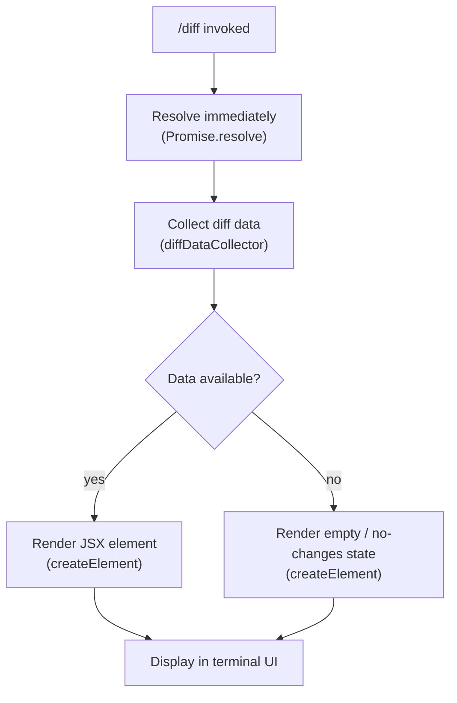

```
---
type: feature-spec
feature: "diff"
cc_version: 2.1.139
updated: "2026-05-18"
tags: ["diff", "commands", "slash-commands"]
source: "bundle-analysis"
bundle_verified: true
inherited_from: 2.1.132
analysis_basis: "CC v2.1.132 bundle.js (AST extraction + Claude interpretation)"
author: "ryujaeuk <ryujaeuk@gmail.com>"
repository: "https://github.com/MyLittleLuckyDog/cc-gnothi"
license: "AGPL-3.0-only"
---

# `/diff`

> Analysis basis: CC v2.1.132 bundle.js (AST extraction + Claude interpretation)
> Minimum version: v2.1.132

---

## Overview

The `/diff` slash command surfaces uncommitted changes in the current working repository alongside per-turn diffs accumulated during the active Claude Code session. It resolves synchronously via a pre-resolved Promise and renders its output as a JSX component rather than plain text, enabling rich in-terminal diff presentation.

---

## Registration

| Field | Value |
|---|---|
| type | `local-jsx` |
| name | `diff` |
| description | `View uncommitted changes and per-turn diffs` |
| module_id | `it9` |

Analysis basis: CC v2.1.132 bundle.js:+10263946

---

## Input Branching

The depth-2 call graph for this command contains three edges originating from the command handler. The branching structure is shallow: the handler immediately resolves, delegates to the diff-data collector, and then passes the result into a JSX renderer.



Analysis basis: CC v2.1.132 bundle.js:+10263786 (Promise.resolve edge), +10263816 (diff-data collector edge), +10263835 (createElement edge)

---

## Behavioral Spec

### Command Handler Execution

The top-level handler resolves without awaiting any asynchronous I/O before delegating.

```
function diffCommandHandler(context):
    result = Promise.resolve()           // immediate resolution, no async gate
    diffPayload = diffDataCollector()    // gather uncommitted + per-turn diff data
    element = createElement(DiffView, { payload: diffPayload })
    return element
```

Analysis basis: CC v2.1.132 bundle.js:+10263786, +10263816, +10263835

### Diff Data Collection

The collector (`nt9`, mapped below as `diffDataCollector`) is called synchronously after the Promise resolves. Its exact internal algorithm is not fully visible at depth-2 traversal.

```
function diffDataCollector():
    // Collects two categories of diff information:
    //   1. Uncommitted working-tree changes (git diff / git status equivalent)
    //   2. Per-turn diffs recorded during the current session
    // Returns a payload object consumed by the JSX renderer.
    // Internal logic: <!-- TODO: not found in depth-2 traversal; needs --depth 4 -->
    return diffPayload
```

Analysis basis: CC v2.1.132 bundle.js:+10263816

### JSX Rendering

The command type is `local-jsx`, meaning the return value of the handler is a React element rendered directly into the Claude Code terminal UI, not a plain string piped to stdout.

```
function renderDiffView(diffPayload):
    // vvA.createElement produces a React/Ink element
    // The element type and props structure are internal to the DiffView component
    element = createElement(DiffView, props_derived_from(diffPayload))
    return element
    // <!-- TODO: DiffView component internals not found in depth-2 traversal; needs --depth 4 -->
```

Analysis basis: CC v2.1.132 bundle.js:+10263835

---

## State & Side Effects

| Item | Detail |
|---|---|
| Telemetry | None detected at depth-2 traversal (`telemetry: []`) |
| Hook registration | None detected at depth-2 traversal |
| appState changes | <!-- TODO: not found in depth-2 traversal; needs --depth 4 --> |
| Sound | <!-- TODO: not found in depth-2 traversal; needs --depth 4 --> |
| Async I/O gate | None — handler uses `Promise.resolve()` (immediate) before delegating |
| Render mode | `local-jsx` — output is a JSX/Ink element, not a plain text string |

---

## Version History

| Version | Change |
|---|---|
| v2.1.132 | Initial analysis |

---

## Common Mistakes

1. **Expecting plain-text output**: Because the command type is `local-jsx`, `/diff` renders a structured UI component. Scripting or piping its output as raw text will not produce useful results.
2. **Assuming async completion gating**: The handler resolves immediately via `Promise.resolve()` before collecting diff data; there is no explicit async wait on git subprocess completion visible at this traversal depth. If the underlying collector is itself async, the JSX renderer may receive an unresolved state.
3. **Calling `/diff` outside a git repository**: The diff-data collector almost certainly relies on git working-tree state. Invoking the command in a non-git directory may silently return an empty diff rather than an error.
4. **Confusing per-turn diffs with full history**: The description explicitly covers "per-turn diffs" (changes made during the current session turns) separately from uncommitted working-tree changes. These are two distinct data sources merged in the view.
5. **Expecting telemetry events**: No `tengu_*` telemetry events are emitted by this command at the depth-2 call surface, so telemetry-based usage analysis will not capture `/diff` invocations.

---

## Appendix — Identifier Mapping

> For bundle debugging only. Identifiers change across versions.

| Identifier | Role |
|---|---|
| `V_7` | Top-level diff command handler function (entry point for `/diff`) |
| `nt9` | Diff data collector — gathers uncommitted changes and per-turn diff records |
| `vvA` | React/Ink namespace used for `createElement` calls within this module |
| `it9` | Module identifier for the `/diff` command registration module |
```